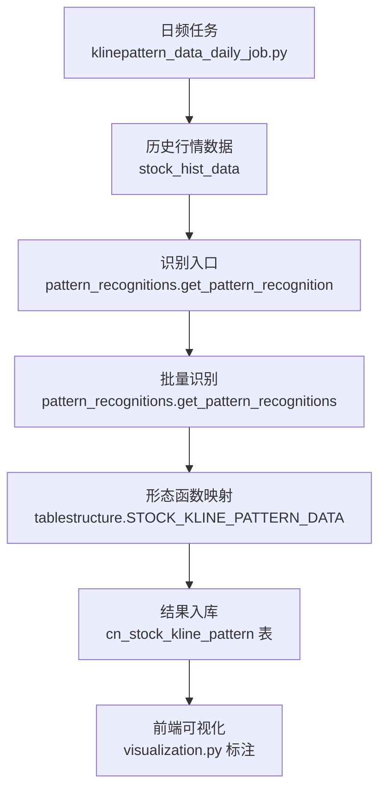
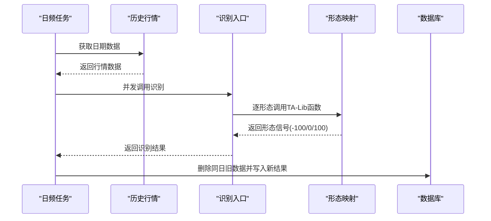
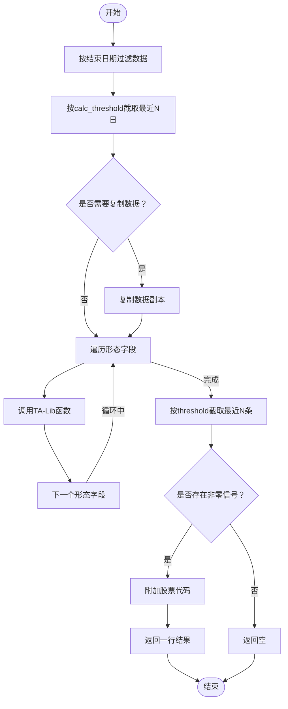
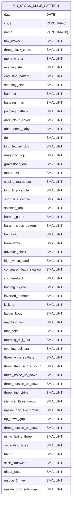
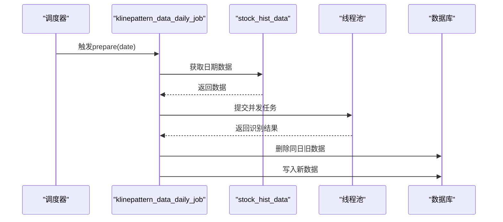
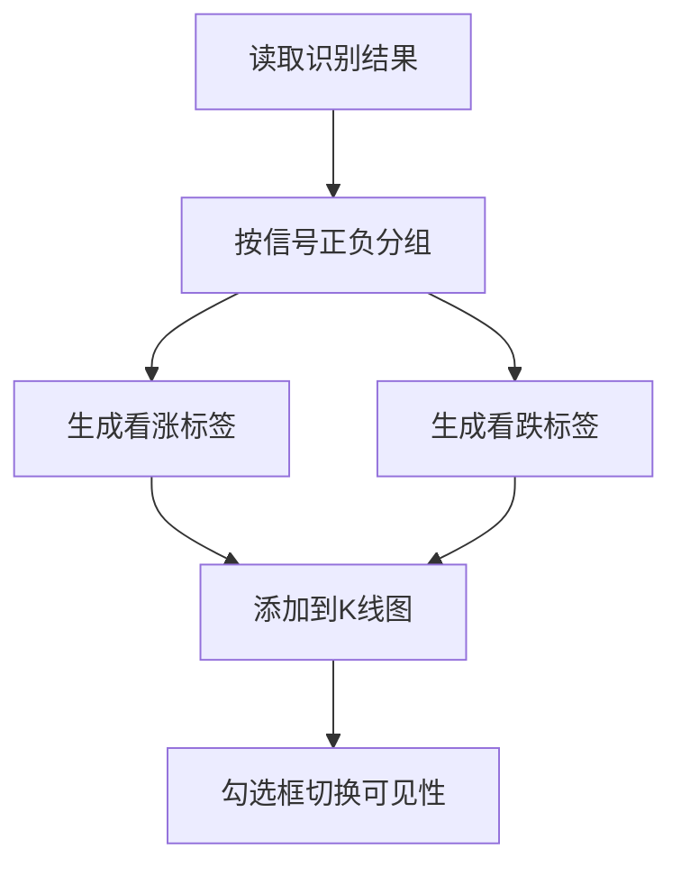
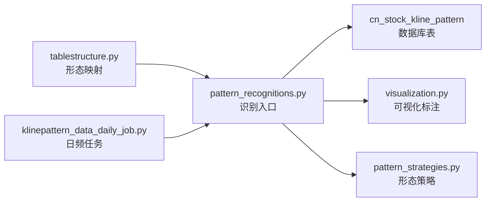

# K线形态识别

<cite>
**本文引用的文件**
- [pattern_recognitions.py](file://quantia/core/pattern/pattern_recognitions.py)
- [tablestructure.py](file://quantia/core/tablestructure.py)
- [klinepattern_data_daily_job.py](file://quantia/job/klinepattern_data_daily_job.py)
- [database_schema.md](file://document/database_schema.md)
- [README.md](file://README.md)
- [visualization.py](file://quantia/core/kline/visualization.py)
- [pattern_strategies.py](file://quantia/core/strategy/pattern/pattern_strategies.py)
</cite>

## 目录
1. [简介](#简介)
2. [项目结构](#项目结构)
3. [核心组件](#核心组件)
4. [架构总览](#架构总览)
5. [详细组件分析](#详细组件分析)
6. [依赖关系分析](#依赖关系分析)
7. [性能考量](#性能考量)
8. [故障排查指南](#故障排查指南)
9. [结论](#结论)
10. [附录](#附录)

## 简介
本文件面向Quantia的K线形态识别系统，系统支持对61种经典K线形态进行自动化识别与入库，涵盖反转形态、持续形态、缺口形态等，并提供日频批量计算任务、数据库存储、前端可视化标注与策略集成能力。本文从系统架构、算法原理、判断标准、信号强度评估、应用场景与解读方法等方面进行深入说明，帮助用户理解K线形态在技术分析中的作用与应用策略。

## 项目结构
围绕K线形态识别的关键目录与文件如下：
- 核心识别逻辑：quantia/core/pattern/pattern_recognitions.py
- 形态映射与字段定义：quantia/core/tablestructure.py
- 日频批处理任务：quantia/job/klinepattern_data_daily_job.py
- 数据库表结构：document/database_schema.md
- 形态清单与信号含义：README.md
- 可视化标注：quantia/core/kline/visualization.py
- 形态策略（策略层集成）：quantia/core/strategy/pattern/pattern_strategies.py

图表来源
- [klinepattern_data_daily_job.py](file://quantia/job/klinepattern_data_daily_job.py#L24-L83)
- [pattern_recognitions.py](file://quantia/core/pattern/pattern_recognitions.py#L10-L71)
- [tablestructure.py](file://quantia/core/tablestructure.py#L469-L585)
- [database_schema.md](file://document/database_schema.md#L461-L533)
- [visualization.py](file://quantia/core/kline/visualization.py#L115-L138)

章节来源
- [klinepattern_data_daily_job.py](file://quantia/job/klinepattern_data_daily_job.py#L1-L94)
- [pattern_recognitions.py](file://quantia/core/pattern/pattern_recognitions.py#L1-L71)
- [tablestructure.py](file://quantia/core/tablestructure.py#L469-L585)
- [database_schema.md](file://document/database_schema.md#L461-L533)
- [README.md](file://README.md#L89-L113)
- [visualization.py](file://quantia/core/kline/visualization.py#L115-L138)

## 核心组件
- 形态识别入口与批量处理：提供按日期筛选、阈值截取、并发执行的识别流程，返回每只股票在指定日期的形态信号。
- 形态映射与字段：将61种形态映射到TA-Lib函数，统一返回值语义（-100看跌、0无信号、100看涨）。
- 日频批处理任务：调度历史数据、并发识别、删除旧数据、写入数据库。
- 数据库表：标准化存储61个形态字段及基础信息，便于查询与可视化。
- 可视化标注：前端展示形态标签，支持按形态类型显示/隐藏。
- 形态策略：将形态识别结果作为策略输入之一，结合成交量、均线等条件进行选股。

章节来源
- [pattern_recognitions.py](file://quantia/core/pattern/pattern_recognitions.py#L10-L71)
- [tablestructure.py](file://quantia/core/tablestructure.py#L469-L585)
- [klinepattern_data_daily_job.py](file://quantia/job/klinepattern_data_daily_job.py#L24-L83)
- [database_schema.md](file://document/database_schema.md#L461-L533)
- [visualization.py](file://quantia/core/kline/visualization.py#L115-L138)
- [pattern_strategies.py](file://quantia/core/strategy/pattern/pattern_strategies.py#L1-L276)

## 架构总览
系统采用“批处理任务 -> 形态识别 -> 映射函数 -> 结果入库 -> 可视化”的流水线式架构，识别结果以标准化表结构落地，既可直接用于可视化标注，也可作为策略因子进入更复杂的选股体系。

图表来源
- [klinepattern_data_daily_job.py](file://quantia/job/klinepattern_data_daily_job.py#L24-L83)
- [pattern_recognitions.py](file://quantia/core/pattern/pattern_recognitions.py#L10-L71)
- [tablestructure.py](file://quantia/core/tablestructure.py#L469-L585)
- [database_schema.md](file://document/database_schema.md#L461-L533)

## 详细组件分析

### 组件A：形态识别入口与批量处理
- 功能要点
  - 支持按结束日期过滤数据，支持仅对最近N日计算（calc_threshold），支持返回最近N条记录（threshold）。
  - 对每个形态字段调用其对应的TA-Lib函数，异常时记录调试日志但不中断整体流程。
  - 单只股票识别返回非零信号时，附加股票代码并返回一行结果；异常或无信号则返回空。
- 判断标准
  - 返回值语义：-100表示看跌信号，0表示无信号，100表示看涨信号。
  - 仅当任一形态字段非零时才视为有效结果。
- 性能特性
  - 批量识别通过并发执行提升吞吐，适合日频全市场扫描。
- 应用场景
  - 日频全市场形态扫描、信号入库、前端标注、策略因子构建。

图表来源
- [pattern_recognitions.py](file://quantia/core/pattern/pattern_recognitions.py#L10-L71)

章节来源
- [pattern_recognitions.py](file://quantia/core/pattern/pattern_recognitions.py#L10-L71)

### 组件B：形态映射与字段定义
- 功能要点
  - 定义61种形态的英文字段名、中文名称、TA-Lib函数以及字段类型。
  - 字段值域统一为小整型，-100/0/100分别代表看跌/无信号/看涨。
- 形态覆盖
  - 包含反转形态（如锤头、上吊线、吞没、射击之星等）、持续形态（如三白兵、三内部、三外部等）、缺口形态（如向上/向下跳空并列阳线、上升/下降跳空三法等）等。
- 存储结构
  - 数据库存储表包含日期、股票代码、名称及61个形态字段，主键为(日期, 代码)，并建立索引以优化查询。

图表来源
- [database_schema.md](file://document/database_schema.md#L461-L533)
- [tablestructure.py](file://quantia/core/tablestructure.py#L469-L585)

章节来源
- [tablestructure.py](file://quantia/core/tablestructure.py#L469-L585)
- [database_schema.md](file://document/database_schema.md#L461-L533)
- [README.md](file://README.md#L89-L113)

### 组件C：日频批处理任务
- 功能要点
  - 获取指定日期的全市场历史数据，调用识别函数并发处理，合并结果并写入数据库。
  - 写入前先删除该日期的历史数据，确保数据一致性。
  - 若表不存在，按表结构推断字段类型，保证首次写入成功。
- 并发模型
  - 使用线程池并发执行，提高识别吞吐。
- 错误处理
  - 对单只股票识别异常进行日志记录，不影响整体任务执行。

图表来源
- [klinepattern_data_daily_job.py](file://quantia/job/klinepattern_data_daily_job.py#L24-L83)

章节来源
- [klinepattern_data_daily_job.py](file://quantia/job/klinepattern_data_daily_job.py#L24-L83)

### 组件D：可视化标注
- 功能要点
  - 将识别出的形态信号在K线图上进行标注，支持按形态类型显示/隐藏。
  - 标注文本为形态中文名称，位置位于K线上方，便于观察。
- 用户交互
  - 勾选框控制不同形态标签的可见性，便于聚焦特定形态。

图表来源
- [visualization.py](file://quantia/core/kline/visualization.py#L115-L138)

章节来源
- [visualization.py](file://quantia/core/kline/visualization.py#L115-L138)

### 组件E：形态策略（策略层集成）
- 功能要点
  - 形态识别结果可作为策略因子之一，结合成交量、均线等条件进行选股。
  - 示例策略包括突破平台、停机坪、高而窄的旗形、无大幅回撤等。
- 策略类别
  - 技术面形态策略：基于K线形态与价格行为组合的选股条件。
  - 与识别系统的耦合点：形态信号作为前置条件之一，再叠加其他技术指标或交易条件。

章节来源
- [pattern_strategies.py](file://quantia/core/strategy/pattern/pattern_strategies.py#L1-L276)

## 依赖关系分析
- 形态识别依赖TA-Lib函数族，通过tablestructure中的映射统一调用。
- 日频任务依赖历史行情数据源与数据库写入模块。
- 可视化依赖识别结果的数据结构，按信号正负生成标注。
- 策略层可复用识别结果作为输入因子。

图表来源
- [tablestructure.py](file://quantia/core/tablestructure.py#L469-L585)
- [pattern_recognitions.py](file://quantia/core/pattern/pattern_recognitions.py#L10-L71)
- [klinepattern_data_daily_job.py](file://quantia/job/klinepattern_data_daily_job.py#L24-L83)
- [database_schema.md](file://document/database_schema.md#L461-L533)
- [visualization.py](file://quantia/core/kline/visualization.py#L115-L138)
- [pattern_strategies.py](file://quantia/core/strategy/pattern/pattern_strategies.py#L1-L276)

## 性能考量
- 并发执行：日频任务使用线程池并发处理，显著缩短全市场扫描时间。
- 数据截取：通过calc_threshold与threshold减少计算窗口，降低内存与CPU压力。
- 异常隔离：识别过程中单只股票异常不会影响整体任务，提升稳定性。
- 数据库写入：按日期删除旧数据，避免重复与冗余，同时支持增量更新。

## 故障排查指南
- 识别结果为空
  - 检查输入数据是否为空或长度不足，确认日期过滤与阈值设置是否合理。
  - 查看识别入口的日志，定位具体形态函数调用异常。
- 数据库写入失败
  - 确认目标表存在性与字段类型推断逻辑，必要时手动建表或调整字段类型。
  - 检查日期格式与主键冲突，确保同一日期仅保留最新数据。
- 可视化标注缺失
  - 确认识别结果中对应形态字段非零，且前端勾选框已启用该形态标签。
- 形态函数报错
  - 检查TA-Lib版本与数据类型，确保输入为数值型数组且无NaN。

章节来源
- [pattern_recognitions.py](file://quantia/core/pattern/pattern_recognitions.py#L23-L26)
- [klinepattern_data_daily_job.py](file://quantia/job/klinepattern_data_daily_job.py#L38-L44)
- [visualization.py](file://quantia/core/kline/visualization.py#L115-L138)

## 结论
Quantia的K线形态识别系统以标准化的形态映射、高效的并发识别与稳定的日频批处理为核心，形成从数据到入库再到可视化的完整链路。61种形态覆盖了反转、持续与缺口等主要类别，信号语义明确，便于策略集成与用户解读。建议在实际应用中结合成交量、均线与趋势指标，构建多因子形态策略，以提升信号质量与胜率。

## 附录
- 形态清单与信号含义
  - 清单包含61种形态，信号含义为：负值表示卖出信号，0表示无信号，正值表示买入信号。
- 数据库表字段
  - 表包含日期、股票代码、名称及61个形态字段，主键为(日期, 代码)，并建立索引以优化查询。

章节来源
- [README.md](file://README.md#L89-L113)
- [database_schema.md](file://document/database_schema.md#L461-L533)
