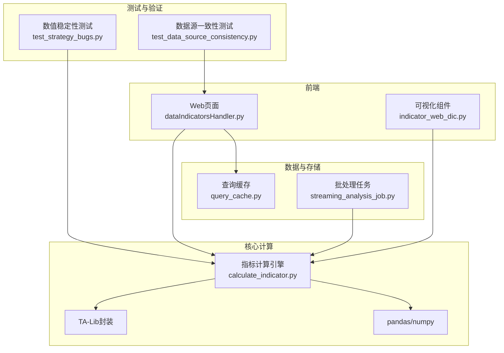
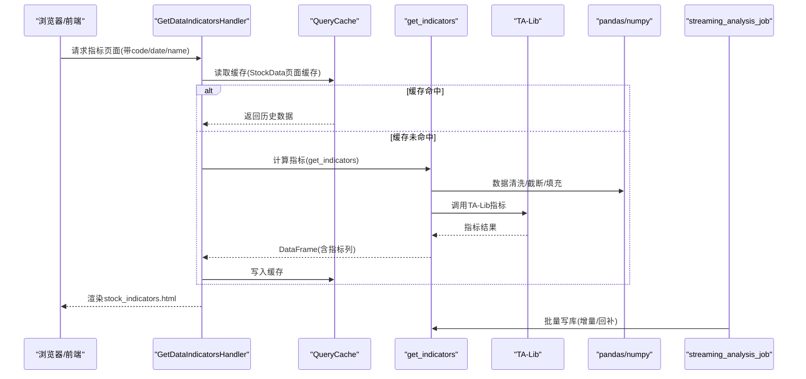
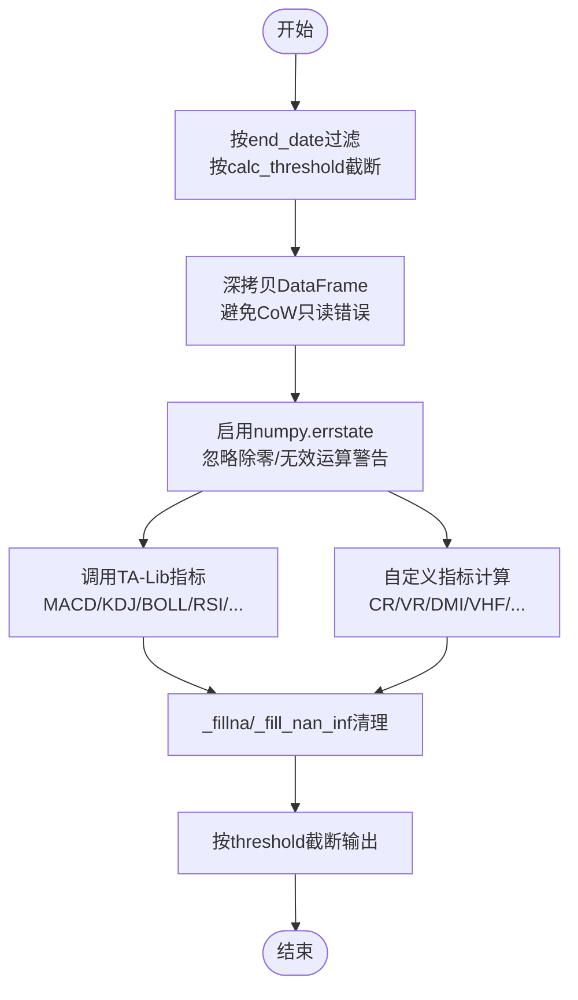
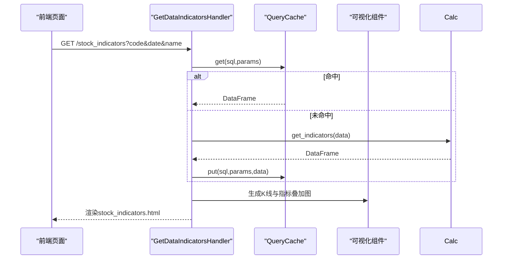
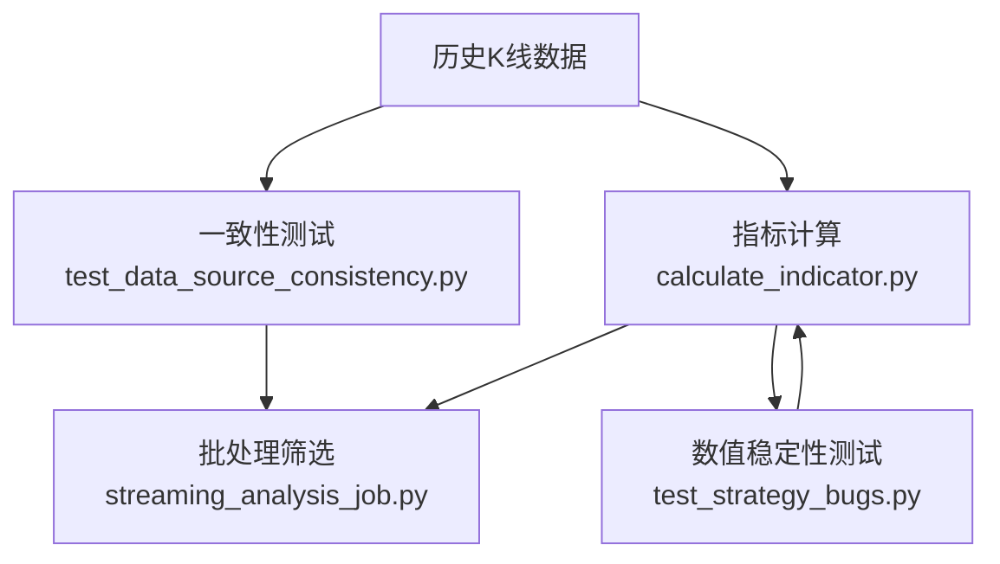
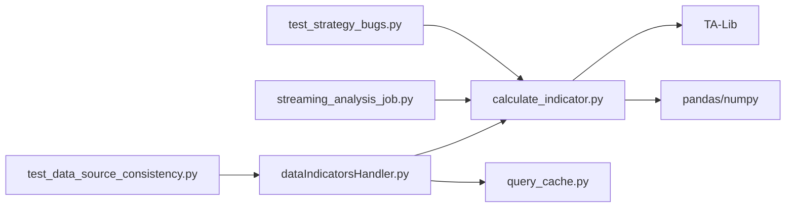

# 技术指标计算

<cite>
**本文引用的文件**
- [calculate_indicator.py](file://quantia/core/indicator/calculate_indicator.py)
- [indicator_web_dic.py](file://quantia/core/kline/indicator_web_dic.py)
- [test_strategy_bugs.py](file://tests/test_strategy_bugs.py)
- [test_data_source_consistency.py](file://tests/test_data_source_consistency.py)
- [dataIndicatorsHandler.py](file://quantia/web/dataIndicatorsHandler.py)
- [query_cache.py](file://quantia/lib/query_cache.py)
- [streaming_analysis_job.py](file://quantia/job/streaming_analysis_job.py)
</cite>

## 目录
1. [简介](#简介)
2. [项目结构](#项目结构)
3. [核心组件](#核心组件)
4. [架构总览](#架构总览)
5. [详细组件分析](#详细组件分析)
6. [依赖分析](#依赖分析)
7. [性能考虑](#性能考虑)
8. [故障排查指南](#故障排查指南)
9. [结论](#结论)
10. [附录](#附录)

## 简介
本文件面向Quantia技术指标计算系统，围绕基于TA-Lib与pandas的高效指标引擎，系统梳理了50+种技术指标（如MACD、KDJ、BOLL、RSI、CCI、DMI、W%R、VR、CR、DMA、TEMA、MFI、VWMA、ROC、OBV、SAR、PSY、BRAR、EMV、BIAS、DPO、VHF、RVI、FI、SUPERTREND、ENE、PPO、STOCHRSI、WT等）的计算流程、公式实现、数值稳定性保障与性能优化策略，并给出与专业软件结果一致性验证思路与最佳实践。

## 项目结构
与技术指标计算直接相关的关键目录与文件：
- 指标计算核心：quantia/core/indicator/calculate_indicator.py
- 指标可视化与前端展示：quantia/core/kline/indicator_web_dic.py
- Web页面入口与数据渲染：quantia/web/dataIndicatorsHandler.py
- 缓存与性能优化：quantia/lib/query_cache.py
- 任务调度与批量指标写库：quantia/job/streaming_analysis_job.py
- 结果一致性与数值稳定性测试：tests/test_strategy_bugs.py、tests/test_data_source_consistency.py

图表来源
- [calculate_indicator.py](file://quantia/core/indicator/calculate_indicator.py#L23-L407)
- [indicator_web_dic.py](file://quantia/core/kline/indicator_web_dic.py#L8-L199)
- [dataIndicatorsHandler.py](file://quantia/web/dataIndicatorsHandler.py#L15-L42)
- [query_cache.py](file://quantia/lib/query_cache.py#L27-L156)
- [streaming_analysis_job.py](file://quantia/job/streaming_analysis_job.py#L439-L469)
- [test_strategy_bugs.py](file://tests/test_strategy_bugs.py#L254-L277)
- [test_data_source_consistency.py](file://tests/test_data_source_consistency.py#L1-L324)

章节来源
- [calculate_indicator.py](file://quantia/core/indicator/calculate_indicator.py#L23-L407)
- [indicator_web_dic.py](file://quantia/core/kline/indicator_web_dic.py#L8-L199)
- [dataIndicatorsHandler.py](file://quantia/web/dataIndicatorsHandler.py#L15-L42)
- [query_cache.py](file://quantia/lib/query_cache.py#L27-L156)
- [streaming_analysis_job.py](file://quantia/job/streaming_analysis_job.py#L439-L469)
- [test_strategy_bugs.py](file://tests/test_strategy_bugs.py#L254-L277)
- [test_data_source_consistency.py](file://tests/test_data_source_consistency.py#L1-L324)

## 核心组件
- 指标计算引擎：提供统一的get_indicators与get_indicator接口，集中实现50+指标的计算、填充与截断逻辑，确保数值稳定性与性能。
- TA-Lib封装：对常用技术指标（MACD、KDJ、BOLL、RSI、CCI、ATR、W%R、ROC、OBV、SAR、PPO、STOCHRSI、ROC、MFI、TRIX、TEMA、BBANDS、SAR等）进行高效封装。
- 自定义指标族：DMI、CR、VR、VHF、RVI、FI、BIAS、DPO、ENE、SUPERTREND、WT等，结合pandas/numpy实现，覆盖动量、超买超卖、通道、趋势、能量等多维度。
- 数值清理与稳定性：提供_fillna与_fill_nan_inf两类清理函数，针对pandas 2.x CoW模式与除零/无穷场景进行稳健处理。
- 可视化与前端集成：通过indicator_web_dic.py维护指标集合与字段映射，dataIndicatorsHandler.py负责页面渲染与缓存读取。
- 批处理与缓存：streaming_analysis_job.py批量写入指标表，query_cache.py提供LRU+TTL缓存，降低重复查询开销。

章节来源
- [calculate_indicator.py](file://quantia/core/indicator/calculate_indicator.py#L13-L21)
- [calculate_indicator.py](file://quantia/core/indicator/calculate_indicator.py#L23-L407)
- [indicator_web_dic.py](file://quantia/core/kline/indicator_web_dic.py#L8-L199)
- [dataIndicatorsHandler.py](file://quantia/web/dataIndicatorsHandler.py#L15-L42)
- [query_cache.py](file://quantia/lib/query_cache.py#L27-L156)
- [streaming_analysis_job.py](file://quantia/job/streaming_analysis_job.py#L439-L469)

## 架构总览
指标计算从“数据输入”到“指标输出”的整体流程如下：

图表来源
- [dataIndicatorsHandler.py](file://quantia/web/dataIndicatorsHandler.py#L15-L42)
- [query_cache.py](file://quantia/lib/query_cache.py#L51-L89)
- [calculate_indicator.py](file://quantia/core/indicator/calculate_indicator.py#L23-L407)
- [streaming_analysis_job.py](file://quantia/job/streaming_analysis_job.py#L439-L469)

## 详细组件分析

### 指标计算引擎（calculate_indicator.py）
- 输入预处理：支持按end_date过滤与calc_threshold截断，避免全量计算；强制深拷贝规避pandas 2.x CoW模式下的只读错误。
- 数值清理策略：
  - _fillna：将NaN替换为0.0，适配EMA/MA等平滑类指标。
  - _fill_nan_inf：先替换±inf为NaN再填充0.0，适配CR、VR、VHF、m_price等易出现除零/无穷的复合指标。
- 指标计算清单（节选）：
  - 动量类：MACD、PPO、ROC、DPO、FI、MFI、TRIX、TEMA
  - 趋势类：DMA、SUPERTREND、MA系列
  - 通道类：BOLL、ENE、ATR、VHF
  - 超买超卖类：KDJ、RSI系列、W%R、STOCHRSI、PSY
  - 能量类：OBV、SAR
  - 主题类：CR、VR、BRAR、EMV、CCI、DMI、RVI、WT、BIAS、VWMA
- 输出控制：threshold参数控制最终返回的窗口长度，确保最新K线的指标可用。

图表来源
- [calculate_indicator.py](file://quantia/core/indicator/calculate_indicator.py#L23-L407)

章节来源
- [calculate_indicator.py](file://quantia/core/indicator/calculate_indicator.py#L13-L21)
- [calculate_indicator.py](file://quantia/core/indicator/calculate_indicator.py#L23-L407)

### 指标可视化与前端集成（indicator_web_dic.py、dataIndicatorsHandler.py）
- 指标字典：以标题、描述与字段映射的方式组织指标集合，便于前端渲染与选择。
- 页面渲染：GetDataIndicatorsHandler从缓存读取历史数据，调用可视化组件生成K线与叠加指标图层，最终渲染stock_indicators.html。
- 缓存策略：QueryCache提供LRU+TTL，显著降低高频页面访问的数据库压力。

图表来源
- [dataIndicatorsHandler.py](file://quantia/web/dataIndicatorsHandler.py#L15-L42)
- [query_cache.py](file://quantia/lib/query_cache.py#L51-L89)
- [indicator_web_dic.py](file://quantia/core/kline/indicator_web_dic.py#L8-L199)

章节来源
- [indicator_web_dic.py](file://quantia/core/kline/indicator_web_dic.py#L8-L199)
- [dataIndicatorsHandler.py](file://quantia/web/dataIndicatorsHandler.py#L15-L42)
- [query_cache.py](file://quantia/lib/query_cache.py#L27-L156)

### 批处理与结果一致性验证（streaming_analysis_job.py、test_data_source_consistency.py、test_strategy_bugs.py）
- 批处理：streaming_analysis_job从指标表中筛选买入/卖出候选，结合KDJ/RSI/CCI/CR/W%R/VR等条件进行规则化筛选。
- 一致性测试：test_data_source_consistency验证多数据源列格式、单位、日期格式与NaN/Inf清理的一致性，确保输入数据质量。
- 数值稳定性测试：test_strategy_bugs聚焦于EMV/VHF/m_price等指标的_fill_nan_inf清理修复，防止inf/NaN污染。

图表来源
- [streaming_analysis_job.py](file://quantia/job/streaming_analysis_job.py#L439-L469)
- [test_data_source_consistency.py](file://tests/test_data_source_consistency.py#L1-L324)
- [test_strategy_bugs.py](file://tests/test_strategy_bugs.py#L254-L277)

章节来源
- [streaming_analysis_job.py](file://quantia/job/streaming_analysis_job.py#L439-L469)
- [test_data_source_consistency.py](file://tests/test_data_source_consistency.py#L1-L324)
- [test_strategy_bugs.py](file://tests/test_strategy_bugs.py#L254-L277)

## 依赖分析
- 外部库依赖：TA-Lib、pandas、numpy、tornado（Web）、MySQL驱动（通过数据库封装）。
- 内部模块耦合：
  - calculate_indicator.py被Web层与Job层共同依赖。
  - indicator_web_dic.py为前端提供指标字段清单，与计算引擎输出列保持一致。
  - query_cache.py为Web层提供缓存能力，降低数据库压力。
- 潜在风险：
  - pandas 2.x CoW模式下的只读错误，通过深拷贝与_fillna策略规避。
  - 除零/无穷导致的NaN/Inf，通过_fill_nan_inf统一清理。

图表来源
- [calculate_indicator.py](file://quantia/core/indicator/calculate_indicator.py#L4-L7)
- [dataIndicatorsHandler.py](file://quantia/web/dataIndicatorsHandler.py#L4-L9)
- [query_cache.py](file://quantia/lib/query_cache.py#L15-L24)
- [streaming_analysis_job.py](file://quantia/job/streaming_analysis_job.py#L439-L469)
- [test_strategy_bugs.py](file://tests/test_strategy_bugs.py#L254-L277)
- [test_data_source_consistency.py](file://tests/test_data_source_consistency.py#L1-L324)

章节来源
- [calculate_indicator.py](file://quantia/core/indicator/calculate_indicator.py#L4-L7)
- [dataIndicatorsHandler.py](file://quantia/web/dataIndicatorsHandler.py#L4-L9)
- [query_cache.py](file://quantia/lib/query_cache.py#L15-L24)
- [streaming_analysis_job.py](file://quantia/job/streaming_analysis_job.py#L439-L469)
- [test_strategy_bugs.py](file://tests/test_strategy_bugs.py#L254-L277)
- [test_data_source_consistency.py](file://tests/test_data_source_consistency.py#L1-L324)

## 性能考虑
- 计算层面：
  - 使用TA-Lib进行向量化计算，避免纯Python循环。
  - 通过calc_threshold与threshold限制计算窗口，仅保留必要数据。
  - 深拷贝避免CoW只读错误，但带来额外内存开销，建议在批量任务中谨慎使用。
- 存储与缓存：
  - QueryCache采用LRU+TTL，适合高频分页与筛选场景；可根据业务调整max_size与default_ttl。
  - 批处理任务streaming_analysis_job按天写入指标表，减少在线查询压力。
- I/O与并发：
  - Web层尽量从缓存读取，减少数据库连接与SQL执行次数。
  - 对于大规模回测/回填，建议拆分批次并设置合理的超时与重试。

## 故障排查指南
- 现象：指标列出现NaN/Inf
  - 排查点：确认_fill_nan_inf是否覆盖到相关列（如CR、VR、VHF、m_price、EMV）。
  - 参考测试：test_strategy_bugs.py验证_fill_nan_inf使用情况。
- 现象：pandas 2.x报只读错误
  - 排查点：确认是否对过滤后的DataFrame直接赋值；get_indicators内部已使用深拷贝，若在其他位置出现类似问题，需同样处理。
- 现象：页面空白或无数据
  - 排查点：检查缓存是否命中；确认缓存键与SQL参数一致；核对数据采集任务是否正常写入指标表。
- 现象：跨数据源指标不一致
  - 排查点：参考test_data_source_consistency.py，检查volume/amount单位、date格式、NaN/Inf清理与列顺序。

章节来源
- [test_strategy_bugs.py](file://tests/test_strategy_bugs.py#L254-L277)
- [calculate_indicator.py](file://quantia/core/indicator/calculate_indicator.py#L31-L34)
- [query_cache.py](file://quantia/lib/query_cache.py#L44-L89)
- [test_data_source_consistency.py](file://tests/test_data_source_consistency.py#L1-L324)

## 结论
本系统以TA-Lib为核心、pandas为支撑，构建了覆盖50+指标的高效计算引擎，并通过严格的数值清理策略、缓存与批处理机制保障性能与稳定性。结合一致性与稳定性测试，能够较好地复现专业软件的计算结果，满足日常技术分析与策略筛选需求。建议在实际部署中持续监控缓存命中率与计算耗时，按业务场景动态调整窗口与缓存参数。

## 附录

### 指标清单与字段映射
- 指标集合由indicator_web_dic.py统一管理，包含标题、描述与字段列表，便于前端渲染与用户选择。
- 字段命名遵循get_indicators输出规范，确保前后端一致。

章节来源
- [indicator_web_dic.py](file://quantia/core/kline/indicator_web_dic.py#L8-L199)
