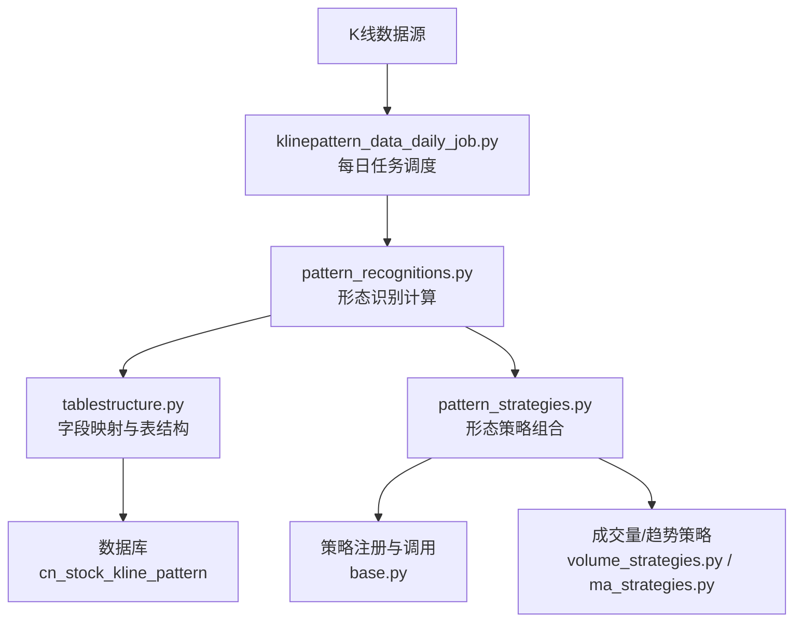
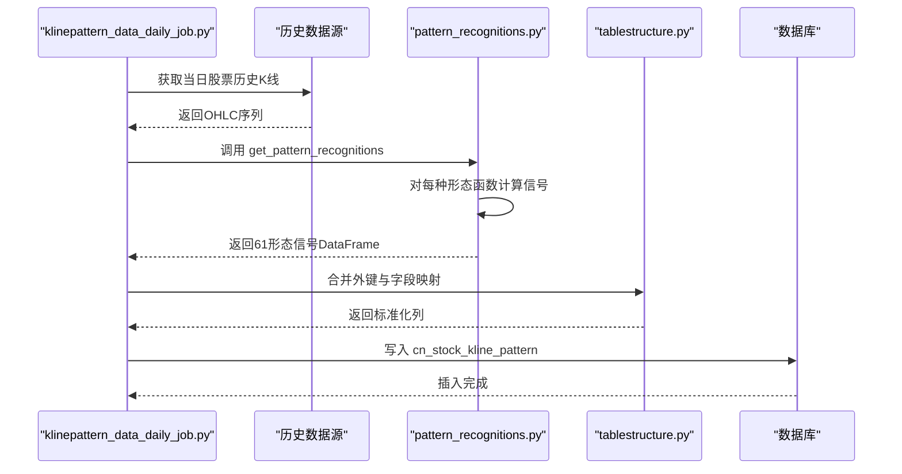
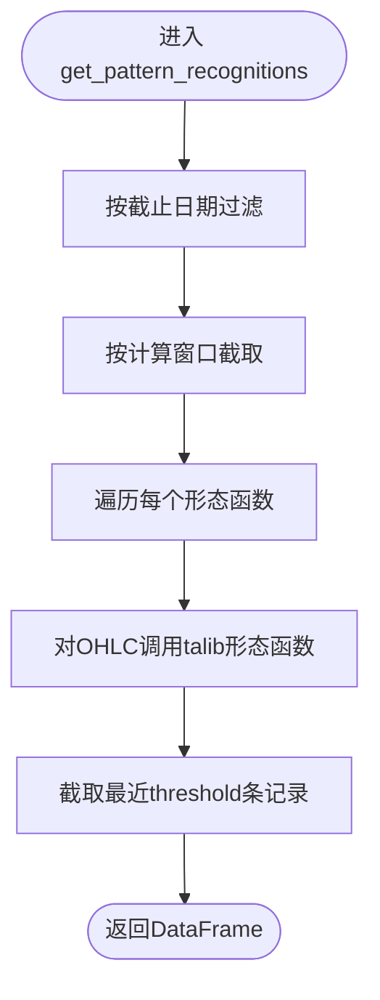
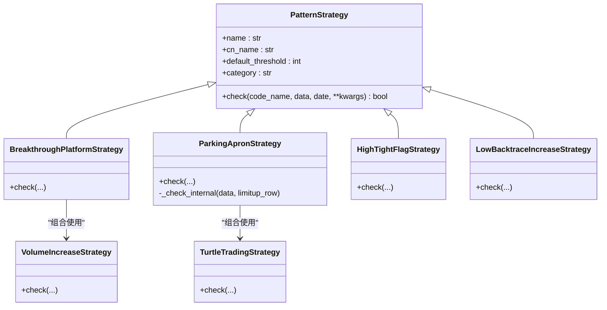
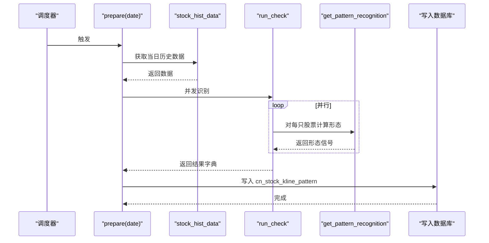
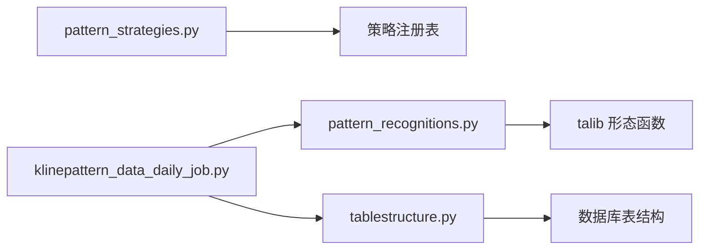

# K线形态策略

<cite>
**本文引用的文件**
- [pattern_recognitions.py](file://quantia/core/pattern/pattern_recognitions.py)
- [pattern_strategies.py](file://quantia/core/strategy/pattern/pattern_strategies.py)
- [klinepattern_data_daily_job.py](file://quantia/job/klinepattern_data_daily_job.py)
- [tablestructure.py](file://quantia/core/tablestructure.py)
- [base.py](file://quantia/core/strategy/base.py)
- [volume_strategies.py](file://quantia/core/strategy/volume/volume_strategies.py)
- [ma_strategies.py](file://quantia/core/strategy/technical/ma_strategies.py)
- [calculate_indicator.py](file://quantia/core/indicator/calculate_indicator.py)
- [index.html](file://docker/stock/quantia/web/templates/index.html)
- [database_schema.md](file://document/database_schema.md)
- [README.md](file://README.md)
</cite>

## 目录
1. [简介](#简介)
2. [项目结构](#项目结构)
3. [核心组件](#核心组件)
4. [架构总览](#架构总览)
5. [详细组件分析](#详细组件分析)
6. [依赖关系分析](#依赖关系分析)
7. [性能考量](#性能考量)
8. [故障排查指南](#故障排查指南)
9. [结论](#结论)
10. [附录](#附录)

## 简介
本文件系统化梳理 Quantia 项目中“基于K线形态识别的选股策略”，覆盖：
- 形态识别：基于 61 种标准 K 线形态（反转、持续、缺口等）的识别与入库
- 形态策略：结合成交量、趋势、突破等条件的实战策略
- 实战应用：如何将形态识别结果融入选股流程、回测与风控
- 风险控制：通过阈值、时间窗口、成交量与趋势确认降低误判

## 项目结构
围绕 K 线形态策略的关键目录与文件如下：
- 核心识别：pattern_recognitions.py
- 形态策略：pattern_strategies.py
- 日常任务：klinepattern_data_daily_job.py
- 表结构与字段映射：tablestructure.py
- 策略基类与注册：base.py
- 成交量与趋势策略（用于形态策略组合）：volume_strategies.py、ma_strategies.py
- 技术指标计算（对比参考）：calculate_indicator.py
- 文档与形态说明：index.html、database_schema.md、README.md



图表来源
- [klinepattern_data_daily_job.py](file://quantia/job/klinepattern_data_daily_job.py#L24-L84)
- [pattern_recognitions.py](file://quantia/core/pattern/pattern_recognitions.py#L10-L34)
- [tablestructure.py](file://quantia/core/tablestructure.py#L587-L589)
- [pattern_strategies.py](file://quantia/core/strategy/pattern/pattern_strategies.py#L22-L77)
- [base.py](file://quantia/core/strategy/base.py#L155-L202)

章节来源
- [klinepattern_data_daily_job.py](file://quantia/job/klinepattern_data_daily_job.py#L24-L84)
- [pattern_recognitions.py](file://quantia/core/pattern/pattern_recognitions.py#L10-L34)
- [tablestructure.py](file://quantia/core/tablestructure.py#L587-L589)

## 核心组件
- 形态识别引擎
  - 输入：K线 OHLC 序列
  - 输出：61 种形态的信号（-100/0/100）
  - 关键实现：pattern_recognitions.get_pattern_recognitions
- 形态策略组合
  - 将形态识别结果与成交量、趋势、突破等条件组合，形成可执行的选股策略
  - 关键实现：pattern_strategies 中的策略类
- 日常任务调度
  - 每日抓取历史数据，批量识别并入库
  - 关键实现：klinepattern_data_daily_job.run_check
- 表结构与字段映射
  - 定义 61 种形态字段及类型，确保入库一致性
  - 关键实现：tablestructure.STOCK_KLINE_PATTERN_DATA 与 TABLE_CN_STOCK_KLINE_PATTERN

章节来源
- [pattern_recognitions.py](file://quantia/core/pattern/pattern_recognitions.py#L10-L34)
- [pattern_strategies.py](file://quantia/core/strategy/pattern/pattern_strategies.py#L22-L77)
- [klinepattern_data_daily_job.py](file://quantia/job/klinepattern_data_daily_job.py#L63-L84)
- [tablestructure.py](file://quantia/core/tablestructure.py#L540-L589)

## 架构总览
K 线形态策略从“数据采集 → 形态识别 → 策略组合 → 选股入库”的完整链路如下：



图表来源
- [klinepattern_data_daily_job.py](file://quantia/job/klinepattern_data_daily_job.py#L24-L58)
- [pattern_recognitions.py](file://quantia/core/pattern/pattern_recognitions.py#L10-L34)
- [tablestructure.py](file://quantia/core/tablestructure.py#L587-L589)

## 详细组件分析

### 组件A：形态识别引擎（pattern_recognitions）
- 功能要点
  - 支持按截止日期与计算窗口裁剪数据
  - 对每个形态函数并行计算，返回信号矩阵
  - 仅保留最近 N 条记录作为最终结果
- 复杂度与性能
  - 时间复杂度：O(N × M)，N 为交易日数，M 为形态种类（61）
  - 并发：ThreadPoolExecutor 并行处理多只股票
- 关键路径
  - get_pattern_recognitions(data, stock_column, end_date, threshold, calc_threshold)
  - get_pattern_recognition(code_name, data, stock_column, date, calc_threshold)



图表来源
- [pattern_recognitions.py](file://quantia/core/pattern/pattern_recognitions.py#L10-L34)

章节来源
- [pattern_recognitions.py](file://quantia/core/pattern/pattern_recognitions.py#L10-L34)

### 组件B：形态策略组合（pattern_strategies）
- 策略类别
  - 突破平台（突破60日均线+放量）
  - 停机坪（涨停后整理+后续强势）
  - 高而窄的旗形（短期快速上涨+机构参与）
  - 无大幅回撤（稳健上涨+严格回撤约束）
- 设计模式
  - 继承 PatternStrategy，统一 check 接口
  - 通过 register_strategy 注册，支持按名称检索
- 关键实现
  - 突破平台：结合 MA60、成交量策略、时间窗筛选
  - 停机坪：结合海龟交易策略、连续三日整理约束
  - 旗形：结合涨幅与机构标签
  - 无大幅回撤：严格限制单日/两日回撤幅度



图表来源
- [base.py](file://quantia/core/strategy/base.py#L150-L202)
- [pattern_strategies.py](file://quantia/core/strategy/pattern/pattern_strategies.py#L22-L276)
- [volume_strategies.py](file://quantia/core/strategy/volume/volume_strategies.py#L19-L69)
- [ma_strategies.py](file://quantia/core/strategy/technical/ma_strategies.py#L140-L167)

章节来源
- [pattern_strategies.py](file://quantia/core/strategy/pattern/pattern_strategies.py#L22-L276)
- [base.py](file://quantia/core/strategy/base.py#L150-L202)
- [volume_strategies.py](file://quantia/core/strategy/volume/volume_strategies.py#L19-L69)
- [ma_strategies.py](file://quantia/core/strategy/technical/ma_strategies.py#L140-L167)

### 组件C：日常任务（klinepattern_data_daily_job）
- 职责
  - 每日拉取历史数据，批量识别形态并入库
  - 使用线程池并发处理，提升吞吐
- 关键流程
  - prepare(date)：获取数据、识别、去重、入库
  - run_check(stocks, date, workers)：并发执行 get_pattern_recognition



图表来源
- [klinepattern_data_daily_job.py](file://quantia/job/klinepattern_data_daily_job.py#L24-L84)

章节来源
- [klinepattern_data_daily_job.py](file://quantia/job/klinepattern_data_daily_job.py#L24-L84)

### 组件D：表结构与字段映射（tablestructure）
- 字段映射
  - STOCK_KLINE_PATTERN_DATA：61 种形态字段及其 talib 形态函数映射
  - TABLE_CN_STOCK_KLINE_PATTERN：表名、主键、索引、列定义
- 数据库模式
  - 日期+代码为主键，便于按日查询与回测

```mermaid
erDiagram
CN_STOCK_KLINE_PATTERN {
date DATE
code VARCHAR(6)
name VARCHAR(20)
tow_crows SMALLINT
three_black_crows SMALLINT
morning_star SMALLINT
... 61种形态字段 ...
}
PK {
date
code
}
CN_STOCK_KLINE_PATTERN }o--|| PK : "主键"
```

图表来源
- [tablestructure.py](file://quantia/core/tablestructure.py#L587-L589)
- [database_schema.md](file://document/database_schema.md#L461-L533)

章节来源
- [tablestructure.py](file://quantia/core/tablestructure.py#L540-L589)
- [database_schema.md](file://document/database_schema.md#L461-L533)

### 组件E：策略基类与注册（base）
- 基类职责
  - 提供统一 check 接口、数据准备、阈值管理
  - 提供 PatternStrategy、TechnicalStrategy、VolumeStrategy 等分类基类
- 注册机制
  - register_strategy：将策略类注册到全局注册表
  - get_strategy / get_all_strategies：按名称或分类检索

章节来源
- [base.py](file://quantia/core/strategy/base.py#L20-L202)

### 组件F：成交量与趋势策略（volume_strategies、ma_strategies）
- 成交量策略
  - 放量上涨：涨幅、成交额、量比、均线量比等条件
- 趋势策略
  - 海龟交易法则：突破近期新高
  - 回踩年线：突破年线后缩量回踩
- 在形态策略中的作用
  - 作为形态确认条件之一，提高信号质量

章节来源
- [volume_strategies.py](file://quantia/core/strategy/volume/volume_strategies.py#L19-L69)
- [ma_strategies.py](file://quantia/core/strategy/technical/ma_strategies.py#L140-L167)

### 组件G：形态说明与实战指引（index.html、README.md）
- 形态说明
  - 61 种形态的中文解释与市场含义（买入/卖出/中性）
- 实战指引
  - 形态信号的解读与组合方式
  - 与成交量、趋势策略的协同

章节来源
- [index.html](file://docker/stock/quantia/web/templates/index.html#L96-L284)
- [README.md](file://README.md#L89-L113)

## 依赖关系分析
- 形态识别依赖 talib 的 61 个形态函数，通过 STOCK_KLINE_PATTERN_DATA 的 func 映射统一调用
- 形态策略依赖策略基类与注册机制，可灵活扩展
- 日常任务依赖数据源与数据库写入，具备并发能力
- 表结构定义确保字段一致性与索引优化



图表来源
- [pattern_recognitions.py](file://quantia/core/pattern/pattern_recognitions.py#L22-L26)
- [pattern_strategies.py](file://quantia/core/strategy/pattern/pattern_strategies.py#L16-L22)
- [klinepattern_data_daily_job.py](file://quantia/job/klinepattern_data_daily_job.py#L63-L84)
- [tablestructure.py](file://quantia/core/tablestructure.py#L540-L589)

章节来源
- [pattern_recognitions.py](file://quantia/core/pattern/pattern_recognitions.py#L22-L26)
- [pattern_strategies.py](file://quantia/core/strategy/pattern/pattern_strategies.py#L16-L22)
- [klinepattern_data_daily_job.py](file://quantia/job/klinepattern_data_daily_job.py#L63-L84)
- [tablestructure.py](file://quantia/core/tablestructure.py#L540-L589)

## 性能考量
- 并发与吞吐
  - 日常任务使用线程池并发处理多只股票，显著提升识别效率
- 数据裁剪
  - 支持 end_date 与 calc_threshold，减少无效计算
- 存储与索引
  - 主键（date, code）与索引（code）有利于回测与查询
- 计算复杂度
  - 形态识别为 O(N×M)，建议合理设置 calc_threshold 与 threshold

## 故障排查指南
- 形态识别异常
  - 现象：日志打印“K线形态 {k} 计算跳过”
  - 排查：检查 OHLC 数据完整性、talib 形态函数输入参数
- 空数据返回
  - 现象：返回 None 或空 DataFrame
  - 排查：确认数据长度是否满足策略阈值、截止日期是否正确
- 入库失败
  - 现象：数据库写入报错
  - 排查：核对表结构、字段类型、主键冲突、日期格式

章节来源
- [pattern_recognitions.py](file://quantia/core/pattern/pattern_recognitions.py#L25-L26)
- [klinepattern_data_daily_job.py](file://quantia/job/klinepattern_data_daily_job.py#L28-L35)

## 结论
本方案以 61 种标准 K 线形态为核心，结合成交量与趋势策略，构建了可扩展、可并行、可入库的形态识别与选股体系。通过严格的表结构与并发任务调度，能够稳定支撑日级形态数据生产与策略回测。

## 附录
- 形态列表与含义（节选）
  - 反转形态：锤头、倒锤头、吞没、母子、晨星、暮星、射击之星等
  - 持续形态：三白兵、三内部、三外部、上升/下降三法等
  - 缺口形态：向上/向下跳空并列、跳空三法、向上跳空的两只乌鸦等
- 实战应用建议
  - 将形态信号与成交量、趋势确认结合，提高胜率
  - 利用阈值与时间窗控制样本规模，避免过度拟合
  - 建立回测流水线，定期评估策略稳定性与收益风险比

章节来源
- [index.html](file://docker/stock/quantia/web/templates/index.html#L96-L284)
- [README.md](file://README.md#L89-L113)
