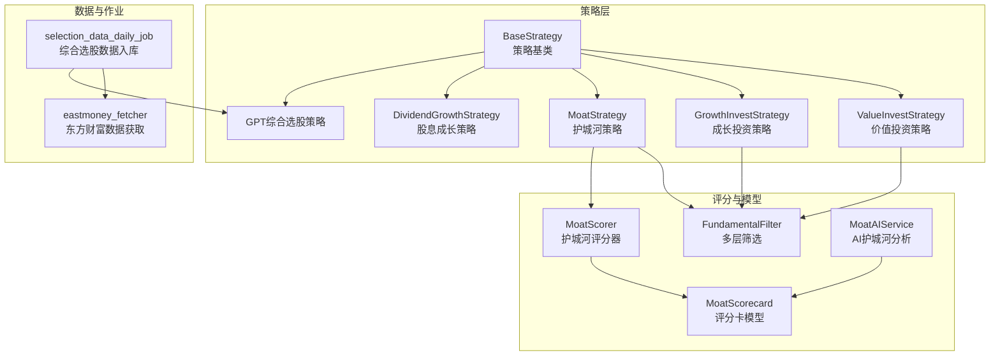
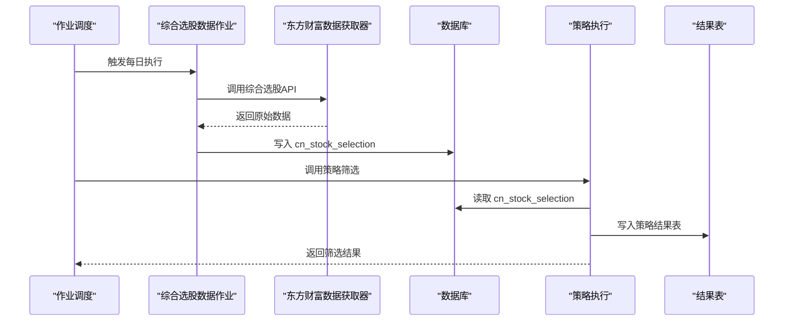
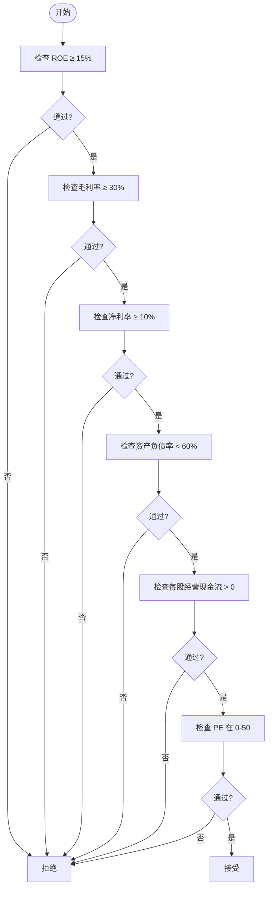
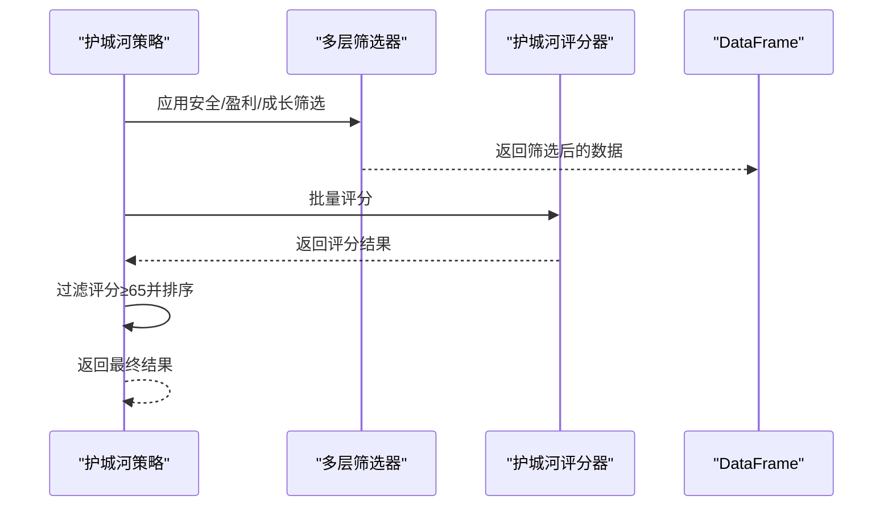
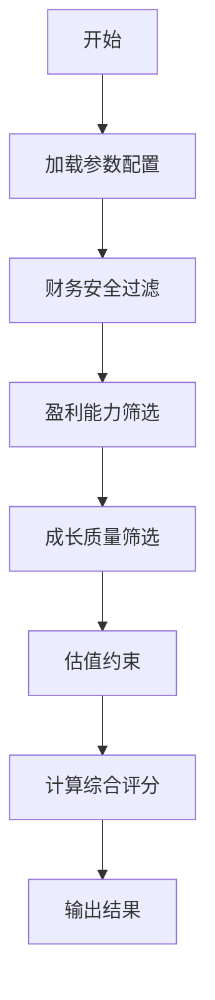
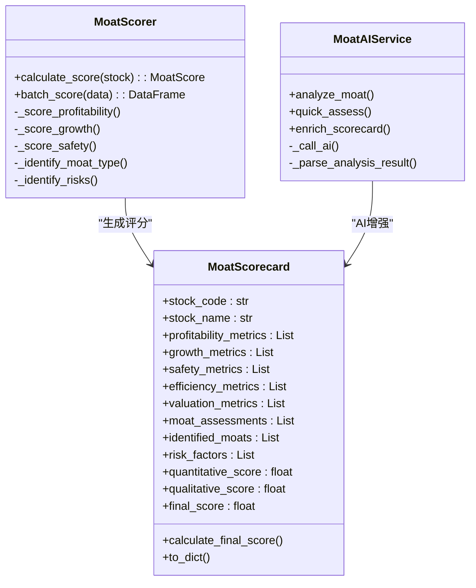
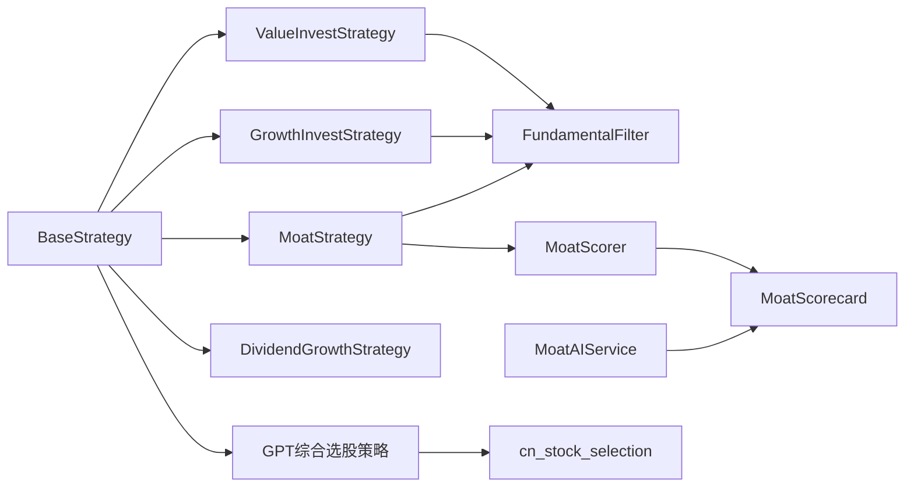

# 基本面分析策略

<cite>
**本文引用的文件**
- [fundamental_strategies.py](file://quantia/core/strategy/fundamental/fundamental_strategies.py)
- [moat_model.py](file://quantia/core/strategy/fundamental/moat_model.py)
- [moat_ai_service.py](file://quantia/core/strategy/fundamental/moat_ai_service.py)
- [fundamental_filter.py](file://quantia/core/strategy/fundamental/fundamental_filter.py)
- [gpt_value_strategy.py](file://quantia/core/strategy/gpt_value_strategy.py)
- [base.py](file://quantia/core/strategy/base.py)
- [selection_data_daily_job.py](file://quantia/job/selection_data_daily_job.py)
- [eastmoney_fetcher.py](file://quantia/core/eastmoney_fetcher.py)
- [README.md](file://README.md)
- [ChatGP选股策略文档.md](file://quantia/core/strategy/document/ChatGP选股策略文档.md)
- [strategy/README.md](file://quantia/core/strategy/README.md)
</cite>

## 目录
1. [简介](#简介)
2. [项目结构](#项目结构)
3. [核心组件](#核心组件)
4. [架构总览](#架构总览)
5. [详细组件分析](#详细组件分析)
6. [依赖关系分析](#依赖关系分析)
7. [性能考量](#性能考量)
8. [故障排查指南](#故障排查指南)
9. [结论](#结论)
10. [附录](#附录)

## 简介
本文件围绕 Quantia 的基本面分析策略，系统梳理并解读以下内容：
- 基于财务数据与公司基本面的选股策略：价值投资、成长投资、护城河策略、股息成长策略
- 护城河模型与评分体系：量化指标评分、定性评估框架、AI辅助评分接口
- 企业估值方法与护城河识别标准
- 基本面数据获取与处理流程
- AI辅助基本面分析的技术实现

本指南兼顾技术深度与可读性，既适合策略研究人员，也适合希望理解系统运作的使用者。

## 项目结构
Quantia 的基本面策略位于核心策略模块中，围绕“策略基类 + 策略实现 + 评分模型 + 数据作业”的分层组织展开。关键目录与文件如下：
- 策略基类与注册：base.py
- 基本面策略实现：fundamental_strategies.py、gpt_value_strategy.py
- 护城河模型与AI服务：moat_model.py、moat_ai_service.py
- 基本筛选与评分：fundamental_filter.py
- 数据获取与作业：selection_data_daily_job.py、eastmoney_fetcher.py
- 文档与说明：ChatGP选股策略文档.md、strategy/README.md

**图表来源**
- [base.py](file://quantia/core/strategy/base.py#L20-L202)
- [fundamental_strategies.py](file://quantia/core/strategy/fundamental/fundamental_strategies.py#L30-L351)
- [gpt_value_strategy.py](file://quantia/core/strategy/gpt_value_strategy.py#L1-L318)
- [fundamental_filter.py](file://quantia/core/strategy/fundamental/fundamental_filter.py#L118-L698)
- [moat_model.py](file://quantia/core/strategy/fundamental/moat_model.py#L85-L323)
- [moat_ai_service.py](file://quantia/core/strategy/fundamental/moat_ai_service.py#L170-L380)
- [selection_data_daily_job.py](file://quantia/job/selection_data_daily_job.py#L22-L68)
- [eastmoney_fetcher.py](file://quantia/core/eastmoney_fetcher.py#L16-L149)

**章节来源**
- [strategy/README.md](file://quantia/core/strategy/README.md#L1-L146)
- [README.md](file://README.md#L1-L700)

## 核心组件
- 策略基类与注册：提供统一的策略接口、注册机制与分类管理，便于扩展与集成。
- 基本面策略实现：提供价值投资、成长投资、护城河、股息成长等策略的具体筛选逻辑。
- 护城河模型：定义量化指标评分、定性评估、风险因素、AI辅助分析的完整数据结构与评分算法。
- 基本筛选与评分：实现多层筛选（财务安全、盈利能力、成长质量、护城河、估值约束）与批量评分。
- 数据获取与作业：每日定时抓取综合选股数据并入库，为基本面策略提供数据基础。

**章节来源**
- [base.py](file://quantia/core/strategy/base.py#L20-L202)
- [fundamental_strategies.py](file://quantia/core/strategy/fundamental/fundamental_strategies.py#L30-L351)
- [moat_model.py](file://quantia/core/strategy/fundamental/moat_model.py#L85-L323)
- [moat_ai_service.py](file://quantia/core/strategy/fundamental/moat_ai_service.py#L170-L380)
- [fundamental_filter.py](file://quantia/core/strategy/fundamental/fundamental_filter.py#L118-L698)
- [selection_data_daily_job.py](file://quantia/job/selection_data_daily_job.py#L22-L68)

## 架构总览
Quantia 的基本面分析策略采用“策略层 + 评分层 + 数据层”的分层架构：
- 策略层：策略基类统一接口，具体策略实现各自筛选条件。
- 评分层：多层筛选器与护城河评分器，提供量化与定性评估。
- 数据层：综合选股数据作业负责每日抓取与入库，策略从数据库表中读取数据进行筛选。

**图表来源**
- [selection_data_daily_job.py](file://quantia/job/selection_data_daily_job.py#L22-L68)
- [eastmoney_fetcher.py](file://quantia/core/eastmoney_fetcher.py#L75-L149)
- [gpt_value_strategy.py](file://quantia/core/strategy/gpt_value_strategy.py#L169-L200)

**章节来源**
- [ChatGP选股策略文档.md](file://quantia/core/strategy/document/ChatGP选股策略文档.md#L336-L367)

## 详细组件分析

### 价值投资策略
- 策略目标：筛选财务健康、盈利能力强的优质价值股。
- 关键条件：
  - ROE ≥ 15%
  - 毛利率 ≥ 30%
  - 净利率 ≥ 10%
  - 资产负债率 < 60%
  - 每股经营现金流 > 0
  - PE 在合理范围（0-50）
- 执行流程：策略内部构造筛选条件与过滤器，批量筛选并返回结果。

**图表来源**
- [fundamental_strategies.py](file://quantia/core/strategy/fundamental/fundamental_strategies.py#L73-L111)

**章节来源**
- [fundamental_strategies.py](file://quantia/core/strategy/fundamental/fundamental_strategies.py#L30-L120)

### 成长投资策略
- 策略目标：筛选高速成长的成长股。
- 关键条件：
  - 营收3年复合增长率 > 15%
  - 净利润3年复合增长率 > 15%
  - ROE ≥ 12%
  - 毛利率 ≥ 25%
  - 资产负债率 < 65%
- 执行流程：与价值投资类似，但侧重成长性指标。

**章节来源**
- [fundamental_strategies.py](file://quantia/core/strategy/fundamental/fundamental_strategies.py#L122-L202)

### 护城河策略
- 策略目标：筛选具有持久竞争优势的企业。
- 关键条件：
  - 护城河评分 ≥ 65 分
  - ROE ≥ 15%
  - 毛利率 ≥ 35%
  - 资产负债率 < 55%
  - 连续3年盈利增长
- 执行流程：
  - 先进行基本面筛选（安全、盈利、成长）
  - 使用护城河评分器批量计算评分
  - 按评分排序并返回结果

**图表来源**
- [fundamental_strategies.py](file://quantia/core/strategy/fundamental/fundamental_strategies.py#L205-L288)
- [fundamental_filter.py](file://quantia/core/strategy/fundamental/fundamental_filter.py#L118-L298)
- [fundamental_filter.py](file://quantia/core/strategy/fundamental/fundamental_filter.py#L301-L637)

**章节来源**
- [fundamental_strategies.py](file://quantia/core/strategy/fundamental/fundamental_strategies.py#L205-L288)

### 股息成长策略
- 策略目标：筛选稳定分红且具有成长性的防御型股票。
- 关键条件：
  - 股息率 > 2%
  - ROE ≥ 12%
  - 利润增长率 > 5%
  - 资产负债率 < 60%
  - 每股现金流 > 每股股息
- 执行流程：逐项校验并返回符合条件的股票。

**章节来源**
- [fundamental_strategies.py](file://quantia/core/strategy/fundamental/fundamental_strategies.py#L291-L351)

### GPT综合选股策略
- 策略目标：基于五层过滤体系的综合选股，强调财务安全、盈利能力、成长质量、估值约束。
- 关键条件（来自文档与代码）：
  - 财务安全：资产负债率 < 60%、每股经营现金流 > 0、流动比率 ≥ 1.0、速动比率 ≥ 0.7
  - 盈利能力：ROE ≥ 15%、毛利率 ≥ 25%、净利率 ≥ 8%、ROA ≥ 4%
  - 成长质量：营收3年CAGR > 8%、净利润3年CAGR > 8%、扣非净利润增长率 > 0%
  - 估值约束：PE(TTM) ∈ (0, 50]、PB(MRQ) ≤ 10
- 执行流程：
  - 从 cn_stock_selection 表读取数据
  - 按参数逐层筛选
  - 计算综合评分并返回结果

**图表来源**
- [gpt_value_strategy.py](file://quantia/core/strategy/gpt_value_strategy.py#L169-L200)
- [gpt_value_strategy.py](file://quantia/core/strategy/gpt_value_strategy.py#L221-L317)
- [ChatGP选股策略文档.md](file://quantia/core/strategy/document/ChatGP选股策略文档.md#L26-L113)

**章节来源**
- [gpt_value_strategy.py](file://quantia/core/strategy/gpt_value_strategy.py#L1-L318)
- [ChatGP选股策略文档.md](file://quantia/core/strategy/document/ChatGP选股策略文档.md#L26-L113)

### 护城河评分模型与AI辅助
- 评分卡模型（MoatScorecard）：
  - 量化指标评分：盈利能力、成长能力、财务安全、经营效率、估值
  - 定性评估：护城河类型、风险因素、AI分析
  - 综合评分：加权计算并考虑风险调整
- 护城河评分器（MoatScorer）：
  - 五个维度评分与总分计算
  - 护城河类型识别与风险识别
- AI辅助评分（MoatAIService）：
  - 生成提示词并调用LLM进行定性分析
  - 解析AI返回结果并整合到评分卡
  - 支持快速评估与报告生成

**图表来源**
- [moat_model.py](file://quantia/core/strategy/fundamental/moat_model.py#L85-L323)
- [moat_model.py](file://quantia/core/strategy/fundamental/moat_model.py#L424-L479)
- [moat_ai_service.py](file://quantia/core/strategy/fundamental/moat_ai_service.py#L170-L380)

**章节来源**
- [moat_model.py](file://quantia/core/strategy/fundamental/moat_model.py#L1-L479)
- [moat_ai_service.py](file://quantia/core/strategy/fundamental/moat_ai_service.py#L1-L459)

### 基本筛选与评分器
- 多层筛选器（FundamentalFilter）：
  - 层级：财务安全、盈利能力、成长质量、护城河、估值约束
  - 逐层过滤并记录筛选前后数量
- 护城河评分器（MoatScorer）：
  - 五个维度评分与总分计算
  - 护城河类型识别与风险识别
  - 批量评分并返回带评分列的DataFrame

**章节来源**
- [fundamental_filter.py](file://quantia/core/strategy/fundamental/fundamental_filter.py#L118-L698)

### 数据获取与处理流程
- 综合选股数据作业（selection_data_daily_job）：
  - 每日定时抓取综合选股数据
  - 写入 cn_stock_selection 表
  - 支持重试与日志记录
- 东方财富数据获取器（eastmoney_fetcher）：
  - 线程安全的会话管理
  - 代理池与Cookie管理
  - 失败重试与错误处理

**章节来源**
- [selection_data_daily_job.py](file://quantia/job/selection_data_daily_job.py#L22-L68)
- [eastmoney_fetcher.py](file://quantia/core/eastmoney_fetcher.py#L16-L149)

## 依赖关系分析
- 策略基类与注册：所有策略继承自 BaseStrategy，通过装饰器注册到策略注册表，便于统一管理与调用。
- 策略与筛选器：价值、成长、护城河、股息成长策略依赖 FundamentalFilter 进行多层筛选。
- 护城河策略与评分：护城河策略依赖 MoatScorer 进行评分，评分器依赖量化指标与阈值配置。
- AI服务：MoatAIService 依赖评分卡模型与提示词模板，支持从数据库加载AI配置。
- 数据依赖：GPT综合选股策略依赖 cn_stock_selection 表，作业负责数据入库。

**图表来源**
- [base.py](file://quantia/core/strategy/base.py#L155-L202)
- [fundamental_strategies.py](file://quantia/core/strategy/fundamental/fundamental_strategies.py#L19-L71)
- [fundamental_filter.py](file://quantia/core/strategy/fundamental/fundamental_filter.py#L118-L298)
- [moat_model.py](file://quantia/core/strategy/fundamental/moat_model.py#L85-L323)
- [moat_ai_service.py](file://quantia/core/strategy/fundamental/moat_ai_service.py#L170-L380)
- [gpt_value_strategy.py](file://quantia/core/strategy/gpt_value_strategy.py#L169-L200)

**章节来源**
- [base.py](file://quantia/core/strategy/base.py#L155-L202)
- [fundamental_strategies.py](file://quantia/core/strategy/fundamental/fundamental_strategies.py#L19-L71)
- [fundamental_filter.py](file://quantia/core/strategy/fundamental/fundamental_filter.py#L118-L298)
- [moat_model.py](file://quantia/core/strategy/fundamental/moat_model.py#L85-L323)
- [moat_ai_service.py](file://quantia/core/strategy/fundamental/moat_ai_service.py#L170-L380)
- [gpt_value_strategy.py](file://quantia/core/strategy/gpt_value_strategy.py#L169-L200)

## 性能考量
- 多层筛选与批量评分：通过 Pandas 向量化操作与逐层过滤，减少不必要的数据扫描。
- 线程安全的数据获取：eastmoney_fetcher 使用线程局部会话，避免并发问题。
- 评分阈值与权重：支持从数据库加载用户自定义参数，动态调整评分权重与阈值，提升策略灵活性。
- 作业调度：每日定时作业，避免重复计算与API调用，提高整体效率。

[本节为通用指导，无需特定文件引用]

## 故障排查指南
- 综合选股数据入库失败：
  - 检查作业日志与重试机制
  - 确认数据库连接与表结构
- 东方财富数据获取异常：
  - 检查Cookie与代理配置
  - 关注网络错误与超时处理
- 护城河AI分析失败：
  - 检查API密钥与模型配置
  - 确认提示词模板与JSON解析
- 策略筛选结果为空：
  - 调整筛选阈值与权重
  - 检查数据完整性与字段有效性

**章节来源**
- [selection_data_daily_job.py](file://quantia/job/selection_data_daily_job.py#L22-L68)
- [eastmoney_fetcher.py](file://quantia/core/eastmoney_fetcher.py#L75-L149)
- [moat_ai_service.py](file://quantia/core/strategy/fundamental/moat_ai_service.py#L306-L380)
- [gpt_value_strategy.py](file://quantia/core/strategy/gpt_value_strategy.py#L169-L200)

## 结论
Quantia 的基本面分析策略通过“策略基类 + 多层筛选 + 护城河评分 + AI辅助”的架构，实现了从财务数据到投资决策的闭环。策略具备清晰的筛选逻辑、可配置的阈值与权重、完善的评分与风险评估，并通过每日作业自动化完成数据获取与策略执行。结合文档与代码，用户可灵活调整参数、扩展策略，并在Web界面中进行可视化监控与回测验证。

[本节为总结性内容，无需特定文件引用]

## 附录

### 基本面指标与计算要点
- 财务安全：资产负债率、流动比率、速动比率、每股经营现金流
- 盈利能力：ROE、ROA、毛利率、净利率
- 成长质量：营收/利润3年复合增长率、扣非净利润增长率
- 估值约束：PE(TTM)、PB(MRQ)
- 护城河：盈利能力、稳定性、成长能力、经营效率、财务安全五维评分

**章节来源**
- [ChatGP选股策略文档.md](file://quantia/core/strategy/document/ChatGP选股策略文档.md#L26-L113)
- [fundamental_filter.py](file://quantia/core/strategy/fundamental/fundamental_filter.py#L36-L91)
- [moat_model.py](file://quantia/core/strategy/fundamental/moat_model.py#L424-L479)

### 企业估值方法与护城河识别
- 估值方法：PE、PB、PEG（策略中已调整为更稳健的约束）
- 护城河识别：品牌效应、专利技术、规模效应、网络效应、转换成本、成本优势、牌照壁垒、生态系统
- AI辅助：通过提示词模板与LLM解析，生成定性评估与投资论点

**章节来源**
- [ChatGP选股策略文档.md](file://quantia/core/strategy/document/ChatGP选股策略文档.md#L84-L96)
- [moat_ai_service.py](file://quantia/core/strategy/fundamental/moat_ai_service.py#L41-L126)
- [moat_model.py](file://quantia/core/strategy/fundamental/moat_model.py#L26-L44)

### 数据获取与处理流程（代码级）
- 作业入口：selection_data_daily_job.py
- 数据源：东方财富综合选股API
- 存储：cn_stock_selection 表
- 策略读取：gpt_value_strategy.py 与各策略文件

**章节来源**
- [selection_data_daily_job.py](file://quantia/job/selection_data_daily_job.py#L22-L68)
- [gpt_value_strategy.py](file://quantia/core/strategy/gpt_value_strategy.py#L169-L200)
- [eastmoney_fetcher.py](file://quantia/core/eastmoney_fetcher.py#L75-L149)
