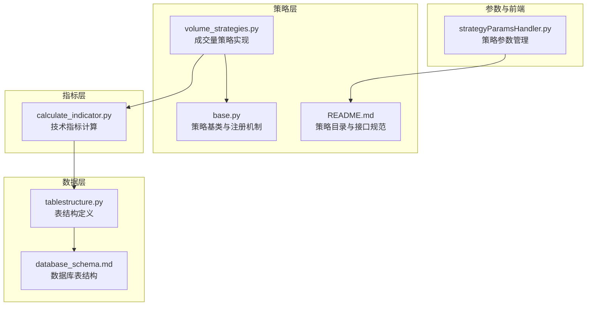
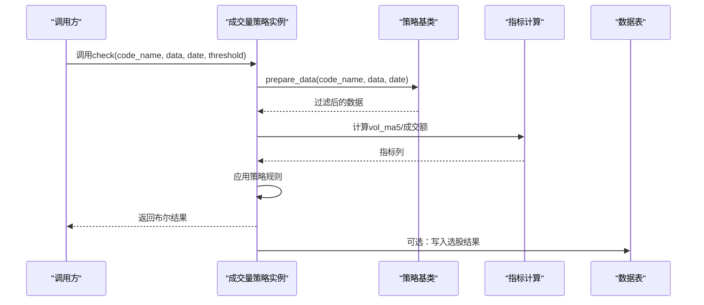
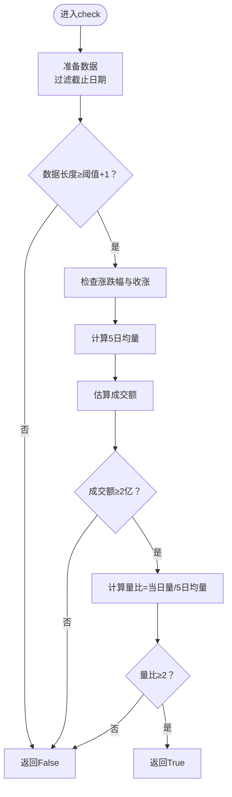
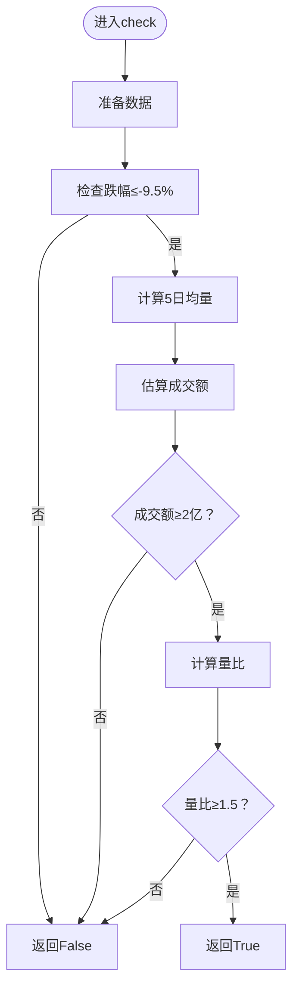
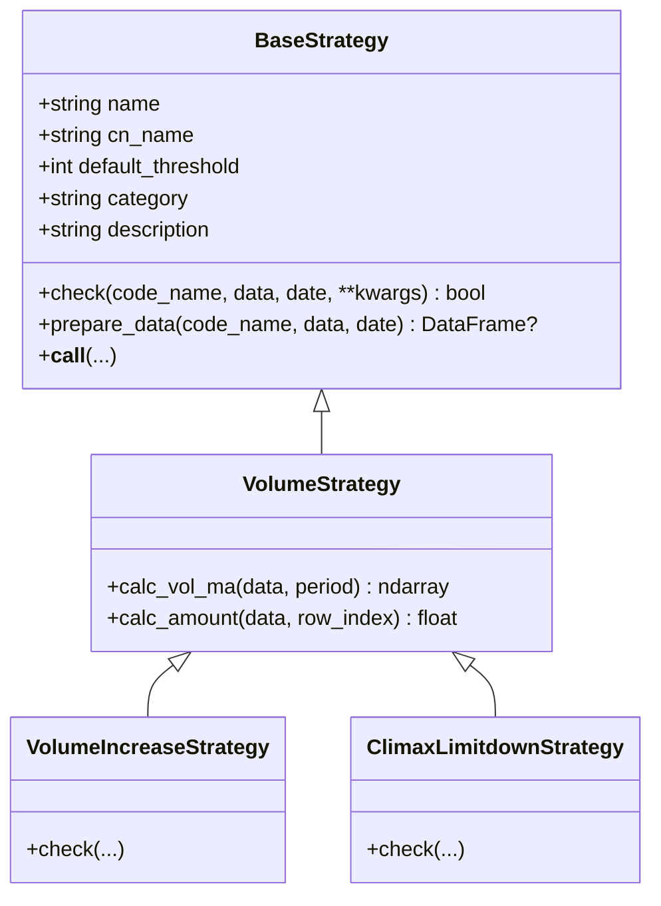
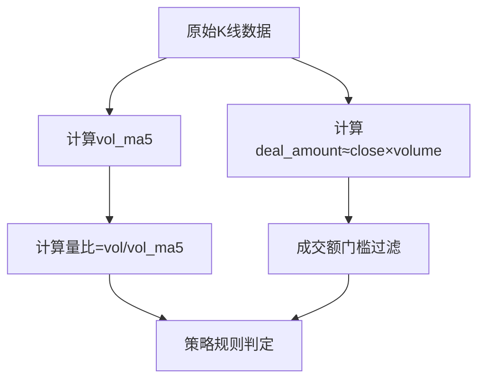
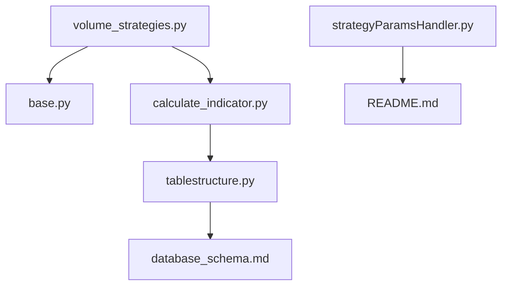

# 成交量分析策略

<cite>
**本文档引用的文件**
- [volume_strategies.py](file://quantia/core/strategy/volume/volume_strategies.py)
- [base.py](file://quantia/core/strategy/base.py)
- [calculate_indicator.py](file://quantia/core/indicator/calculate_indicator.py)
- [README.md](file://quantia/core/strategy/README.md)
- [enter.py](file://quantia/core/strategy/enter.py)
- [climax_limitdown.py](file://quantia/core/strategy/climax_limitdown.py)
- [tablestructure.py](file://quantia/core/tablestructure.py)
- [database_schema.md](file://document/database_schema.md)
- [strategyParamsHandler.py](file://quantia/web/strategyParamsHandler.py)
</cite>

## 目录
1. [引言](#引言)
2. [项目结构](#项目结构)
3. [核心组件](#核心组件)
4. [架构概览](#架构概览)
5. [详细组件分析](#详细组件分析)
6. [依赖关系分析](#依赖关系分析)
7. [性能考虑](#性能考虑)
8. [故障排查指南](#故障排查指南)
9. [结论](#结论)
10. [附录](#附录)

## 引言
本文件面向Quantia系统中的成交量分析策略，围绕成交量与成交额的选股实践，系统阐述以下内容：
- 量价配合策略、成交量突破策略、缩量回调策略的理论基础与实现要点
- 成交量指标的计算方法与量能分析技术
- 策略参数设置指南与实际应用案例
- 与系统其他模块（指标计算、数据表结构、参数管理）的集成关系

目标是帮助使用者在掌握量价分析技巧的同时，高效配置与落地成交量策略。

## 项目结构
成交量策略位于策略子系统中，采用“策略基类 + 具体策略”的分层设计，结合指标计算模块生成所需数据，最终落于数据库表结构进行持久化与回测。

**图表来源**
- [volume_strategies.py](file://quantia/core/strategy/volume/volume_strategies.py#L1-L126)
- [base.py](file://quantia/core/strategy/base.py#L1-L202)
- [calculate_indicator.py](file://quantia/core/indicator/calculate_indicator.py#L1-L449)
- [tablestructure.py](file://quantia/core/tablestructure.py#L1-L200)
- [database_schema.md](file://document/database_schema.md#L66-L421)
- [strategyParamsHandler.py](file://quantia/web/strategyParamsHandler.py#L1-L200)

**章节来源**
- [README.md](file://quantia/core/strategy/README.md#L1-L146)

## 核心组件
- 策略基类与注册机制：提供统一的check接口、数据准备逻辑、类别分类与注册表，支撑成交量策略的标准化开发与调用。
- 成交量策略实现：包含放量上涨与放量跌停两类策略，分别对应“量增价涨”与“恐慌性抛售”的典型场景。
- 指标计算模块：提供成交量移动平均、成交额计算等通用工具，为策略提供基础数据支持。
- 数据表结构：定义了每日股票数据表等关键表结构，支撑策略数据的存储与查询。
- 参数管理：提供策略参数的持久化与动态配置能力，便于策略参数化与调优。

**章节来源**
- [base.py](file://quantia/core/strategy/base.py#L126-L143)
- [volume_strategies.py](file://quantia/core/strategy/volume/volume_strategies.py#L19-L125)
- [calculate_indicator.py](file://quantia/core/indicator/calculate_indicator.py#L138-L142)
- [tablestructure.py](file://quantia/core/tablestructure.py#L63-L104)
- [database_schema.md](file://document/database_schema.md#L66-L117)
- [strategyParamsHandler.py](file://quantia/web/strategyParamsHandler.py#L24-L200)

## 架构概览
成交量策略在系统中的工作流如下：
- 输入：历史K线数据（包含成交量、成交额、涨跌幅等）
- 预处理：通过策略基类的prepare_data按截止日期过滤数据，确保满足最小阈值
- 指标计算：使用成交量移动平均、成交额计算等工具生成策略所需特征
- 规则判定：依据策略规则对当日数据进行筛选
- 结果输出：返回布尔值，用于后续选股与回测

**图表来源**
- [volume_strategies.py](file://quantia/core/strategy/volume/volume_strategies.py#L34-L68)
- [base.py](file://quantia/core/strategy/base.py#L64-L89)
- [calculate_indicator.py](file://quantia/core/indicator/calculate_indicator.py#L138-L142)

## 详细组件分析

### 放量上涨策略（VolumeIncreaseStrategy）
- 策略目标：识别“量增价涨”的强势启动信号
- 关键规则
  - 当日涨幅≥2%且收涨
  - 成交额≥2亿元（通过收盘价×成交量估算）
  - 当日成交量/5日均量≥2
- 数据准备与计算
  - 使用策略基类的prepare_data按截止日期过滤
  - 通过VolumeStrategy.calc_vol_ma计算5日均量
  - 通过VolumeStrategy.calc_amount估算当日成交额
- 参数与阈值
  - 默认阈值为60个交易日，确保样本稳定性
  - 阈值可通过构造函数传入覆盖

**图表来源**
- [volume_strategies.py](file://quantia/core/strategy/volume/volume_strategies.py#L34-L68)
- [base.py](file://quantia/core/strategy/base.py#L64-L89)
- [base.py](file://quantia/core/strategy/base.py#L131-L135)
- [base.py](file://quantia/core/strategy/base.py#L138-L142)

**章节来源**
- [volume_strategies.py](file://quantia/core/strategy/volume/volume_strategies.py#L19-L68)
- [base.py](file://quantia/core/strategy/base.py#L126-L143)

### 放量跌停策略（ClimaxLimitdownStrategy）
- 策略目标：捕捉“恐慌性抛售”引发的极端放量下跌
- 关键规则
  - 当日跌幅接近跌停（≤-9.5%）
  - 放量：当日成交量/5日均量≥1.5
  - 成交额≥2亿元
- 适用场景：市场恐慌或利空集中释放后的极端抛压，可能预示阶段性底部或短期见顶后的分歧

**图表来源**
- [volume_strategies.py](file://quantia/core/strategy/volume/volume_strategies.py#L85-L112)

**章节来源**
- [volume_strategies.py](file://quantia/core/strategy/volume/volume_strategies.py#L71-L112)

### 策略基类与注册机制
- BaseStrategy：定义check接口、数据准备、阈值控制与可调用包装
- VolumeStrategy：扩展成交量相关指标计算（如vol_ma、amount）
- 注册机制：通过装饰器将策略注册到全局注册表，便于统一调度与查找

**图表来源**
- [base.py](file://quantia/core/strategy/base.py#L20-L96)
- [base.py](file://quantia/core/strategy/base.py#L126-L143)
- [volume_strategies.py](file://quantia/core/strategy/volume/volume_strategies.py#L19-L112)

**章节来源**
- [base.py](file://quantia/core/strategy/base.py#L155-L202)

### 指标计算与量能分析
- 成交量移动平均：使用TA-Lib计算MA，平滑成交量波动，识别量能趋势
- 成交额估算：通过收盘价×成交量估算当日成交额，作为资金规模门槛
- 量比：当日成交量与5日均量之比，衡量当日放量程度
- 与数据库表结构的关系：每日股票数据表包含volume、deal_amount等字段，策略直接复用

**图表来源**
- [calculate_indicator.py](file://quantia/core/indicator/calculate_indicator.py#L138-L142)
- [tablestructure.py](file://quantia/core/tablestructure.py#L63-L104)
- [database_schema.md](file://document/database_schema.md#L66-L117)

**章节来源**
- [calculate_indicator.py](file://quantia/core/indicator/calculate_indicator.py#L1-L449)
- [tablestructure.py](file://quantia/core/tablestructure.py#L63-L104)
- [database_schema.md](file://document/database_schema.md#L66-L117)

### 与历史策略的兼容性
- 旧版策略文件提供了check_volume与check函数，保持与历史调用方式一致
- 新策略通过类封装与注册机制，提供更清晰的扩展性与可维护性

**章节来源**
- [enter.py](file://quantia/core/strategy/enter.py#L16-L60)
- [climax_limitdown.py](file://quantia/core/strategy/climax_limitdown.py#L15-L59)
- [volume_strategies.py](file://quantia/core/strategy/volume/volume_strategies.py#L115-L125)

## 依赖关系分析
- 策略层依赖基类与注册机制，确保统一接口与可扩展性
- 指标计算模块为策略提供必要的成交量与成交额特征
- 数据表结构定义了策略输入数据的字段与类型，保证数据一致性
- 参数管理模块为策略参数化提供持久化与动态配置能力

**图表来源**
- [volume_strategies.py](file://quantia/core/strategy/volume/volume_strategies.py#L1-L126)
- [base.py](file://quantia/core/strategy/base.py#L1-L202)
- [calculate_indicator.py](file://quantia/core/indicator/calculate_indicator.py#L1-L449)
- [tablestructure.py](file://quantia/core/tablestructure.py#L1-L200)
- [database_schema.md](file://document/database_schema.md#L66-L421)
- [strategyParamsHandler.py](file://quantia/web/strategyParamsHandler.py#L1-L200)
- [README.md](file://quantia/core/strategy/README.md#L1-L146)

**章节来源**
- [README.md](file://quantia/core/strategy/README.md#L1-L146)

## 性能考虑
- 数据截取与阈值：通过prepare_data按截止日期过滤并校验最小长度，避免无效计算
- 向量化计算：使用TA-Lib与NumPy进行批量指标计算，提升吞吐
- 内存与拷贝：指标计算模块显式复制DataFrame以避免写时复制问题，提高稳定性
- 参数化与缓存：策略参数可持久化，减少重复配置成本；回测阶段可利用缓存加速

**章节来源**
- [base.py](file://quantia/core/strategy/base.py#L64-L89)
- [calculate_indicator.py](file://quantia/core/indicator/calculate_indicator.py#L31-L34)

## 故障排查指南
- NaN/Inf处理：指标计算模块对NaN与无穷值进行填充或替换，避免传播到策略判断
- 除零保护：当5日均量为0时，策略直接返回False，防止除零错误
- 数据长度不足：若过滤后数据长度小于阈值，策略返回False，建议适当调整阈值
- 参数异常：策略参数可通过参数管理模块进行重置与校验，确保配置正确

**章节来源**
- [calculate_indicator.py](file://quantia/core/indicator/calculate_indicator.py#L13-L21)
- [volume_strategies.py](file://quantia/core/strategy/volume/volume_strategies.py#L63-L64)
- [strategyParamsHandler.py](file://quantia/web/strategyParamsHandler.py#L450-L468)

## 结论
成交量分析策略通过“量增价涨”与“恐慌性抛售”两类典型场景，结合成交量移动平均与成交额门槛，形成可落地的选股框架。依托策略基类与注册机制，策略具备良好的扩展性；借助指标计算模块与数据库表结构，实现从数据到决策的闭环。配合参数管理与回测体系，可进一步优化策略参数并评估效果。

## 附录

### 参数设置指南
- 阈值（threshold）：建议根据策略类型与市场波动性设定，常见区间为60~250个交易日
- 成交额门槛：可根据行业与流动性设定，如2亿元为常用门槛
- 量比阈值：放量上涨策略建议≥2，放量跌停策略建议≥1.5
- 跌幅阈值：放量跌停策略建议≤-9.5%

**章节来源**
- [volume_strategies.py](file://quantia/core/strategy/volume/volume_strategies.py#L29-L32)
- [volume_strategies.py](file://quantia/core/strategy/volume/volume_strategies.py#L80-L83)
- [strategyParamsHandler.py](file://quantia/web/strategyParamsHandler.py#L24-L200)

### 实际应用案例
- 放量上涨策略：适用于强势突破初期，结合趋势与形态策略进行二次确认
- 放量跌停策略：适用于风险控制与逆向机会识别，建议配合资金流与消息面分析

**章节来源**
- [volume_strategies.py](file://quantia/core/strategy/volume/volume_strategies.py#L29-L32)
- [volume_strategies.py](file://quantia/core/strategy/volume/volume_strategies.py#L80-L83)
