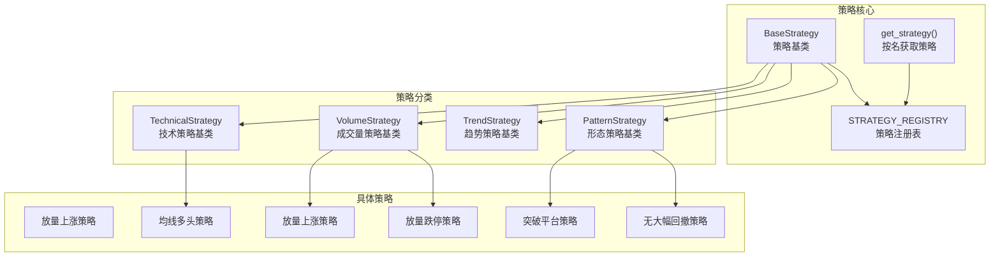
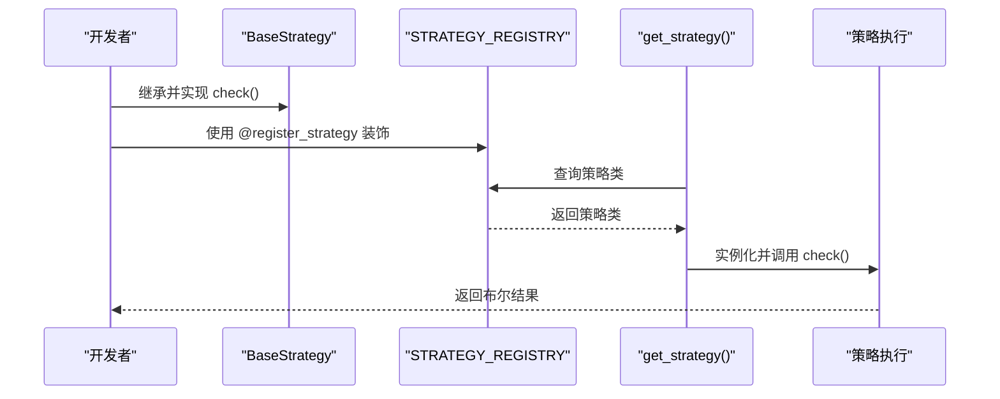
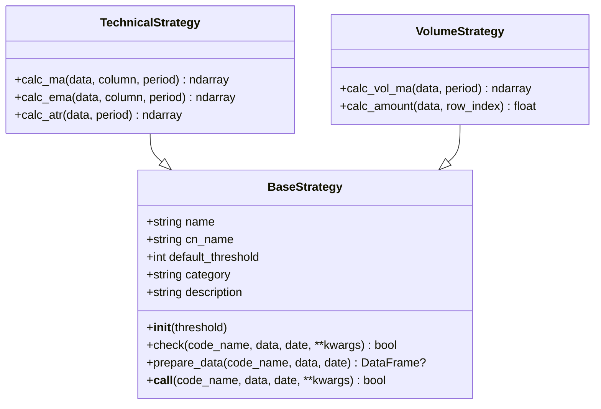
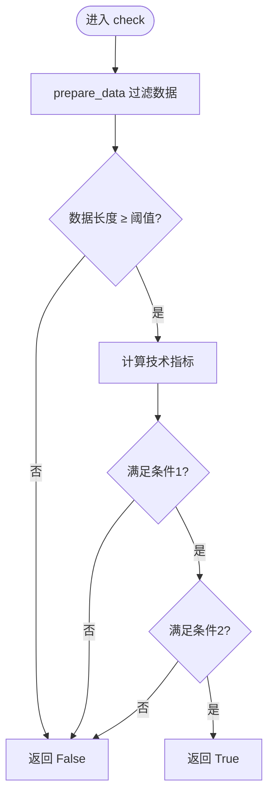
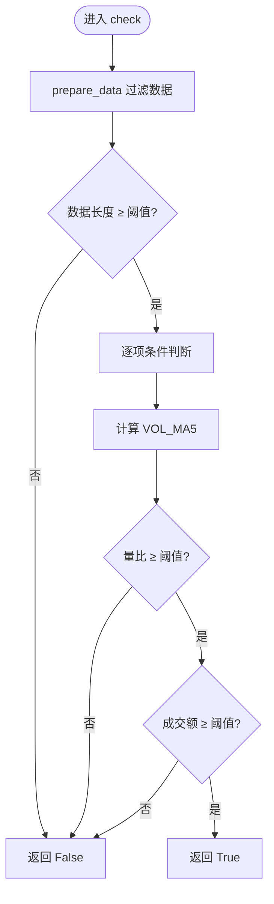
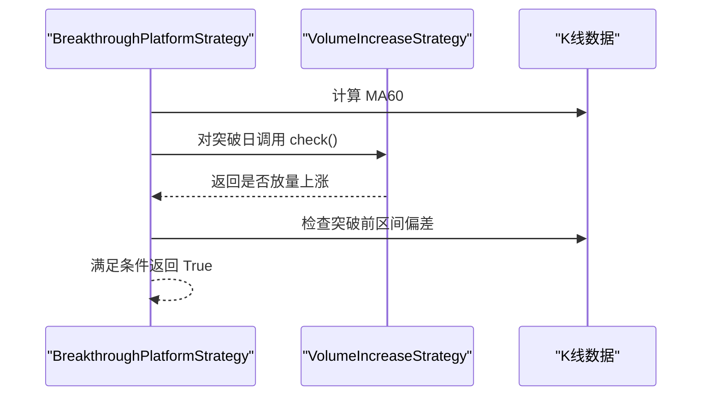
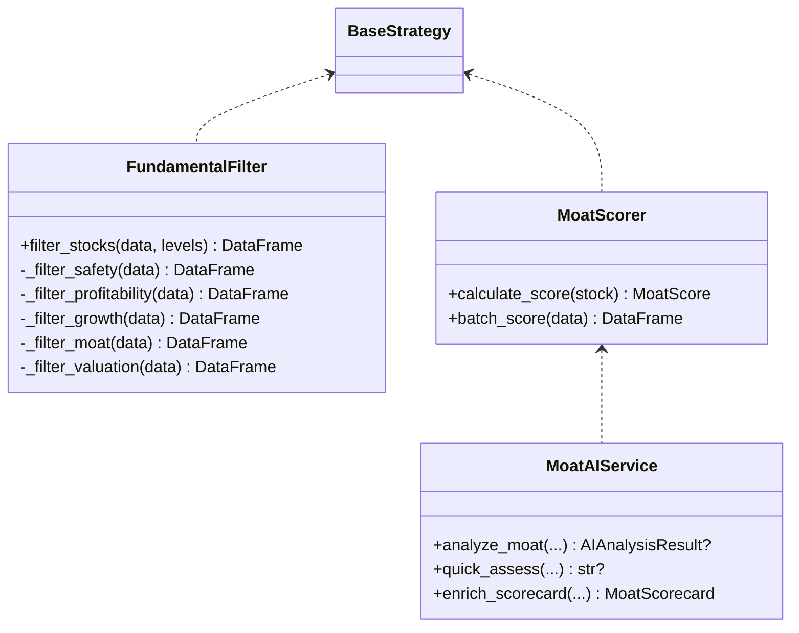
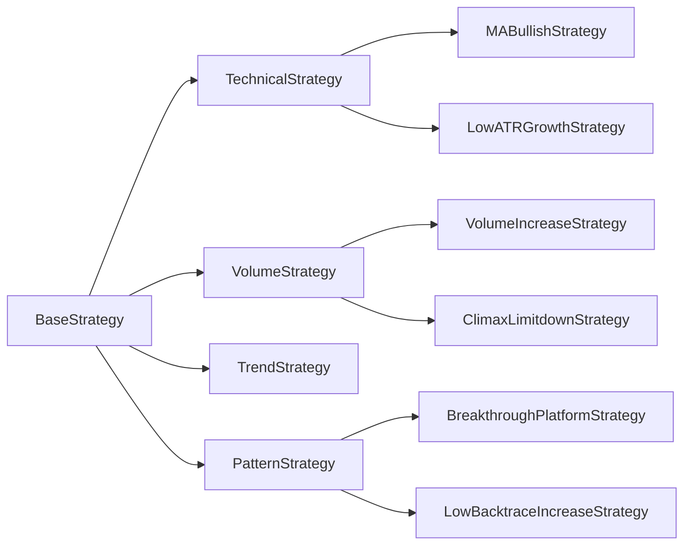

# 自定义策略开发

<cite>
**本文档引用的文件**
- [base.py](file://quantia/core/strategy/base.py)
- [__init__.py](file://quantia/core/strategy/__init__.py)
- [README.md](file://quantia/core/strategy/README.md)
- [strategy_template.py](file://quantia/trade/robot/infrastructure/strategy_template.py)
- [default_handler.py](file://quantia/trade/robot/infrastructure/default_handler.py)
- [enter.py](file://quantia/core/strategy/enter.py)
- [ma_strategies.py](file://quantia/core/strategy/technical/ma_strategies.py)
- [volume_strategies.py](file://quantia/core/strategy/volume/volume_strategies.py)
- [pattern_strategies.py](file://quantia/core/strategy/pattern/pattern_strategies.py)
- [fundamental_strategies.py](file://quantia/core/strategy/fundamental/fundamental_strategies.py)
- [fundamental_filter.py](file://quantia/core/strategy/fundamental/fundamental_filter.py)
- [moat_model.py](file://quantia/core/strategy/fundamental/moat_model.py)
- [moat_ai_service.py](file://quantia/core/strategy/fundamental/moat_ai_service.py)
- [test_strategy_mapping.py](file://tests/test_strategy_mapping.py)
- [test_strategy_bugs.py](file://tests/test_strategy_bugs.py)
</cite>

## 目录
1. [简介](#简介)
2. [项目结构](#项目结构)
3. [核心组件](#核心组件)
4. [架构概览](#架构概览)
5. [详细组件分析](#详细组件分析)
6. [依赖关系分析](#依赖关系分析)
7. [性能考虑](#性能考虑)
8. [故障排查指南](#故障排查指南)
9. [结论](#结论)
10. [附录](#附录)

## 简介
本指南面向希望基于 Quantia 平台开发自定义选股策略的开发者。文档围绕策略基类、策略注册机制、参数配置方法以及测试验证流程展开，提供最佳实践、代码规范与性能优化技巧，并附带完整的策略开发示例与调试指南，帮助开发者快速上手策略扩展开发。

## 项目结构
Quantia 的策略体系采用模块化设计，策略基类位于 core/strategy，具体策略分布在技术、成交量、形态与基本面四个子模块中；同时提供注册表与兼容接口，便于统一管理和调用。

**图表来源**
- [base.py](file://quantia/core/strategy/base.py#L20-L202)
- [__init__.py](file://quantia/core/strategy/__init__.py#L30-L119)

**章节来源**
- [README.md](file://quantia/core/strategy/README.md#L1-L146)
- [__init__.py](file://quantia/core/strategy/__init__.py#L1-L119)

## 核心组件
- 策略基类与注册机制
  - BaseStrategy：定义统一的 check 接口与数据准备逻辑，提供 prepare_data 过滤指定日期前数据并校验最小数据长度。
  - 分类基类：TechnicalStrategy、VolumeStrategy、TrendStrategy、PatternStrategy 提供常用指标计算工具（如 MA、EMA、ATR、成交量均量等）。
  - 注册表：STRATEGY_REGISTRY 通过装饰器 register_strategy 动态注册策略类；get_strategy/get_all_strategies/get_strategies_by_category 提供查询接口。
- 策略模板与日志
  - StrategyTemplate：交易机器人策略模板，提供初始化、策略执行、时钟事件与日志钩子。
  - DefaultLogHandler：默认日志处理器，支持 stdout/file 输出与级别控制。

**章节来源**
- [base.py](file://quantia/core/strategy/base.py#L20-L202)
- [strategy_template.py](file://quantia/trade/robot/infrastructure/strategy_template.py#L9-L43)
- [default_handler.py](file://quantia/trade/robot/infrastructure/default_handler.py#L15-L37)

## 架构概览
策略开发遵循“基类抽象 + 分类扩展 + 注册管理 + 兼容接口”的架构模式。开发者通过继承相应基类实现 check 方法，使用装饰器完成注册，即可被统一调度与测试。

**图表来源**
- [base.py](file://quantia/core/strategy/base.py#L159-L191)

## 详细组件分析

### 策略基类与注册机制
- BaseStrategy
  - 关键方法：check(code_name, data, date, **kwargs)、prepare_data()、__call__()。
  - 数据准备：按 end_date 过滤数据，确保长度 ≥ threshold。
- 分类基类
  - TechnicalStrategy：提供 MA、EMA、ATR 计算。
  - VolumeStrategy：提供 VOL_MA、成交额计算。
- 注册与查询
  - @register_strategy 将策略类加入 STRATEGY_REGISTRY。
  - get_strategy(name) 按名称获取策略类；get_all_strategies() 获取全部；get_strategies_by_category() 按分类筛选。

**图表来源**
- [base.py](file://quantia/core/strategy/base.py#L20-L143)

**章节来源**
- [base.py](file://quantia/core/strategy/base.py#L20-L202)

### 技术策略示例：均线多头与低ATR成长
- MABullishStrategy
  - 条件：MA30 连续上升且涨幅 > 20%。
  - 实现要点：使用 prepare_data 确保阈值，计算 MA30 并分段比较。
- LowATRGrowthStrategy
  - 条件：ATR/Close < 3%，120 日涨幅 > 10%。
  - 实现要点：计算 ATR 并与价格比值判断，检查区间涨跌幅。

**图表来源**
- [ma_strategies.py](file://quantia/core/strategy/technical/ma_strategies.py#L36-L55)
- [ma_strategies.py](file://quantia/core/strategy/technical/ma_strategies.py#L170-L211)

**章节来源**
- [ma_strategies.py](file://quantia/core/strategy/technical/ma_strategies.py#L22-L212)

### 成交量策略示例：放量上涨与放量跌停
- VolumeIncreaseStrategy
  - 条件：当日涨幅 > 2% 且收盘 > 开盘；成交额 ≥ 2 亿；量比 ≥ 2。
  - 实现要点：计算 VOL_MA5，注意除零保护。
- ClimaxLimitdownStrategy
  - 条件：当日跌停且量比 ≥ 1.5。
  - 实现要点：p_change 接近 -10% 时判定跌停，量比判断。

**图表来源**
- [volume_strategies.py](file://quantia/core/strategy/volume/volume_strategies.py#L34-L68)
- [volume_strategies.py](file://quantia/core/strategy/volume/volume_strategies.py#L85-L112)

**章节来源**
- [volume_strategies.py](file://quantia/core/strategy/volume/volume_strategies.py#L19-L126)

### 形态策略示例：突破平台与无大幅回撤
- BreakthroughPlatformStrategy
  - 条件：某日收盘价在 MA60 上方且当日放量上涨；此前一段时间收盘价与 MA60 偏差在 -5%~20%。
  - 实现要点：组合使用 VolumeIncreaseStrategy 与 MA60 计算。
- LowBacktraceIncreaseStrategy
  - 条件：60 日涨幅 > 60%，期间无单日跌幅 > 7%、高开低走 > 7%、两日累计跌幅 > 10%、两日高开低走累计 > 10%。
  - 实现要点：注意 previous_open 初始化，避免误判。

**图表来源**
- [pattern_strategies.py](file://quantia/core/strategy/pattern/pattern_strategies.py#L22-L77)

**章节来源**
- [pattern_strategies.py](file://quantia/core/strategy/pattern/pattern_strategies.py#L22-L276)

### 基本面策略：价值投资、成长投资与护城河
- ValueInvestStrategy/GrowthInvestStrategy/MoatStrategy
  - 通过 FundamentalFilter 与 FundamentalCriteria 进行多层级筛选。
  - MoatStrategy 结合 MoatScorer 进行护城河评分，输出评分卡。
- AI 辅助：MoatAIService 提供 AI 分析接口，整合到评分卡中。

**图表来源**
- [fundamental_strategies.py](file://quantia/core/strategy/fundamental/fundamental_strategies.py#L30-L289)
- [fundamental_filter.py](file://quantia/core/strategy/fundamental/fundamental_filter.py#L118-L299)
- [moat_model.py](file://quantia/core/strategy/fundamental/moat_model.py#L86-L323)
- [moat_ai_service.py](file://quantia/core/strategy/fundamental/moat_ai_service.py#L170-L305)

**章节来源**
- [fundamental_strategies.py](file://quantia/core/strategy/fundamental/fundamental_strategies.py#L30-L351)
- [fundamental_filter.py](file://quantia/core/strategy/fundamental/fundamental_filter.py#L118-L698)
- [moat_model.py](file://quantia/core/strategy/fundamental/moat_model.py#L86-L479)
- [moat_ai_service.py](file://quantia/core/strategy/fundamental/moat_ai_service.py#L170-L459)

### 策略模板与日志
- StrategyTemplate：提供 init、strategy、clock、shutdown 生命周期钩子，支持自定义日志句柄。
- DefaultLogHandler：封装日志处理器，支持 stdout/file 输出与级别设置。

**章节来源**
- [strategy_template.py](file://quantia/trade/robot/infrastructure/strategy_template.py#L9-L43)
- [default_handler.py](file://quantia/trade/robot/infrastructure/default_handler.py#L15-L37)

## 依赖关系分析
- 策略基类依赖 pandas/numpy/talib，提供统一接口与数据准备。
- 具体策略依赖分类基类提供的指标计算工具，减少重复实现。
- 注册表通过装饰器集中管理策略类，查询接口支持按分类筛选。
- 测试覆盖策略映射完整性与常见 bug 修复，保障策略稳定性。

**图表来源**
- [base.py](file://quantia/core/strategy/base.py#L99-L153)
- [ma_strategies.py](file://quantia/core/strategy/technical/ma_strategies.py#L22-L212)
- [volume_strategies.py](file://quantia/core/strategy/volume/volume_strategies.py#L19-L126)
- [pattern_strategies.py](file://quantia/core/strategy/pattern/pattern_strategies.py#L22-L276)

**章节来源**
- [base.py](file://quantia/core/strategy/base.py#L155-L202)
- [__init__.py](file://quantia/core/strategy/__init__.py#L30-L119)

## 性能考虑
- 数据过滤与阈值
  - 使用 prepare_data 在 check 前过滤到指定日期前的数据，避免不必要的计算。
  - 设置合理的 default_threshold，平衡精度与性能。
- 指标计算
  - 使用 talib 的向量化计算（MA/EMA/ATR/VOL_MA），减少 Python 循环。
  - 对 NaN 值进行填充或掩码处理，避免传播到后续计算。
- 除零保护
  - 在量比/ATR/成交量等计算中增加分母非零判断，防止除零异常。
- 批量处理
  - 对于基本面策略，优先使用 DataFrame 的向量化筛选，减少逐行遍历。

[本节为通用指导，无需特定文件来源]

## 故障排查指南
- 策略映射与兼容性
  - 使用测试用例验证策略映射完整性，确保中文名、表名与别名均能正确解析。
- 常见数值问题
  - 放量上涨/放量跌停：当 VOL_MA5 为 0 时，应返回 False 并避免除零。
  - 回踩年线：注意 volume=0 时的除零保护与日期边界处理。
  - 旗形突破：确保使用当日收盘价而非切片后的 high 计算 ratio。
- 单元测试参考
  - 参考 test_strategy_mapping.py 与 test_strategy_bugs.py 中的断言与构造方法，定位问题并编写针对性测试。

**章节来源**
- [test_strategy_mapping.py](file://tests/test_strategy_mapping.py#L14-L165)
- [test_strategy_bugs.py](file://tests/test_strategy_bugs.py#L65-L277)

## 结论
Quantia 的策略体系提供了清晰的基类抽象、完善的注册与查询机制，以及丰富的示例策略。开发者只需遵循统一接口、使用分类基类工具、通过装饰器注册，并配合测试验证，即可高效完成自定义策略开发与上线。

[本节为总结性内容，无需特定文件来源]

## 附录

### 策略开发最佳实践
- 接口一致性
  - 统一实现 check(code_name, data, date=None, **kwargs)，返回布尔值。
  - 使用 prepare_data 过滤数据并校验阈值。
- 参数配置
  - default_threshold 与 category 合理设置，便于统一调度与展示。
  - 对外暴露的策略类使用 @register_strategy 装饰。
- 代码规范
  - 明确策略条件与实现逻辑，注释清晰。
  - 避免硬编码阈值，必要时通过类属性或配置文件管理。
- 性能优化
  - 优先使用向量化计算与缓存中间结果。
  - 对异常输入（如空数据、NaN、零值）进行显式处理。
- 测试验证
  - 编写单元测试覆盖正常路径与边界条件。
  - 使用现有测试用例作为模板，确保兼容性与稳定性。

[本节为通用指导，无需特定文件来源]

### 完整开发示例（步骤）
- 步骤1：创建策略文件，继承相应基类并实现 check。
- 步骤2：在文件顶部使用 @register_strategy 装饰策略类。
- 步骤3：在 __init__.py 中导出策略类，确保注册生效。
- 步骤4：编写单元测试，覆盖正常与异常场景。
- 步骤5：运行测试用例，验证策略映射与功能正确性。
- 步骤6：集成到回测与生产环境，监控运行状态。

**章节来源**
- [base.py](file://quantia/core/strategy/base.py#L159-L171)
- [__init__.py](file://quantia/core/strategy/__init__.py#L30-L119)
- [test_strategy_mapping.py](file://tests/test_strategy_mapping.py#L17-L84)
