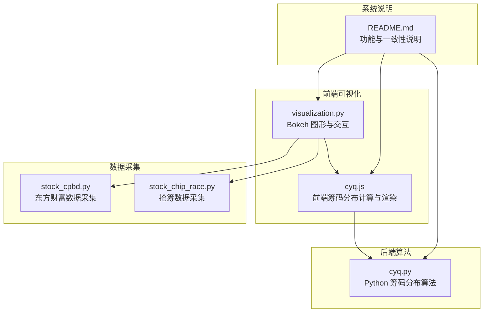
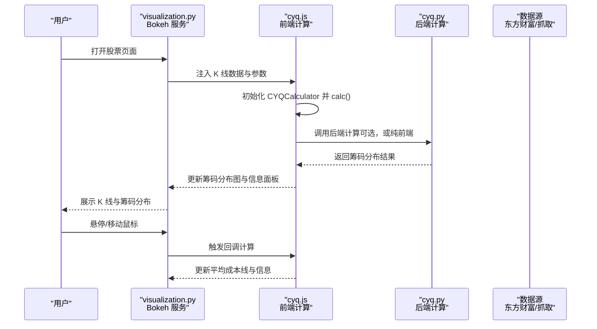
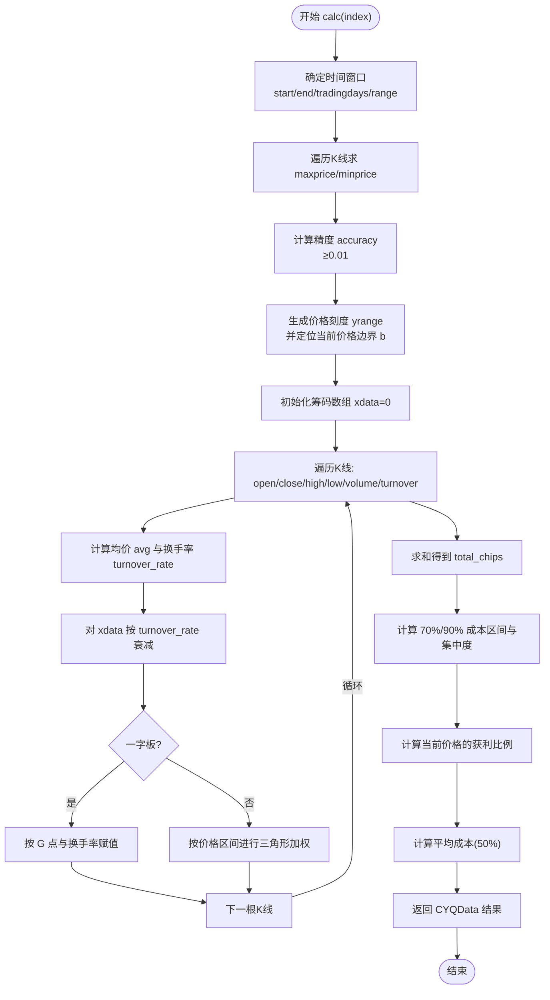
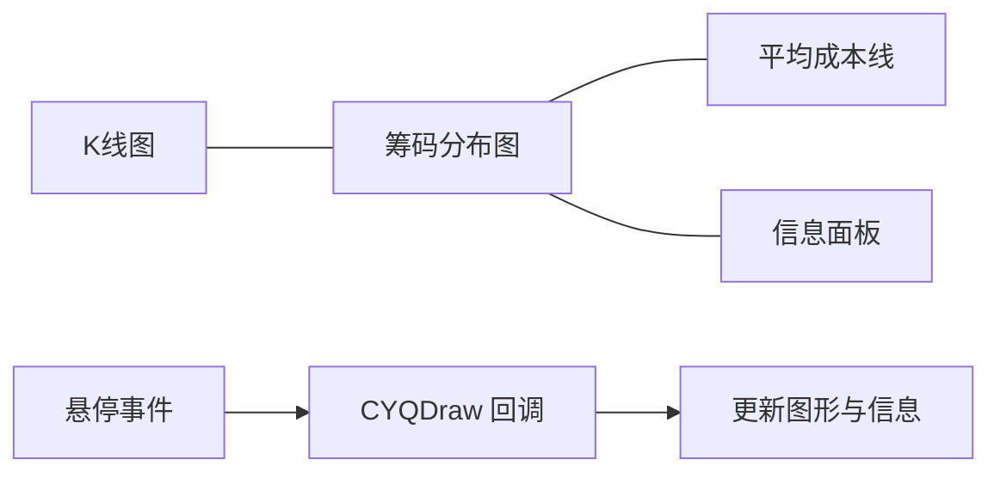
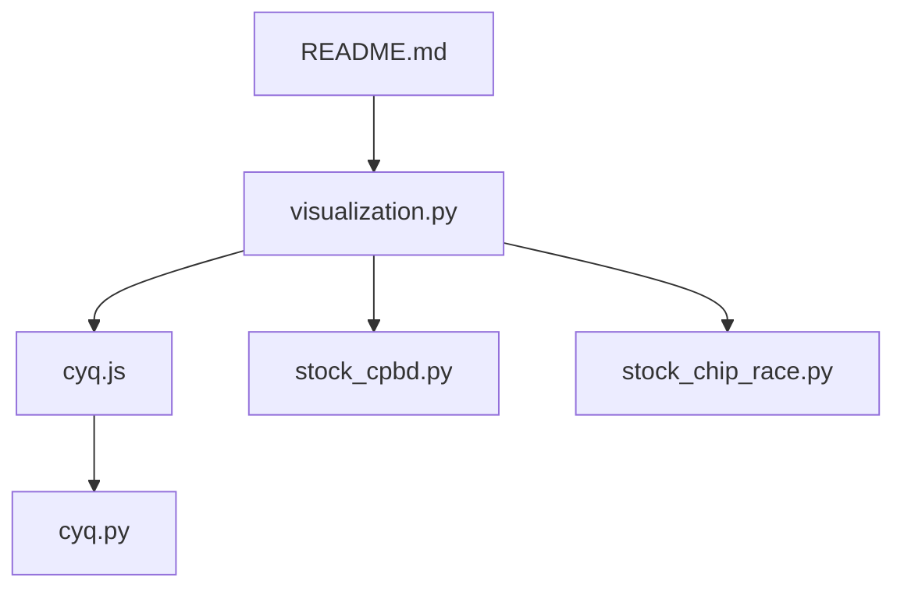

# 筹码分布计算

<cite>
**本文引用的文件**
- [README.md](file://README.md)
- [cyq.py](file://docker/stock/quantia/core/kline/cyq.py)
- [cyq.js](file://docker/stock/quantia/core/kline/cyq.js)
- [visualization.py](file://docker/stock/quantia/core/kline/visualization.py)
- [stock_cpbd.py](file://docker/stock/quantia/core/crawling/stock_cpbd.py)
- [stock_chip_race.py](file://docker/stock/quantia/core/crawling/stock_chip_race.py)
- [indicator_web_dic.py](file://docker/stock/quantia/core/kline/indicator_web_dic.py)
</cite>

## 目录
1. [简介](#简介)
2. [项目结构](#项目结构)
3. [核心组件](#核心组件)
4. [架构总览](#架构总览)
5. [详细组件分析](#详细组件分析)
6. [依赖关系分析](#依赖关系分析)
7. [性能考量](#性能考量)
8. [故障排查指南](#故障排查指南)
9. [结论](#结论)
10. [附录](#附录)

## 简介
本文件围绕 Quantia 系统中的筹码分布（CYQ）计算体系，系统化阐述其计算原理、算法实现、时间范围配置、与专业软件一致性验证思路、计算效率优化策略，并提供筹码分布图的解读方法与投资决策应用技巧。筹码分布通过在一定时间窗口内对最高价、最低价、成交量等数据进行加权叠加，刻画不同价格区间的筹码密度与成本分布，辅助研判股价压力/支撑与获利盘分布。

## 项目结构
与筹码分布直接相关的核心模块与文件如下：
- 筹码分布算法实现（Python/JavaScript 双实现）
  - Python 实现：[cyq.py](file://docker/stock/quantia/core/kline/cyq.py)
  - JavaScript 实现：[cyq.js](file://docker/stock/quantia/core/kline/cyq.js)
- 可视化集成与交互
  - 可视化渲染与交互：[visualization.py](file://docker/stock/quantia/core/kline/visualization.py)
- 数据采集与一致性验证
  - 东方财富相关数据采集：[stock_cpbd.py](file://docker/stock/quantia/core/crawling/stock_cpbd.py)
  - 抢筹数据采集（辅助一致性验证思路）：[stock_chip_race.py](file://docker/stock/quantia/core/crawling/stock_chip_race.py)
- 指标与可视化面板配置
  - 指标面板配置：[indicator_web_dic.py](file://docker/stock/quantia/core/kline/indicator_web_dic.py)

图表来源
- [visualization.py](file://docker/stock/quantia/core/kline/visualization.py#L91-L106)
- [cyq.js](file://docker/stock/quantia/core/kline/cyq.js#L32-L133)
- [cyq.py](file://docker/stock/quantia/core/kline/cyq.py#L27-L165)
- [stock_cpbd.py](file://docker/stock/quantia/core/crawling/stock_cpbd.py#L14-L140)
- [stock_chip_race.py](file://docker/stock/quantia/core/crawling/stock_chip_race.py#L17-L176)
- [README.md](file://README.md#L110-L113)

章节来源
- [README.md](file://README.md#L110-L113)
- [visualization.py](file://docker/stock/quantia/core/kline/visualization.py#L91-L106)
- [cyq.js](file://docker/stock/quantia/core/kline/cyq.js#L32-L133)
- [cyq.py](file://docker/stock/quantia/core/kline/cyq.py#L27-L165)
- [stock_cpbd.py](file://docker/stock/quantia/core/crawling/stock_cpbd.py#L14-L140)
- [stock_chip_race.py](file://docker/stock/quantia/core/crawling/stock_chip_race.py#L17-L176)

## 核心组件
- 筹码分布计算器（Python）
  - 输入：K 线数据（包含日期、开盘、收盘、最高、最低、成交量、成交额、振幅、换手率等字段）
  - 关键参数：精度因子（纵轴刻度数）、计算范围（K 线数量）、交易日窗口（cyq_days）
  - 输出：筹码密度数组、价格刻度、平均成本、获利比例、百分位成本区间与集中度
- 筹码分布计算器（JavaScript）
  - 与 Python 版本等价的前端实现，用于 Bokeh 交互渲染
- 可视化与交互
  - 使用 Bokeh 渲染 K 线与筹码分布侧边图，支持悬停触发计算与渲染
- 数据采集与一致性验证
  - 通过东方财富等数据源抓取关键指标，结合筹码分布结果进行一致性校验

章节来源
- [cyq.py](file://docker/stock/quantia/core/kline/cyq.py#L13-L22)
- [cyq.js](file://docker/stock/quantia/core/kline/cyq.js#L9-L26)
- [visualization.py](file://docker/stock/quantia/core/kline/visualization.py#L42-L44)
- [README.md](file://README.md#L110-L113)

## 架构总览
筹码分布计算在系统中的位置与交互流程如下：

图表来源
- [visualization.py](file://docker/stock/quantia/core/kline/visualization.py#L91-L106)
- [cyq.js](file://docker/stock/quantia/core/kline/cyq.js#L32-L133)
- [cyq.py](file://docker/stock/quantia/core/kline/cyq.py#L27-L165)

## 详细组件分析

### 筹码分布算法（Python）
- 时间范围与窗口
  - 通过 tradingdays 控制计算的交易日窗口，默认 210 个交易日
  - 通过 range 控制参与计算的 K 线数量（与 tradingdays 协同）
- 价格网格与精度
  - 以 minprice、maxprice 为边界，按精度因子划分等距价格刻度
  - 精度不小于 0.01，避免过细导致计算开销
- 成本分布叠加
  - 对每根 K 线，计算均价与换手率，按价格区间进行三角形分布加权
  - 一字板特殊处理：按 G 点坐标与换手率进行集中度赋值
  - 每根 K 线结束后，对现有筹码按换手率进行衰减
- 指标输出
  - 平均成本：50% 分位对应的价格
  - 获利比例：当前价格以上的筹码占比
  - 百分位成本区间：70%/90% 分位对应的价格区间与集中度
  - 边界下标：当前价格所在价格刻度的下标

图表来源
- [cyq.py](file://docker/stock/quantia/core/kline/cyq.py#L27-L165)

章节来源
- [cyq.py](file://docker/stock/quantia/core/kline/cyq.py#L13-L22)
- [cyq.py](file://docker/stock/quantia/core/kline/cyq.py#L27-L165)

### 筹码分布算法（JavaScript）
- 与 Python 版本等价的前端实现，用于 Bokeh 交互渲染
- 关键差异
  - 使用 toPrecision(12) 进行数值精度控制，避免浮点误差累积
  - 通过 DOM 事件回调触发计算，动态更新筹码分布图与信息面板

章节来源
- [cyq.js](file://docker/stock/quantia/core/kline/cyq.js#L9-L26)
- [cyq.js](file://docker/stock/quantia/core/kline/cyq.js#L32-L133)
- [cyq.js](file://docker/stock/quantia/core/kline/cyq.js#L138-L149)
- [cyq.js](file://docker/stock/quantia/core/kline/cyq.js#L198-L222)

### 可视化与交互（Bokeh）
- K 线与筹码分布并排展示
- 筹码分布侧边图：上半区（高于平均成本）与下半区（低于平均成本）分别渲染
- 平均成本线与标注
- 信息面板：日期、获利比例、平均成本、70%/90% 成本区间与集中度、交易日数
- 交互：悬停触发计算，支持多点索引更新

图表来源
- [visualization.py](file://docker/stock/quantia/core/kline/visualization.py#L91-L106)
- [cyq.js](file://docker/stock/quantia/core/kline/cyq.js#L228-L353)

章节来源
- [visualization.py](file://docker/stock/quantia/core/kline/visualization.py#L91-L106)
- [cyq.js](file://docker/stock/quantia/core/kline/cyq.js#L228-L353)

### 数据采集与一致性验证
- 东方财富数据采集
  - 通过统一的 fetcher 接口抓取关键指标，作为一致性验证的数据基准
- 抢筹数据采集
  - 早盘/尾盘抢筹数据可用于验证筹码分布的短期资金行为一致性
- 一致性验证思路
  - 将筹码分布的“平均成本”、“获利比例”、“成本区间集中度”与东方财富关键指标对比
  - 对比不同数据源（如不同交易所或第三方接口）的 K 线与成交量，确保输入数据一致后再进行筹码分布对比

章节来源
- [stock_cpbd.py](file://docker/stock/quantia/core/crawling/stock_cpbd.py#L14-L140)
- [stock_chip_race.py](file://docker/stock/quantia/core/crawling/stock_chip_race.py#L17-L176)
- [README.md](file://README.md#L110-L113)

## 依赖关系分析
- 可视化层依赖前端 JS 计算器，后者可调用后端 Python 计算器（或纯前端）
- 筹码分布计算依赖 K 线数据的质量与完整性
- 一致性验证依赖数据采集模块与第三方数据源

图表来源
- [visualization.py](file://docker/stock/quantia/core/kline/visualization.py#L91-L106)
- [cyq.js](file://docker/stock/quantia/core/kline/cyq.js#L32-L133)
- [cyq.py](file://docker/stock/quantia/core/kline/cyq.py#L27-L165)
- [stock_cpbd.py](file://docker/stock/quantia/core/crawling/stock_cpbd.py#L14-L140)
- [stock_chip_race.py](file://docker/stock/quantia/core/crawling/stock_chip_race.py#L17-L176)
- [README.md](file://README.md#L110-L113)

章节来源
- [visualization.py](file://docker/stock/quantia/core/kline/visualization.py#L91-L106)
- [cyq.js](file://docker/stock/quantia/core/kline/cyq.js#L32-L133)
- [cyq.py](file://docker/stock/quantia/core/kline/cyq.py#L27-L165)
- [stock_cpbd.py](file://docker/stock/quantia/core/crawling/stock_cpbd.py#L14-L140)
- [stock_chip_race.py](file://docker/stock/quantia/core/crawling/stock_chip_race.py#L17-L176)
- [README.md](file://README.md#L110-L113)

## 性能考量
- 精度因子与计算复杂度
  - 精度因子越大，价格刻度越细，计算量与内存占用越高
  - 建议根据目标股票价格区间与波动性合理设置精度因子
- K 线数量与窗口大小
  - tradingdays 与 range 决定参与计算的 K 线数量，窗口越大计算越慢
  - 可通过滑动窗口与增量更新策略减少重复计算
- 数值精度与稳定性
  - Python 版本使用 toPrecision/高精度字符串格式化，避免浮点误差累积
  - 建议在前端 JS 版本同样采用高精度处理
- 交互渲染优化
  - 仅在悬停或索引变化时触发计算，避免频繁重算
  - 对历史数据进行缓存，减少重复请求

章节来源
- [cyq.py](file://docker/stock/quantia/core/kline/cyq.py#L44-L45)
- [cyq.py](file://docker/stock/quantia/core/kline/cyq.py#L92-L92)
- [cyq.js](file://docker/stock/quantia/core/kline/cyq.js#L115-L120)
- [visualization.py](file://docker/stock/quantia/core/kline/visualization.py#L91-L106)

## 故障排查指南
- 筹码分布为空或异常
  - 检查 K 线数据是否完整（存在空值或异常值）
  - 确认精度因子与价格区间设置是否合理
- 前后端结果不一致
  - 对比前后端数值精度处理（toPrecision 与高精度字符串格式化）
  - 确认输入数据（K 线、成交量、换手率）是否一致
- 交互不响应
  - 检查 Bokeh 回调是否正确注入与触发
  - 确认前端 JS 文件加载与路径配置

章节来源
- [cyq.py](file://docker/stock/quantia/core/kline/cyq.py#L44-L45)
- [cyq.js](file://docker/stock/quantia/core/kline/cyq.js#L115-L120)
- [visualization.py](file://docker/stock/quantia/core/kline/visualization.py#L91-L106)

## 结论
Quantia 的筹码分布计算体系以 Python/JavaScript 双实现为核心，配合 Bokeh 可视化与交互，实现了高效、可解释的筹码密度与成本分布展示。通过合理的参数配置、数值精度控制与交互优化，系统能够在保证与专业软件一致性的同时，满足日常投资分析与决策需求。建议在实际使用中结合数据采集与一致性验证流程，持续校准输入数据质量与算法参数，以获得更稳健的结果。

## 附录

### 时间范围配置与默认值
- 默认交易日窗口：210 个交易日
- 默认计算 K 线数量：阈值 + 窗口（由可视化层设置）
- 可通过参数调整精度因子、计算范围与交易日窗口

章节来源
- [visualization.py](file://docker/stock/quantia/core/kline/visualization.py#L42-L44)
- [cyq.py](file://docker/stock/quantia/core/kline/cyq.py#L13-L22)

### 与专业软件一致性验证要点
- 对比维度：平均成本、获利比例、70%/90% 成本区间与集中度
- 数据源：东方财富等权威数据源的关键指标
- 方法：在相同时间窗口与输入数据条件下进行对比

章节来源
- [README.md](file://README.md#L110-L113)
- [stock_cpbd.py](file://docker/stock/quantia/core/crawling/stock_cpbd.py#L14-L140)
- [stock_chip_race.py](file://docker/stock/quantia/core/crawling/stock_chip_race.py#L17-L176)

### 筹码分布图解读与应用
- 平均成本线：反映市场多数人的持仓成本，常作为短期压力/支撑参考
- 获利比例：当前价格之上筹码占比，反映当前获利盘压力
- 成本区间与集中度：衡量筹码在某一价格区间的密集程度，集中度越高，突破/回踩的敏感性越强
- 应用技巧：
  - 高位高集中度：潜在压力较大，需警惕回调
  - 低位高集中度：潜在支撑较强，可能形成底部
  - 成本区间突破：结合成交量与趋势确认有效性

章节来源
- [cyq.js](file://docker/stock/quantia/core/kline/cyq.js#L228-L353)
- [cyq.py](file://docker/stock/quantia/core/kline/cyq.py#L108-L165)
- [indicator_web_dic.py](file://docker/stock/quantia/core/kline/indicator_web_dic.py#L1-L200)
