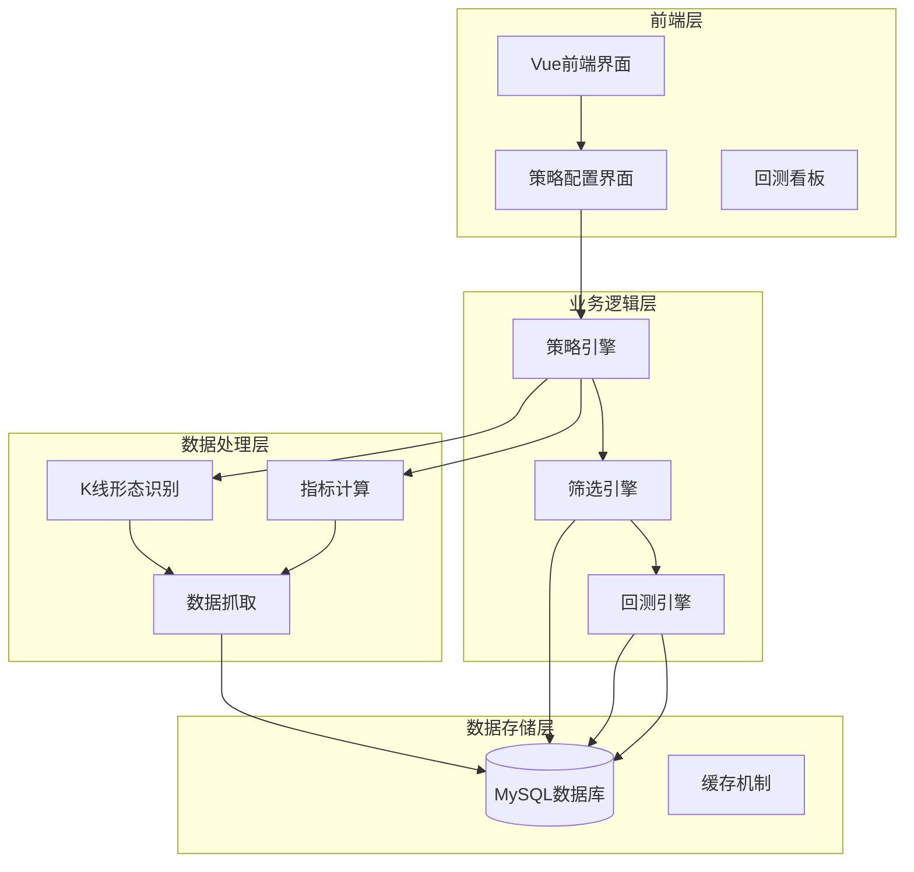
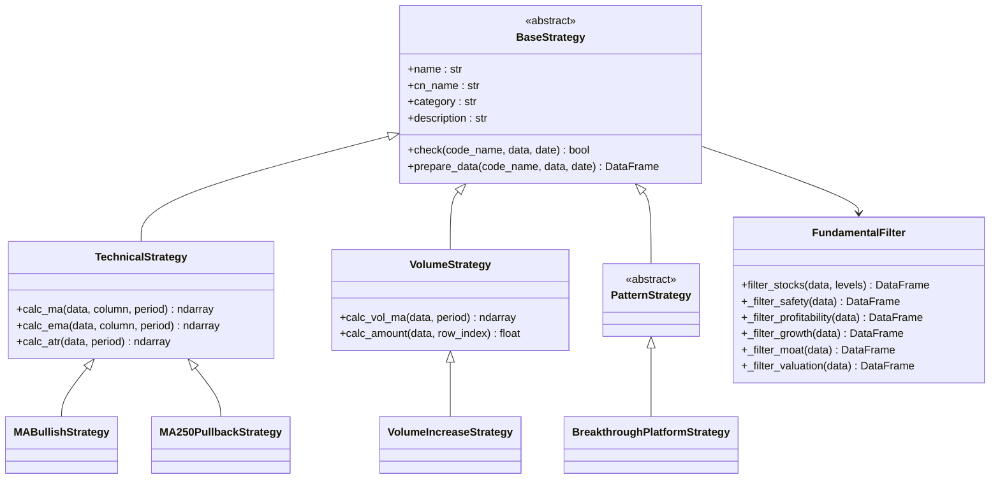
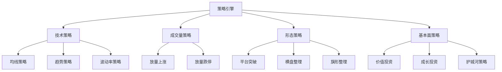
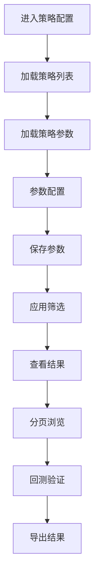
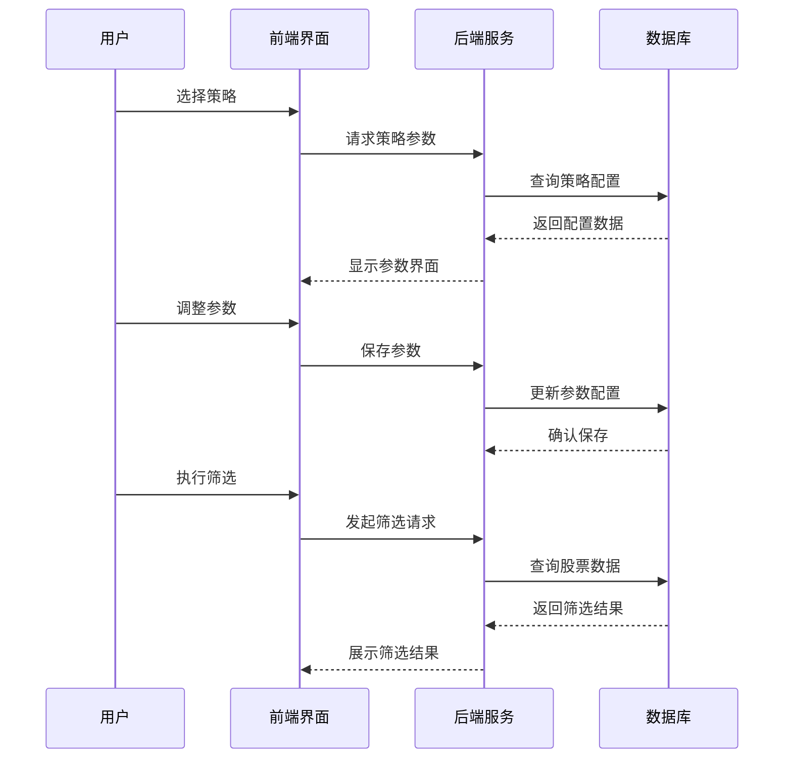

# 综合选股系统

<cite>
**本文档引用的文件**
- [README.md](file://README.md)
- [QUICKSTART.md](file://QUICKSTART.md)
- [tablestructure.py](file://quantia/core/tablestructure.py)
- [calculate_indicator.py](file://quantia/core/indicator/calculate_indicator.py)
- [pattern_recognitions.py](file://quantia/core/pattern/pattern_recognitions.py)
- [base.py](file://quantia/core/strategy/base.py)
- [ma_strategies.py](file://quantia/core/strategy/technical/ma_strategies.py)
- [volume_strategies.py](file://quantia/core/strategy/volume/volume_strategies.py)
- [pattern_strategies.py](file://quantia/core/strategy/pattern/pattern_strategies.py)
- [fundamental_filter.py](file://quantia/core/strategy/fundamental/fundamental_filter.py)
- [fundamental_strategies.py](file://quantia/core/strategy/fundamental/fundamental_strategies.py)
- [StrategyConfig.vue](file://quantia/fontWeb/src/views/strategy/StrategyConfig.vue)
</cite>

## 目录
1. [项目概述](#项目概述)
2. [系统架构](#系统架构)
3. [核心功能模块](#核心功能模块)
4. [选股条件体系](#选股条件体系)
5. [策略引擎](#策略引擎)
6. [数据结构与指标](#数据结构与指标)
7. [前端交互界面](#前端交互界面)
8. [使用流程与案例](#使用流程与案例)
9. [性能与扩展性](#性能与扩展性)
10. [故障排查](#故障排查)
11. [总结](#总结)

## 项目概述

综合选股系统是一个基于Python开发的量化选股平台，支持股票范围筛选、基本面分析、技术面分析、消息面分析、人气指标分析、行情数据分析等六大维度的200多个信息栏目的自由组合选股能力。系统采用模块化设计，具备高效的数据处理能力、灵活的策略配置和直观的可视化界面。

系统的主要特点包括：
- 支持200+信息栏目的自由组合筛选
- 内置多种技术指标和K线形态识别
- 提供基本面、技术面、消息面等多维度分析
- 支持策略参数化配置和回测验证
- 提供Web前端界面，支持实时数据展示

## 系统架构



**图表来源**
- [StrategyConfig.vue](file://quantia/fontWeb/src/views/strategy/StrategyConfig.vue#L1-L697)
- [tablestructure.py](file://quantia/core/tablestructure.py#L1-L800)

## 核心功能模块

### 1. 数据采集与处理模块

系统采用多数据源策略，支持东方财富、腾讯财经、新浪财经等多个数据源的自动切换和容错处理。数据采集包括：

- **实时行情数据**：股票实时价格、成交量、成交额等
- **历史K线数据**：支持10年历史数据的增量更新
- **财务基本面数据**：ROE、毛利率、资产负债率等200+指标
- **技术指标数据**：MACD、KDJ、布林带等技术指标
- **K线形态数据**：61种经典K线形态识别

### 2. 策略引擎模块

策略引擎采用插件化设计，支持多种策略类型的注册和管理：



**图表来源**
- [base.py](file://quantia/core/strategy/base.py#L20-L202)
- [fundamental_filter.py](file://quantia/core/strategy/fundamental/fundamental_filter.py#L118-L299)

**章节来源**
- [base.py](file://quantia/core/strategy/base.py#L1-L202)
- [tablestructure.py](file://quantia/core/tablestructure.py#L1-L800)

### 3. 指标计算模块

系统基于TA-Lib和Pandas提供高效准确的技术指标计算：

- **价格类指标**：MA、EMA、布林带、KDJ等
- **动量类指标**：MACD、RSI、CCI、ROC等  
- **成交量类指标**：OBV、MFI、VR等
- **波动率类指标**：ATR、BBI、DPO等
- **趋势类指标**：ADX、DMI、SAR等

### 4. K线形态识别模块

支持61种经典K线形态的自动识别，包括：
- **反转形态**：锤子线、倒锤头、吞没形态等
- **持续形态**：三白兵、三只乌鸦、早晨之星等
- **整理形态**：矩形、三角形、双底等

## 选股条件体系

### 1. 股票范围筛选

系统提供全方位的股票范围筛选能力：

**市场维度**：
- 主板、中小板、创业板、科创板
- 沪深300、上证50、中证500等指数成分股
- 新三板、退市整理板等特殊市场

**行业维度**：
- 中证行业分类（一级/二级/三级）
- 申万行业分类
- 国标行业分类

**地域维度**：
- 省份、城市、经济特区
- 京津冀、长三角、粤港澳大湾区等区域

**概念维度**：
- 热点概念、题材概念
- 政策概念、主题概念

**风格维度**：
- 价值股、成长股、平衡股
- 大盘股、中小盘股、小盘股
- 高β、低β股票

### 2. 基本面分析

提供多层次的基本面筛选：

**财务安全过滤**：
- 资产负债率 < 60%
- 每股经营现金流 > 0
- 流动比率 ≥ 1.0

**盈利能力筛选**：
- ROE(加权) ≥ 15%
- 毛利率 ≥ 30%
- 净利率 ≥ 10%
- ROA ≥ 5%

**成长质量筛选**：
- 营收3年复合增长率 > 10%
- 净利润3年复合增长率 > 10%
- 扣非净利润增长率 > 0

**竞争壁垒评估**：
- 上市时间 ≥ 5年
- 速动比率 ≥ 0.8
- 现金流稳定

**估值约束**：
- 市盈率TTM ≤ 50
- 市净率MRQ ≤ 10
- PEG ≤ 1.5

### 3. 技术面分析

涵盖多种技术分析方法：

**趋势分析**：
- 均线多头排列
- 年线突破回踩
- 趋势通道突破

**成交量分析**：
- 放量上涨
- 放量跌停
- 量价配合

**形态分析**：
- 经典K线形态识别
- 三形态组合
- 头肩顶底识别

### 4. 消息面分析

整合多渠道消息数据：

**公告消息**：
- 重大事项公告
- 业绩预告
- 重组并购消息

**机构关注**：
- 机构调研记录
- 机构持仓变化
- 机构评级调整

**市场情绪**：
- 股吧人气排名
- 资金流向
- 市场热度

### 5. 人气指标分析

提供多维度的人气指标：

**交易热度**：
- 涨停板统计
- 连板股数量
- 地板股统计

**资金活跃度**：
- 主力净流入
- 超大单资金流向
- 散户参与度

**市场情绪**：
- 恐慌指数
- 鲸鱼活动
- 市场信心指数

### 6. 行情数据分析

实时监控市场行情：

**价格表现**：
- 涨跌幅排行
- 涨速排行
- 波动率分析

**成交量分析**：
- 成交量变化
- 换手率分析
- 成交额分布

**资金流向**：
- 主力资金流向
- 超大单资金流向
- 散户资金流向

## 策略引擎

### 1. 策略分类体系

系统采用统一的策略分类体系：



**图表来源**
- [base.py](file://quantia/core/strategy/base.py#L155-L202)

### 2. 策略注册机制

系统采用装饰器模式实现策略注册：

```python
@register_strategy
class MABullishStrategy(TechnicalStrategy):
    name = "keep_increasing"
    cn_name = "均线多头"
    default_threshold = 30
    description = "MA30均线持续上涨，涨幅超过20%"
```

### 3. 策略参数化

每个策略都支持参数化配置，用户可以根据需要调整筛选条件。

**章节来源**
- [ma_strategies.py](file://quantia/core/strategy/technical/ma_strategies.py#L1-L237)
- [volume_strategies.py](file://quantia/core/strategy/volume/volume_strategies.py#L1-L126)
- [pattern_strategies.py](file://quantia/core/strategy/pattern/pattern_strategies.py#L1-L276)
- [fundamental_strategies.py](file://quantia/core/strategy/fundamental/fundamental_strategies.py#L1-L351)

## 数据结构与指标

### 1. 数据表结构

系统采用标准化的数据表结构，支持200+个信息栏目的存储：

```mermaid
erDiagram
CN_STOCK_SELECTION {
date DATE
code VARCHAR(6)
name VARCHAR(20)
new_price FLOAT
change_rate FLOAT
volume BIGINT
turnover BIGINT
amplitude FLOAT
turnoverrate FLOAT
volume_ratio FLOAT
open FLOAT
high FLOAT
low FLOAT
pre_close FLOAT
listing_date DATE
industry VARCHAR(50)
area VARCHAR(50)
concept VARCHAR(800)
style VARCHAR(255)
is_hs300 VARCHAR(2)
is_sz50 VARCHAR(2)
is_zz500 VARCHAR(2)
is_zz1000 VARCHAR(2)
is_cy50 VARCHAR(2)
pe9 FLOAT
pbnewmrq FLOAT
pettmdeducted FLOAT
ps9 FLOAT
pcfjyxjl9 FLOAT
predict_pe_syear FLOAT
predict_pe_nyear FLOAT
total_market_cap BIGINT
free_cap BIGINT
dtsyl FLOAT
ycpeg FLOAT
enterprise_value_multiple FLOAT
basic_eps FLOAT
bvps FLOAT
per_netcash_operate FLOAT
per_fcfe FLOAT
per_capital_reserve FLOAT
per_unassign_profit FLOAT
per_surplus_reserve FLOAT
per_retained_earning FLOAT
parent_netprofit BIGINT
deduct_netprofit BIGINT
total_operate_income BIGINT
roe_weight FLOAT
jroa FLOAT
roic FLOAT
zxgxl FLOAT
sale_gpr FLOAT
sale_npr FLOAT
netprofit_yoy_ratio FLOAT
deduct_netprofit_growthrate FLOAT
toi_yoy_ratio FLOAT
netprofit_growthrate_3y FLOAT
income_growthrate_3y FLOAT
predict_netprofit_ratio FLOAT
predict_income_ratio FLOAT
basiceps_yoy_ratio FLOAT
total_profit_growthrate FLOAT
operate_profit_growthrate FLOAT
debt_asset_ratio FLOAT
equity_ratio FLOAT
equity_multiplier FLOAT
current_ratio FLOAT
speed_ratio FLOAT
total_shares BIGINT
free_shares BIGINT
holder_newest BIGINT
holder_ratio FLOAT
hold_amount FLOAT
avg_hold_num FLOAT
holdnum_growthrate_3q FLOAT
holdnum_growthrate_hy FLOAT
hold_ratio_count FLOAT
free_hold_ratio FLOAT
}
```



**图表来源**
- [tablestructure.py](file://quantia/core/tablestructure.py#L591-L800)

### 2. 技术指标体系

系统提供全面的技术指标支持：

**价格类指标**：
- 移动平均线：MA(5/10/20/30/60/120/250)
- 指数平滑：EMA(12/26)
- 布林带：BOLL(20,2)

**动量类指标**：
- MACD：DIF、DEA、柱状图
- KDJ：K、D、J线
- RSI：6/12/14日周期
- CCI：14/84日周期

**成交量类指标**：
- OBV：能量潮指标
- MFI：资金流量指标
- VR：量比指标

**波动率类指标**：
- ATR：平均真实波幅
- BBI：多空指标
- DPO：延迟震荡指标

**章节来源**
- [calculate_indicator.py](file://quantia/core/indicator/calculate_indicator.py#L1-L449)
- [tablestructure.py](file://quantia/core/tablestructure.py#L320-L394)

## 前端交互界面

### 1. 策略配置界面

Vue前端提供了直观的策略配置界面：



**图表来源**
- [StrategyConfig.vue](file://quantia/fontWeb/src/views/strategy/StrategyConfig.vue#L130-L180)

### 2. 实时数据展示

前端界面支持实时数据展示和交互：

- **股票列表**：支持按多种指标排序
- **指标详情**：点击查看具体技术指标
- **回测看板**：可视化展示回测结果
- **关注管理**：支持股票关注和取消关注

**章节来源**
- [StrategyConfig.vue](file://quantia/fontWeb/src/views/strategy/StrategyConfig.vue#L1-L697)

## 使用流程与案例

### 1. 基础使用流程



### 2. 实际应用案例

**案例一：价值投资策略**
- 筛选条件：ROE≥15%、毛利率≥30%、资产负债率<60%
- 时间范围：最近60个交易日
- 结果：筛选出符合价值投资标准的优质股票

**案例二：技术面突破策略**
- 筛选条件：均线多头排列、放量上涨、突破平台
- 时间范围：最近30个交易日
- 结果：识别出具备技术面突破潜力的股票

**案例三：基本面+技术面综合策略**
- 筛选条件：ROE≥15%、毛利率≥30%、均线多头、放量上涨
- 时间范围：最近90个交易日
- 结果：获得更严格的综合筛选结果

### 3. 参数配置示例

系统支持灵活的参数配置：

- **阈值参数**：如ROE阈值、毛利率阈值等
- **时间参数**：如计算周期、回测周期等  
- **权重参数**：如不同指标的权重配置
- **过滤参数**：如行业过滤、市值过滤等

## 性能与扩展性

### 1. 性能优化

系统采用多项性能优化措施：

- **多线程处理**：并行处理多个股票的数据计算
- **缓存机制**：缓存常用数据和计算结果
- **增量更新**：支持历史数据的增量更新
- **内存管理**：优化大数据量下的内存使用

### 2. 扩展性设计

系统具备良好的扩展性：

- **插件化策略**：支持新增策略的快速集成
- **参数化配置**：支持策略参数的灵活配置
- **模块化架构**：各功能模块相对独立，便于维护
- **API接口**：提供标准化的API接口供外部调用

## 故障排查

### 1. 常见问题

**数据获取失败**：
- 检查网络连接状态
- 配置代理服务器
- 更新东方财富Cookie

**策略执行异常**：
- 检查策略参数配置
- 验证数据完整性
- 查看日志文件

**性能问题**：
- 检查系统资源使用情况
- 优化策略参数设置
- 调整并发处理数量

### 2. 日志分析

系统提供详细的日志记录：

- **执行日志**：记录数据处理过程
- **错误日志**：记录异常和错误信息
- **性能日志**：记录性能指标和瓶颈
- **访问日志**：记录用户操作行为

## 总结

综合选股系统是一个功能完善、架构清晰的量化选股平台。系统通过200多个信息栏目的自由组合，为用户提供全方位的股票筛选能力。系统采用模块化设计，支持灵活的策略配置和强大的扩展性。

主要优势包括：
- **全面的筛选维度**：涵盖股票范围、基本面、技术面、消息面、人气指标、行情数据六大维度
- **灵活的参数配置**：支持策略参数的个性化调整
- **高效的处理能力**：基于多线程和缓存机制的高性能设计
- **友好的用户界面**：直观的Vue前端界面，支持实时数据展示
- **完善的扩展机制**：插件化的策略设计，便于功能扩展

系统适用于专业投资者、量化分析师和普通投资者，为不同层次的用户提供了智能化的股票筛选工具。
