# 选股验证系统

<cite>
**本文档引用的文件**
- [bt_engine.py](file://quantia/core/backtest/bt_engine.py)
- [rate_stats.py](file://quantia/core/backtest/rate_stats.py)
- [backtestHandler.py](file://quantia/web/backtestHandler.py)
- [backtestDashboardHandler.py](file://quantia/web/backtestDashboardHandler.py)
- [base.py](file://quantia/web/base.py)
- [database.py](file://quantia/lib/database.py)
- [tablestructure.py](file://quantia/core/tablestructure.py)
- [base_strategy.py](file://quantia/core/strategy/base.py)
- [ma_strategies.py](file://quantia/core/strategy/technical/ma_strategies.py)
- [volume_strategies.py](file://quantia/core/strategy/volume/volume_strategies.py)
- [pattern_strategies.py](file://quantia/core/strategy/pattern/pattern_strategies.py)
- [fundamental_strategies.py](file://quantia/core/strategy/fundamental/fundamental_strategies.py)
- [strategyParamsHandler.py](file://quantia/web/strategyParamsHandler.py)
- [dataTableHandler.py](file://quantia/web/dataTableHandler.py)
- [klineHandler.py](file://quantia/web/klineHandler.py)
</cite>

## 目录
1. [简介](#简介)
2. [项目结构](#项目结构)
3. [核心组件](#核心组件)
4. [架构概览](#架构概览)
5. [详细组件分析](#详细组件分析)
6. [依赖关系分析](#依赖关系分析)
7. [性能考虑](#性能考虑)
8. [故障排除指南](#故障排除指南)
9. [结论](#结论)
10. [附录](#附录)

## 简介

Quantia选股验证系统是一个基于Backtrader的量化回测框架，专门用于验证和优化股票选股策略。该系统提供了完整的回测生态系统，包括策略开发、参数配置、回测执行、结果分析和可视化展示等功能。

系统的核心特点：
- **Backtrader集成**：深度集成Backtrader回测引擎，提供专业的量化回测能力
- **多策略支持**：涵盖技术分析、成交量分析、形态识别和基本面分析四大类策略
- **参数化配置**：支持策略参数的动态配置和持久化管理
- **可视化分析**：提供丰富的回测报告和图表展示功能
- **批量回测**：支持大规模策略回测和对比分析

## 项目结构

系统采用模块化设计，按照功能层次组织代码结构：

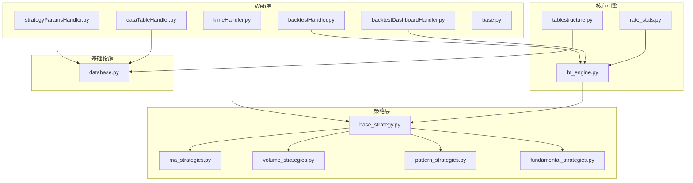

**图表来源**
- [backtestHandler.py](file://quantia/web/backtestHandler.py#L1-L673)
- [bt_engine.py](file://quantia/core/backtest/bt_engine.py#L1-L388)
- [base_strategy.py](file://quantia/core/strategy/base.py#L1-L202)

**章节来源**
- [backtestHandler.py](file://quantia/web/backtestHandler.py#L1-L673)
- [bt_engine.py](file://quantia/core/backtest/bt_engine.py#L1-L388)
- [base_strategy.py](file://quantia/core/strategy/base.py#L1-L202)

## 核心组件

### 回测引擎组件

系统的核心回测引擎由三个关键组件构成：

1. **BacktestEngine**：封装Backtrader引擎，提供简化的回测接口
2. **SignalStrategy**：信号驱动的策略基类，支持基于选股信号的交易执行
3. **StrategyBacktester**：策略批量回测器，支持多策略对比分析

### 策略体系

系统实现了完整的策略分类体系：

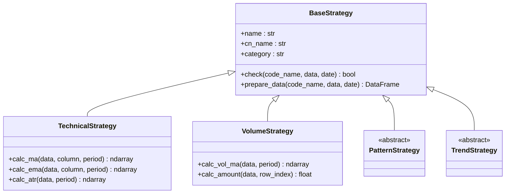

**图表来源**
- [base_strategy.py](file://quantia/core/strategy/base.py#L20-L202)

**章节来源**
- [base_strategy.py](file://quantia/core/strategy/base.py#L1-L202)
- [ma_strategies.py](file://quantia/core/strategy/technical/ma_strategies.py#L1-L237)
- [volume_strategies.py](file://quantia/core/strategy/volume/volume_strategies.py#L1-L126)
- [pattern_strategies.py](file://quantia/core/strategy/pattern/pattern_strategies.py#L1-L276)

## 架构概览

系统采用分层架构设计，确保各层职责清晰、耦合度低：

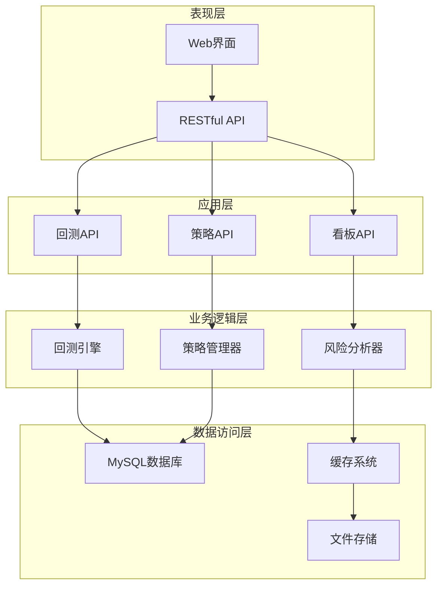

**图表来源**
- [backtestHandler.py](file://quantia/web/backtestHandler.py#L82-L126)
- [backtestDashboardHandler.py](file://quantia/web/backtestDashboardHandler.py#L360-L467)
- [database.py](file://quantia/lib/database.py#L60-L71)

## 详细组件分析

### 回测引擎组件

#### BacktestEngine类分析

BacktestEngine是系统的核心回测组件，提供了完整的回测生命周期管理：

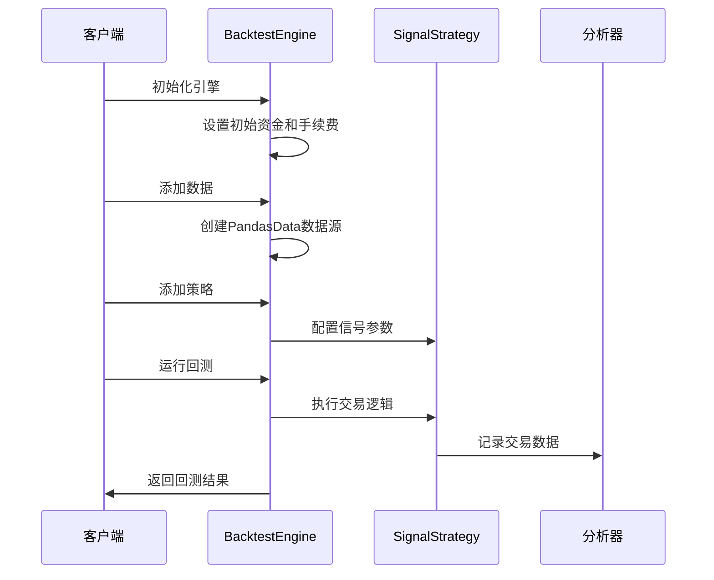

**图表来源**
- [bt_engine.py](file://quantia/core/backtest/bt_engine.py#L101-L215)

#### SignalStrategy策略分析

SignalStrategy是基于选股信号的交易策略实现：

| 参数 | 类型 | 默认值 | 说明 |
|------|------|--------|------|
| signal_dates | List[str] | [] | 选股信号日期列表 |
| hold_days | int | 5 | 持仓天数 |
| position_pct | float | 0.1 | 仓位比例 |

**章节来源**
- [bt_engine.py](file://quantia/core/backtest/bt_engine.py#L43-L99)

### 策略回测器

#### StrategyBacktester组件

StrategyBacktester提供了批量策略回测功能：

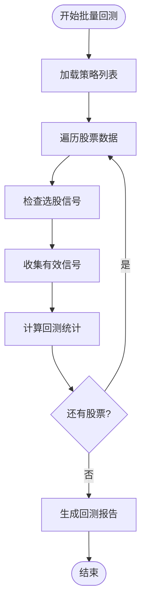

**图表来源**
- [bt_engine.py](file://quantia/core/backtest/bt_engine.py#L217-L308)

**章节来源**
- [bt_engine.py](file://quantia/core/backtest/bt_engine.py#L217-L308)

### 风险指标计算

#### 收益率计算模块

系统实现了多种收益率计算方法：

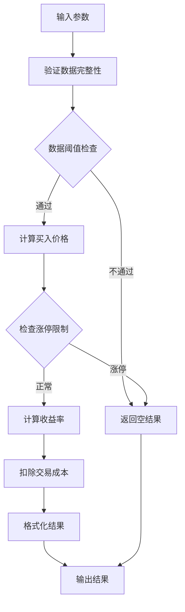

**图表来源**
- [rate_stats.py](file://quantia/core/backtest/rate_stats.py#L34-L108)

**章节来源**
- [rate_stats.py](file://quantia/core/backtest/rate_stats.py#L1-L108)

### Web API组件

#### 回测API分析

系统提供了完整的回测API接口：

| 接口名称 | 功能描述 | 请求参数 | 返回数据 |
|----------|----------|----------|----------|
| GetBacktestConfigHandler | 获取回测配置 | 无 | 可选周期、策略列表 |
| RunBacktestHandler | 执行单只股票回测 | code, strategy, period | 回测详细结果 |
| RunBatchBacktestHandler | 批量回测 | strategy, period, limit | 统计汇总结果 |

**章节来源**
- [backtestHandler.py](file://quantia/web/backtestHandler.py#L69-L126)

#### 回测看板API

回测看板提供了高级分析功能：

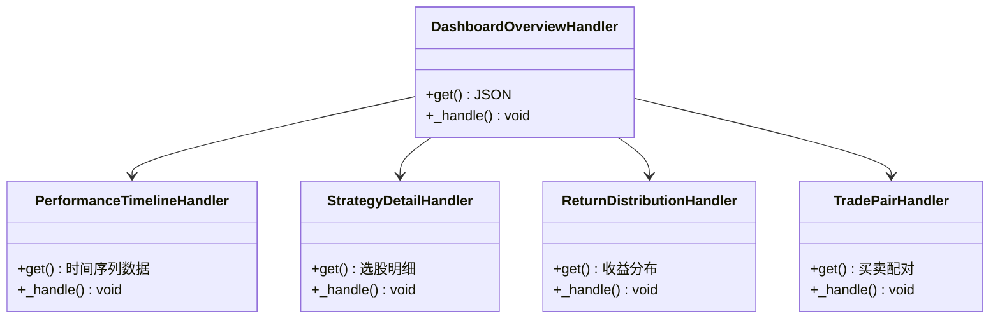

**图表来源**
- [backtestDashboardHandler.py](file://quantia/web/backtestDashboardHandler.py#L360-L467)

**章节来源**
- [backtestDashboardHandler.py](file://quantia/web/backtestDashboardHandler.py#L1-L906)

### 策略参数管理系统

#### 参数配置架构

系统实现了灵活的参数配置机制：

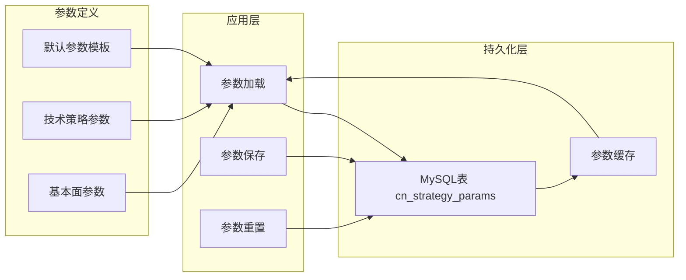

**图表来源**
- [strategyParamsHandler.py](file://quantia/web/strategyParamsHandler.py#L450-L539)

**章节来源**
- [strategyParamsHandler.py](file://quantia/web/strategyParamsHandler.py#L1-L1022)

## 依赖关系分析

### 数据库架构

系统使用MySQL作为主要数据存储，支持复杂的回测数据管理：

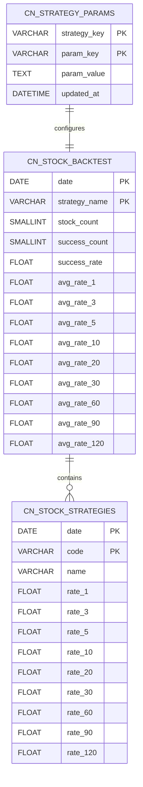

**图表来源**
- [tablestructure.py](file://quantia/core/tablestructure.py#L29-L44)
- [tablestructure.py](file://quantia/core/tablestructure.py#L409-L443)

**章节来源**
- [tablestructure.py](file://quantia/core/tablestructure.py#L1-L1137)
- [database.py](file://quantia/lib/database.py#L450-L468)

### 策略依赖关系

系统策略之间存在复杂的依赖关系：

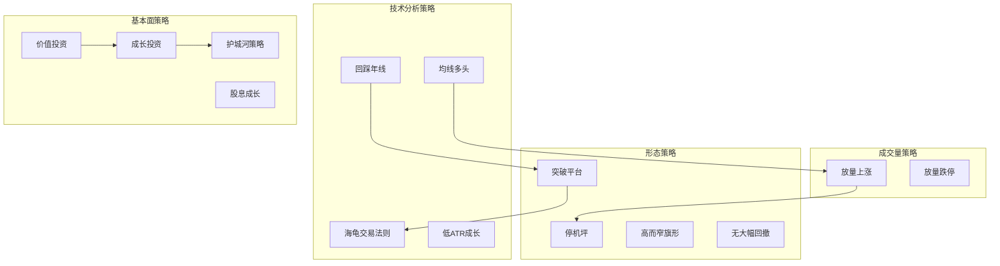

**图表来源**
- [ma_strategies.py](file://quantia/core/strategy/technical/ma_strategies.py#L22-L56)
- [volume_strategies.py](file://quantia/core/strategy/volume/volume_strategies.py#L19-L69)
- [pattern_strategies.py](file://quantia/core/strategy/pattern/pattern_strategies.py#L22-L78)

**章节来源**
- [ma_strategies.py](file://quantia/core/strategy/technical/ma_strategies.py#L1-L237)
- [volume_strategies.py](file://quantia/core/strategy/volume/volume_strategies.py#L1-L126)
- [pattern_strategies.py](file://quantia/core/strategy/pattern/pattern_strategies.py#L1-L276)
- [fundamental_strategies.py](file://quantia/core/strategy/fundamental/fundamental_strategies.py#L1-L351)

## 性能考虑

### 数据库优化

系统采用了多项数据库优化策略：

1. **连接池管理**：使用SQLAlchemy连接池，限制最大连接数为5个
2. **索引优化**：为常用查询字段建立合适的索引
3. **缓存机制**：实现查询结果缓存，减少重复查询
4. **批量操作**：支持批量数据插入和更新

### 内存管理

```python
# 连接池配置示例
_pool_instance = None
_engine_instance = None

def engine():
    global _engine_instance
    if _engine_instance is None:
        _engine_instance = create_engine(
            MYSQL_CONN_URL,
            pool_size=2,           # 最大连接数
            max_overflow=3,        # 允许的最大溢出连接
            pool_recycle=600,      # 连接回收时间(秒)
            pool_pre_ping=True,    # 连接前ping检查
            pool_timeout=30        # 连接超时时间
        )
    return _engine_instance
```

### 并发处理

系统支持多线程并发处理大量股票数据：

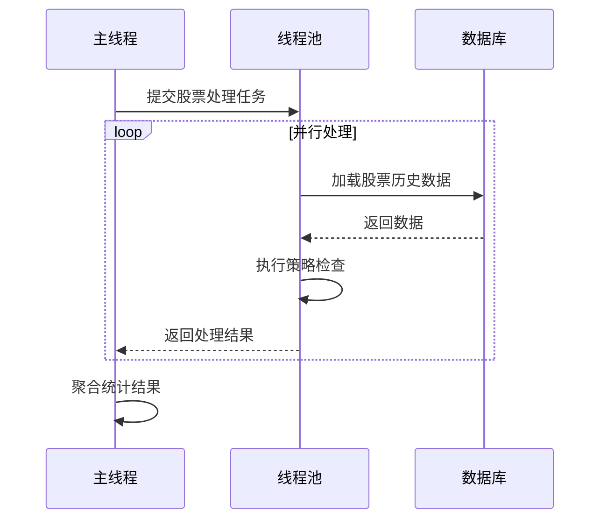

## 故障排除指南

### 常见问题及解决方案

#### Backtrader安装问题

**问题**：ImportError: Backtrader未安装
**解决方案**：
```bash
pip install backtrader
```

#### 数据库连接问题

**问题**：数据库连接失败
**解决方案**：
1. 检查数据库配置参数
2. 验证网络连接
3. 确认数据库服务状态

#### 回测数据异常

**问题**：回测结果显示无数据
**排查步骤**：
1. 检查策略表是否存在
2. 验证数据采集任务是否完成
3. 确认日期范围设置是否正确

**章节来源**
- [backtestHandler.py](file://quantia/web/backtestHandler.py#L94-L101)
- [database.py](file://quantia/lib/database.py#L79-L92)

### 日志分析

系统提供了完善的日志记录机制：

| 日志级别 | 用途 | 示例 |
|----------|------|------|
| DEBUG | 详细调试信息 | 策略执行细节 |
| INFO | 重要操作记录 | 回测开始/结束 |
| WARNING | 警告信息 | 数据异常警告 |
| ERROR | 错误信息 | 系统异常 |

**章节来源**
- [backtestHandler.py](file://quantia/web/backtestHandler.py#L98-L100)
- [database.py](file://quantia/lib/database.py#L86-L91)

## 结论

Quantia选股验证系统是一个功能完整、架构清晰的量化回测平台。系统的主要优势包括：

1. **完整的策略体系**：涵盖四大类策略，满足不同投资理念的需求
2. **灵活的参数配置**：支持动态参数调整和持久化管理
3. **强大的分析功能**：提供多维度的回测报告和可视化展示
4. **良好的扩展性**：模块化设计便于功能扩展和维护

系统适用于专业投资者、量化分析师和金融研究机构，为股票选股策略的验证和优化提供了强有力的技术支撑。

## 附录

### API参考

#### 回测API端点

| 端点 | 方法 | 描述 |
|------|------|------|
| `/backtest/config` | GET | 获取回测配置信息 |
| `/backtest/run` | GET | 执行单只股票回测 |
| `/backtest/batch` | GET | 执行批量回测 |
| `/dashboard/overview` | GET | 获取回测看板概览 |
| `/dashboard/timeline` | GET | 获取时间序列数据 |

#### 策略参数API

| 端点 | 方法 | 描述 |
|------|------|------|
| `/strategy/params` | GET | 获取策略参数配置 |
| `/strategy/params/save` | POST | 保存策略参数 |
| `/strategy/params/reset` | POST | 重置策略参数 |
| `/strategy/filter` | GET | 根据参数筛选股票 |

### 配置选项

#### 回测周期配置

| 周期 | 天数 | 描述 |
|------|------|------|
| 1w | 5 | 一周 |
| 2w | 10 | 两周 |
| 1m | 20 | 一个月 |
| 3m | 60 | 三个月 |
| 6m | 120 | 六个月 |
| 1y | 250 | 一年 |

#### 收益周期设置

默认收益周期：[1, 3, 5, 10, 20]
最大支持周期：100天

### 策略优化建议

1. **参数敏感性分析**：定期分析关键参数对策略表现的影响
2. **样本外测试**：使用独立数据集验证策略稳定性
3. **风险管理**：设置合理的止损和仓位控制机制
4. **多因子组合**：结合多个策略提高预测准确性
5. **滚动优化**：定期重新训练和优化模型参数
