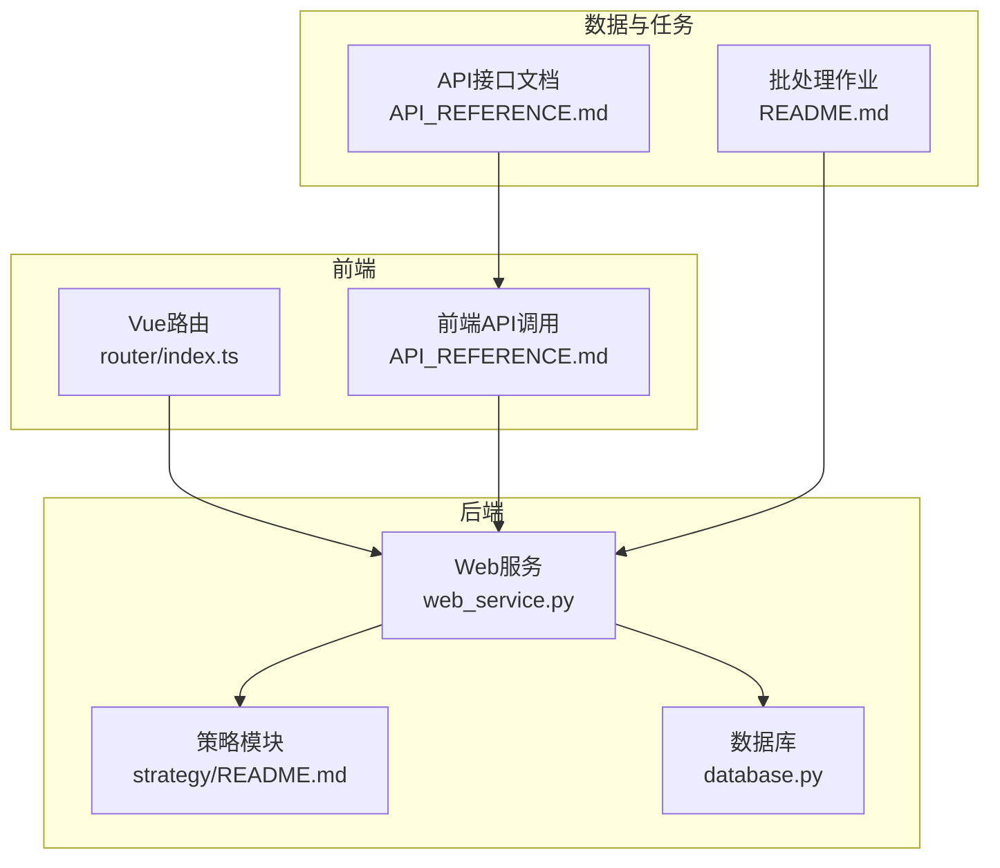
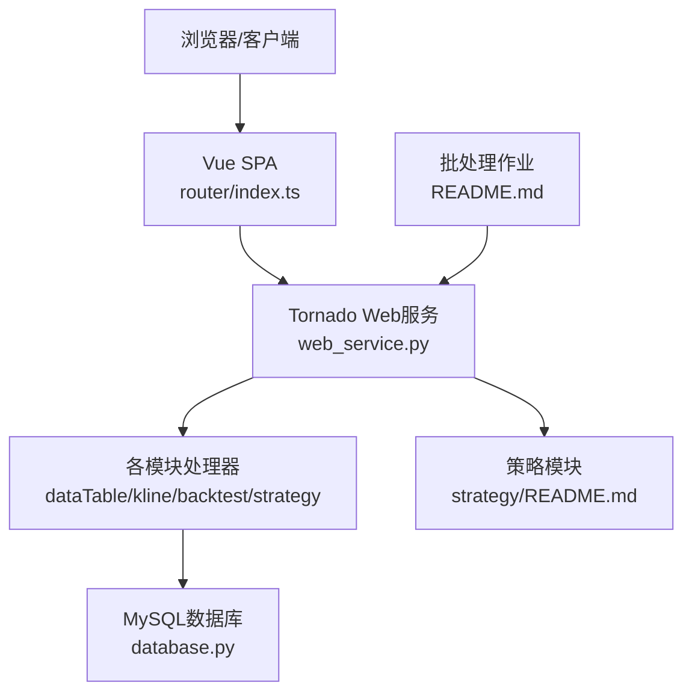
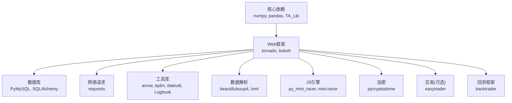

# 目标用户群体

<cite>
**本文引用的文件**
- [README.md](file://README.md)
- [QUICKSTART.md](file://QUICKSTART.md)
- [API_REFERENCE.md](file://document/API_REFERENCE.md)
- [strategy/README.md](file://quantia/core/strategy/README.md)
- [router/index.ts](file://quantia/fontWeb/src/router/index.ts)
- [web_service.py](file://quantia/web/web_service.py)
- [database.py](file://quantia/lib/database.py)
- [requirements.txt](file://requirements.txt)
- [docker-image.yml](file://.github/workflows/docker-image.yml)
- [azure-container-webapp.yml](file://.github/workflows/azure-container-webapp.yml)
- [supervisord.conf](file://docker/stock/supervisor/supervisord.conf)
</cite>

## 目录
1. [简介](#简介)
2. [项目结构](#项目结构)
3. [核心组件](#核心组件)
4. [架构总览](#架构总览)
5. [详细组件分析](#详细组件分析)
6. [依赖分析](#依赖分析)
7. [性能考虑](#性能考虑)
8. [故障排查指南](#故障排查指南)
9. [结论](#结论)
10. [附录](#附录)

## 简介
Quantia量化投资股票选股系统是一个面向量化投资与股票研究的综合性平台，具备数据采集、技术指标计算、K线形态识别、策略选股、回测验证、可视化展示与可选的自动交易能力。系统提供Web前端界面与REST API，支持批量历史数据处理与实时数据更新，适用于多种角色用户：数据分析师、量化研究员、系统管理员、投资者。

## 项目结构
系统采用前后端分离与模块化设计：
- 后端核心：Python Tornado Web服务，提供REST API与数据处理管道
- 前端：Vue SPA，路由驱动的模块化界面（综合选股、股票数据、技术指标、K线形态、策略选股、参数配置、回测看板）
- 数据层：MySQL数据库，提供结构化数据存储与索引
- 任务调度：批处理作业与定时任务，支持增量更新与回测
- 部署：Docker镜像与容器编排，支持云端部署

**图表来源**
- [router/index.ts](file://quantia/fontWeb/src/router/index.ts#L1-L336)
- [web_service.py](file://quantia/web/web_service.py#L53-L100)
- [strategy/README.md](file://quantia/core/strategy/README.md#L1-L146)
- [database.py](file://quantia/lib/database.py#L17-L53)
- [API_REFERENCE.md](file://document/API_REFERENCE.md#L1-L746)
- [README.md](file://README.md#L211-L232)

**章节来源**
- [README.md](file://README.md#L1-L700)
- [QUICKSTART.md](file://QUICKSTART.md#L157-L167)

## 核心组件
- Web服务与API：提供数据查询、策略参数配置、回测接口与SPA路由
- 策略模块：内置多种K线与基本面策略，支持参数化与扩展
- 数据与存储：统一的数据库连接、批量写入与索引管理
- 前端路由与视图：模块化页面与参数配置界面
- 任务与调度：批处理作业与定时任务，支持增量更新与回测

**章节来源**
- [web_service.py](file://quantia/web/web_service.py#L53-L100)
- [strategy/README.md](file://quantia/core/strategy/README.md#L60-L146)
- [database.py](file://quantia/lib/database.py#L60-L203)
- [router/index.ts](file://quantia/fontWeb/src/router/index.ts#L1-L336)

## 架构总览
系统采用“Web服务 + 数据库 + 前端SPA”的三层架构，后端通过Tornado提供REST API，前端通过路由与API交互，策略模块与数据处理管道贯穿批处理与实时更新。

**图表来源**
- [router/index.ts](file://quantia/fontWeb/src/router/index.ts#L1-L336)
- [web_service.py](file://quantia/web/web_service.py#L53-L100)
- [database.py](file://quantia/lib/database.py#L17-L53)
- [strategy/README.md](file://quantia/core/strategy/README.md#L60-L146)
- [README.md](file://README.md#L211-L232)

## 详细组件分析

### 目标用户群体与需求画像
- 数据分析师
  - 需求：高频数据查询、指标计算、回测验证、可视化展示
  - 场景：批量历史数据回测、策略效果对比、收益分布分析
  - 系统满足：REST API、回测看板、指标图表、参数化策略
- 量化研究员
  - 需求：策略研发与参数调优、多策略对比、回测统计
  - 场景：策略参数配置、批量回测、收益周期与日期区间控制
  - 系统满足：策略参数API、回测配置与批量接口、看板仪表盘
- 系统管理员
  - 需求：部署与运维、数据库配置、日志与监控、容器化与CI/CD
  - 场景：Docker部署、Supervisor进程管理、数据库连接与备份
  - 系统满足：Docker镜像、Supervisord配置、API与日志
- 投资者
  - 需求：实时/历史数据浏览、关注股票、策略选股结果、回测验证
  - 场景：日常跟踪、关注列表置顶、策略筛选与回测验证
  - 系统满足：前端路由、关注功能、回测看板、策略参数配置

### 面向不同用户的使用指南与最佳实践

- 数据分析师
  - 快速上手
    - 启动Web服务与批处理：参考快速入门与安装说明
    - 使用API获取数据：通过/api_data接口查询各类数据表
  - 最佳实践
    - 使用分页与日期过滤减少响应体积
    - 利用回测看板进行跨策略对比与收益分布分析
    - 通过策略参数API调整参数并批量回测验证
  - 参考
    - [QUICKSTART.md](file://QUICKSTART.md#L40-L61)
    - [API_REFERENCE.md](file://document/API_REFERENCE.md#L31-L107)

- 量化研究员
  - 快速上手
    - 配置策略参数：通过参数配置页面设置策略阈值
    - 执行回测：使用回测配置与批量接口进行策略验证
  - 最佳实践
    - 使用日期区间与收益周期灵活控制回测窗口
    - 对比多个策略在同一窗口下的成功率与收益
    - 结合回测看板的收益分布与交易对明细进行深入分析
  - 参考
    - [router/index.ts](file://quantia/fontWeb/src/router/index.ts#L258-L277)
    - [API_REFERENCE.md](file://document/API_REFERENCE.md#L437-L724)

- 系统管理员
  - 快速上手
    - Docker部署：使用docker-compose或远程数据库配置
    - Supervisor进程管理：run_job、run_web、run_cron的生命周期管理
    - 数据库配置：通过环境变量或配置文件设置连接参数
  - 最佳实践
    - 使用环境变量传递数据库凭据，避免硬编码
    - 监控日志与容器状态，结合CI/CD自动化构建镜像
    - 定期备份数据库与缓存目录
  - 参考
    - [docker-image.yml](file://.github/workflows/docker-image.yml#L1-L18)
    - [azure-container-webapp.yml](file://.github/workflows/azure-container-webapp.yml#L1-L86)
    - [supervisord.conf](file://docker/stock/supervisor/supervisord.conf#L25-L41)
    - [database.py](file://quantia/lib/database.py#L24-L53)

- 投资者
  - 快速上手
    - 访问系统：打开浏览器访问本地Web服务
    - 关注股票：通过关注接口将目标股票置顶展示
    - 查看策略：在策略选股模块查看筛选结果
  - 最佳实践
    - 使用综合选股与策略参数配置进行个性化筛选
    - 通过回测看板验证策略有效性后再实盘参考
    - 结合K线形态与技术指标进行辅助判断
  - 参考
    - [router/index.ts](file://quantia/fontWeb/src/router/index.ts#L19-L43)
    - [API_REFERENCE.md](file://document/API_REFERENCE.md#L163-L195)

## 依赖分析
系统依赖包括数据处理、Web框架、数据库、网络请求、工具库、JS引擎、加密、交易与回测框架等。这些依赖共同支撑数据采集、处理、存储与展示。

**图表来源**
- [requirements.txt](file://requirements.txt#L4-L41)

**章节来源**
- [requirements.txt](file://requirements.txt#L1-L41)

## 性能考虑
- 批处理与增量更新：支持批量历史数据与增量更新，减少重复抓取与计算
- 多线程与单例资源：通过单例共享资源提升计算与IO效率
- 数据库连接池：合理配置连接池大小与超时，避免并发写入冲突
- 前端路由与API：SPA与API分离，减少页面刷新与冗余请求

[本节为通用指导，无需列出具体文件来源]

## 故障排查指南
- 数据获取失败
  - 检查网络与代理配置，系统支持多数据源自动切换
  - 参考：常见问题与解决方案
- 数据库连接失败
  - 检查数据库服务状态与连接参数，使用环境变量或配置文件
- 历史数据更新异常
  - 使用增量更新脚本或整体作业进行修复
- 日志定位
  - 关注Web服务与执行作业的日志文件，便于问题追踪

**章节来源**
- [QUICKSTART.md](file://QUICKSTART.md#L169-L195)
- [database.py](file://quantia/lib/database.py#L80-L117)

## 结论
Quantia系统通过清晰的角色划分与模块化设计，为数据分析师、量化研究员、系统管理员与投资者提供了从数据采集、策略研发到回测验证与可视化的完整链路。依托Web服务与API、策略模块与数据库，系统在易用性与扩展性之间取得平衡，适合在本地或云端环境中部署与使用。

[本节为总结性内容，无需列出具体文件来源]

## 附录
- 快速开始与常用操作：参考快速入门与安装说明
- API参考：涵盖数据查询、策略参数、回测与交易日期接口
- 策略模块：包含策略分类、接口规范与扩展指南
- 部署与运维：Docker镜像、Supervisor进程管理与CI/CD工作流

**章节来源**
- [QUICKSTART.md](file://QUICKSTART.md#L1-L207)
- [API_REFERENCE.md](file://document/API_REFERENCE.md#L1-L746)
- [strategy/README.md](file://quantia/core/strategy/README.md#L1-L146)
- [docker-image.yml](file://.github/workflows/docker-image.yml#L1-L18)
- [azure-container-webapp.yml](file://.github/workflows/azure-container-webapp.yml#L1-L86)
- [supervisord.conf](file://docker/stock/supervisor/supervisord.conf#L1-L41)
