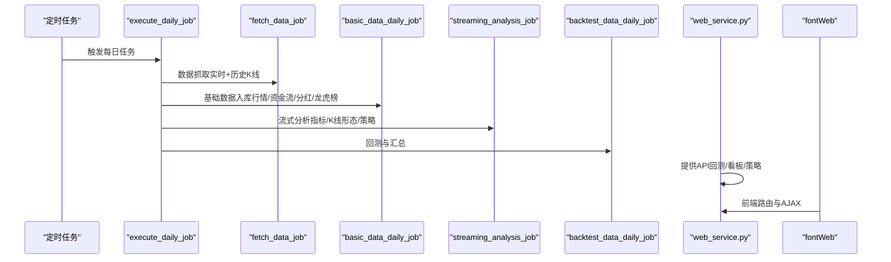
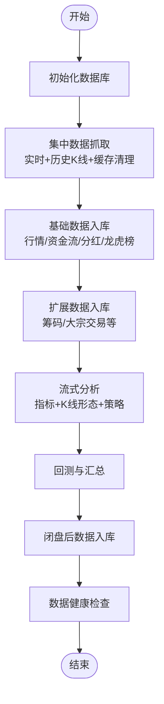
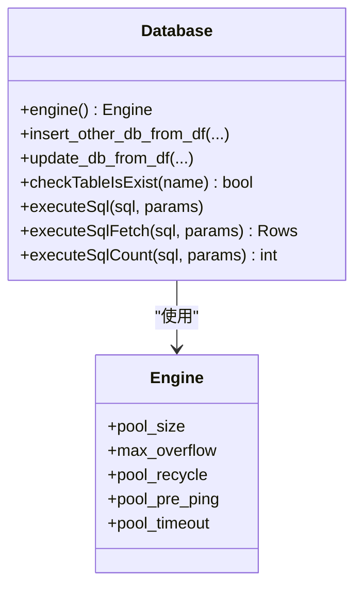
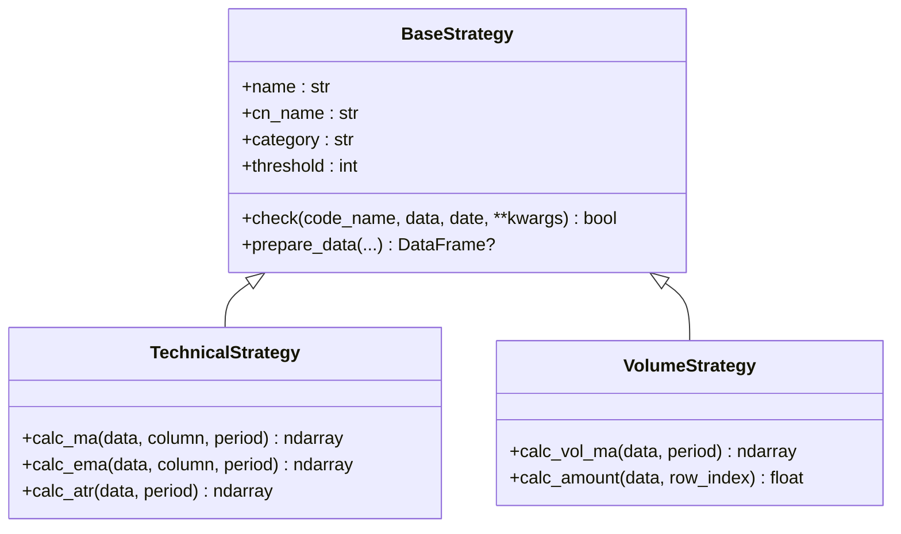
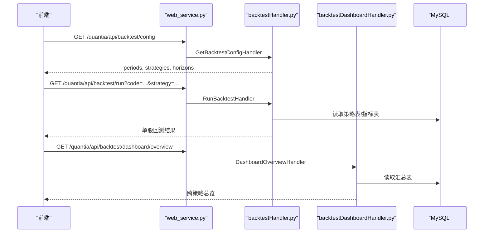
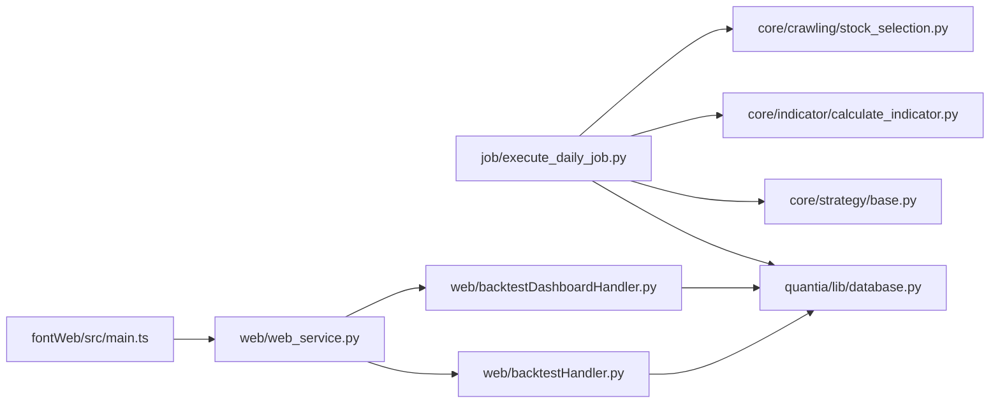

# 系统介绍

<cite>
**本文引用的文件**
- [README.md](file://README.md)
- [QUICKSTART.md](file://QUICKSTART.md)
- [API_REFERENCE.md](file://document/API_REFERENCE.md)
- [database_schema.md](file://document/database_schema.md)
- [init_database.sql](file://docker/init_database.sql)
- [database.py](file://quantia/lib/database.py)
- [web_service.py](file://quantia/web/web_service.py)
- [execute_daily_job.py](file://quantia/job/execute_daily_job.py)
- [main.ts](file://quantia/fontWeb/src/main.ts)
- [base.py](file://quantia/core/strategy/base.py)
- [calculate_indicator.py](file://quantia/core/indicator/calculate_indicator.py)
- [stock_selection.py](file://quantia/core/crawling/stock_selection.py)
- [backtestHandler.py](file://quantia/web/backtestHandler.py)
- [backtestDashboardHandler.py](file://quantia/web/backtestDashboardHandler.py)
</cite>

## 目录
1. [简介](#简介)
2. [项目结构](#项目结构)
3. [核心组件](#核心组件)
4. [架构总览](#架构总览)
5. [详细组件分析](#详细组件分析)
6. [依赖关系分析](#依赖关系分析)
7. [性能考量](#性能考量)
8. [故障排查指南](#故障排查指南)
9. [结论](#结论)
10. [附录](#附录)

## 简介
Quantia（Quantia）是一个面向企业级与个人用户的量化投资股票选股系统，围绕“多数据源抓取—技术分析—策略选股—回测验证—可视化展示”的闭环流程构建。系统提供：
- 多维度选股条件（股票范围、基本面、技术面、消息面、人气指标、行情数据）
- 全面技术指标与K线形态识别
- 14类内置策略（含GPT综合选股）
- 回测看板与API，支持批量回测与收益分布分析
- Web可视化界面与Vue前端
- Docker化部署与本地化运行

系统定位为“专业量化数据库级别的因子池+策略工厂+回测仪表盘”，既适合初学者快速上手，也为资深开发者提供可扩展的架构与清晰的数据流。

## 项目结构
项目采用“作业驱动 + Web服务 + 前端SPA”的分层组织：
- quantia/job：每日批处理作业（数据抓取、分析、回测、初始化）
- quantia/core：核心业务逻辑（策略、指标、爬虫、K线形态、回测统计）
- quantia/web：Tornado Web服务与API路由
- quantia/fontWeb：Vue SPA前端（回测看板、策略配置、图表）
- quantia/lib：基础设施（数据库连接、日志、缓存、交易时间）
- document/docker：文档与数据库初始化脚本
- docker：Docker镜像与编排

```mermaid
graph TB
subgraph "数据层"
DB[MySQL 数据库]
CACHE[本地缓存<br/>历史K线]
end
subgraph "作业层"
JOB_INIT[job/init_job.py]
JOB_FETCH[job/fetch_data_job.py]
JOB_BASIC[job/basic_data_daily_job.py]
JOB_STREAM[job/streaming_analysis_job.py]
JOB_BACKTEST[job/backtest_data_daily_job.py]
JOB_EXECUTE[job/execute_daily_job.py]
end
subgraph "核心逻辑"
CORE_STRATEGY[core/strategy/base.py]
CORE_INDICATOR[core/indicator/calculate_indicator.py]
CORE_CRAWL[core/crawling/stock_selection.py]
CORE_PATTERN[core/pattern/...]
end
subgraph "Web服务"
WEB_APP[web/web_service.py]
WEB_API_BACKTEST[web/backtestHandler.py]
WEB_API_DASHBOARD[web/backtestDashboardHandler.py]
end
subgraph "前端"
FRONT_MAIN[fontWeb/src/main.ts]
end
JOB_EXECUTE --> JOB_INIT
JOB_EXECUTE --> JOB_FETCH
JOB_EXECUTE --> JOB_BASIC
JOB_EXECUTE --> JOB_STREAM
JOB_EXECUTE --> JOB_BACKTEST
JOB_STREAM --> CORE_INDICATOR
JOB_STREAM --> CORE_PATTERN
JOB_BASIC --> CORE_CRAWL
CORE_STRATEGY --> CORE_INDICATOR
CORE_STRATEGY --> CORE_PATTERN
WEB_APP --> WEB_API_BACKTEST
WEB_APP --> WEB_API_DASHBOARD
JOB_FETCH --> CACHE
JOB_STREAM --> CACHE
DB <- --> JOB_INIT
DB <- --> JOB_BASIC
DB <- --> JOB_BACKTEST
DB <- --> WEB_API_BACKTEST
DB <- --> WEB_API_DASHBOARD
```

**图示来源**
- [execute_daily_job.py](file://quantia/job/execute_daily_job.py#L80-L180)
- [web_service.py](file://quantia/web/web_service.py#L53-L98)
- [backtestHandler.py](file://quantia/web/backtestHandler.py#L69-L81)
- [backtestDashboardHandler.py](file://quantia/web/backtestDashboardHandler.py#L360-L467)

**章节来源**
- [README.md](file://README.md#L1-L700)
- [QUICKSTART.md](file://QUICKSTART.md#L157-L167)

## 核心组件
- 数据作业与调度
  - execute_daily_job：统一编排初始化、抓取、入库、分析、回测与健康检查
  - streaming_analysis_job：低内存流式分析（指标、K线形态、策略）
  - fetch_data_job：增量更新历史K线与缓存清理
- 数据库与连接
  - database.py：连接池、Upsert、重试、主键/索引自动维护
  - database_schema.md：37张核心表结构与关系
- 核心策略与指标
  - strategy/base.py：策略基类与注册体系
  - indicator/calculate_indicator.py：32类指标计算（TA-Lib）
  - crawling/stock_selection.py：综合选股器数据抓取
- Web服务与API
  - web_service.py：Tornado路由与SPA回退
  - backtestHandler.py：单股/批量回测API
  - backtestDashboardHandler.py：回测看板API（总览、时间序列、明细、分布、配对）
- 前端
  - fontWeb/src/main.ts：Vue + Pinia + ElementPlus + MSW Mock

**章节来源**
- [execute_daily_job.py](file://quantia/job/execute_daily_job.py#L80-L180)
- [database.py](file://quantia/lib/database.py#L60-L71)
- [base.py](file://quantia/core/strategy/base.py#L20-L96)
- [calculate_indicator.py](file://quantia/core/indicator/calculate_indicator.py#L23-L408)
- [stock_selection.py](file://quantia/core/crawling/stock_selection.py#L18-L111)
- [web_service.py](file://quantia/web/web_service.py#L53-L98)
- [backtestHandler.py](file://quantia/web/backtestHandler.py#L69-L81)
- [backtestDashboardHandler.py](file://quantia/web/backtestDashboardHandler.py#L360-L467)
- [main.ts](file://quantia/fontWeb/src/main.ts#L1-L40)

## 架构总览
系统采用“批处理流水线 + 实时Web服务 + 前端SPA”的架构：
- 批处理流水线：每日定时执行，完成数据抓取、入库、分析、回测与汇总
- Web服务：提供REST API与SPA前端，支持回测看板、策略参数配置、K线图表
- 数据存储：MySQL承载37张核心表，配合本地缓存加速历史K线读取
- 前端：Vue SPA，Mock服务支持离线开发



**图示来源**
- [execute_daily_job.py](file://quantia/job/execute_daily_job.py#L80-L180)
- [web_service.py](file://quantia/web/web_service.py#L53-L98)

## 详细组件分析

### 数据作业与调度（execute_daily_job）
- 分阶段执行：初始化、抓取、入库、分析、回测、收尾与健康检查
- 本地优先：通过阈值检测避免重复分析，支持强制执行
- 内存优化：流式分析，峰值内存远低于传统全量加载
- 健康检查：任务结束后检查核心表当日数据完整性



**图示来源**
- [execute_daily_job.py](file://quantia/job/execute_daily_job.py#L80-L180)

**章节来源**
- [execute_daily_job.py](file://quantia/job/execute_daily_job.py#L48-L78)
- [execute_daily_job.py](file://quantia/job/execute_daily_job.py#L182-L226)

### 数据库与连接（database.py）
- 单例连接池：避免频繁创建连接，支持重试与瞬态错误恢复
- Upsert：INSERT ... ON DUPLICATE KEY UPDATE，保障并发写入一致性
- 自动主键/索引：首次入库自动添加主键与索引
- 环境变量：支持Docker部署时通过环境变量覆盖数据库配置



**图示来源**
- [database.py](file://quantia/lib/database.py#L60-L71)
- [database.py](file://quantia/lib/database.py#L126-L203)

**章节来源**
- [database.py](file://quantia/lib/database.py#L17-L45)
- [database.py](file://quantia/lib/database.py#L94-L117)
- [database.py](file://quantia/lib/database.py#L120-L203)

### 核心策略与指标（strategy/base.py, indicator/calculate_indicator.py）
- 策略基类：统一check接口、数据准备、阈值控制与注册体系
- 指标计算：32类指标（MACD、KDJ、RSI、BOLL、DMI、W%R、CCI、CR、VR、ATR、DMA、TEMA、MFI、VWMA、PPO、WT、Supertrend、DPO、VHF、RVI、FI、ENE等），与主流软件结果对齐
- 形态识别：61种K线形态，支持自定义筛选



**图示来源**
- [base.py](file://quantia/core/strategy/base.py#L20-L96)
- [base.py](file://quantia/core/strategy/base.py#L99-L143)

**章节来源**
- [base.py](file://quantia/core/strategy/base.py#L155-L202)
- [calculate_indicator.py](file://quantia/core/indicator/calculate_indicator.py#L23-L408)

### 综合选股与数据抓取（crawling/stock_selection.py）
- 通过东方财富选股器接口抓取70+筛选字段，支持分页与失败重试
- 字段映射与类型转换，统一输出DataFrame

**章节来源**
- [stock_selection.py](file://quantia/core/crawling/stock_selection.py#L18-L111)

### Web服务与API（web_service.py, backtestHandler.py, backtestDashboardHandler.py）
- Tornado路由：API（JSON）+ SPA回退（index.html）
- 回测API：单股回测、批量回测、回测配置
- 回测看板API：跨策略总览、时间序列、单策略明细、收益分布、买入-卖出配对



**图示来源**
- [web_service.py](file://quantia/web/web_service.py#L53-L98)
- [backtestHandler.py](file://quantia/web/backtestHandler.py#L69-L81)
- [backtestDashboardHandler.py](file://quantia/web/backtestDashboardHandler.py#L360-L467)

**章节来源**
- [web_service.py](file://quantia/web/web_service.py#L53-L98)
- [backtestHandler.py](file://quantia/web/backtestHandler.py#L82-L126)
- [backtestDashboardHandler.py](file://quantia/web/backtestDashboardHandler.py#L549-L637)

### 前端（fontWeb/src/main.ts）
- Vue 3 + TypeScript + Pinia + ElementPlus
- Mock服务（MSW）支持离线开发
- 回测看板、策略配置、K线图表等页面

**章节来源**
- [main.ts](file://quantia/fontWeb/src/main.ts#L1-L40)

## 依赖关系分析
- 组件耦合
  - 作业层与数据库：强耦合（初始化、入库、回测均依赖）
  - 核心逻辑与数据：弱耦合（策略/指标通过DataFrame与缓存交互）
  - Web服务与核心：通过API解耦，便于前后端并行演进
- 外部依赖
  - TA-Lib：技术指标计算
  - Tornado：Web服务
  - Vue生态：前端SPA
  - Docker：容器化部署



**图示来源**
- [execute_daily_job.py](file://quantia/job/execute_daily_job.py#L80-L180)
- [web_service.py](file://quantia/web/web_service.py#L53-L98)

**章节来源**
- [execute_daily_job.py](file://quantia/job/execute_daily_job.py#L80-L180)
- [web_service.py](file://quantia/web/web_service.py#L53-L98)

## 性能考量
- 内存优化：流式分析峰值内存远低于传统全量加载，显著提升大规模数据处理效率
- 并发与重试：数据库连接池与瞬态错误重试，提升稳定性
- 缓存与增量：历史K线缓存与增量更新，缩短每日处理时间
- 可扩展性：策略注册体系与指标计算抽象，便于新增策略与指标

**章节来源**
- [execute_daily_job.py](file://quantia/job/execute_daily_job.py#L132-L147)
- [database.py](file://quantia/lib/database.py#L60-L71)
- [database.py](file://quantia/lib/database.py#L110-L117)

## 故障排查指南
- 数据获取失败
  - 检查网络与代理配置，系统具备多数据源自动切换与重试
- 数据库连接失败
  - 校验数据库配置与服务状态，必要时通过环境变量覆盖
- 无数据或数据不完整
  - 使用数据健康检查接口确认核心表当日数据
- 回测看板无数据
  - 确认回测汇总表存在且区间内有数据，或使用动态计算模式

**章节来源**
- [QUICKSTART.md](file://QUICKSTART.md#L169-L195)
- [database.py](file://quantia/lib/database.py#L244-L259)
- [execute_daily_job.py](file://quantia/job/execute_daily_job.py#L182-L226)

## 结论
Quantia以“批处理流水线 + Web服务 + 前端SPA”的架构，为企业级量化投资提供了从数据抓取、技术分析、策略选股到回测验证与可视化的完整能力。其核心优势在于：
- 多数据源与代理/Cookie支持，保障数据稳定性
- 低内存流式分析与Upsert写入，兼顾性能与可靠性
- 丰富的策略与指标体系，支持企业级扩展
- 完整的回测看板与API，便于策略验证与监控
- Docker化部署与前端SPA，降低运维与使用门槛

## 附录
- 数据库初始化脚本：docker/init_database.sql
- API参考：document/API_REFERENCE.md
- 数据库设计：document/database_schema.md
- 快速开始：QUICKSTART.md

**章节来源**
- [init_database.sql](file://docker/init_database.sql#L1-L455)
- [API_REFERENCE.md](file://document/API_REFERENCE.md#L1-L746)
- [database_schema.md](file://document/database_schema.md#L1-L848)
- [QUICKSTART.md](file://QUICKSTART.md#L1-L207)
