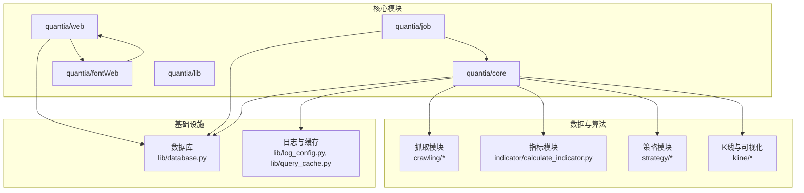
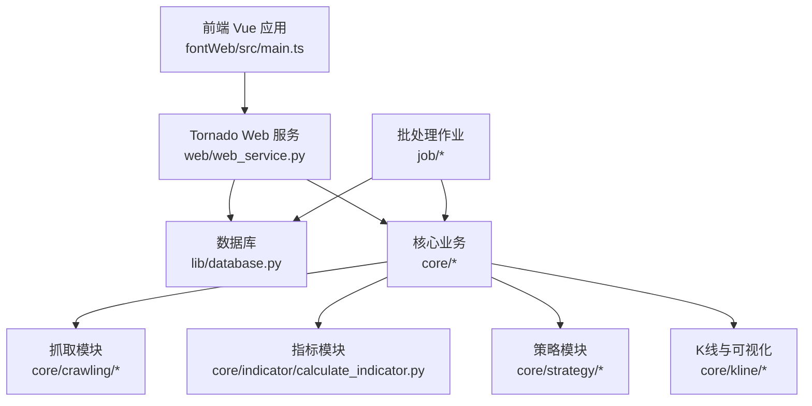
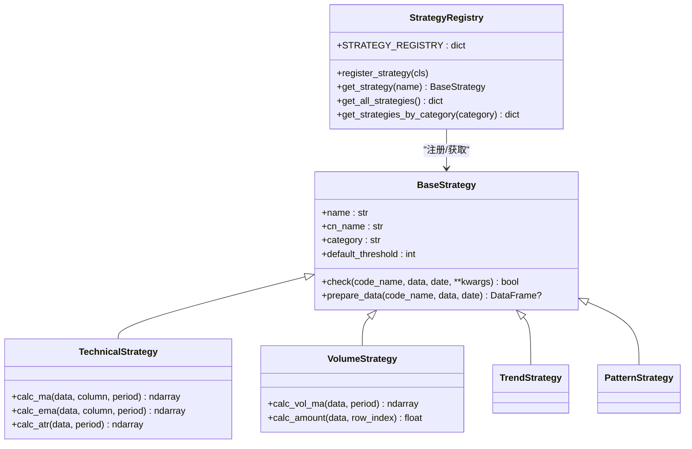
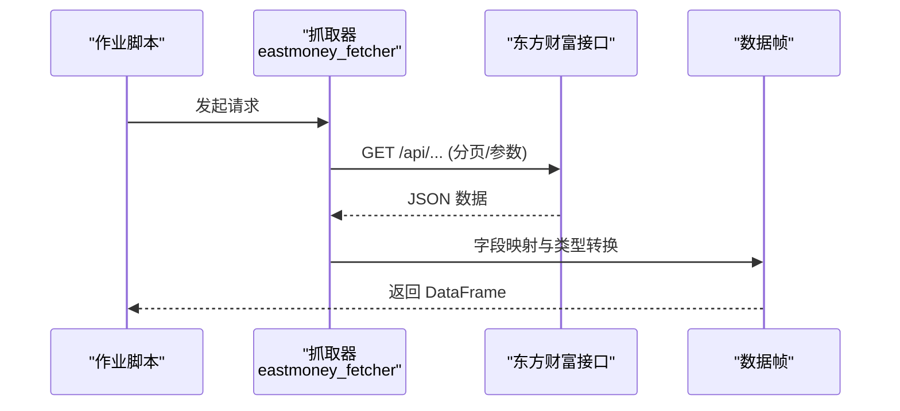
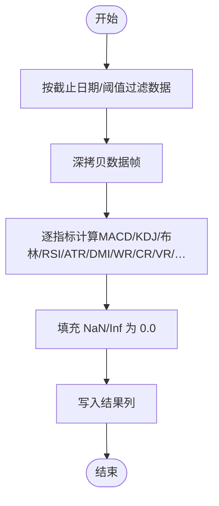
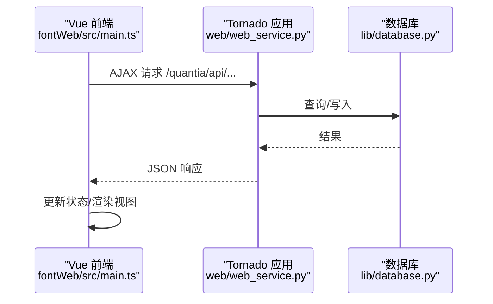
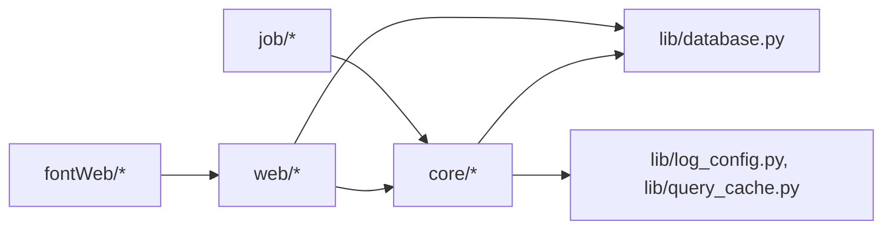

# 项目概述

<cite>
**本文引用的文件**
- [README.md](file://README.md)
- [QUICKSTART.md](file://QUICKSTART.md)
- [quantia/core/__init__.py](file://quantia/core/__init__.py)
- [quantia/job/__init__.py](file://quantia/job/__init__.py)
- [quantia/lib/__init__.py](file://quantia/lib/__init__.py)
- [quantia/core/strategy/__init__.py](file://quantia/core/strategy/__init__.py)
- [quantia/core/strategy/base.py](file://quantia/core/strategy/base.py)
- [quantia/core/crawling/stock_hist_em.py](file://quantia/core/crawling/stock_hist_em.py)
- [quantia/core/indicator/calculate_indicator.py](file://quantia/core/indicator/calculate_indicator.py)
- [quantia/lib/database.py](file://quantia/lib/database.py)
- [quantia/web/web_service.py](file://quantia/web/web_service.py)
- [quantia/fontWeb/src/main.ts](file://quantia/fontWeb/src/main.ts)
</cite>

## 目录
1. [简介](#简介)
2. [项目结构](#项目结构)
3. [核心组件](#核心组件)
4. [架构总览](#架构总览)
5. [详细组件分析](#详细组件分析)
6. [依赖关系分析](#依赖关系分析)
7. [性能考量](#性能考量)
8. [故障排查指南](#故障排查指南)
9. [结论](#结论)
10. [附录](#附录)

## 简介
Quantia（Quantia）是一个面向企业级与个人用户的量化投资股票选股系统，围绕“多数据源抓取—技术分析—策略选股—回测验证—可视化展示—可选自动交易”的闭环流程构建。系统提供：
- 多数据源抓取与容错切换（东方财富、腾讯、新浪）
- 基于TA-Lib与Pandas的高效技术指标计算
- 多类策略（技术面、成交量、形态、基本面）与策略模板化
- 回测看板与收益分布、时间序列等可视化
- Web 前后端一体化（Tornado + Vue + Pinia + Element Plus）
- Docker 镜像与定时任务调度，支持批量与增量更新

系统定位：为量化研究与实盘辅助提供“可配置、可扩展、可回测”的一站式工具链。

## 项目结构
项目采用“模块化+分层”的组织方式：
- quantia/core：核心业务逻辑（抓取、指标、形态、策略、K线可视化）
- quantia/job：批处理与调度作业（每日/批量执行）
- quantia/web：Web 服务（Tornado + 模板与静态资源）
- quantia/fontWeb：Vue 前端（SPA + Mock）
- quantia/lib：基础设施（数据库、日志、缓存、工具）
- docker：容器化与定时任务

图表来源
- [quantia/core/__init__.py](file://quantia/core/__init__.py#L1-L6)
- [quantia/job/__init__.py](file://quantia/job/__init__.py#L1-L6)
- [quantia/lib/__init__.py](file://quantia/lib/__init__.py#L1-L6)
- [quantia/core/strategy/__init__.py](file://quantia/core/strategy/__init__.py#L1-L119)
- [quantia/core/indicator/calculate_indicator.py](file://quantia/core/indicator/calculate_indicator.py#L1-L200)
- [quantia/lib/database.py](file://quantia/lib/database.py#L1-L200)
- [quantia/web/web_service.py](file://quantia/web/web_service.py#L1-L143)
- [quantia/fontWeb/src/main.ts](file://quantia/fontWeb/src/main.ts#L1-L40)

章节来源
- [README.md](file://README.md#L1-L700)
- [QUICKSTART.md](file://QUICKSTART.md#L1-L207)

## 核心组件
- 数据抓取层：多源聚合与容错（东方财富→腾讯→新浪），支持代理与Cookie注入，统一入口封装在抓取模块中。
- 指标计算层：基于 TA-Lib 与 Pandas 的指标流水线，兼容 NaN/Inf，提供 MACD、KDJ、布林、RSI、ATR、DMI、WR、CR、VR、DMA、MFI、VWMA、PPO 等。
- 策略引擎：策略基类与注册表，支持技术面、成交量、趋势、形态四类策略，策略模板化便于扩展。
- K线与形态：K线可视化与61种K线形态识别，支持自选形态。
- 回测与可视化：Web 回测看板（跨策略总览、时间序列、明细、收益分布、交易对），支持自定义周期与日期区间。
- Web 前后端：Tornado 提供 REST 接口与 SPA 路由，Vue 前端通过 AJAX 调用 API，支持 Mock。
- 数据存储：MySQL/SQLAlchemy 封装，支持 Upsert、主键/索引自动维护、连接池与重试。
- 作业调度：批处理脚本与定时任务，支持批量日期与增量更新。

章节来源
- [README.md](file://README.md#L12-L320)
- [quantia/core/strategy/base.py](file://quantia/core/strategy/base.py#L1-L202)
- [quantia/core/indicator/calculate_indicator.py](file://quantia/core/indicator/calculate_indicator.py#L1-L200)
- [quantia/web/web_service.py](file://quantia/web/web_service.py#L1-L143)
- [quantia/lib/database.py](file://quantia/lib/database.py#L1-L200)

## 架构总览
系统采用“数据采集—指标计算—策略执行—回测—Web 展示”的分层架构，前后端分离，核心业务集中在 quantia/core，Web 服务通过 Tornado 暴露 API 并承载 Vue 前端。

图表来源
- [quantia/fontWeb/src/main.ts](file://quantia/fontWeb/src/main.ts#L1-L40)
- [quantia/web/web_service.py](file://quantia/web/web_service.py#L1-L143)
- [quantia/lib/database.py](file://quantia/lib/database.py#L1-L200)
- [quantia/core/crawling/stock_hist_em.py](file://quantia/core/crawling/stock_hist_em.py#L1-L200)
- [quantia/core/indicator/calculate_indicator.py](file://quantia/core/indicator/calculate_indicator.py#L1-L200)
- [quantia/core/strategy/base.py](file://quantia/core/strategy/base.py#L1-L202)

## 详细组件分析

### 策略引擎与策略注册
策略采用统一基类与注册表，支持按分类检索与动态实例化，便于扩展自有策略。

图表来源
- [quantia/core/strategy/base.py](file://quantia/core/strategy/base.py#L1-L202)

章节来源
- [quantia/core/strategy/__init__.py](file://quantia/core/strategy/__init__.py#L1-L119)
- [quantia/core/strategy/base.py](file://quantia/core/strategy/base.py#L1-L202)

### 抓取流程（以东方财富为例）
系统通过统一抓取器封装请求与解析，支持分页、随机延时与字段清洗。

图表来源
- [quantia/core/crawling/stock_hist_em.py](file://quantia/core/crawling/stock_hist_em.py#L1-L200)

章节来源
- [quantia/core/crawling/stock_hist_em.py](file://quantia/core/crawling/stock_hist_em.py#L1-L200)

### 指标计算流程
指标计算以 TA-Lib 为核心，兼容 NaN/Inf，按阈值裁剪与深拷贝，保证稳定性与一致性。

图表来源
- [quantia/core/indicator/calculate_indicator.py](file://quantia/core/indicator/calculate_indicator.py#L1-L200)

章节来源
- [quantia/core/indicator/calculate_indicator.py](file://quantia/core/indicator/calculate_indicator.py#L1-L200)

### Web 服务与前端交互
Tornado 提供 REST 接口与 SPA 路由，前端通过 AJAX 调用 API，支持 Mock。

图表来源
- [quantia/web/web_service.py](file://quantia/web/web_service.py#L1-L143)
- [quantia/fontWeb/src/main.ts](file://quantia/fontWeb/src/main.ts#L1-L40)
- [quantia/lib/database.py](file://quantia/lib/database.py#L1-L200)

章节来源
- [quantia/web/web_service.py](file://quantia/web/web_service.py#L1-L143)
- [quantia/fontWeb/src/main.ts](file://quantia/fontWeb/src/main.ts#L1-L40)
- [quantia/lib/database.py](file://quantia/lib/database.py#L1-L200)

## 依赖关系分析
- 组件内聚：核心业务（抓取/指标/策略/K线）集中于 quantia/core，职责清晰。
- 组件耦合：Web 服务依赖数据库与核心模块；前端依赖 Web 服务；作业脚本依赖核心模块与数据库。
- 外部依赖：TA-Lib、Pandas、Tornado、SQLAlchemy、Element Plus、Vue 生态。
- 可能的循环依赖：未发现模块间循环导入迹象，分层清晰。

图表来源
- [quantia/job/__init__.py](file://quantia/job/__init__.py#L1-L6)
- [quantia/core/__init__.py](file://quantia/core/__init__.py#L1-L6)
- [quantia/lib/__init__.py](file://quantia/lib/__init__.py#L1-L6)
- [quantia/web/web_service.py](file://quantia/web/web_service.py#L1-L143)
- [quantia/lib/database.py](file://quantia/lib/database.py#L1-L200)

章节来源
- [quantia/job/__init__.py](file://quantia/job/__init__.py#L1-L6)
- [quantia/core/__init__.py](file://quantia/core/__init__.py#L1-L6)
- [quantia/lib/__init__.py](file://quantia/lib/__init__.py#L1-L6)

## 性能考量
- 计算性能：指标计算基于 TA-Lib 与向量化 Pandas，支持阈值裁剪与深拷贝，避免 CoW 写入错误。
- 存储性能：SQLAlchemy 连接池与 Upsert（ON DUPLICATE KEY UPDATE）减少重复写入与死锁风险。
- 网络性能：抓取模块分页与随机延时，多源自动切换，降低限流风险。
- 运行效率：批处理与增量更新，首次全量后仅补缺新增交易日，显著缩短后续执行时间。

章节来源
- [quantia/core/indicator/calculate_indicator.py](file://quantia/core/indicator/calculate_indicator.py#L1-L200)
- [quantia/lib/database.py](file://quantia/lib/database.py#L1-L200)
- [README.md](file://README.md#L308-L320)

## 故障排查指南
- 数据获取失败：检查网络、代理与 Cookie；系统具备多源自动切换与容错。
- 数据库连接失败：确认数据库服务、凭据与连接参数；查看连接池与瞬态错误重试。
- 前端 Mock：开发模式下启用 MSW，未匹配请求将放行；生产环境关闭 Mock。
- 日志定位：执行日志、Web 日志、交易日志分别记录在对应日志文件，便于问题追踪。

章节来源
- [QUICKSTART.md](file://QUICKSTART.md#L169-L207)
- [README.md](file://README.md#L169-L207)

## 结论
Quantia 以“可配置、可扩展、可回测”为核心理念，结合多数据源抓取、高效指标计算、策略模板化与可视化回测，为企业与个人用户提供了一套实用的量化投资工具链。其模块化与分层架构便于二次开发与集成，适合在本地或容器环境中部署与运行。

## 附录
- 快速开始：安装依赖、配置数据库、运行作业、启动 Web 服务、访问系统。
- 常用操作：回测看板、手动拉取历史数据、计算技术指标、运行策略选股、批量处理历史数据。
- Docker 部署：docker-compose 一键部署，支持外部数据库与内部数据库两种模式。

章节来源
- [QUICKSTART.md](file://QUICKSTART.md#L1-L207)
- [README.md](file://README.md#L321-L700)
