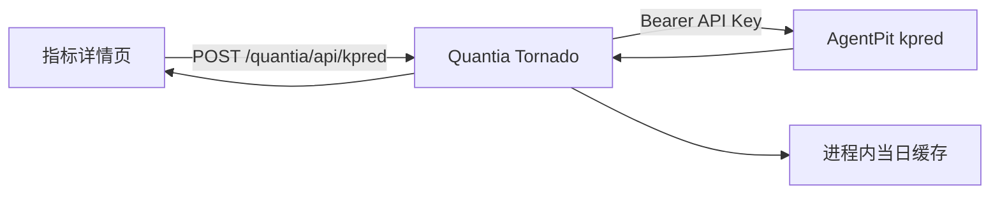
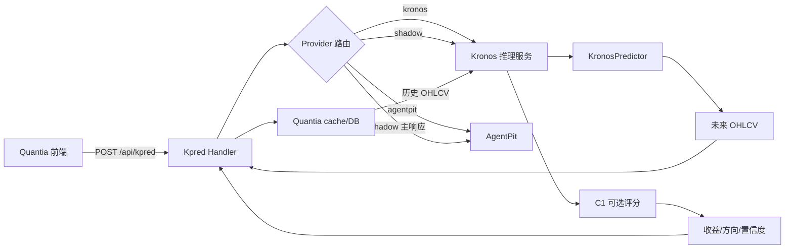

# Kronos 本地 K 线预测接入 Quantia 落地方案

> 文档状态：第一阶段本地链路已实现并验证，C1 仅完成实验性接入
> 审查日期：2026-07-13  
> 适用仓库：`Kronos/` 与 `Quantia/`  
> 目标：使用本地 Kronos 替换 Quantia 当前 AgentPit K 线预测 API，同时保留方案 C（C1）作为可选的收益评分增强层。

---

## 1. 结论摘要

当前实现不能把方案 C 的 C1 bundle 直接接到 Quantia 图表中替换 AgentPit，原因是两者输出语义不同：

| 能力 | 实现 | 输出 | 能否绘制预测 K 线 |
| --- | --- | --- | --- |
| 基础 K 线生成 | `KronosPredictor.predict()` | 未来逐期 OHLCV/amount | 能 |
| 方案 C-C1 单股评分 | `run_fusion.py::predict_latest()` | 未来 H 日收益、方向、概率、波动 | 不能 |
| 方案 C-C1 多股评分 | `train_c1_bundle.py::predict_bundle()` | 截面收益排名 | 不能 |

正确的产品结构是：

1. **Kronos 基础模型负责生成未来蜡烛图**，兼容 Quantia 当前 `predictions[]`。
2. **通过正式样本外验收的 C1 模型负责增强评分**，填充 `pro` 中的方向、收益和因子贡献。
3. C1 不可用或未通过验收时，仍可只展示 Kronos 蜡烛；不得用演示 bundle 生成投资评分。
4. 推理应运行在独立进程中，Quantia Tornado 仅负责读取本地数据、调用本地服务、缓存和返回兼容响应。

当前可以进入第一阶段开发，但不能直接切断 AgentPit：

- 本地 tokenizer 和 Kronos-base 权重存在且已完成真实 CPU 推理。
- Quantia 前端已有预测蜡烛展示能力，接口兼容改造量较小。
- 当前 `runs/dataC_c1` 只有 10 个标的，验证和测试 IC 均为负，只能视为流程演示产物。
- 本机缓存最后 K 线日期落后于审查日期，服务必须先实现行情新鲜度门禁。

---

## 2. 审查范围与实测证据

### 2.0 2026-07-13 本地接入复验

已新增 `Kronos/finetune_csv/local_kpred_service.py`，并完成 Quantia 到 Kronos 的真实 HTTP 黑盒验证：

```powershell
$env:KRONOS_C1_ENABLED='1'
$env:KRONOS_DEVICE='cpu'
C:\xapproject\Quantia\Kronos\.venv\Scripts\python.exe `
  C:\xapproject\Quantia\Kronos\finetune_csv\local_kpred_service.py
```

Quantia 配置：

```dotenv
QUANTIA_KPRED_PROVIDER=local
QUANTIA_KPRED_LOCAL_URL=http://127.0.0.1:18081/v1/open-api/kpred
KRONOS_LOOKBACK=256
QUANTIA_KPRED_MAX_DAYS=30
QUANTIA_KPRED_HORIZONS=1,3,5,10,15,30
KRONOS_REJECT_STALE_HISTORY=1
```

实测结果：

| 验证项 | 结果 |
| --- | --- |
| 本地权重加载 | tokenizer/base 均从 `model/pretrained` 加载，6.349 秒 |
| Quantia 公开接口 | `POST /quantia/api/kpred` 返回 `code=0`、`provider=local` |
| `300308` 本地缓存 | 2359 行，发送最近 90 行，基准日 2026-07-01 |
| 3 日 CPU 推理 | 376~483 ms，3/3 根 OHLC 合法 |
| 新鲜度 | 缓存落后，正确返回 `stale=true` |
| C1 默认质量门禁 | `test IC_by_date=-0.0961`，正确阻断并保持 `pro=null` |
| C1 实验开关 | `300528` 成功返回 Pro，5 日延迟 674 ms，标记 `confidence=实验` |

C1 实验验证使用 `KRONOS_C1_ALLOW_UNVALIDATED=1`，仅证明加载、特征匹配、LightGBM 推理和前端契约技术可行。该开关会绕过负 IC 和陈旧特征门禁，生产环境必须保持为 `0`。当前 `300528` 使用的特征日期为 2026-06-16，实验预测收益 2.648%，不构成有效性结论或投资依据。

### 2.1 已核对的关键实现

Kronos：

- 基础预测：[KronosPredictor.predict](../../Kronos/model/kronos.py) 返回 `open/high/low/close/volume/amount`。
- 模型加载：[kronos_loader.py](../../Kronos/finetune_csv/kronos_loader.py) 支持本地、ModelScope、Hugging Face。
- C1 单股链路：[run_fusion.py](../../Kronos/finetune_csv/run_fusion.py)。
- C1 多股 bundle：[train_c1_bundle.py](../../Kronos/finetune_csv/train_c1_bundle.py)。
- 方案 C 操作手册：[方案C操作指南_数据到训练验证测试.md](../../Kronos/document/LoRa/方案C操作指南_数据到训练验证测试.md)。
- 当前 C1 产物：[manifest.json](../../Kronos/runs/dataC_c1/manifest.json)。

Quantia：

- 路由注册：[web_service.py](../quantia/web/web_service.py)。
- 当前 AgentPit 代理：[kpredHandler.py](../quantia/web/kpredHandler.py)。
- 本地 K 线读取：[data_feed.py](../quantia/core/backtest/data_feed.py)。
- 前端 API 类型：[stock.ts](../quantia/fontWeb/src/api/stock.ts)。
- 预测蜡烛和 Pro tooltip：[indicator/index.vue](../quantia/fontWeb/src/views/indicator/index.vue)。
- 当前接口文档：[API_REFERENCE.md](API_REFERENCE.md)。

### 2.2 2026-07-13 实测结果

运行环境：`Kronos/.venv`，CPU，本地权重，不访问远端模型仓库。

| 验证项 | 结果 | 结论 |
| --- | --- | --- |
| `build_kronos_features.py --smoke` | 通过，生成 16 行合法特征 | Kronos 特征抽取基本链路可用 |
| `train_c1_bundle.py --smoke` | 通过，LightGBM save/load/predict 正常 | 多标的 C1 bundle 机制可用 |
| `run_fusion.py smoke` | CPU 自回归阶段长时间未完成并被中断 | 不适合作为同步 Web 请求或日常快速 smoke |
| 本地权重加载 | 约 3.275 秒 | 必须进程启动时加载一次并常驻 |
| 90 根历史、1 步、1 sample | 约 0.133 秒 | 单股低步数 CPU 推理可行 |
| 90 根历史、5 步、1 sample | 约 0.595 秒 | 适合有限并发，仍需目标机压测 |
| 5 步输出检查 | 6 列有限值，5/5 根 OHLC 合法 | 单样本通过，不等于全市场 100% 合法 |
| 输入缓存新鲜度 | 最后日期 2026-07-01 | 相对审查日过期，必须拒绝或标记陈旧预测 |

实测命令：

```powershell
cd C:\xapproject\Quantia\Kronos
.\.venv\Scripts\python.exe finetune_csv\build_kronos_features.py --smoke
.\.venv\Scripts\python.exe finetune_csv\train_c1_bundle.py --smoke
```

注意：实测延迟仅代表本机 CPU、`lookback=90`、`sample_count=1`。延迟随预测步数和采样数近似线性增加，不能把该结果外推为生产 SLA。

### 2.3 当前 C1 bundle 的上线判定

`Kronos/runs/dataC_c1/manifest.json` 显示：

| 指标 | 当前值 |
| --- | ---: |
| 标的数 | 10 |
| 训练/验证/测试行数 | 831 / 179 / 190 |
| 验证 IC | -0.0697 |
| 验证 IC_by_date | -0.1169 |
| 测试 IC | -0.1310 |
| 测试 IC_by_date | -0.0961 |
| 测试方向命中率 | 43.68% |

判定：**不允许上线**。该 bundle 只能验证训练、保存、加载、排名流程，不得用于 Quantia 的 `pro` 评分或选股决策。

### 2.4 回看窗口与预测天数复审

“模型能接受的最大值”和“预测效果最优值”是两个问题。Kronos-base/small 的训练上下文上限是 512，但这不表示回看 512 根最准确。仓库固定回归测试在同一数据、预测 30 步时给出的 MSE 为：

| lookback | 30 步 OHLC MSE | 判读 |
| ---: | ---: | --- |
| 256 | 0.003741 | 该固定样本更好 |
| 512 | 0.008979 | 比 256 差，说明更长不必然更准 |

该测试只有 4 个固定抽样窗口，且原始回归使用 Kronos-small，不能直接证明全 A 股最优参数；它足以否定“回看越长越好”。最终最优值必须用 Quantia 股票池做 walk-forward，并分别统计 3、5、10、20 日误差和方向命中率。

当前建议：

| 使用场景 | lookback | pred days | sample_count | 说明 |
| --- | ---: | ---: | ---: | --- |
| 当前 C1 特征兼容 | 90 | 5 | 10 | 必须匹配现有 `kronos_features_report.json` 的训练口径 |
| 生产页面选项 | 256 | 1 / 3 / 5 / 10 / 15 / 30 | 1 | 30 步回归通过；15/30 日真实准确率仍需 shadow 验收 |
| 低延迟候选 | 90～128 | 1 / 3 / 5 / 10 / 15 / 30 | 1 | 当前 CPU 3 日约 0.4 秒，需 shadow 确认精度损失 |
| 中期趋势研究 | 256～400 | 20～30 | 5～10 | 只看趋势和分布，不宜当精确价格 |
| 超过 30 个交易日 | 不推荐日线自回归 | >30 | - | 误差逐步累积；应改周线/月线或滚动重预测 |

参数边界：

| 参数 | 模型层边界 | 本地服务边界 | 默认值 |
| --- | --- | --- | ---: |
| 输入列 | OHLC 必须，volume/amount 可补，共 6 维 | 同模型 | 6 维 |
| `max_context` | base/small 最大 512；mini 为 2048 | 当前 base 服务固定保护在 32～512 | 512 |
| `lookback` | 1～`max_context` | 32～`max_context` | 90 |
| `pred_len/days` | ≥1，模型代码无绝对硬上限 | 1～120，Quantia 默认只开放到 30 | 30 上限 |
| `sample_count` | ≥1，无模型硬上限，显存和耗时近似线性增长 | 1～64 | 1 |
| `temperature` | 必须 >0 | 0.05～5.0 | 1.0 |
| `top_k` | 0 或不超过 token vocabulary | 0～1024 | 0 |
| `top_p` | 0～1 | 0.01～1.0 | 0.9 |
| `clip` | 正数 | 1.0～20.0 | 5.0 |

推理核心使用滑动缓冲，因此生成步数可以超过 `512-lookback`；但越过训练分布后误差会继续累积。训练数据切窗仍必须保证原始样本至少含 `lookback + pred_len` 行。

---

## 3. 当前系统与目标系统

### 3.1 当前调用链



当前优点：

- 前端已经支持 1/3/5/10/15/30 日预测蜡烛。
- 历史 K 线与预测 K 线有明确视觉区分。
- `pro` 存在时可显示综合评分和因子明细，不存在时仍可展示蜡烛。

当前问题：

- 依赖外部 API Key、额度和服务可用性。
- 缓存键仅包含代码、天数和自然日，不能感知模型版本、历史数据版本和参数变化。
- 相同未命中请求没有 singleflight，可能重复调用上游。
- Web handler 直接承担供应商错误映射，尚无 provider 抽象。

### 3.2 目标调用链



职责边界：

| 模块 | 负责 | 不负责 |
| --- | --- | --- |
| Quantia Handler | 参数校验、本地行情读取、缓存、provider 路由、响应兼容 | 加载 PyTorch 模型、访问外部行情 |
| Kronos 服务 | 常驻加载权重、推理、输出清洗、模型元数据 | 自行抓取 AkShare/东财、直接查询生产 DB |
| C1 离线流水线 | 特征生成、训练、验证、bundle 发布 | 生成逐日 OHLC |
| 前端 | 展示预测蜡烛、模型来源和评分 | 推断缺失字段、计算模型置信度 |

该边界符合 Quantia 的 Fetch/Analysis/Web 分离规则：Web 请求只读取 MySQL 和本地缓存，Kronos 服务消费调用方提供的数据。

---

## 4. 接口契约

### 4.1 对外接口保持兼容

继续使用：

```http
POST /quantia/api/kpred
Content-Type: application/json
```

请求体：

```json
{
  "code": "000001",
  "days": 5,
  "refresh": false
}
```

`days` 只接受标准选项 `1/3/5/10/15/30`，非法值返回 HTTP 400，不再静默截断。批量准确率评测使用一次 30 日确定性路径，并取第 1/3/5/10/15/30 步分别对齐真实交易日，避免重复推理产生路径不一致。

建议响应：

```json
{
  "code": 0,
  "data": {
    "symbol": "000001",
    "name": "平安银行",
    "last_close": 10.20,
    "last_date": "2026-07-10",
    "predictions": [
      {
        "date": "2026-07-13",
        "open": 10.22,
        "high": 10.35,
        "low": 10.10,
        "close": 10.28,
        "volume": 810000
      }
    ],
    "pro": null,
    "provider": "local",
    "model_version": "kronos-base:<sha256-prefix>",
    "history_last_date": "2026-07-10",
    "stale": false,
    "latencyMs": 610
  },
  "_cached": false
}
```

兼容规则：

- `predictions` 必须存在且长度等于 `days`。
- C1 未启用时 `pro=null`，前端不显示 Pro 区域。
- 新字段只能追加，不能删除现有字段。
- `_cached` 继续位于最外层。
- 失败时仍使用 `{code:-1,msg:string}`，但增加稳定的机器可读 `error_code`。

### 4.2 Quantia 到 Kronos 的内部接口

建议新增独立本地服务：

```http
GET  /health
POST /v1/kline/predict
```

内部请求应包含历史数据，不让模型服务自行取数：

```json
{
  "request_id": "uuid",
  "symbol": "000001",
  "pred_len": 5,
  "lookback": 256,
  "sample_count": 1,
  "temperature": 1.0,
  "top_p": 0.9,
  "future_timestamps": [
    "2026-07-13",
    "2026-07-14",
    "2026-07-15",
    "2026-07-16",
    "2026-07-17"
  ],
  "history": [
    {
      "date": "2026-07-10",
      "open": 10.10,
      "high": 10.25,
      "low": 10.05,
      "close": 10.20,
      "volume": 800000,
      "amount": 8160000
    }
  ]
}
```

`future_timestamps` 必须由 Quantia 的 A 股交易日历生成。不能使用 `BDay` 或历史时间差中位数，因为它们不识别法定节假日和临时休市。

### 4.3 错误码

| HTTP | error_code | 场景 | 是否允许回退 |
| --- | --- | --- | --- |
| 400 | `INVALID_ARGUMENT` | 代码、天数、历史列不合法 | 否 |
| 404 | `HISTORY_NOT_FOUND` | 无本地 K 线 | 可回退 AgentPit |
| 409 | `HISTORY_STALE` | 历史数据落后于最近应有交易日 | 默认不预测，可配置回退 |
| 422 | `INSUFFICIENT_HISTORY` | 行数小于 lookback | 可降 lookback 或回退 |
| 503 | `MODEL_NOT_READY` | 权重未加载或健康检查失败 | 是 |
| 503 | `INFERENCE_BUSY` | 队列满 | 是 |
| 504 | `INFERENCE_TIMEOUT` | 推理超时 | 是 |
| 500 | `INVALID_MODEL_OUTPUT` | NaN、负数或 OHLC 非法且无法修复 | 是 |

---

## 5. 数据处理规则

### 5.1 历史数据

Quantia 应调用：

```python
load_stock_data(code, end_date=datetime.date.today(), cache_only=True)
```

当前实际数据优先级：

1. `quantia/cache/hist/{code[:3]}/{code}qfq.gzip.pickle`：完整股票日线主来源。
2. `quantia/cache/hist/{code}.gzip.pickle`：旧格式兼容来源。
3. MySQL `cn_stock_spot`：只补请求日期的单日行情，不是完整历史 K 线库。
4. `cache_only=True` 时禁止 EastMoney/AkShare 联网。

因此当前已经支持“缓存读取多年历史 + DB 补最近单日”。如果未来要求只靠 DB 完成 90～512 根回看，必须新增正式的股票历史表（建议唯一键 `code, trade_date`）并在 `load_stock_data` 增加 DB 历史查询；现有 `fund_etf_hist_em` 是基金/ETF 表，不能作为股票历史来源。

必须遵守：

1. 仅支持已验证的 A 股日线；指数和 ETF 是否开放应单独定义路由与模型适用性。
2. 按日期升序，按日期去重，保留最后一条。
3. OHLC 转为有限浮点数，volume/amount 转为非负数。
4. 缺少 `amount` 时可用 `volume * OHLC均价` 补算，并记录 `amount_imputed=true`。
5. 过滤或拒绝 `OHLC<=0`、负成交量、负成交额。
6. 历史最后日期必须等于最近应有交易日；停牌股票可允许更宽松阈值，但必须在响应中标记。
7. `lookback <= 512`，建议首期固定 256，压测后再调整。

### 5.2 未来交易日

必须复用 Quantia 的交易日历数据。生成规则：

1. 从 `history_last_date` 后第一个开市日开始。
2. 精确生成 `days` 个交易日。
3. 不把周末、法定节假日、休市日交给 Kronos。
4. 交易日历不可用时返回明确错误，不使用自然日静默兜底。

日线预测必须只使用已经完整结算的 K 线。默认结算边界复用 `QUANTIA_SETTLEMENT_HOUR=18`：

| 调用时点 | 历史最后允许日期 | 第一根预测日期 |
| --- | --- | --- |
| 交易日中午 | 上一交易日 | 今天 |
| 交易日收盘后但未到结算时间 | 上一交易日 | 今天 |
| 交易日 18:00 后且今日数据已入库 | 今天 | 下一交易日 |
| 周末或节假日 | 最近交易日 | 下一交易日 |

因此“今天中午调用从今天还是明天开始”的答案是：**从今天开始更合适**。今天的日 K 尚未完成，不能作为历史输入；模型使用昨天及之前的完整 K 线预测今天。若业务需要盘中实时预测，应另建分钟级模型，不应把中午快照伪装成完整日线。

如果缓存最后日期早于上述“历史最后允许日期”，默认 `KRONOS_REJECT_STALE_HISTORY=1` 会拒绝请求。这避免从旧日期开始生成已经落在过去的“未来 K 线”。只有研究排障时才可临时关闭，生产不建议关闭。

当前 [run_fusion.py](../../Kronos/finetune_csv/run_fusion.py) 的 `_future_timestamps()` 按历史中位步长外推，不满足生产日线要求。内部服务必须接受调用方给定的 `future_timestamps`。

### 5.3 模型输出清洗

每根预测蜡烛必须满足：

$$
high \ge \max(open, close), \qquad
low \le \min(open, close)
$$

并满足：

$$
open, high, low, close > 0, \qquad volume, amount \ge 0
$$

推荐处理顺序：

1. 任一字段 NaN/inf：整次预测失败，不缓存。
2. 价格小于等于 0：整次预测失败，不做绝对值修复。
3. `high/low` 仅轻微越界时，可做 `high=max(high,open,close)`、`low=min(low,open,close)`，并记录 `sanitized=true`。
4. volume/amount 的轻微负值裁剪到 0，并记录修复计数。
5. 对全市场运行合法率统计；未达到 100% 不切生产流量。
6. 涨跌停限制只作为可配置后处理，不应在未验证前硬编码到模型结果。

---

## 6. 服务实现拆分

### 6.1 Kronos 仓库新增模块

建议目录：

```text
Kronos/
  serving/
    app.py                 # FastAPI/Flask 入口
    config.py              # 环境变量和参数校验
    model_runtime.py       # 单例加载、锁、推理
    schemas.py             # 请求/响应 schema
    sanitization.py        # 输出合法性检查
    c1_runtime.py          # 可选 C1 加载与评分
    health.py              # readiness/liveness
  tests/
    test_serving_contract.py
    test_serving_sanitization.py
```

`model_runtime.py` 必须：

- 启动时从本地目录加载 tokenizer 和 model。
- 默认禁止运行时从 ModelScope/HF 下载，避免生产网络依赖。
- 暴露 `model_version`，至少包含模型目录版本和权重 SHA-256 前缀。
- `model.eval()` 并使用 `torch.inference_mode()`。
- CPU/GPU 设备由配置决定，不在每次请求自动探测。
- 使用有界 semaphore；GPU 第一版并发设为 1，CPU 按压测确定。
- 支持优雅关闭，不在请求完成前释放模型。

### 6.2 Quantia 仓库改造

建议新增：

```text
Quantia/quantia/web/kpred/
  base.py                  # Provider 协议
  agentpit_provider.py     # 迁移现有 urllib 逻辑
  kronos_provider.py       # 本地 HTTP 调用
  cache.py                 # TTL + singleflight
  service.py               # 数据读取、路由、响应归一
```

保留 [kpredHandler.py](../quantia/web/kpredHandler.py) 作为薄 Handler：

- 解析请求。
- 调用 `KpredService.predict()`。
- 映射 HTTP 状态和统一响应。
- 不直接包含供应商 URL、模型调用或缓存细节。

### 6.3 配置建议

本次已实现 AgentPit 与兼容本地接口的直接切换：

```dotenv
# agentpit | local
QUANTIA_KPRED_PROVIDER=local

# 与 AgentPit 请求/响应兼容的本地服务
QUANTIA_KPRED_LOCAL_URL=http://127.0.0.1:18081/v1/open-api/kpred
QUANTIA_KPRED_LOCAL_API_KEY=
QUANTIA_KPRED_TIMEOUT=15
QUANTIA_KPRED_MAX_DAYS=30
QUANTIA_KPRED_HORIZONS=1,3,5,10,15,30
KRONOS_LOOKBACK=256
KRONOS_REJECT_STALE_HISTORY=1
```

local 模式下 Quantia 会自动发送最近 `KRONOS_LOOKBACK` 根本地 K 线和真实未来交易日。本地接口直接返回业务对象或 `{code:0,data:{...}}`。后续引入 shadow 和自动回退时，再扩展为完整的 `KpredService`：

```dotenv
# 后续规划，当前版本尚未实现
QUANTIA_KPRED_PROVIDER=shadow

QUANTIA_KPRED_FALLBACK_AGENTPIT=1
QUANTIA_KPRED_REJECT_STALE_HISTORY=1
QUANTIA_KPRED_CACHE_TTL=86400
```

Kronos 服务现已支持 YAML：

```powershell
cd C:\xapproject\Quantia\Kronos
.\.venv\Scripts\python.exe finetune_csv\local_kpred_service.py `
  --config finetune_csv\configs\local_kpred.yaml
```

配置文件：[local_kpred.yaml](../../Kronos/finetune_csv/configs/local_kpred.yaml)。文件中的模型、C1 bundle 和特征表路径均为**相对 Kronos 仓库根目录**的路径，不依赖 `C:` 盘符；同一配置可用于 Windows 和 Linux。环境变量优先于 YAML，适合容器或 systemd 部署时覆盖；可配置 `service`、`model`、`inference` 和 `c1` 四组参数。关键对应关系：

| YAML | 环境变量 |
| --- | --- |
| `model.max_context` | `KRONOS_MAX_CONTEXT` |
| `model.device` | `KRONOS_DEVICE` |
| `inference.lookback` | `KRONOS_LOOKBACK` |
| `inference.max_pred_days` | `KRONOS_MAX_PRED_DAYS` |
| `inference.sample_count` | `KRONOS_SAMPLE_COUNT` |
| `inference.temperature/top_k/top_p/clip` | `KRONOS_TEMPERATURE/TOP_K/TOP_P/CLIP` |
| `c1.*` | `KRONOS_C1_*` |

Quantia 和 Kronos 是独立进程，必须保持以下两组值一致：

```text
Quantia KRONOS_LOOKBACK          = YAML inference.lookback
Quantia QUANTIA_KPRED_MAX_DAYS  = YAML inference.max_pred_days
```

路径和端口均位于配置文件或环境变量中，不写死在业务处理逻辑里。

---

## 7. 缓存、并发和可观测性

### 7.1 缓存键

当前 `{code}_{days}_{YYYYMMDD}` 不足以保证模型结果一致性。新缓存键至少包含：

```text
provider
+ symbol
+ history_last_date
+ history_fingerprint
+ pred_len
+ lookback
+ sample_count
+ temperature/top_p
+ model_version
+ c1_model_version
```

`history_fingerprint` 可用最后 lookback 行的日期和 OHLCV 规范化序列哈希。相同日期的数据被修复后，缓存应自动失效。

只缓存成功且通过输出校验的响应。`refresh=true` 绕过读取缓存，但成功后应覆盖当前键缓存。

### 7.2 Singleflight

同一缓存键并发未命中时，只允许一个请求进入推理，其余请求等待同一 Future。这样可以避免：

- 同一股票被重复推理。
- GPU 瞬时 OOM。
- 刷新按钮和多用户同时访问放大负载。

singleflight 必须在异常、超时和取消时清理键，避免永久挂起。

### 7.3 指标和日志

至少记录：

- 请求数、成功率、按 provider 的错误数。
- 缓存命中率和 singleflight 合并数。
- 模型加载时间、排队时间、推理时间、总延迟 p50/p95/p99。
- 输入历史最后日期、lookback、预测步数、采样数。
- 输出清洗数量和非法输出数量。
- 回退次数与回退原因。
- 当前模型版本、C1 bundle 版本。

日志不得记录 API Key、Authorization、完整历史 K 线请求体。

---

## 8. 方案 C-C1 的正确接入方式

### 8.1 C1 只作为评分增强

C1 可提供：

- `pred_fwd_ret`：未来 H 日预测收益。
- `direction`：方向。
- `k_up_prob`：Kronos 多路径上涨概率。
- `k_pred_vol`：预测分歧。
- 因子模型贡献：通过 LightGBM `pred_contrib`/SHAP 计算。

C1 不能提供：

- 每个未来交易日的 open/high/low/close。
- 未经校准的“真实置信度”。
- 未在训练数据出现过的因子解释。

### 8.2 `pro` 字段映射

正式 C1 bundle 通过验收后，可按以下规则填充：

| Quantia 字段 | 来源 |
| --- | --- |
| `kronos_raw_return_pct` | Kronos 最后预测 close / 当前 close - 1 |
| `factor_return_pct` | C1 `pred_fwd_ret * 100` |
| `adj_return_pct` | 经独立校准集校准后的收益，不可直接复制训练输出 |
| `sigma_daily_pct` | 多路径收益标准差按期限换算 |
| `composite_score` | 校准后的有界分数 |
| `rating` | 基于已验证阈值映射为偏多/中性/偏空 |
| `confidence` | 基于校准误差、路径分歧和数据完整度 |
| `conflict_level` | Kronos 方向与 C1/因子方向一致性 |
| `factors` | LightGBM SHAP/贡献值前 N 项 |

禁止使用固定乘数伪造 `adj_return_pct`、置信度或样本外指标。

### 8.3 C1 发布门禁

每个 bundle 必须包含：

- 唯一版本号、训练代码 commit、创建时间。
- tokenizer、Kronos 模型和 C1 权重哈希。
- 数据时间范围、标的范围、特征 schema 和缺失策略版本。
- val/test 指标和滚动窗口指标。
- 明确的 `approved=true/false` 及审批时间。

服务只加载 `approved=true` 且 schema 完全匹配的 bundle。当前 `runs/dataC_c1` 不满足该要求。

---

## 9. 发布阶段

### Phase 0：基线与契约测试

目标：冻结当前行为，避免替换时破坏前端。

- 为 `GetKpredHandler` 补参数、缓存、错误映射测试。
- 为前端 `KpredResult` 增加 `pro: KpredPro | null`。
- 固化 AgentPit 成功响应 fixture，不调用真实外部 API。
- 记录当前页面 1/3/5/10/15/30 日交互截图和 tooltip 行为。

完成标准：现有 provider 行为有自动化测试覆盖。

### Phase 1：本地 Kronos 蜡烛服务

目标：只替换 OHLC 生成，不接 C1。

- 实现独立 Kronos 服务和健康检查。
- 使用 Quantia 本地缓存提供历史数据。
- 使用真实交易日历提供未来时间戳。
- 实现输出清洗、模型版本、数据新鲜度和有界并发。
- Quantia 增加 `kronos` provider，`pro=null`。

完成标准：接口契约测试、单股真实推理、并发和异常测试通过。

### Phase 2：Shadow 影子验证

目标：不改变用户看到的结果，持续比较 AgentPit 与 Kronos。

- 主响应仍使用 AgentPit。
- 后台异步调用 Kronos，记录延迟和结果，不阻塞主响应。
- 到期后用真实 K 线计算 MAE/RMSE、方向命中、OHLC 合法率。
- 按板块、价格区间、波动区间、预测期限分层统计。

建议至少连续 60 个交易日，覆盖不少于 1000 只股票。

### Phase 3：灰度切流

目标：逐步使用本地 Kronos。

- 先按稳定 hash 放量 5%，再 20%、50%、100%。
- 每级至少观察 5 个交易日和完整错误分布。
- 自动回退 AgentPit，不得因 Kronos 故障拖垮 K 线详情页。
- 100% 稳定后再决定是否移除 AgentPit Key。

### Phase 4：C1 评分增强

目标：在不影响蜡烛生成的前提下增加方案 C 评分。

- 使用全市场多年数据重新训练。
- 完成截面标准化、行业/市值中性化和滚动样本外验证。
- 发布 approved bundle。
- 接入 SHAP 因子贡献和经过校准的置信度。

---

## 10. 测试与验收

### 10.1 单元测试

Kronos 服务：

- 缺列、NaN、负价格、历史不足。
- 未来时间戳数量错误、非升序、包含休市日。
- 输出 OHLC 修复和不可修复失败。
- 模型只加载一次。
- semaphore、超时和队列满。
- C1 schema 缺失时禁用评分但保留蜡烛。

Quantia：

- `agentpit/kronos/shadow` provider 路由。
- 缓存键包含模型与历史版本。
- 相同请求 singleflight。
- 陈旧缓存拒绝或回退。
- `pro=null` 响应兼容。
- Kronos 超时后的 AgentPit 回退。

前端：

- 有/无 `pro` 均可渲染。
- predictions 为空时不追加日期。
- 切换股票和天数时丢弃过期请求。
- 日 K 之外禁用预测。

### 10.2 集成测试

1. 启动 Kronos 服务，`/health` 返回模型版本和 ready 状态。
2. Quantia 使用本地缓存请求 `/api/kpred`。
3. 校验响应日期均为交易日且严格晚于 `last_date`。
4. 校验 prediction 数量等于请求天数。
5. 校验前端图表历史区和预测区无重叠。
6. 重复请求验证缓存命中；并发请求验证只执行一次推理。
7. 停止 Kronos 服务，验证回退和错误提示。

后端变更后必须重启 `web_service.py`，再黑盒请求真实接口确认 HTTP 200 和字段契约；仅跑单元测试不算完成。

### 10.3 上线硬门槛

| 维度 | 最低要求 |
| --- | --- |
| 模型可用性 | 连续 60 个交易日影子运行无系统性中断 |
| 股票覆盖 | 目标 A 股代码覆盖率 >= 99% |
| 数据新鲜度 | 过期历史不得静默预测 |
| 输出合法性 | 有限值和 OHLC 合法率 100% |
| 性能 | 目标机 p95/p99 达成约定 SLA，队列无无界增长 |
| 回退 | 模型未就绪、超时、队列满可自动回退 |
| 可追溯 | 每次响应可定位模型版本和历史日期 |
| 准确性 | 多期限、多市场状态下不显著劣于基线 |
| C1 | 滚动 test 的 IC_by_date 稳定为正，且组合回测有样本外增益 |

准确率门槛应在影子期根据 AgentPit 和简单基线共同确定，不建议预先只写一个总命中率阈值。

---

## 11. 回测审查说明

[run_backtest_kronos.py](../../Kronos/examples/run_backtest_kronos.py) 不能用于判断模型是否可上线，主要问题包括：

1. 它读取一段历史结束后的未来预测 CSV，再把 `predicted_close` 作为组合估值和成交价格。
2. 交易信号由整段未来预测价格的 `pct_change()` 产生，实际交易时无法提前看到完整未来路径。
3. 历史区结束后缺少真实价格时，代码使用预测价格替代真实价格计算收益，形成前视偏差和自我验证。
4. 做空时资金和持仓处理不符合真实 A 股交易约束。
5. 未计手续费、滑点、涨跌停、T+1、停牌和可成交性。

正确评估应使用 walk-forward：

1. 在交易日 $t$ 只使用 $t$ 及之前的数据生成预测。
2. 保存该次预测及模型版本，之后不得覆盖。
3. 到 $t+H$ 后使用真实行情结算误差或策略收益。
4. 每个预测时点向前滚动，禁止一次生成整段未来再交易。
5. 策略回测复用 Quantia 现有交易引擎处理手续费、滑点和交易约束。

因此该示例可保留为离线文件和绘图演示，但应在文件顶部增加“不可用于无偏模型评估”的说明，或另建 walk-forward 验证脚本。

---

## 12. 实施任务清单

### Kronos

- [x] 新建独立推理服务和兼容 schema。
- [x] 启动时优先加载本地权重。
- [x] 接受调用方提供的未来交易时间戳。
- [x] 增加 OHLC/有限值/非负校验。
- [ ] 增加有界并发、超时、健康检查和指标。
- [x] 增加健康检查、串行模型锁和输出清洗 smoke。
- [ ] 增加正式服务契约测试和并发指标。
- [ ] 优化或拆分耗时过长的 `run_fusion.py smoke`。

### Quantia 后端

- [x] 抽象 kpred provider，保留 AgentPit 实现。
- [x] 使用 `load_stock_data(..., cache_only=True)` 读取历史。
- [x] 接入真实交易日历并返回行情新鲜度标记。
- [ ] 实现 Kronos provider、shadow 模式、回退和 singleflight。
- [ ] 升级缓存键并增加模型版本。
- [x] 实现 local Kronos provider；shadow、自动回退和 singleflight 待补。
- [x] 增加 handler 单元测试。
- [x] 更新 `.env.example` 和本落地文档。

### Quantia 前端

- [ ] 将 `KpredResult.pro` 改为可空。
- [ ] 展示 provider、模型版本和历史基准日。
- [ ] stale 响应显示明确告警，不绘制为最新预测。
- [ ] 保持移动端 tooltip 和 K 线布局不回归。
- [ ] 完成 `npm run build` 和相关前端测试。

### 模型与验证

- [ ] 建立 prediction log，保存每次预测和到期真实值。
- [ ] 运行至少 60 个交易日 shadow。
- [ ] 分层比较 AgentPit、Kronos、简单基线。
- [ ] 用全市场多年数据重训 C1。
- [ ] 建立 bundle 审批、版本和回滚机制。

---

## 13. 推荐实施顺序

1. 先补当前 `/api/kpred` 契约测试。
2. 实现只输出 OHLCV、`pro=null` 的独立 Kronos 服务。
3. 在 Quantia 增加 provider 抽象、真实交易日和数据新鲜度门禁。
4. 运行 shadow，不立即替换用户结果。
5. 完成精度、性能、覆盖率和稳定性验收后灰度切流。
6. 最后重新训练并验收 C1，再增加 Pro 评分。

这条顺序把“K 线展示替换”和“方案 C 投资评分”拆成两个可独立回滚的发布单元，避免当前负 IC 的演示 bundle 阻塞本地 K 线能力落地，也避免未经验证的评分影响用户判断。
