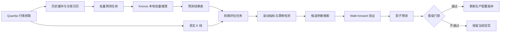
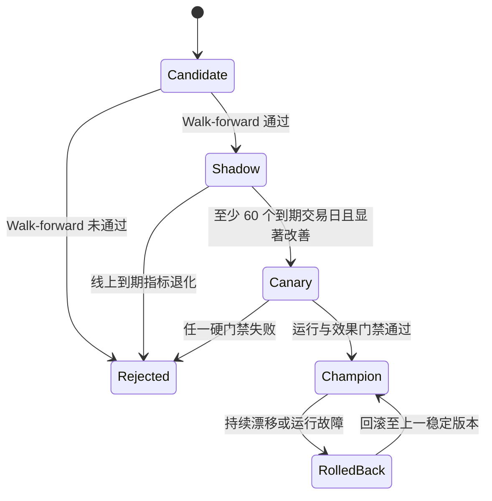

# Kronos 滚动验证、批量预测与动态调优方案

> 审查日期：2026-07-13
> 适用范围：Quantia 日线预测、Kronos-base、本地推理服务、可选 C1 收益评分层
> 文档状态：实施规格；Phase 1 最小闭环已落地并完成真实烟测，Phase 2～4 尚未上线

## 1. 分析结论

### 1.1 可行性结论

以下能力均可以实现，而且现有代码已经具备主要基础：

1. Kronos 已有 `KronosPredictor.predict_batch()`，可以对等长历史窗口、相同预测步数的多个标的执行批量推理。
2. Quantia 已有股票历史缓存、交易日历、工作日 Cron 和统一数据库写入封装，可以负责股票池、调度和持久化。
3. Kronos 已有单次验证/测试入口及 C1 的 IC、RankIC、Hit 指标，可以扩展为多锚点 walk-forward 验证。
4. 每次预测只要保存数据截止日、目标交易日、模型版本和配置哈希，等真实 K 线到齐后即可自动对齐并评估。
5. 可以根据滚动结果搜索参数，但不应让线上程序根据单日结果立即修改生产参数。推荐采用“候选生成 -> 离线滚动验证 -> 影子预测 -> 冠军/挑战者晋级”的受控闭环。

### 1.2 当前缺口

现有 `finetune_csv/run_validate.py` 和 `pipeline/eval_runner.py` 主要计算 tokenizer 重建 MSE 与 predictor loss。这些指标适合检查模型是否退化，但不能直接回答以下业务问题：

- 第 1、3、5、10、15、30 个交易日的收盘价误差是多少；
- 涨跌方向是否正确；
- C1 的截面排序是否有效；
- 不同市场状态下哪个 lookback 更稳定；
- 线上真实预测是否优于当前生产版本或简单基线。

因此后续必须增加“历史锚点生成式回放”和“线上到期结果评估”，不能只复用训练 loss 作为准确率。

### 1.3 推荐默认值不等于永久最优值

当前生产候选仍建议：

| 参数 | 默认值 | 后续候选空间 |
| --- | ---: | --- |
| `max_context` | 512 | 固定，Kronos-base 上限 |
| `lookback` | 256 | 90、128、256、384、512 |
| `max_pred_days` | 30 | 分别评估 1、3、5、10、15、30 日 |
| `sample_count` | 1 | 确定性主模型为 1；概率实验为 5、10 |
| `temperature` | 1.0 | 确定性模式固定；概率实验 0.7、0.9、1.0 |
| `top_k` | 1 | 确定性生产固定为 1 |
| `top_p` | 1.0 | 概率实验 0.85、0.9、0.95、1.0 |
| `clip` | 5.0 | 通常固定，仅在独立实验中搜索 |

预测周期不是一个可以混合比较的单一超参数。1 日和 30 日是不同任务，必须分别报告指标和选择配置。**当前 Quantia 生产语义是对 `days=1/3/5/10/15/30` 分别请求**；Kronos 自回归结果会随 `pred_len` 改变，真实验证已确认独立 5 日请求的第 5 步不等于 30 日请求的第 5 步。因此生产等价评测必须对每个 horizon 独立调用，不能用一条 30 日路径代替六次线上请求。若未来另建“固定 30 日路径模式”，只能作为不同的实验契约，必须使用独立 `mode/config_hash`，不得与当前线上指标混合。

服务代码保留 `max_pred_days<=120` 作为隔离的研究硬上限，但 Quantia 对外配置和当前评测白名单仍固定在 30 日以内。任何 30 日以上实验必须使用不同 `run_type/config_hash`，不得进入生产指标或晋级判断。

### 1.4 2026-07-13 深度审查后的实施修正

本轮结合实际数据库、缓存、HTTP 服务和真实模型运行确认并修复了以下问题：

1. `cn_stock_spot` 主键实际为 `(date, code)`，按单股日期区间查询不能使用 `code` 前缀索引。当前按需预测只允许在缓存后 **30 个自然日**内续接 DB 尾段，避免长期缺口股票反复扫描大表；全市场批量必须改用按日期批量读取/内存分发，不能逐股查询。
2. 文件缓存是 `qfq`，DB 快照是原始行情。续接前必须校验首行 `pre_close_price` 与缓存末收盘、后续行与前一收盘连续；除权除息导致价格基准不连续时拒绝拼接并等待缓存重建，不能制造虚假跳空。
3. Kronos 原 `model_version` 只覆盖 predictor，无法识别 tokenizer 变化。服务现已分别返回 `predictor_version`、`tokenizer_version`，并用二者生成组合 `model_version`。
4. lookback 原为进程级固定值，无法在同一服务上执行候选搜索。服务现支持请求级 `lookback`，并严格限制在 `32..max_context`。
5. Phase 1 CLI 首版若读取整张未来交易日历，会让数据加载器收到远未来截止日并误判已到期结果为 `not_traded`。现已将实际边界固定为 `min(MAX(cn_stock_spot.date), 最后完整交易日)`，也可用 `--actual-end` 固定可复现快照。

## 2. 总体架构与职责



职责边界：

- **Quantia**：选择股票池、读取缓存、生成交易日期、调度、任务状态、MySQL 持久化、真实值对齐、告警。
- **Kronos 服务**：加载一次模型，执行单只/批量推理，返回预测值、耗时和模型元数据。
- **C1**：只作为独立的 5 日截面收益评分层；当前质量门禁未通过，继续保持默认关闭。
- **Web Handler**：只读缓存/数据库并调用本地模型服务，不直接访问外部行情源。

Kronos 不直接连接 Quantia 生产数据库。这样可以保持两个 Python 环境隔离，也便于模型服务独立部署在 GPU 节点或纯 CPU 的 Linux 节点上（CPU-only 容量测算与降级策略见第 9 章）。

## 3. 滚动验证设计

### 3.1 两类验证必须分开

#### A. 冻结模型的推理参数验证

不重新训练 Kronos 权重，只在多个历史锚点上改变 `lookback`、采样参数和预测周期。这是当前最应先落地、成本最低的一层。

对每个锚点 $t$：

1. 输入只能使用日期 $\le t$ 的已完成日线；
2. 生成 $t$ 后第 1 到 $H$ 个交易日的预测；
3. 与真实 $t+1,\ldots,t+H$ 对齐；
4. 保存逐股票、逐步长指标；
5. 将锚点向前滚动 5 个交易日后重复。

#### B. 训练型 walk-forward

适用于 C1 重训或 Kronos 微调。每个锚点必须重新构建当时可见的数据集：

```text
train ----------------| embargo | validation | embargo | test
                      H days                  H days
```

`embargo` 至少等于标签周期 $H$。例如 C1 使用未来 5 日收益标签，则训练集最后 5 个交易日不能进入训练标签，防止标签跨越验证边界。

推荐节奏：

- 冻结模型推理参数：每周运行；
- C1 重训候选：每月运行；
- Kronos tokenizer/base 微调：季度或确认结构性漂移后运行，不应按日重训。

### 3.2 锚点与样本范围

第一阶段建议：

| 项目 | 建议 |
| --- | --- |
| 回放区间 | 至少最近 2 年，覆盖上涨、下跌、震荡阶段 |
| 锚点步长 | 5 个交易日 |
| 股票池 | 先固定 100～300 只有充足历史的股票，再扩全市场 |
| 最少历史 | `lookback + 20` 个有效交易日 |
| 预测周期 | 1、3、5、10、15、30 分开评估 |
| 评估聚合 | 按日期、股票、行业、波动率分组、市场状态分别聚合 |

股票池必须在锚点时刻可知。不能使用今天的成分股列表回测多年前的市场，否则会产生幸存者偏差。第一阶段若没有历史成分股快照，应明确标注为“固定现存股票池技术验证”，不能作为无偏收益结论。

当前 Quantia 可用于两年回放的主要事实源是 `cache/hist/**/**qfq.gzip.pickle`；`cn_stock_spot` 实库当前只覆盖约 99 个交易日，不能单独承担两年回放。缓存是随时间重算的 qfq 快照，并非逐日冻结的数据版本，因此 Phase 1 MVP 只能用于技术/参数比较，不能宣称完全消除了复权因子和数据修订带来的时点偏差。要形成无偏生产证据，后续必须保存不可变 `data_snapshot_id`（至少包含文件哈希、复权方式和生成时间），或建设按交易日版本化的行情事实表。

### 3.3 指标体系

#### K 线数值指标

相对最后真实收盘价 $C_t$ 计算未来第 $h$ 步收益：

$$
\hat r_{t,h}=\frac{\hat C_{t+h}}{C_t}-1,\qquad
r_{t,h}=\frac{C_{t+h}}{C_t}-1
$$

推荐指标：

- Close MAE / RMSE；
- Close sMAPE，避免普通 MAPE 的非对称问题；
- 归一化误差：$|\hat C-C|/ATR_{20}$；
- 收益方向准确率：$\mathbb{1}[\operatorname{sign}(\hat r)=\operatorname{sign}(r)]$；
- 涨跌幅误差：$|\hat r-r|$；
- OHLC 合法率：`low <= open/close <= high`；
- 若启用多样本采样：分位区间覆盖率与区间宽度。

不能把 `pred_close > pred_open` 当成唯一方向指标。业务预测方向应相对锚点真实收盘价 $C_t$，否则隔夜缺口会使定义偏离实际持有收益。

#### C1 截面指标

- Pearson IC；
- Spearman RankIC；
- Hit rate；
- Top/Bottom decile spread；
- 分组单调性；
- 加入手续费、滑点和涨跌停约束后的组合收益、最大回撤和换手率。

C1 标签固定为未来 5 日收益，只能与 5 日结果比较。

#### 基线

每项结果必须同时报告以下基线：

1. Random walk：未来收盘价等于 $C_t$；
2. 最近收益延续或移动平均基线；
3. 当前线上冠军配置；
4. C1 对比零分/行业中性简单排序。

只有“统计上稳定优于冠军和简单基线”才有晋级意义，单看方向准确率超过 50% 不够。

### 3.4 聚合与统计显著性

禁止把同一股票相邻锚点的高度重叠预测当作独立样本直接计算普通置信区间。建议按交易日做 block bootstrap，或按非重叠持有周期采样。

最少门禁建议：

- 至少 60 个到期交易日；
- 至少 100 只有效股票；
- 真实值覆盖率不低于 95%；
- 对冠军的核心指标改善在 block bootstrap 95% 置信区间下不劣；
- 至少三个市场状态中不存在显著崩溃；
- 延迟、显存和失败率满足运行预算。

`55%` 方向准确率只能作为早期观察线，不应硬编码成通用生产真理。

## 4. 批量预测设计

### 4.1 执行时点

日线批量任务应加入现有 `cron.workdayly/run_workdayly` 串行编排，放在 `run_kline_cache` 成功之后；18:30 只能作为启动时间，不能替代上游成功门禁：

1. 验证当天是交易日且已经结算；
2. 验证缓存最后日期等于当天；
3. 以当天为 `as_of_data_date`；
4. 从下一交易日开始生成未来 1～30 日预测，并按标准 horizon 保存/评测。

盘中按需预测仍遵循现有规则：中午只使用上一完整交易日，并从今天开始预测。盘中结果和结算后批量结果必须使用不同 `batch_id` 和 `as_of_data_date`，不能互相覆盖。

### 4.2 批处理方式

`KronosPredictor.predict_batch()` 要求同一批次的所有序列具有相同 `lookback` 和 `pred_len`。推荐流程（GPU、CPU 通用）：

1. 按 `model_version + config_hash + lookback + pred_len` 分桶；
2. 过滤历史不足、停牌或数据过期的标的；
3. 每桶按硬件资源预算（GPU 显存或 CPU 内存/线程数）切成 micro-batch；micro-batch 大小必须先在目标机型实测，不能沿用开发机数值；
4. 同一模型进程串行执行各 micro-batch；
5. 每个 micro-batch 完成后立即持久化并更新 checkpoint；
6. 失败标的记录错误类型，重试时只处理失败项。

不要用 `ThreadPoolExecutor` 或多进程并发调用同一个模型实例来"加速"。GPU 场景优先使用 `predict_batch` 做张量级并行；CPU 场景 PyTorch 已经在算子内部用多线程做 BLAS 并行，叠加 Python 线程池或额外进程会造成核心争抢，通常更慢而不是更快。CPU-only 部署的容量测算、线程配置和降级策略见第 9 章。

### 4.3 幂等与恢复

每个批次生成 UUID `batch_id`。任务状态：

```text
created -> running -> partial/succeeded/failed
                    -> resumed -> succeeded/failed
```

批次表必须另设业务唯一键，不能只靠每次新生成的 UUID `batch_id`。推荐：

```text
(run_type, model_version, config_hash, data_snapshot_id, as_of_data_date, universe_id)
```

预测明细必须显式区分 `request_horizon` 与 `path_step`。当前生产等价模式只保存每个独立请求的终点，明细业务键为 `(batch_id, code, request_horizon, target_date)`；若未来保存完整路径，则改为 `(batch_id, code, request_horizon, path_step)`。同一参数重跑采用 upsert；改变参数或 horizon 语义会创建新版本记录，不覆盖旧预测。所有数据库写入使用 Quantia `quantia.lib.database`，保持 `chunksize=500` 和 NaN/inf 清洗规则。

## 5. 持久化数据模型

部署前必须通过 `INFORMATION_SCHEMA.COLUMNS` 核对生产库，表结构以实际迁移脚本为准。建议新增四张表。

### 5.1 批次表 `cn_kronos_prediction_batch`

关键字段：

- `batch_id`：UUID，唯一；
- `run_type`：`eod|intraday|walk_forward|shadow`；
- `as_of_data_date`、`generated_at`；
- `model_version`、`tokenizer_version`、`c1_version`；
- `config_hash`、`code_git_sha`、`data_snapshot_id`；
- `lookback`、`pred_len`、采样参数；
- `universe_id`、计划/成功/失败数量；
- `status`、`error_summary`、开始/结束时间。

### 5.2 预测明细表 `cn_stock_kronos_prediction`

每只股票、每个目标交易日一行：

- `batch_id`、`code`；
- `as_of_data_date`、`target_date`、`request_horizon`、`path_step`；
- `last_actual_close`；
- `pred_open/high/low/close/volume/amount`；
- `pred_return`、可选分位数区间；
- `c1_score`、`c1_rank`（仅兼容 5 日时填写）；
- `latency_ms`、`status`、`error_code`、`error_message`。

当前终点模式唯一键：`(batch_id, code, request_horizon, target_date)`。不能只用 `(batch_id, code, target_date)`，否则未来保存多个独立请求的重叠路径时会互相覆盖。

### 5.3 真实值与评估表 `cn_stock_kronos_evaluation`

- 使用不可变 `prediction_id` 关联预测事实；
- `actual_open/high/low/close/volume/amount`；
- `actual_return`；
- `close_abs_error`、`close_smape`、`return_abs_error`；
- `direction_correct`、`ohlc_valid`；
- `actual_data_version`、`evaluated_at`；
- `status`：`pending|observed|invalidated`。

唯一键应为 `(prediction_id, actual_data_version)`，并另设 `is_current` 或当前版本视图。真实行情后续发生复权或纠错时，不修改原始预测；增加真实数据版本并重新计算评估。若目标区间跨越除权除息且无法把真实价转换到预测生成时的价格基准，状态必须记为 `price_basis_break`/`invalidated` 并排除出价格误差聚合，不能直接比较 qfq 与原始价。

### 5.4 聚合表 `cn_kronos_model_metric`

按 `model_version + config_hash + window + request_horizon + segment` 保存：

- 样本数、覆盖率；
- MAE、RMSE、sMAPE、方向准确率；
- IC、RankIC、分组收益；
- 推理 p50/p95/p99、失败率；
- 相对冠军和基线的差值及置信区间；
- 指标窗口起止日期、计算时间。

明细是事实来源，聚合表可以安全重建。

## 6. 真实结果到期评估

评估任务每天在行情缓存更新后运行，不需要为每个历史批次单独设置 Cron：

1. 查询 `target_date <= latest_complete_trade_date` 且状态为 `pending` 的预测；
2. 从 Quantia 缓存/数据库读取对应真实 K 线；
3. 数据缺失时保持 pending，并记录缺失原因；只有目标日之后该股票重新出现有效 K 线，才能确认目标日为 `not_traded`，数据尾端缺失一律记为 `actual_missing`，不能把缓存过期/价格基准断裂误判为停牌；
4. 对齐后写评估明细；
5. 更新最近 20、60、120 个交易日的聚合指标；
6. 检查覆盖率、漂移和挑战者门禁；
7. 生成 JSON/CSV 报告供审计，不依赖报告文件作为事实来源。

需要区分：

- `request_horizon=1`：目标日一到即可评估；
- 完整 `pred_len=10` 批次：第 10 个目标交易日到齐后才标记 complete；
- 停牌：若目标交易日该股票无成交，应标记 `not_traded`，不能自动挪到下一交易日并假装原预测命中。
- 锚点成熟度：输出必须包含选中锚点数、已成熟锚点数和因未来交易日不足跳过的锚点数，禁止静默缩小样本。
- 同一批运行若观察到多个 `model_version`，必须标记 `mixed_model_versions=true` 并禁止用于参数比较或晋级。

## 7. 动态调优闭环

### 7.1 不推荐的方案

以下做法风险过高：

- 根据最近一天准确率自动修改 YAML；
- 在同一测试区间反复选参并报告该区间为“测试集”；
- 市场大跌后只用最近一周数据立即重训并替换生产模型；
- 搜索大量参数后只保留最优结果，不保存全部试验；
- C1 负 IC 时通过反转分数直接宣称可生产。

这些做法容易造成追涨杀跌、数据窥探和不可复现。

### 7.2 推荐冠军/挑战者流程



晋级条件建议同时满足：

1. walk-forward 主指标优于当前冠军；
2. 测试窗口从未参与候选参数选择；
3. 影子预测至少积累 60 个到期交易日；
4. 覆盖率、OHLC 合法率、失败率和延迟通过；
5. 改善经过 block bootstrap 或按日配对检验；
6. 配置、模型、代码和数据快照均可复现；
7. 由人工审批更新生产配置，不直接由评估脚本写生产 YAML。

### 7.3 搜索策略

分层搜索，避免组合爆炸：

1. **推理窗口层**：`lookback=[90,128,256,384,512]`，确定性参数固定；
2. **概率采样层**：只对前两名 lookback 搜索 `sample_count/temperature/top_p`；
3. **C1 层**：独立搜索特征、正则化和模型参数，仅评价 5 日截面指标；
4. **微调层**：只有冻结模型持续退化且数据量足够时，才启动 tokenizer/base 微调实验。

推荐使用随机搜索或 Optuna 的受限搜索，而不是全排列。每个 trial 必须保存：

- 参数、随机种子和配置哈希；
- 模型/tokenizer/C1 版本；
- Git SHA；
- 数据快照、股票池版本和时间边界；
- 各锚点明细、聚合指标、耗时和硬件信息。

选择目标不能只有一个 MAPE。建议使用带硬约束的综合目标：先剔除覆盖率、失败率、延迟不达标的候选，再在剩余候选中按方向准确率、sMAPE、稳定性和运行成本排序。

### 7.4 漂移触发

调优任务建议周度汇总、月度决策。触发条件可包括：

- 最近 20 日相对冠军方向准确率下降，且置信区间确认非随机波动；
- sMAPE 或 ATR 归一化误差连续多个窗口恶化；
- 行业/波动率分组出现集中失效；
- 数据分布 PSI/KS 超阈值；
- 预测覆盖率或服务失败率异常。

触发只创建候选实验，不自动替换生产版本。

## 8. 可视化设计

### 8.1 定位与原则

这是内部研发/风控可观测面板，不是面向普通用户的选股功能，默认不出现在公开导航中。设计原则：

1. 前端只读第 5 章持久化表的**聚合结果**，不在浏览器里重新计算逐笔误差或截面排名，避免页面卡顿。
2. 复用 Quantia 现有前端基础设施：Vue 3 + Element Plus + ECharts，图表交互风格与 [indicator/index.vue](../quantia/fontWeb/src/views/indicator/index.vue) 保持一致。
3. 按仓库 `AGENTS.md` 的移动端适配规则，新页面必须做响应式：宽对比表格提供卡片视图，ECharts 在 tab 切换后必须 `resize()`，弹窗遵循 `isMobile` 全屏规则。这是一条硬约束，不因为是内部页面而豁免。
4. 图表默认查询窗口不超过最近 120 个交易日；需要更长区间时要求用户显式选择，防止一次性拉取过多历史点位。
5. 每个图表都必须能看出"样本量是否足够"，例如叠加到期交易日计数，避免把仅有 5～10 个样本的早期噪声误读成稳定结论。

### 8.2 页面结构

新增 `quantia/fontWeb/src/views/kronos-monitor/`，建议拆分为以下 Tab：

| Tab | 核心用途 |
| --- | --- |
| 总览 | 当前冠军版本信息卡片（`model_version`/`lookback`/`pred_len`/生效时间）+ 关键 KPI（近 20 日方向准确率、sMAPE、覆盖率、失败率）+ 告警条 |
| 滚动验证 | 多锚点、多 horizon 的历史回放指标趋势 |
| 批量预测监控 | 批次状态、延迟分布、失败标的清单 |
| 准确率评估 | 误差分布、预测 vs 实际散点/校准曲线、K 线抽查对比 |
| C1 截面 | IC/RankIC 时间序列、分层收益 |
| 冠军 / 挑战者 | 多维度对比 + 晋级门禁检查单 |

### 8.3 关键图表规格

1. **滚动验证时间序列**（折线图）：横轴为锚点日期，每个 horizon（1/3/5/10/15/30 日）一条线，叠加冠军基线和随机游走基线的虚线；默认只显示 1/5/30 以避免六条线拥挤，其余通过图例切换。置信区间用半透明面积（upper/lower 两条辅助 series + `areaStyle`）表示，避免用户把单点波动误认为趋势拐点。
2. **误差分布箱线图**：按 horizon 或按行业/波动率分组的 `close_smape`、方向准确率分布，后端需要预先计算 `[min, Q1, median, Q3, max]` 再传给 ECharts `boxplot`，不要把全部原始样本传到前端。
3. **预测 vs 实际收益散点/校准曲线**：横轴预测收益 $\hat r_{t,h}$，纵轴真实收益 $r_{t,h}$，叠加 $y=x$ 参考线和线性拟合线，标注该窗口的 IC/RankIC 数值；用于直观判断模型是否系统性偏多或偏空。
4. **K 线抽查叠加图**：复用现有蜡烛图组件，用同一坐标轴叠加"预测蜡烛"（半透明或虚线描边）与"真实蜡烛"，用于人工抽查而非替代统计指标。
5. **C1 分层收益条形图**：按预测分位数（如十分位）分组的未来实际收益均值，用于判断截面排序单调性；非单调应在图上高亮提示。
6. **漂移监控折线图**：PSI/KS 等分布漂移指标随时间变化，叠加 `markLine` 标出告警阈值。
7. **冠军 / 挑战者对比**：多维指标（方向准确率、sMAPE、覆盖率、延迟、样本数）归一化后用雷达图或并列柱状图对比，旁边配 7.2 节晋级门禁的检查单组件（每项显示 ✅/❌ 及当前数值）。
8. **批量任务运行监控**：按日期的批次状态日历（成功/部分成功/失败三色），配合延迟 P50/P95/P99 趋势线和吞吐（symbols/秒）趋势线；用于判断第 9 章的容量假设是否仍然成立。

### 8.4 数据契约

新增只读 handler `quantia/web/kronosMonitorHandler.py`，建议路由：

- `GET /quantia/api/kronos/monitor/rolling_metrics`
- `GET /quantia/api/kronos/monitor/evaluation_summary`
- `GET /quantia/api/kronos/monitor/champion_challenger`
- `GET /quantia/api/kronos/monitor/batch_health`

所有接口直接查询 `cn_kronos_model_metric`、`cn_kronos_prediction_batch` 等聚合/状态表，返回已经算好、与图表 series 字段一一对应的 JSON，不在 Web 层做重计算，也不反向触发批量或评估任务。

## 9. CPU-only Linux 部署可行性分析

### 9.1 结论

功能上完全可行：本地服务默认配置 `model.device: cpu`，此前所有真实推理验证（包括 300308 黑盒调用）都是在 CPU 上完成的，不依赖 GPU。**真正的约束是吞吐**：单机 CPU 能否在夜间批处理窗口内完成目标股票池的批量预测，需要在目标机型实测后才能下结论，不能直接假设"能"或"不能"。

### 9.2 已核实的事实

- 当前 `local_kpred.yaml` 的 `model.device` 默认值就是 `cpu`（见 [local_kpred.yaml](../../Kronos/finetune_csv/configs/local_kpred.yaml)），CPU 是当前实现的默认路径而非陌生场景。
- 模型体积：`Kronos-base/model.safetensors` 约 390 MB，`Kronos-Tokenizer-base/model.safetensors` 约 15 MB，磁盘合计约 405 MB。常驻推理时的实际内存占用还包含激活值和框架开销，需要在目标机型用 `/usr/bin/time -v` 或 `ps`/`smem` 实测，不能直接套用磁盘体积估算。
- 已实测延迟（Windows 开发机 CPU，`lookback=90`）：单步约 133 ms，5 步约 595 ms；`300308` 真实缓存场景 3 步 376～483 ms。
- 2026-07-13 实测：Windows 开发机 CPU、`lookback=256`、`pred_len=30`、`sample_count=1`、`top_k=1`，单股 30 日请求约 **10 秒**。服务修复后使用 DB 连续补齐至 2026-07-10 的新鲜历史，按需接口已返回 HTTP 200。
- 生产等价评测需要分别执行六个 horizon，不能再用“单次 30 日耗时 × 股票数”低估成本。Phase 1 真实烟测（300308、锚点 2026-06-30、lookback 64）独立 1/3 日请求分别约 109/277 ms；完整六档和长 lookback 仍需单独测量。因此纯 CPU 全市场逐股串行不可作为生产方案；批量端点和目标机 micro-batch 实测是 Phase 2 的硬门禁。

### 9.3 容量测算方法

在目标 Linux 机型（而不是开发机）上执行基准测试：

1. 固定 `lookback=256`，分别对独立 `pred_len ∈ {1,3,5,10,15,30}`、若干 `micro_batch_size`（如 1、8、16、32）跑真实历史数据，记录各 horizon 的 P50/P95 延迟和吞吐（symbols/秒）；
2. 用下式估算覆盖目标股票池所需时间：

$$
T_{batch}\approx\frac{N_{symbols}}{\text{throughput(symbols/s)}}
$$

3. 与可用批处理窗口（例如收盘数据结算后到次日开盘前）比较，判断能否覆盖目标股票池；
4. 把结果连同硬件型号、核数、`torch`/`OMP` 线程配置一并记录到 [`finetune_csv/bench_cpu_capacity.py`](新增) 的产出文件中，作为后续容量决策的依据，不能只凭一次性口头结论。

### 9.4 CPU 线程与并发配置

- 单进程常驻模型，显式调用 `torch.set_num_threads(物理核数)`，并设置 `OMP_NUM_THREADS`/`MKL_NUM_THREADS` 环境变量，避免和同机的 Quantia 行情抓取、指标计算等任务抢核；
- `predict_batch()` 已经把多只股票的矩阵运算合并成一次前向调用，是 CPU 上最有效的并行方式；不要再叠加线程池或多进程重复调用同一模型实例，那样只会造成核心争抢、拖慢整体吞吐（呼应 4.2 节）；
- 如确需水平扩展（例如按股票池分片、每个分片一个独立进程），必须显式限制每个进程的线程数，确认所有进程线程数之和不超过物理核数，且总内存不超过机器可用内存（单进程内存 × 进程数）；
- 容器化部署（Docker/K8s）必须显式设置 CPU limit，并提前固定线程数环境变量；否则 PyTorch 默认按宿主机核数分配线程，在共享节点上会过度订阅，拖慢所有共享该节点的服务。

### 9.5 分层部署策略

在完成 9.3 的实测之前，不应默认承诺"CPU 可以覆盖全市场夜间批量"。建议按下列优先级分层，具体分界点由实测吞吐决定：

- **Tier 1（核心关注股票池，如 100～300 只自选/重点标的）**：若保持当前生产语义，CPU 每日分别执行 1/3/5/10/15/30 日请求；若容量不足，只能明确缩减 horizon，不能偷换成一条 30 日路径后沿用原指标名称；可选叠加 C1。
- **Tier 2（全市场其余标的）**：若实测吞吐不足以覆盖全市场夜间批次，按成本从低到高降级：
  1. 缩小 horizon 集合（例如只保留 1 日和 5 日）；
  2. 降低批频率（Tier 1 每日，Tier 2 每周）；
  3. 评估体积更小的 Kronos-small 是否能满足精度要求，以降低单步计算量（需要额外验证，当前仓库默认权重是 base）；
  4. 增加一台 GPU 节点专门跑全市场批次，CPU 节点只保留 Tier 1 与按需请求；
  5. 全市场其余标的改用开销远低于生成式 Transformer 的传统因子/C1 打分，Kronos 蜡烛预测只保留给 Tier 1。

该分层不是最终结论，必须先完成 9.3 的实测，再确定具体股票数量和 micro-batch 参数。

### 9.6 风险与缓解

- **长尾延迟**：进入张量 micro-batch 后无法对单个标的设置可中断超时。必须先完成历史长度、有限值、价格基准连续性等预校验；整批设置超时/看门狗，失败后缩小 micro-batch 或逐标的隔离重试。
- **内存增长**：常驻服务需要监控 RSS，超过阈值应告警并考虑重启或降低并发；
- **与 Quantia 同机资源竞争**：若 Kronos 服务与 Quantia Web/Cron 部署在同一台 Linux 机器，需要用 cgroup 或进程优先级隔离，防止批量推理挤占实时 Web 请求；
- **时区一致性**：容器时区必须设为 `Asia/Shanghai`，否则 `_completed_daily_cutoff`/`is_post_settlement` 等基于本地时间的判断会发生偏移。

## 10. 推荐模块与配置

### 10.1 Kronos 侧

已落地：

- `local_kpred_service.py`：请求级 `lookback`（32～`max_context`）、predictor/tokenizer 独立指纹及组合 `model_version`；
- 现有单只端点仍为 `/v1/open-api/kpred` 和 `/v1/kline/predict`。

Phase 2 仍待新增：

- `finetune_csv/rolling_forecast_validator.py`：历史锚点生成式回放；
- `finetune_csv/evaluation_metrics.py`：OHLC/收益/截面指标；
- `finetune_csv/parameter_search.py`：候选试验编排；
- `finetune_csv/bench_cpu_capacity.py`：CPU-only 容量测算脚本（见 9.3）；
- 本地服务 `/v1/kline/predict-batch`：当前不存在；待按 micro-batch 推理并返回逐标的状态后，才能开始 Phase 2 全市场容量验收。

`finetune_csv/pipeline/forecast_evaluation.py` 已支持对**一条固定预测路径**按 step 评测，适合 path-mode 研究，但不能替代当前生产等价的独立 horizon 请求。其可执行入口为：

```bash
python finetune_csv/evaluate_kpred_results.py \
  --prediction-json runs/predictions/300308_20260713.json \
  --actual-csv DataSet/actual/300308.csv \
  --horizons 1,3,5,10,15,30 \
  --output runs/evaluation/300308_20260713.json
```

输入预测 JSON 使用本地服务的响应契约；真实 CSV 至少包含 `date/open/high/low/close`。尚未到期或缺失的真实交易日输出 `pending`，不会被当作错误或分母中的命中；预测路径不足则输出 `not_predicted`。聚合结果按 horizon 分别给出覆盖率、Close MAE/sMAPE、收益 MAE、方向准确率和 OHLC 合法率，可直接映射到第 5 章数据表与第 8 章图表。

复用：

- `model/kronos.py::KronosPredictor.predict_batch`；
- `finetune_csv/pipeline/splits.py::rolling_date_splits`；
- `finetune_csv/train_c1_bundle.py` 中的 IC/RankIC/Hit 计算；
- `finetune_csv/local_kpred_service.py` 的模型加载、配置和质量门禁。

### 10.2 Quantia 侧

Phase 1 已落地：

- `quantia/kronos/rolling_validation.py`：锚点切片、独立 horizon 调用、状态记录、random-walk 基线和分组汇总；
- `quantia/job/kronos_rolling_validation_job.py`：只读缓存/DB 的 CLI，支持代码列表、锚点范围、lookback/horizon、固定 `actual_end` 和原子 JSON 输出；
- `tests/test_kronos_rolling_validation.py`：独立请求、停牌、错误响应与基线契约；
- `runs/kronos_validation/`：本地审计产物目录，已加入 `.gitignore`，不是事实数据库。

真实烟测命令：

```bash
python -m quantia.job.kronos_rolling_validation_job \
  --codes 300308 \
  --anchor-start 2026-06-30 --anchor-end 2026-06-30 \
  --lookbacks 64 --horizons 1,3 --anchor-step 1 \
  --actual-end 2026-07-10 \
  --output runs/kronos_validation/smoke_300308_20260630.json
```

已验证输出 2 条 `observed`：目标日 2026-07-01、2026-07-03，覆盖率均为 100%。该结果只证明执行链和日期对齐正确，不构成准确率通过。

Phase 2～3 待新增：

- `quantia/job/kronos_batch_prediction_job.py`；
- `quantia/job/kronos_prediction_evaluation_job.py`；
- `quantia/job/kronos_metric_aggregation_job.py`；
- `cron/cron.workdayly/run_kronos_batch_prediction`；
- `cron/cron.workdayly/run_kronos_prediction_evaluation`；
- `quantia/web/kronosMonitorHandler.py`：第 8 章可视化面板的只读聚合接口；
- `quantia/fontWeb/src/views/kronos-monitor/`：第 8 章可视化面板前端页面；
- 表结构和迁移脚本，以及必要的只读查询 API。

配置建议扩展：

```yaml
batch:
  enabled: false
  schedule_after: "18:30"
  horizons: [1, 3, 5, 10, 15, 30]
  micro_batch_size: 16
  min_history: 276
  persist_json: true
  resume_failed: true

rolling_validation:
  enabled: false
  anchor_step_days: 5
  history_years: 2
  horizons: [1, 3, 5, 10, 15, 30]
  lookbacks: [90, 128, 256, 384, 512]
  min_symbols: 100
  embargo_days: 10

promotion:
  min_mature_trade_days: 60
  min_coverage: 0.95
  require_human_approval: true
```

这些段落初始必须保持 `enabled: false`，待实现和测试后再启用。

## 11. 分阶段实施计划

### Phase 1：离线滚动验证（MVP 已落地）

已交付：

- 生产等价的独立 horizon 历史锚点回放；
- 逐记录 Close MAE/sMAPE、收益 MAE、方向、random-walk 基线；
- `observed/not_traded/actual_missing/provider_error` 状态及稳定 `error_code`；
- 成熟/未成熟锚点审计计数、运行中模型版本集合与混合版本标记；
- 模型/tokenizer 指纹、lookback、实际数据截止日和配置哈希；
- 原子 JSON 审计产物与真实模型烟测。

仍待扩展：

- 大股票池 1/3/5/10/15/30 全量运行；
- 行业/波动率/市场状态分组和 block bootstrap 置信区间；
- 固定股票池局限说明；
- 256 与其他 lookback 的真实对比报告。

MVP 验收已通过：单股单锚点真实请求可重复运行、日期严格按交易日对齐、不读取锚点后的历史输入。完整 Phase 1 验收仍要求固定不可变数据快照并完成 100～300 股票池运行。

### Phase 2：小股票池批量预测

先用 20～100 只股票影子运行：

- 按第 9 章方法完成目标机型（尤其是 CPU-only Linux）的容量基准测试，确定初始 micro_batch_size 和预期吸吐量；
- 批量端点和 micro-batch；
- 四张表、幂等 upsert、断点恢复；
- EOD Cron；
- 逐标的错误分类和运行指标。

验收：重复执行不产生重复事实记录，单只失败不影响整批，服务重启后可续做。

### Phase 3：到期评估闭环

交付：

- pending 预测自动对齐真实值；
- 20/60/120 日聚合；
- 漂移告警；
- 第 8 章定义的滚动验证/准确率评估/冠军挑战者可视化面板上线。

验收：停牌、缺失、复权修订和跨节假日场景均有明确状态；面板能实时反映这些状态。

### Phase 4：受控动态调优

交付：

- 参数搜索试验注册表；
- 周度候选、月度晋级；
- shadow/canary/production 状态；
- 人工审批和一键回滚。

验收：任何生产版本都能追溯到模型、配置、代码、数据和完整评估证据。

## 12. 最终建议

1. 先实现 Phase 1，不要直接做自动调参。当前最重要的问题是建立可信、无泄漏的业务指标基线。
2. 批量预测首期只做影子记录，不参与交易决策；至少积累 60 个到期交易日后再讨论晋级。
3. 采用 Quantia 编排与持久化、Kronos 专注推理的边界。部署形态不预设 GPU：CPU-only Linux 在功能上可行，但全市场夜间批量的吸吐量必须先用第 9 章的方法实测，不能默认假定 CPU 能覆盖全市场；实测不足时优先采用分层部署（重点股票池每日全 horizon，其余股票降频或降级为轻量因子评分），而不是预先采购 GPU。
4. 线上当前仍使用 `lookback=256`、确定性生成，但它只能称为现状基线，不能称为已通过的生产冠军。本轮真实单股到期结果显示其短期方向虽命中、3/5 日幅度严重失真；仓库也没有“base 模型 30 步 golden 准确率通过”的测试。是否保留 256 必须由独立 horizon 滚动证据和目标 Linux 机型容量测试共同决定。
5. C1 继续关闭。只有新的 5 日 walk-forward IC/RankIC 和影子结果通过门禁后才能启用。
6. 动态调优应是“自动发现候选、自动验证、人工晋级”，而不是“自动改参数并上线”。
7. 滚动调优数据、准确率评估、漂移监控必须有第 8 章描述的可视化面板支撑，不能只依赖 JSON 报告文件人工比对。
