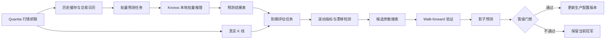
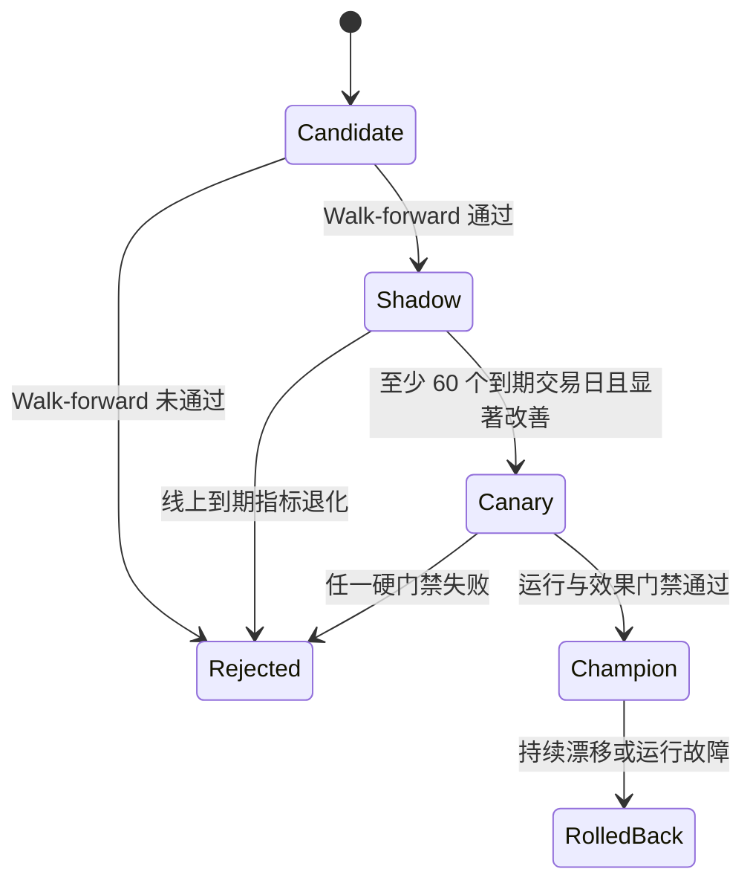

# Kronos 滚动验证、批量预测与动态调优方案

> 审查日期：2026-07-13
> 适用范围：Quantia 日线预测、Kronos-base、本地推理服务、可选 C1 收益评分层
> 文档状态：实施规格；本文描述后续建设，不代表相关模块已经上线

## 1. 分析结论

### 1.1 可行性结论

以下能力均可以实现，而且现有代码已经具备主要基础：

1. Kronos 已有 `KronosPredictor.predict_batch()`，可以对等长历史窗口、相同预测步数的多个标的执行批量推理。
2. Quantia 已有股票历史缓存、交易日历、工作日 Cron 和统一数据库写入封装，可以负责股票池、调度和持久化。
3. Kronos 已有单次验证/测试入口及 C1 的 IC、RankIC、Hit 指标，可以扩展为多锚点 walk-forward 验证。
4. 每次预测只要保存数据截止日、目标交易日、模型版本和配置哈希，等真实 K 线到齐后即可自动对齐并评估。
5. 可以根据滚动结果搜索参数，但不应让线上程序根据单日结果立即修改生产参数。推荐采用“候选生成 -> 离线滚动验证 -> 影子预测 -> 冠军/挑战者晋级”的受控闭环。

### 1.2 当前缺口

现有 `finetune_csv/run_validate.py` 和 `pipeline/eval_runner.py` 主要计算 tokenizer 重建 MSE 与 predictor loss。这些指标适合检查模型是否退化，但不能直接回答以下业务问题：

- 第 1、3、5、10 个交易日的收盘价误差是多少；
- 涨跌方向是否正确；
- C1 的截面排序是否有效；
- 不同市场状态下哪个 lookback 更稳定；
- 线上真实预测是否优于当前生产版本或简单基线。

因此后续必须增加“历史锚点生成式回放”和“线上到期结果评估”，不能只复用训练 loss 作为准确率。

### 1.3 推荐默认值不等于永久最优值

当前生产候选仍建议：

| 参数 | 默认值 | 后续候选空间 |
| --- | ---: | --- |
| `max_context` | 512 | 固定，Kronos-base 上限 |
| `lookback` | 256 | 90、128、256、384、512 |
| `max_pred_days` | 10 | 分别评估 1、3、5、10 日 |
| `sample_count` | 1 | 确定性主模型为 1；概率实验为 5、10 |
| `temperature` | 1.0 | 确定性模式固定；概率实验 0.7、0.9、1.0 |
| `top_k` | 1 | 确定性生产固定为 1 |
| `top_p` | 1.0 | 概率实验 0.85、0.9、0.95、1.0 |
| `clip` | 5.0 | 通常固定，仅在独立实验中搜索 |

预测周期不是一个可以混合比较的单一超参数。1 日和 10 日是不同任务，必须分别报告指标和选择配置。

## 2. 总体架构与职责



职责边界：

- **Quantia**：选择股票池、读取缓存、生成交易日期、调度、任务状态、MySQL 持久化、真实值对齐、告警。
- **Kronos 服务**：加载一次模型，执行单只/批量推理，返回预测值、耗时和模型元数据。
- **C1**：只作为独立的 5 日截面收益评分层；当前质量门禁未通过，继续保持默认关闭。
- **Web Handler**：只读缓存/数据库并调用本地模型服务，不直接访问外部行情源。

Kronos 不直接连接 Quantia 生产数据库。这样可以保持两个 Python 环境隔离，也便于模型服务在 GPU Linux 节点独立部署。

## 3. 滚动验证设计

### 3.1 两类验证必须分开

#### A. 冻结模型的推理参数验证

不重新训练 Kronos 权重，只在多个历史锚点上改变 `lookback`、采样参数和预测周期。这是当前最应先落地、成本最低的一层。

对每个锚点 $t$：

1. 输入只能使用日期 $\le t$ 的已完成日线；
2. 生成 $t$ 后第 1 到 $H$ 个交易日的预测；
3. 与真实 $t+1,\ldots,t+H$ 对齐；
4. 保存逐股票、逐步长指标；
5. 将锚点向前滚动 5 个交易日后重复。

#### B. 训练型 walk-forward

适用于 C1 重训或 Kronos 微调。每个锚点必须重新构建当时可见的数据集：

```text
train ----------------| embargo | validation | embargo | test
                      H days                  H days
```

`embargo` 至少等于标签周期 $H$。例如 C1 使用未来 5 日收益标签，则训练集最后 5 个交易日不能进入训练标签，防止标签跨越验证边界。

推荐节奏：

- 冻结模型推理参数：每周运行；
- C1 重训候选：每月运行；
- Kronos tokenizer/base 微调：季度或确认结构性漂移后运行，不应按日重训。

### 3.2 锚点与样本范围

第一阶段建议：

| 项目 | 建议 |
| --- | --- |
| 回放区间 | 至少最近 2 年，覆盖上涨、下跌、震荡阶段 |
| 锚点步长 | 5 个交易日 |
| 股票池 | 先固定 100～300 只有充足历史的股票，再扩全市场 |
| 最少历史 | `lookback + 20` 个有效交易日 |
| 预测周期 | 1、3、5、10 分开评估 |
| 评估聚合 | 按日期、股票、行业、波动率分组、市场状态分别聚合 |

股票池必须在锚点时刻可知。不能使用今天的成分股列表回测多年前的市场，否则会产生幸存者偏差。第一阶段若没有历史成分股快照，应明确标注为“固定现存股票池技术验证”，不能作为无偏收益结论。

### 3.3 指标体系

#### K 线数值指标

相对最后真实收盘价 $C_t$ 计算未来第 $h$ 步收益：

$$
\hat r_{t,h}=\frac{\hat C_{t+h}}{C_t}-1,\qquad
r_{t,h}=\frac{C_{t+h}}{C_t}-1
$$

推荐指标：

- Close MAE / RMSE；
- Close sMAPE，避免普通 MAPE 的非对称问题；
- 归一化误差：$|\hat C-C|/ATR_{20}$；
- 收益方向准确率：$\mathbb{1}[\operatorname{sign}(\hat r)=\operatorname{sign}(r)]$；
- 涨跌幅误差：$|\hat r-r|$；
- OHLC 合法率：`low <= open/close <= high`；
- 若启用多样本采样：分位区间覆盖率与区间宽度。

不能把 `pred_close > pred_open` 当成唯一方向指标。业务预测方向应相对锚点真实收盘价 $C_t$，否则隔夜缺口会使定义偏离实际持有收益。

#### C1 截面指标

- Pearson IC；
- Spearman RankIC；
- Hit rate；
- Top/Bottom decile spread；
- 分组单调性；
- 加入手续费、滑点和涨跌停约束后的组合收益、最大回撤和换手率。

C1 标签固定为未来 5 日收益，只能与 5 日结果比较。

#### 基线

每项结果必须同时报告以下基线：

1. Random walk：未来收盘价等于 $C_t$；
2. 最近收益延续或移动平均基线；
3. 当前线上冠军配置；
4. C1 对比零分/行业中性简单排序。

只有“统计上稳定优于冠军和简单基线”才有晋级意义，单看方向准确率超过 50% 不够。

### 3.4 聚合与统计显著性

禁止把同一股票相邻锚点的高度重叠预测当作独立样本直接计算普通置信区间。建议按交易日做 block bootstrap，或按非重叠持有周期采样。

最少门禁建议：

- 至少 60 个到期交易日；
- 至少 100 只有效股票；
- 真实值覆盖率不低于 95%；
- 对冠军的核心指标改善在 block bootstrap 95% 置信区间下不劣；
- 至少三个市场状态中不存在显著崩溃；
- 延迟、显存和失败率满足运行预算。

`55%` 方向准确率只能作为早期观察线，不应硬编码成通用生产真理。

## 4. 批量预测设计

### 4.1 执行时点

日线批量任务建议在工作日 18:30、行情缓存完成更新后执行：

1. 验证当天是交易日且已经结算；
2. 验证缓存最后日期等于当天；
3. 以当天为 `as_of_data_date`；
4. 从下一交易日开始生成未来 1～10 日预测。

盘中按需预测仍遵循现有规则：中午只使用上一完整交易日，并从今天开始预测。盘中结果和结算后批量结果必须使用不同 `batch_id` 和 `as_of_data_date`，不能互相覆盖。

### 4.2 批处理方式

`KronosPredictor.predict_batch()` 要求同一批次的所有序列具有相同 `lookback` 和 `pred_len`。推荐流程：

1. 按 `model_version + config_hash + lookback + pred_len` 分桶；
2. 过滤历史不足、停牌或数据过期的标的；
3. 每桶按 GPU 显存预算切成 micro-batch；
4. 同一模型进程串行执行 micro-batch；
5. 每个 micro-batch 完成后立即持久化并更新 checkpoint；
6. 失败标的记录错误类型，重试时只处理失败项。

不要默认用 `ThreadPoolExecutor` 并发调用同一个 GPU 模型实例。GPU 上优先使用 `predict_batch`；CPU 可按进程隔离模型，但必须评估模型副本的内存成本。

### 4.3 幂等与恢复

每个批次生成 UUID `batch_id`。任务状态：

```text
created -> running -> partial/succeeded/failed
                    -> resumed -> succeeded/failed
```

幂等键必须包含模型和配置版本，推荐：

```text
(model_version, config_hash, as_of_data_date, code, target_date, horizon_step)
```

同一参数重跑采用 upsert；改变参数会创建新版本记录，不覆盖旧预测。所有数据库写入使用 Quantia `quantia.lib.database`，保持 `chunksize=500` 和 NaN/inf 清洗规则。

## 5. 持久化数据模型

部署前必须通过 `INFORMATION_SCHEMA.COLUMNS` 核对生产库，表结构以实际迁移脚本为准。建议新增四张表。

### 5.1 批次表 `cn_kronos_prediction_batch`

关键字段：

- `batch_id`：UUID，唯一；
- `run_type`：`eod|intraday|walk_forward|shadow`；
- `as_of_data_date`、`generated_at`；
- `model_version`、`tokenizer_version`、`c1_version`；
- `config_hash`、`code_git_sha`、`data_snapshot_id`；
- `lookback`、`pred_len`、采样参数；
- `universe_id`、计划/成功/失败数量；
- `status`、`error_summary`、开始/结束时间。

### 5.2 预测明细表 `cn_stock_kronos_prediction`

每只股票、每个目标交易日一行：

- `batch_id`、`code`；
- `as_of_data_date`、`target_date`、`horizon_step`；
- `last_actual_close`；
- `pred_open/high/low/close/volume/amount`；
- `pred_return`、可选分位数区间；
- `c1_score`、`c1_rank`（仅兼容 5 日时填写）；
- `latency_ms`、`status`、`error_code`、`error_message`。

唯一键：`(batch_id, code, target_date)`。

### 5.3 真实值与评估表 `cn_stock_kronos_evaluation`

- 关联 `batch_id + code + target_date`；
- `actual_open/high/low/close/volume/amount`；
- `actual_return`；
- `close_abs_error`、`close_smape`、`return_abs_error`；
- `direction_correct`、`ohlc_valid`；
- `actual_data_version`、`evaluated_at`；
- `status`：`pending|observed|invalidated`。

真实行情后续发生复权或纠错时，不修改原始预测；只增加真实数据版本并重新计算评估。

### 5.4 聚合表 `cn_kronos_model_metric`

按 `model_version + config_hash + window + horizon_step + segment` 保存：

- 样本数、覆盖率；
- MAE、RMSE、sMAPE、方向准确率；
- IC、RankIC、分组收益；
- 推理 p50/p95/p99、失败率；
- 相对冠军和基线的差值及置信区间；
- 指标窗口起止日期、计算时间。

明细是事实来源，聚合表可以安全重建。

## 6. 真实结果到期评估

评估任务每天在行情缓存更新后运行，不需要为每个历史批次单独设置 Cron：

1. 查询 `target_date <= latest_complete_trade_date` 且状态为 `pending` 的预测；
2. 从 Quantia 缓存/数据库读取对应真实 K 线；
3. 数据缺失时保持 pending，并记录缺失原因；
4. 对齐后写评估明细；
5. 更新最近 20、60、120 个交易日的聚合指标；
6. 检查覆盖率、漂移和挑战者门禁；
7. 生成 JSON/CSV 报告供审计，不依赖报告文件作为事实来源。

需要区分：

- `horizon_step=1`：目标日一到即可评估；
- 完整 `pred_len=10` 批次：第 10 个目标交易日到齐后才标记 complete；
- 停牌：若目标交易日该股票无成交，应标记 `not_traded`，不能自动挪到下一交易日并假装原预测命中。

## 7. 动态调优闭环

### 7.1 不推荐的方案

以下做法风险过高：

- 根据最近一天准确率自动修改 YAML；
- 在同一测试区间反复选参并报告该区间为“测试集”；
- 市场大跌后只用最近一周数据立即重训并替换生产模型；
- 搜索大量参数后只保留最优结果，不保存全部试验；
- C1 负 IC 时通过反转分数直接宣称可生产。

这些做法容易造成追涨杀跌、数据窥探和不可复现。

### 7.2 推荐冠军/挑战者流程



晋级条件建议同时满足：

1. walk-forward 主指标优于当前冠军；
2. 测试窗口从未参与候选参数选择；
3. 影子预测至少积累 60 个到期交易日；
4. 覆盖率、OHLC 合法率、失败率和延迟通过；
5. 改善经过 block bootstrap 或按日配对检验；
6. 配置、模型、代码和数据快照均可复现；
7. 由人工审批更新生产配置，不直接由评估脚本写生产 YAML。

### 7.3 搜索策略

分层搜索，避免组合爆炸：

1. **推理窗口层**：`lookback=[90,128,256,384,512]`，确定性参数固定；
2. **概率采样层**：只对前两名 lookback 搜索 `sample_count/temperature/top_p`；
3. **C1 层**：独立搜索特征、正则化和模型参数，仅评价 5 日截面指标；
4. **微调层**：只有冻结模型持续退化且数据量足够时，才启动 tokenizer/base 微调实验。

推荐使用随机搜索或 Optuna 的受限搜索，而不是全排列。每个 trial 必须保存：

- 参数、随机种子和配置哈希；
- 模型/tokenizer/C1 版本；
- Git SHA；
- 数据快照、股票池版本和时间边界；
- 各锚点明细、聚合指标、耗时和硬件信息。

选择目标不能只有一个 MAPE。建议使用带硬约束的综合目标：先剔除覆盖率、失败率、延迟不达标的候选，再在剩余候选中按方向准确率、sMAPE、稳定性和运行成本排序。

### 7.4 漂移触发

调优任务建议周度汇总、月度决策。触发条件可包括：

- 最近 20 日相对冠军方向准确率下降，且置信区间确认非随机波动；
- sMAPE 或 ATR 归一化误差连续多个窗口恶化；
- 行业/波动率分组出现集中失效；
- 数据分布 PSI/KS 超阈值；
- 预测覆盖率或服务失败率异常。

触发只创建候选实验，不自动替换生产版本。

## 8. 推荐模块与配置

### 8.1 Kronos 侧

建议新增：

- `finetune_csv/rolling_forecast_validator.py`：历史锚点生成式回放；
- `finetune_csv/evaluation_metrics.py`：OHLC/收益/截面指标；
- `finetune_csv/parameter_search.py`：候选试验编排；
- 本地服务 `/v1/kline/predict-batch`：按 micro-batch 推理并返回逐标的状态。

复用：

- `model/kronos.py::KronosPredictor.predict_batch`；
- `finetune_csv/pipeline/splits.py::rolling_date_splits`；
- `finetune_csv/train_c1_bundle.py` 中的 IC/RankIC/Hit 计算；
- `finetune_csv/local_kpred_service.py` 的模型加载、配置和质量门禁。

### 8.2 Quantia 侧

建议新增：

- `quantia/job/kronos_batch_prediction_job.py`；
- `quantia/job/kronos_prediction_evaluation_job.py`；
- `quantia/job/kronos_metric_aggregation_job.py`；
- `cron/cron.workdayly/run_kronos_batch_prediction`；
- `cron/cron.workdayly/run_kronos_prediction_evaluation`；
- 表结构和迁移脚本，以及必要的只读查询 API。

配置建议扩展：

```yaml
batch:
  enabled: false
  schedule_after: "18:30"
  horizons: [1, 3, 5, 10]
  micro_batch_size: 16
  min_history: 276
  persist_json: true
  resume_failed: true

rolling_validation:
  enabled: false
  anchor_step_days: 5
  history_years: 2
  horizons: [1, 3, 5, 10]
  lookbacks: [90, 128, 256, 384, 512]
  min_symbols: 100
  embargo_days: 10

promotion:
  min_mature_trade_days: 60
  min_coverage: 0.95
  require_human_approval: true
```

这些段落初始必须保持 `enabled: false`，待实现和测试后再启用。

## 9. 分阶段实施计划

### Phase 1：离线滚动验证

交付：

- 历史锚点生成式回放；
- 1/3/5/10 日指标；
- 基线、分组和置信区间；
- 固定股票池局限说明；
- 256 与其他 lookback 的真实对比报告。

验收：同一数据快照和随机种子可重复得到相同结果，无越界读取。

### Phase 2：小股票池批量预测

先用 20～100 只股票影子运行：

- 批量端点和 micro-batch；
- 四张表、幂等 upsert、断点恢复；
- EOD Cron；
- 逐标的错误分类和运行指标。

验收：重复执行不产生重复事实记录，单只失败不影响整批，服务重启后可续做。

### Phase 3：到期评估闭环

交付：

- pending 预测自动对齐真实值；
- 20/60/120 日聚合；
- 漂移告警；
- 冠军/挑战者看板或报告。

验收：停牌、缺失、复权修订和跨节假日场景均有明确状态。

### Phase 4：受控动态调优

交付：

- 参数搜索试验注册表；
- 周度候选、月度晋级；
- shadow/canary/production 状态；
- 人工审批和一键回滚。

验收：任何生产版本都能追溯到模型、配置、代码、数据和完整评估证据。

## 10. 最终建议

1. 先实现 Phase 1，不要直接做自动调参。当前最重要的问题是建立可信、无泄漏的业务指标基线。
2. 批量预测首期只做影子记录，不参与交易决策；至少积累 60 个到期交易日后再讨论晋级。
3. 采用 Quantia 编排与持久化、Kronos 专注推理的边界，Linux GPU 部署更简单。
4. 生产默认继续使用 `lookback=256`、确定性生成、最多 10 日；最终是否调整由滚动证据决定。
5. C1 继续关闭。只有新的 5 日 walk-forward IC/RankIC 和影子结果通过门禁后才能启用。
6. 动态调优应是“自动发现候选、自动验证、人工晋级”，而不是“自动改参数并上线”。
