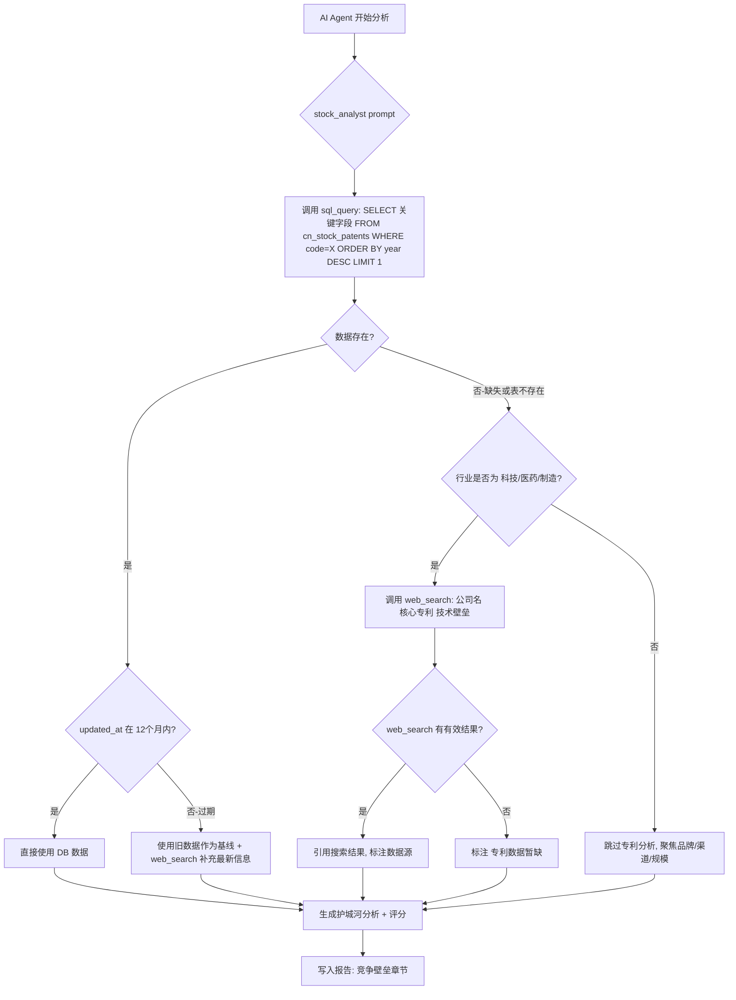

# AI 分析增强 — 专利护城河 + 多期限投资建议 + 表结构优化

> 生成时间: 2026-05-27 | 最后更新: 2026-06-01 | 状态: ✅ P1/P2/P3a/P3b/P4 核心已落地（与代码核对见 §10）
>
> 更新说明: 新增「DB优先 + web_search兜底」双源策略；Google Patents 作为备份数据源；
> 表结构增加 IPC 分类、专利含金量评估、5年申请趋势等字段
>
> 实现说明 (2026-06-01): P3b Google Patents 备份源已落地，采用 XHR JSON 接口 (懒加载
> requests，失败优雅降级，非 Playwright)。`source_detail.google_patents` 记录采集季度
> (格式 `YYYY-Qn`)。完整专利测试套件 82 passed。
>
> ⚠️ **重要：实际实现与本计划存在架构差异**。落地时采用了「两表 + 公告级原始数据」管道，
> AI 护城河分析的首选数据源是 `stock_profile.patent_info`（来自 `cn_stock_patent_info`），
> 而非本文 §六 描述的"直接查 `cn_stock_patents`"。详见文末 **§10 实现现状对照**（含尚未实现项）。
> 阅读 §1–§9 时请以 §10 为准。

---

## 一、现状分析

### 1.1 web_search 工具现状

| 项目 | 现状 |
|------|------|
| 工具位置 | `quantia/lib/ai/tools/web_search.py` |
| 搜索引擎 | 自定义代理（`QUANTIA_AI_WEB_SEARCH_URL`）或 DuckDuckGo 兜底 |
| 专利查询 | ❌ **未专门搜索专利信息** |
| 搜索策略 | 通用搜索，由 LLM 自行决定搜索关键词 |
| Prompt 指引 | 仅指示搜索"近期重大新闻/公告" |

**结论**: 当前 `web_search` 是通用工具，stock_analyst prompt 中没有引导 LLM 搜索专利/护城河信息。LLM 自行决策时也不会主动查询专利数据。

### 1.2 投资建议现状

当前 `stock_analyst.md` 第六节"综合判断与操作建议"的结构：

```markdown
#### 六、综合判断与操作建议
- **评级**: 🟢买入 / 🟡观望 / 🔴回避（一句话理由）
- **已持仓**: 建议操作
- **观望者**: 入场条件
- **短线**: 机会与风险
```

**缺失项**:
- ❌ 无中期投资建议（1-6个月维度）
- ❌ 无长期投资建议（1年以上维度）
- ❌ 无目标价位区间
- ❌ 无止损建议

### 1.3 表结构现状

**cn_stock_ai_report** (16列, 4条记录):

| 列名 | 类型 | 说明 |
|------|------|------|
| id | BIGINT PK | 自增ID |
| code | VARCHAR(10) | 股票代码 |
| name | VARCHAR(32) | 股票名称 |
| report_md | MEDIUMTEXT | Markdown 全文 |
| model | VARCHAR(64) | 使用模型 |
| provider | VARCHAR(32) | 提供商 |
| tools_used | JSON | 工具调用详情 |
| tokens_used | INT | Token 消耗 |
| latency_ms | INT | 耗时 |
| quality_score | TINYINT | 结构校验分 |
| user_feedback | TINYINT | 用户评分 |
| feedback_reason | VARCHAR(200) | 反馈原因 |
| data_cutoff_date | DATE | 数据截止日 |
| source | ENUM | 生成来源 |
| created_at | DATETIME | 创建时间 |
| share_token | VARCHAR(36) | 分享链接 |

**问题诊断**:
1. **报告为纯文本 Markdown** — 无法按维度（技术面/基本面/资金面）独立检索或对比
2. **无投资期限字段** — 前端无法按短/中/长期筛选建议
3. **无结构化评级** — 评级嵌入文本中，难以做统计或可视化
4. **无版本/更新机制** — 同一股票多次生成的报告互相独立，无法看到"观点变化"
5. **无专利/护城河结构化字段** — 即使 LLM 分析了，结果也混在 markdown 里

---

## 二、优化方案

### 2.1 方案概览

```
┌─────────────────────────────────────────────────────────────┐
│              Phase 1: Prompt 增强（0.5天）                    │
│  - stock_analyst.md 新增"竞争壁垒"分析维度                    │
│  - web_search 引导查询: "{公司名} 核心专利 技术壁垒"           │
│  - 投资建议拆分为 短/中/长 三期限                             │
├─────────────────────────────────────────────────────────────┤
│              Phase 2: 表结构优化（1天）                       │
│  - cn_stock_ai_report 新增结构化字段                         │
│  - 报告生成后解析 Markdown 提取结构化数据                     │
├─────────────────────────────────────────────────────────────┤
│              Phase 3: 专利数据系统化（3-5天，可选）            │
│  - cn_stock_patents 新表                                     │
│  - 年报解析爬虫                                              │
│  - 前端展示                                                  │
└─────────────────────────────────────────────────────────────┘
```

---

### 2.2 Phase 1: Prompt 增强 + 多期限建议

#### 2.2.1 stock_analyst.md 改动

**新增第四节半 — "竞争壁垒分析"**:

```markdown
#### 四.五、竞争壁垒（护城河）
- 核心专利/技术壁垒（**优先**从 cn_stock_patents 表获取，数据缺失或超过1年未更新时用 web_search 补充）
- 专利含金量: 发明专利占比、IPC 技术领域分布、近5年申请趋势
- 研发投入强度（来自 cn_stock_financial.rd_ratio + cn_stock_patents.rd_staff_ratio）
- 行业地位与市场份额（来自 web_search 公开信息）
- 品牌/渠道/规模优势（定性判断）
- 转换成本/网络效应（如适用）
```

**数据获取优先级（关键设计）**:

```
┌─────────────────────────────────────────────────────────────────┐
│  AI 分析护城河数据获取策略（优先级从高到低）                       │
├─────────────────────────────────────────────────────────────────┤
│  1. sql_query → cn_stock_patents (本地结构化数据, 响应 <100ms)   │
│     ├── 数据存在且 updated_at 在 12 个月内 → 直接使用            │
│     └── 数据不存在 或 updated_at > 12 个月 → 降级到 step 2      │
│                                                                 │
│  2. web_search → "{公司名} 核心专利 技术壁垒 专利数量"           │
│     ├── 有有效结果 → 引用并标注 [数据源: web_search]             │
│     └── 无结果或不可用 → 标注 "专利数据暂缺"                    │
│                                                                 │
│  ⚠️ 禁止编造专利数量！无数据时必须明确标注暂缺。                  │
└─────────────────────────────────────────────────────────────────┘
```

**改造第六节 — 多期限投资建议**:

```markdown
#### 六、综合判断与操作建议

##### 评级: 🟢买入 / 🟡观望 / 🔴回避

##### 短期（1-4周）
- 操作建议 + 入场/止损价位
- 关键催化/风险事件

##### 中期（1-6个月）
- 趋势判断 + 目标区间
- 需关注的财报/业绩节点

##### 长期（1年以上）
- 基本面评估 + 成长性
- 护城河强度评分（强/中/弱/无）
- 适合定投/长持/回避
```

**web_search 搜索策略增强**:

```markdown
4. `web_search` 使用策略（按优先级）：
   a. 搜索近期新闻: "{股票名} 最新消息 公告"
    b. 搜索专利/壁垒（仅当 cn_stock_patents 数据缺失/过期 且 行业为科技/医药/制造/新能源时）:
      - "{公司名} 核心专利 技术壁垒 专利数量 {当前年份}"
   c. 搜索分析师观点: "{股票名} 研报 目标价"（如有余量）
   每次 web_search 限 top_n=3，最多调用 2 次以节省 token。

5. `sql_query` 查询 cn_stock_patents 策略:
   - 先查 (**禁止 SELECT ***): 
     ```sql
      SELECT year, total_patents, invention_patents, invention_ratio, patent_quality_score,
                trend_5y_cagr, trend_direction, ipc_primary_desc, tech_domain,
                avg_citation_count, pct_international, rd_staff_ratio, key_tech_desc, updated_at
     FROM cn_stock_patents WHERE code='{code}' ORDER BY year DESC LIMIT 1
     ```
   - 如果返回空集或 sql_query 报错（表不存在），标记为"数据缺失"，触发 web_search
   - 如果有数据但 updated_at 超过12个月，标记为"数据过期"，用旧数据+web_search补充
   - 如果数据新鲜，直接引用: patent_quality_score, invention_ratio, trend_5y_cagr, ipc_primary_desc
```

#### 2.2.2 实现难度

| 改动 | 文件 | 难度 | 工时 |
|------|------|------|------|
| Prompt 改造 | `quantia/lib/ai/prompt/stock_analyst.md` | ★☆☆☆☆ | 1h |
| 结构验证调整 | `quantia/web/stockReportHandler.py` (quality_score) | ★★☆☆☆ | 1h |
| 前端报告展示 | 无需改动（Markdown 渲染） | - | 0 |

> ⚠️ **Token 预算注意**: 当前 stock_analyst.md prompt 约 800 tokens。新增护城河章节 + 多期限建议 + sql_query策略后预计增加 ~400 tokens。需确认总 prompt + 工具描述不超过模型上下文的 20%（留足空间给工具结果和生成）。如超出，可将部分策略说明移入 `sql_query` 工具的 description 中。
>
> ⚠️ **Agent 轮次预算**: 当前 agent max_rounds=4。新增的护城河分析路径需要: 1轮 sql_query(专利) + 可能1轮 web_search(专利) + 1轮 kline_fetch/stock_profile + 1轮写报告。如果4轮不够，需要:
> - 方案A: 将 max_rounds 提升到 5-6
> - 方案B: 让 sql_query 和 stock_profile 合并为一轮（并行调用）
> - 方案C: 仅当 sql_query 无数据时才消耗 web_search 轮次（即DB有数据时只需3轮）

---

### 2.3 Phase 2: 表结构优化

#### 2.3.1 新增字段 (ALTER TABLE)

```sql
ALTER TABLE cn_stock_ai_report
  ADD COLUMN rating ENUM('buy','hold','avoid') COMMENT '结构化评级',
  ADD COLUMN rating_score TINYINT UNSIGNED COMMENT '综合评分(0-100)',
  ADD COLUMN short_term_advice VARCHAR(500) COMMENT '短期建议摘要',
  ADD COLUMN mid_term_advice VARCHAR(500) COMMENT '中期建议摘要',
  ADD COLUMN long_term_advice VARCHAR(500) COMMENT '长期建议摘要',
  ADD COLUMN target_price_low FLOAT COMMENT '目标价下限',
  ADD COLUMN target_price_high FLOAT COMMENT '目标价上限',
  ADD COLUMN stop_loss_price FLOAT COMMENT '止损价',
  ADD COLUMN moat_score TINYINT COMMENT '护城河评分(0-5)',
  ADD COLUMN moat_factors JSON COMMENT '护城河因素{patents,brand,scale,tech,network}',
  ADD COLUMN report_version INT DEFAULT 1 COMMENT '同一股票第N版报告(INSERT时自动计算)',
  ADD COLUMN prev_report_id BIGINT COMMENT '上一版报告ID(观点变化追踪)',
  ADD INDEX idx_rating (rating, created_at DESC),
  ADD INDEX idx_moat (moat_score, created_at DESC);
```

#### 2.3.2 报告后处理逻辑

在 `stockReportHandler.py` 生成报告后，新增解析函数：

```python
def _extract_structured_fields(report_md: str) -> dict:
    """从 Markdown 报告中提取结构化字段."""
    fields = {}
    # 评级: 匹配 🟢买入/🟡观望/🔴回避
    if '🟢' in report_md: fields['rating'] = 'buy'
    elif '🔴' in report_md: fields['rating'] = 'avoid'
    else: fields['rating'] = 'hold'
    
    # 护城河评分: 匹配 "护城河强度评分（强/中/弱/无）"
    # 短/中/长期建议: 正则提取对应段落首句
    # 目标价: 匹配 "目标区间 XX-XX 元"
    ...
    return fields
```

#### 2.3.3 实现难度

| 改动 | 文件 | 难度 | 工时 |
|------|------|------|------|
| ALTER TABLE | migration script | ★☆☆☆☆ | 0.5h |
| 后处理解析 | `stockReportHandler.py` | ★★★☆☆ | 3h |
| 前端评级展示 | `indicator/index.vue` 或报告页 | ★★☆☆☆ | 2h |
| 历史对比（观点变化） | 新 handler | ★★★☆☆ | 3h |

---

### 2.4 Phase 3: 专利数据系统化

#### 2.4.1 数据源评估（双源互补策略）

| 来源 | 角色 | 优势 | 劣势 | 可行性 |
|------|------|------|------|--------|
| **巨潮年报 PDF/HTML** | 🥇 主数据源 | 权威、覆盖全A股、合法、含专利分类明细 | 需PDF解析/NLP、年度更新 | ✅ 推荐 |
| **Google Patents** | 🥈 备份+增量 | 结构化好、含IPC分类、实时性强、免费 | 无官方API、需headless browser、公司名匹配难 | ✅ 升级为备份源 |
| **CNIPA 检索** | 参考 | 最权威 | 验证码、反爬严格 | ❌ 不推荐 |
| **天眼查/企查查** | 参考 | 数据好 | 付费、API变动频繁 | ⚠️ 成本高 |
| **上交所/深交所年报** | 等价 | 直接下载 | 同巨潮 | ✅ 等价方案 |

**推荐方案**: 双源互补

```
┌─────────────────────────────────────────────────────────────────────────┐
│                    数据采集双源策略                                       │
├─────────────────────────────────────────────────────────────────────────┤
│                                                                         │
│  主源: 巨潮年报 (每年5月全量更新)                                         │
│  ├── 提供: 专利总数、分类明细、研发人员、核心技术描述                       │
│  ├── 覆盖: 全部A股 (~5000只)                                            │
│  └── 频率: 年度 (年报 4 月底前披露完毕)                                   │
│                                                                         │
│  备份: Google Patents (季度增量更新)                                      │
│  ├── 提供: IPC分类、申请趋势、专利引用次数、全球对比                       │
│  ├── 覆盖: 有专利申请的公司 (~2000只)                                    │
│  ├── 频率: 季度 (补充年报之间的增量)                                      │
│  └── 触发: 主源数据缺失 或 需要IPC/引用等年报无法提供的字段                 │
│                                                                         │
│  兜底: web_search (AI分析时实时查询)                                      │
│  ├── 触发: cn_stock_patents 无数据 或 数据超过12个月                      │
│  └── 用途: 仅作为AI报告补充引用，不写入结构化表                            │
│                                                                         │
└─────────────────────────────────────────────────────────────────────────┘
```

#### 2.4.2 新表设计（增强版）

```sql
CREATE TABLE cn_stock_patents (
    -- === 基础标识 ===
    code VARCHAR(10) NOT NULL COMMENT '股票代码',
    year INT NOT NULL COMMENT '统计年度',
    
    -- === 专利数量 ===
    invention_patents INT COMMENT '发明专利数(含金量最高)',
    utility_patents INT COMMENT '实用新型专利数',
    design_patents INT COMMENT '外观设计专利数',
    total_patents INT COMMENT '专利总数',
    new_patents_year INT COMMENT '当年新增专利',
    patent_yoy FLOAT COMMENT '专利同比增长率(%)',
    
    -- === 专利含金量指标 ===
    invention_ratio FLOAT COMMENT '发明专利占比(%) = invention/total*100',
    patent_quality_score TINYINT UNSIGNED COMMENT '专利含金量评分(0-100), 综合计算',
    avg_citation_count FLOAT COMMENT '平均被引用次数(来自Google Patents)',
    pct_international INT COMMENT 'PCT国际专利数量',
    core_patents INT COMMENT '核心专利数(高被引+有效期内)',
    patent_maintenance_rate FLOAT COMMENT '专利维持率(%) = 有效专利/历史总授权',
    
    -- === IPC 技术分类 ===
    ipc_primary VARCHAR(20) COMMENT '主IPC分类号(如H04L, G06F)',
    ipc_primary_desc VARCHAR(100) COMMENT '主IPC中文描述(如"电通信技术")',
    ipc_distribution JSON COMMENT 'IPC分布 {"H04L":45, "G06F":30, "H04W":15}',
    tech_domain VARCHAR(50) COMMENT '技术领域归类(通信/AI/新能源/生物医药/...)',
    
    -- === 5年申请趋势 ===
    trend_5y JSON COMMENT '近5年申请数 [{"year":2022,"count":45},{"year":2023,"count":52}...]',
    trend_5y_cagr FLOAT COMMENT '5年专利申请复合增长率(%)',
    trend_direction ENUM('accelerating','stable','decelerating','declining') 
        COMMENT '趋势方向: 加速增长/稳定/减速/下滑',
    
    -- === 研发团队 ===
    rd_staff_count INT COMMENT '研发人员数量',
    rd_staff_ratio FLOAT COMMENT '研发人员占比(%)',
    
    -- === 描述性字段 ===
    key_tech_desc TEXT COMMENT '核心技术描述(年报原文摘要, ≤500字)',
    competitive_position VARCHAR(200) COMMENT '行业专利排名描述(如"行业前3")',
    
    -- === 元数据 ===
    data_source ENUM('annual_report','google_patents','mixed') DEFAULT 'annual_report'
        COMMENT '数据来源: 年报/Google Patents/混合',
    source_detail JSON COMMENT '来源明细 {"annual_report":"2025年报","google_patents":"2026-Q1"}',
    confidence_score TINYINT UNSIGNED DEFAULT 80 COMMENT '数据可信度(0-100): 年报=95, Google=80, 混合=85',
    created_at DATETIME DEFAULT CURRENT_TIMESTAMP COMMENT '首次入库时间',
    updated_at DATETIME DEFAULT CURRENT_TIMESTAMP ON UPDATE CURRENT_TIMESTAMP,
    
    PRIMARY KEY (code, year),
    INDEX idx_total (total_patents DESC),
    INDEX idx_quality (patent_quality_score DESC),
    INDEX idx_invention_ratio (invention_ratio DESC),
    INDEX idx_trend (trend_5y_cagr DESC),
    INDEX idx_ipc (ipc_primary, year),
    INDEX idx_tech_domain (tech_domain, total_patents DESC),
    INDEX idx_updated (updated_at)
) ENGINE=InnoDB DEFAULT CHARSET=utf8mb4 COMMENT='上市公司专利数据(护城河量化)';
```

#### 2.4.3 专利含金量评分算法

```python
def calculate_patent_quality_score(row: dict) -> int:
    """综合评估专利含金量 (0-100分).
    
    维度权重:
    - 发明专利占比 (30%): 发明专利技术门槛最高
    - 专利数量规模 (20%): 绝对数量代表研发投入
    - 5年增长趋势 (20%): 持续创新能力
    - 被引用次数 (15%): 技术影响力
    - PCT国际专利 (10%): 全球竞争力
    - 专利维持率 (5%): 专利实际价值
    """
    score = 0
    
    # 1. 发明专利占比 (30分)
    inv_ratio = row.get('invention_ratio', 0) or 0
    if inv_ratio >= 80: score += 30
    elif inv_ratio >= 60: score += 25
    elif inv_ratio >= 40: score += 18
    elif inv_ratio >= 20: score += 10
    else: score += 5
    
    # 2. 专利数量 (20分) — 按行业分位数
    total = row.get('total_patents', 0) or 0
    if total >= 500: score += 20
    elif total >= 200: score += 16
    elif total >= 100: score += 12
    elif total >= 30: score += 8
    else: score += 3
    
    # 3. 5年CAGR (20分)
    cagr = row.get('trend_5y_cagr', 0) or 0
    if cagr >= 30: score += 20
    elif cagr >= 15: score += 16
    elif cagr >= 5: score += 12
    elif cagr >= 0: score += 8
    else: score += 3  # 负增长
    
    # 4. 被引用次数 (15分)
    citations = row.get('avg_citation_count', 0) or 0
    if citations >= 10: score += 15
    elif citations >= 5: score += 12
    elif citations >= 2: score += 8
    elif citations > 0: score += 4
    
    # 5. PCT国际专利 (10分)
    pct = row.get('pct_international', 0) or 0
    if pct >= 20: score += 10
    elif pct >= 5: score += 7
    elif pct > 0: score += 4
    
    # 6. 维持率 (5分)
    maint = row.get('patent_maintenance_rate', 0) or 0
    if maint >= 80: score += 5
    elif maint >= 60: score += 3
    elif maint >= 40: score += 1
    
    return min(score, 100)
```

#### 2.4.4 IPC 分类说明

**IPC (International Patent Classification)** 是世界知识产权组织(WIPO)制定的专利技术分类体系：

| IPC 大类 | 技术领域 | A股典型行业 | 示例公司 |
|----------|----------|-------------|----------|
| A | 人类生活必需品 | 医药/食品/农业 | 恒瑞医药、贵州茅台 |
| B | 作业/运输 | 机械/汽车/物流 | 三一重工、比亚迪 |
| C | 化学/冶金 | 化工/材料/新能源 | 万华化学、宁德时代 |
| D | 纺织/造纸 | 纺织/包装/印刷 | 海天味业(包装)、晨鸣纸业 |
| E | 固定建筑物 | 建筑/建材/房屋 | 中国建筑、东方雨虹 |
| F | 机械工程/照明/加热 | 家电/光伏/暖通 | 格力电器、隆基绿能 |
| G | 物理/仪器 | AI/光学/半导体 | 海康威视、中芯国际 |
| H | 电学 | 通信/电子/芯片 | 华为(未上市)、中兴通讯 |

**为什么 IPC 分类有价值？**
- 判断公司技术布局方向（是否与主营匹配）
- 识别跨界创新（如汽车公司申请 AI 专利）
- 行业对标（同 IPC 分类下的专利密度对比）
- 识别技术转型信号（IPC 分布年度变化）

#### 2.4.5 采集任务设计（双源架构）

```
 quantia/core/crawling/
 ├── cninfo_annual_report.py        ← 主源: 巨潮年报
 │   ├── download_annual_report(code, year) → HTML/PDF path
 │   ├── parse_patent_section(content) → {invention, utility, design, total, new, staff...}
 │   └── parse_ipc_from_report(content) → {ipc_primary, ipc_distribution}  (部分年报含)
 │
 └── google_patents_crawler.py      ← 备份源: Google Patents
     ├── search_patents(assignee, country='CN') → patent_list
     ├── extract_ipc_distribution(patent_list) → {ipc: count}
     ├── extract_citation_stats(patent_list) → {avg_citations, max_citations}
     ├── extract_yearly_trend(patent_list, years=5) → [{year, count}]
     └── calculate_pct_count(patent_list) → int

 quantia/job/fetch_patent_data.py
 └── main():
       1. 获取所有股票列表 + 公司全称映射 (cn_stock_spot.name)
       2. 主源采集: 巨潮年报解析 (全量, 5月跑)
       3. 备份源采集: Google Patents 增量 (季度跑, 补充 IPC/引用/趋势)
       4. 合并去重 + 计算衍生指标 (invention_ratio, quality_score, trend_5y_cagr)
       5. 写入 cn_stock_patents (upsert by code+year)

 cron/
 ├── cron.monthly/run_patents_annual     ← 5月: 全量年报解析
 └── cron.monthly/run_patents_quarterly  ← 每季度: Google Patents 增量
```

#### 2.4.6 Google Patents 采集方案详细设计

**搜索接口**: `https://patents.google.com/?assignee={公司名}&country=CN&language=CHINESE`

**公司名匹配策略**:
```python
def get_patent_search_names(code: str) -> list[str]:
    """获取用于 Google Patents 搜索的公司名变体.
    
    问题: 上市公司简称 ≠ 专利申请人全称
    例如: '宁德时代' 的专利申请人是 '宁德时代新能源科技股份有限公司'
    """
    # 1. 从 cn_stock_spot 获取简称
    short_name = get_stock_name(code)  # e.g. '宁德时代'
    
    # 2. 从巨潮/天眼查获取全称 (可缓存)
    full_name = get_company_full_name(code)  # e.g. '宁德时代新能源科技股份有限公司'
    
    # 3. 子公司名 (可选, 大公司专利可能在子公司名下)
    subsidiaries = get_major_subsidiaries(code)  # 年报披露的主要子公司
    
    return [full_name, short_name] + subsidiaries[:3]
```

**采集字段映射**:

| Google Patents 页面元素 | → cn_stock_patents 字段 |
|------------------------|------------------------|
| 搜索结果总数 | total_patents (校验用) |
| 专利类型 filter (invention/utility/design) | invention_patents, utility_patents, design_patents |
| IPC Classification 标签 | ipc_primary, ipc_distribution |
| "Cited by" 计数 | avg_citation_count |
| 申请日期 year 分组 | trend_5y |
| PCT 标记 | pct_international |
| 法律状态 (Active/Expired) | patent_maintenance_rate |

**反爬对策**:
```python
GOOGLE_PATENTS_CONFIG = {
    'request_interval': 5,          # 秒, 两次请求间隔
    'max_per_hour': 100,            # 每小时最大请求数
    'use_headless': True,           # Playwright headless Chrome
    'proxy_pool': True,             # 启用代理池 (当单IP被限时)
    'cache_days': 90,               # 结果缓存90天
    'retry_on_429': 3,              # 429 重试次数
    'backoff_factor': 2.0,          # 指数退避
}
```

#### 2.4.7 年报专利段落示例

典型年报"研发投入"章节格式：

```
截至报告期末，公司累计获得专利 286 项，其中发明专利 158 项，
实用新型专利 98 项，外观设计专利 30 项。报告期内新增专利 42 项。
公司研发人员共 1,235 人，占员工总数的 28.6%。

公司核心技术及其先进性:
公司在5G通信、物联网及人工智能领域拥有多项核心专利技术...
主要IPC分类: H04L(数据交换网络), H04W(无线通信网络), G06F(电数据处理)
```

正则提取模式：
```python
# 基础数量提取
patterns_count = [
    r'累计.*?专利\s*(\d+)\s*项',
    r'发明专利\s*(\d+)\s*项',
    r'实用新型.*?(\d+)\s*项',
    r'外观设计.*?(\d+)\s*项',
    r'新增专利\s*(\d+)\s*项',
    r'研发人员.*?([\d,]+)\s*人',
    r'占.*?总数.*?([\d.]+)\s*%',
]

# IPC 分类提取 (部分年报有)
patterns_ipc = [
    r'IPC\s*分类[：:](.*?)(?:\n|。)',
    r'([A-H]\d{2}[A-Z])',  # 标准 IPC 格式
]

# PCT 国际专利
patterns_pct = [
    r'PCT.*?(\d+)\s*[项件]',
    r'国际专利.*?(\d+)\s*[项件]',
]
```

#### 2.4.8 5年趋势计算

```python
def calculate_trend_metrics(trend_data: list[dict]) -> dict:
    """从5年数据计算趋势指标.
    
    Args:
        trend_data: [{"year": 2021, "count": 30}, {"year": 2022, "count": 45}, ...]
                    ☁️ 不要求输入已排序，函数内部保证排序
    
    Returns:
        {
            "trend_5y_cagr": 15.2,       # 复合年增长率
            "trend_direction": "accelerating",  # 趋势方向
            "trend_5y": [...],            # 原始数据(已排序)
        }
    """
    if len(trend_data) < 2:
        return {'trend_5y_cagr': None, 'trend_direction': None, 'trend_5y': trend_data}
    
    # ❗ 关键: 必须按 year 升序排列, 保证 first=最早, last=最晚
    trend_data = sorted(trend_data, key=lambda x: x['year'])
    
    # 过滤异常值: count 必须 >= 0
    trend_data = [d for d in trend_data if d.get('count', 0) >= 0]
    if len(trend_data) < 2:
        return {'trend_5y_cagr': None, 'trend_direction': None, 'trend_5y': trend_data}
    
    # CAGR = (末期/初期)^(1/年数) - 1
    first, last = trend_data[0]['count'], trend_data[-1]['count']
    years = trend_data[-1]['year'] - trend_data[0]['year']
    if first > 0 and years > 0:
        cagr = ((last / first) ** (1 / years) - 1) * 100
    elif first == 0 and last > 0:
        cagr = 100.0  # 从0到有, 记为100%增长
    else:
        cagr = 0
    
    # 趋势方向: 比较前半段增速 vs 后半段增速
    mid = len(trend_data) // 2
    first_half_growth = (trend_data[mid]['count'] - trend_data[0]['count']) / max(trend_data[0]['count'], 1)
    second_half_growth = (trend_data[-1]['count'] - trend_data[mid]['count']) / max(trend_data[mid]['count'], 1)
    
    if second_half_growth > first_half_growth * 1.2:
        direction = 'accelerating'
    elif second_half_growth > first_half_growth * 0.8:
        direction = 'stable'
    elif second_half_growth > 0:
        direction = 'decelerating'
    else:
        direction = 'declining'
    
    return {
        'trend_5y_cagr': round(cagr, 2),
        'trend_direction': direction,
        'trend_5y': trend_data,
    }
```

#### 2.4.9 实现难度（更新）

| 模块 | 难度 | 工时 | 依赖 |
|------|------|------|------|
| 巨潮年报下载 | ★★★☆☆ | 1天 | 无 |
| PDF/HTML 解析 + 正则 | ★★★★☆ | 2天 | pdfplumber/BeautifulSoup |
| Google Patents 爬虫 | ★★★★☆ | 2天 | Playwright + 代理池 |
| IPC 分类解析 + 映射表 | ★★☆☆☆ | 0.5天 | WIPO IPC 对照表 |
| 含金量评分算法 | ★★☆☆☆ | 0.5天 | 无 |
| 5年趋势计算 | ★★☆☆☆ | 0.5天 | 无 |
| 数据合并入库 | ★★★☆☆ | 1天 | 双源去重逻辑 |
| AI Prompt 集成 | ★★☆☆☆ | 0.5天 | Phase 1 |
| 前端展示 | ★★★☆☆ | 1.5天 | Phase 2 |
| **合计** | | **~9.5天** | |

---

## 三、开发计划

### 3.1 里程碑

| 阶段 | 内容 | 优先级 | 依赖 | 预估 |
|------|------|--------|------|------|
| **P1** | Prompt 增强: 护城河维度 + DB优先/web_search兜底策略 + 多期限建议 | 🔴 高 | 无 | 0.5天 |
| **P2** | 表结构优化: cn_stock_ai_report 结构化字段 + 后处理解析 | 🟡 中 | P1 | 1.5天 |
| **P3a** | 专利数据-主源: 巨潮年报采集 + cn_stock_patents 建表 + 含金量评分 | 🟡 中 | P1† | 5天 |
| **P3b** | 专利数据-备份: Google Patents 爬虫 + IPC分类 + 引用/趋势 | 🟢 低 | P3a | 3天 |
| **P4** | 前端集成: 护城河评分+IPC分布+趋势图+评级面板 | 🟢 低 | P3a | 2.5天 |

> † **依赖说明**: P3a 仅依赖 P1（Prompt 需要知道如何查询该表），与 P2（cn_stock_ai_report 表优化）无关。P2 和 P3a 可并行开发。
>
> ⚠️ **报告长度调整**: 当前 prompt 规定 800-1500 字。新增护城河章节(~200字) + 三期限建议(~200字) + 免责声明(~50字) 后，应将上限调整为 **1000-2000 字**。否则 LLM 会被迫截断护城河或长期建议段落。

### 3.2 Phase 1 详细任务

```
[x] 1.1 修改 stock_analyst.md
    - 新增"四.五、竞争壁垒（护城河）"章节
    - 改造"六、综合判断"为三期限结构
    - web_search 策略增加专利/壁垒查询指引
    - 约束: 科技/医药/制造/新能源行业才查专利

[x] 1.2 更新结构验证逻辑
    - stockReportHandler._validate_report_structure() 
    - 新增对"短期/中期/长期"段落的检测
    - quality_score 评分标准调整

[x] 1.3 验证
    - 生成 3 只不同行业股票的报告
    - 确认专利查询仅在科技股触发
    - 确认三期限建议格式正确
```

### 3.3 Phase 2 详细任务

```
[x] 2.1 数据库迁移
    - ALTER TABLE cn_stock_ai_report 新增 10 个字段
    - 新增 2 个索引

[x] 2.2 后处理模块
    - 新增 quantia/lib/ai/report_parser.py
    - _extract_rating(md) → 'buy'|'hold'|'avoid'
    - _extract_advices(md) → {short, mid, long}
    - _extract_moat(md) → {score, factors}
    - _extract_prices(md) → {target_low, target_high, stop_loss}

[x] 2.3 Handler 集成
    - stockReportHandler 生成报告后调用 report_parser
    - 将结构化字段写入数据库
    - report_version 递增逻辑 (需原子操作防并发):
        SELECT id, report_version FROM cn_stock_ai_report 
        WHERE code=X ORDER BY created_at DESC LIMIT 1 FOR UPDATE
        新版本 = 上一版本.report_version + 1
        prev_report_id = 上一版本.id
    - history API 返回新字段供前端筛选

[x] 2.4 前端（可选）
    - 报告列表页显示评级标签
    - 报告详情页显示护城河评分条
    - 历史对比: 观点变化时间线
```

### 3.4 Phase 3a 详细任务（主源: 巨潮年报）

```
[x] 3a.1 巨潮年报下载模块
    - quantia/core/crawling/cninfo_crawler.py
    - 接口: GET http://www.cninfo.com.cn/new/disclosure/stock
    - 参数: stock=000001&category=category_ndbg_szsh
    - 返回 HTML 格式年报链接
    - 缓存策略: 已下载年报保存到 cache/annual_reports/{code}_{year}.html

[x] 3a.2 年报解析模块
    - quantia/core/crawling/annual_report_parser.py
    - HTML 年报: BeautifulSoup 定位"研发投入"章节
    - PDF 年报: pdfplumber 按页提取 + 关键词定位
    - 正则提取: 专利数字 + IPC分类(如有) + 研发人员
    - LLM 兜底: 格式异常时用 LLM 提取（限制调用频率）

[x] 3a.3 含金量评分 + 趋势计算
    - quantia/core/patent_analytics.py
    - calculate_patent_quality_score() → 0-100
    - calculate_trend_metrics() → cagr + direction
    - calculate_invention_ratio() → %

[x] 3a.4 数据入库
    - quantia/job/fetch_patent_data.py --source=annual_report
    - 遍历所有股票, 下载最近5年年报
    - 解析并写入 cn_stock_patents (confidence_score=95)
    - 加入 cron.monthly (5月执行)

[x] 3a.5 AI 集成
    - sql_query 白名单新增 cn_stock_patents 表 + 完整列名
    - stock_analyst prompt: 优先查 cn_stock_patents，无数据时 web_search
    - 护城河评分映射:
        patent_quality_score >= 80 → 强
        patent_quality_score >= 50 → 中
        patent_quality_score >= 20 → 弱
        patent_quality_score < 20 或无数据 → 无/暂缺
```

### 3.5 Phase 3b 详细任务（备份: Google Patents）

```
[x] 3b.1 Google Patents 爬虫
    - quantia/core/crawling/google_patents_crawler.py
    - 实现采用 Google Patents XHR JSON 接口 (懒加载 requests), 比 Playwright 更轻量且可离线单测; Playwright 仅作可选增强(未启用)
    - 公司名匹配: 简称 + 全称后缀候选 (get_company_names)
    - 解析: 专利列表、IPC标签、引用数、申请日 (normalize_patent/_parse_xhr_results)
    - 反爬: 5s间隔 + 90天本地缓存; 任何失败优雅返回 [] (仅依赖年报)

[x] 3b.2 IPC 分类映射
    - quantia/core/patent_ipc_mapping.py
    - WIPO IPC 大类→中文对照表 (A-H 8部 + ~50 高频大类)
    - ipc_code → tech_domain 归类逻辑 (parse_ipc_code/ipc_to_tech_domain)
    - IPC 分布 JSON 生成 (build_ipc_distribution/primary_ipc)

[x] 3b.3 增量合并
    - quantia/job/fetch_patent_data.py --source=google_patents
    - 仅更新: avg_citation_count, pct_international, ipc_*, trend_5y
    - 不覆盖年报已有的 total_patents 等（年报更权威）
    - data_source 标记为 'mixed'，source_detail 记录来源
    - confidence_score: 纯Google=80, 混合=85

[x] 3b.4 季度 Cron
    - cron/cron.monthly/run_patents_quarterly (季度首月 1/4/7/10 执行)
    - 调用 fetch_patent_data --source google_patents 补充 IPC/引用/趋势/PCT
```

### 3.6 Phase 4 前端展示任务

```
[x] 4.1 指标详情页新增"知识产权"卡片
    - 显示: 发明/实用/外观专利数, 含金量评分(进度条), 发明占比
    - 显示: IPC 主分类 + 技术领域标签
    - 显示: 5年趋势方向图标 (↑加速 →稳定 ↓减速)

[x] 4.2 ECharts 图表
    - 柱状图: 近5年专利申请数 (分发明/实用/外观)
    - 折线图: 含金量评分趋势
    - 饼图: IPC 技术分布

[x] 4.3 AI 报告页评级展示
    - 报告列表: 评级标签 (🟢/🟡/🔴) + 护城河评分条
    - 报告详情: 短/中/长期建议高亮卡片
    - 历史对比: 观点变化时间线
```

---

## 四、风险与注意事项

### 4.1 技术风险

| 风险 | 影响 | 缓解措施 |
|------|------|----------|
| 巨潮反爬 | 年报下载受限 | 降频(3s) + 代理池 + 本地缓存已下载文件 |
| PDF格式不统一 | 解析准确率低 | 正则兜底 + LLM 提取(少量) + 人工抽检10% |
| Google Patents 限流 | IP被封/429 | 5s间隔 + 代理池 + 90天结果缓存 |
| Google Patents 公司名匹配 | 匹配不到/匹配错误 | 全称+简称+子公司多次搜索; 结果数异常时标记人工审核 |
| web_search 作为兜底时质量不稳定 | 搜索结果可能不含专利信息 | 仅作为引用补充，不写入结构化表 |
| LLM 幻觉 | 编造专利数据 | Prompt 强制: 有DB数据引用DB，无数据标注"暂缺"，禁止推测 |
| IPC 分类不完整 | 年报不一定披露 | Google Patents 补充; 缺失时标注 null |
| 5年趋势数据不足 | 新上市公司(<5年) | 有几年算几年，trend_5y_cagr 可为 null |

### 4.2 合规风险

| 风险 | 处置 |
|------|------|
| 年报数据使用 | ✅ 上市公司年报为法定公开信息，可自由使用 |
| 巨潮爬取 | ⚠️ 遵守 robots.txt，单IP限流，标注数据来源 |
| 投资建议合规 | ⚠️ 报告末尾必须加免责声明（见下方模板） |

**免责声明模板**（写入 stock_analyst.md 输出规范）:
```markdown
> ⚠️ 免责声明: 以上分析基于公开数据和模型计算，仅供参考，不构成任何投资建议。股市有风险，投资须谨慎。
```

### 4.3 投入产出评估

| 方案 | 投入 | 产出 | ROI |
|------|------|------|-----|
| Phase 1 (Prompt) | 0.5天 | AI报告质量大幅提升，覆盖护城河 + 多期限; DB优先策略就绪 | ⭐⭐⭐⭐⭐ |
| Phase 2 (表优化) | 1.5天 | 报告可检索/可对比/可统计 | ⭐⭐⭐⭐ |
| Phase 3a (专利-主源) | 5天 | 年报采集 + 含金量评分 + 趋势计算; AI分析有结构化数据可用 | ⭐⭐⭐⭐ |
| Phase 3b (专利-备份) | 3天 | Google Patents IPC/引用/国际专利; 数据维度更全面 | ⭐⭐⭐ |
| Phase 4 (前端) | 2.5天 | 可视化展示护城河 + 评级面板 | ⭐⭐⭐ |

---

## 五、建议优先级

1. **立即执行 Phase 1** — 改 Prompt 即可让 AI 报告覆盖护城河分析和多期限建议；同时预埋 DB 优先查询逻辑（cn_stock_patents 表就绪后自动生效）
2. **Phase 2 紧接** — 结构化字段对前端展示和数据统计价值高
3. **Phase 3a 作为核心数据建设** — 有了结构化专利数据后 AI 分析质量会质变（从"网上搜搜"→"本地精确数据"）
4. **Phase 3b 按需** — Google Patents 对科技股深度分析有增量价值（IPC、引用、国际专利）
5. **Phase 4 最后** — 前端展示依赖数据就绪

---

## 六、AI 分析数据获取流程（核心设计）

### 6.1 完整数据获取流程图



> ⚠️ **过渡期处理**: Phase 1 实施后、Phase 3a 完成前，`cn_stock_patents` 表尚不存在。
> `sql_query` 工具会通过 INFORMATION_SCHEMA 校验发现表不存在，返回错误。
> Prompt 中必须明确写: “如果 sql_query 返回错误（表不存在），视为数据缺失，直接走 web_search 分支”。

### 6.2 Prompt 中的具体指令

```markdown
## 竞争壁垒数据获取规则（严格遵循）

1. **第一步**: 用 `sql_query` 查询 cn_stock_patents:
   ```sql
    SELECT year, total_patents, invention_patents, invention_ratio,
          patent_quality_score, trend_5y_cagr, trend_direction,
          ipc_primary_desc, tech_domain, pct_international,
             avg_citation_count, rd_staff_ratio, key_tech_desc, updated_at
   FROM cn_stock_patents 
   WHERE code = '{code}' 
   ORDER BY year DESC LIMIT 1
   ```

2. **如果有数据**: 直接使用，重点引用:
   - patent_quality_score → 含金量评分
   - invention_ratio → 发明专利占比
   - trend_5y_cagr + trend_direction → 创新趋势
   - ipc_primary_desc → 技术方向
   - 标注: [数据源: cn_stock_patents]

3. **如果无数据或数据过期**: 且行业为科技/医药/制造:
   - 调用 web_search("{公司名} 核心专利 技术壁垒 专利数量 {年份}")
   - 仅引用搜索结果中明确数字，标注: [数据源: web_search]

4. **绝对禁止**: 编造专利数量、编造IPC分类、编造增长率
```

### 6.3 数据新鲜度判定逻辑

| 数据状态 | 判定条件 | AI Agent 行为 |
|----------|----------|---------------|
| 新鲜 | `updated_at` 在 12 个月内 | 直接使用，不调 web_search |
| 过期 | `updated_at` 超过 12 个月 | 使用 DB 旧数据作为基线 + web_search 补充最新信息 |
| 缺失 | cn_stock_patents 无该 code 记录 | 仅用 web_search（如适用行业） |
| 表不存在 | sql_query 返回错误（P3a未实施前） | 视为缺失，直接走 web_search |
| 不适用 | 行业为金融/房地产/公用事业等 | 跳过专利维度，聚焦其他护城河 |

---

## 七、快速验证（Phase 1 前置）

在不改任何代码的情况下，可以先手动测试 AI 是否能通过 web_search 获取专利信息：

```
用户问: "分析 000100 TCL科技，特别关注其技术壁垒和核心专利情况"
```

如果 LLM 自行调用 `web_search("TCL科技 核心专利 技术壁垒")`并返回有效结果，说明 Phase 1 的核心假设成立 — Prompt 引导即可。

如果 DuckDuckGo 对中文专利查询结果较差，则需考虑：
- 搜索 query 混合中英文: `"TCL Technology patents 专利"`
- 加速推进 Phase 3a（巨潮年报路线），让 DB 有数据后不再依赖 web_search

---

## 八、附录: cn_stock_patents 字段决策矩阵

| 字段 | 来源 | 必要性 | 决策理由 |
|------|------|--------|----------|
| invention_patents | 年报 | 必须 | 发明专利是技术含金量核心指标 |
| utility_patents | 年报 | 必须 | 区分实用新型(含金量较低) |
| design_patents | 年报 | 建议 | 完整分类，计算占比 |
| total_patents | 年报+Google | 必须 | 基础指标 |
| invention_ratio | 计算 | 必须 | 含金量核心指标 = invention/total |
| patent_quality_score | 计算 | 必须 | 综合评分，AI直接引用 |
| avg_citation_count | Google Patents | 建议 | 被引用次数=技术影响力 |
| pct_international | Google Patents | 建议 | 国际竞争力标志 |
| core_patents | 计算/年报 | 可选 | 高被引+有效期内，难精确计算 |
| patent_maintenance_rate | Google Patents | 可选 | 维持率反映专利实际价值 |
| ipc_primary | Google Patents | 建议 | 判断技术方向是否匹配主营 |
| ipc_distribution | Google Patents | 建议 | 技术布局广度 |
| tech_domain | 映射 | 必须 | 让AI可按领域对标 |
| trend_5y | Google+年报 | 必须 | 创新能力趋势 |
| trend_5y_cagr | 计算 | 必须 | 量化增长速度 |
| trend_direction | 计算 | 必须 | 定性判断趋势方向 |
| rd_staff_count/ratio | 年报 | 必须 | 研发投入另一维度 |
| key_tech_desc | 年报 | 建议 | AI生成报告时可直接引用 |
| confidence_score | 系统 | 必须 | 让AI标注数据可信度 |

---

## 九、审查问题与补充设计

### 9.1 发现的潜在问题与修正

| # | 问题 | 影响 | 修正方案 |
|---|------|------|----------|
| 1 | **Phase 依赖错误**: P3a 原依赖 P2，但实际上两张表完全独立 | 不必要的串行等待 | P3a 仅依赖 P1，与 P2 可并行（已修正） |
| 2 | **过渡期空表**: P1 实施后 prompt 让 LLM 查 cn_stock_patents，但 P3a 未完成前表不存在 | sql_query 报错，LLM 困惑 | Prompt 明确: “sql_query报错视为无数据，走web_search”（已修正） |
| 3 | **趋势计算排序假设**: 代码假设 trend_data 已按年份排序，但未校验 | CAGR 计算错误 | 函数内部强制 sorted + 过滤异常值（已修正） |
| 4 | **过期数据处理逻辑缺失**: 原流程图中过期数据直接弹到web_search，丢弃了DB旧数据 | 明明有可用基线数据却不用 | 新增"旧数据作为基线"节点（已修正） |
| 5 | **Google Patents 法律风险未充分评估** | 可能违反 ToS | 见 9.2 补充 |
| 6 | **双源数据冲突未定义**: 年报说200专利，Google搜到350 | 前端展示矛盾 | 见 9.3 双源冲突解决 |
| 7 | **缺少前端 API 设计** | Phase 4 无接口参考 | 见 9.4 补充 |
| 8 | **数据校验缺失**: 解析结果无合理性检查 | 异常数据入库 | 见 9.5 校验规则 |
| 9 | **存储和性能未评估** | 25000份年报存储压力 | 觉 9.6 容量估算 |
| 10 | **含金量评分无行业差异化** | 生物医药50专利“强” vs 电子50专利“弱” | 觉 9.7 行业校准 |

### 9.2 Google Patents 法律合规补充

| 风险点 | 说明 | 缓解措施 |
|----------|------|----------|
| ToS 违规 | Google 服务条款禁止自动化抓取 | 1) 低频调用 (5s间隔); 2) 定位为"研究用途"; 3) 不存储原始专利全文，仅统计数据 |
| IP 封禁 | 超过阈值后被封 | 代理池 + 90天缓存 + 降级策略(封禁后跳过，不阻塞其他股票) |
| 替代方案 | 如果 Google 完全不可用 | **降级策略**: 仅依赖年报数据 + web_search。IPC/引用字段为 null，不影响核心流程 |
| 建议 | 长期方案 | 监控 Google 的 Lens API (lens.org) — 正规开放专利数据，有免费 tier，未来可替代爬虫 |

### 9.3 双源数据冲突解决策略

年报和 Google Patents 的专利数可能不一致（原因：统计口径不同、子公司范围、授权vs申请、时间截点）：

```python
# 双源合并规则
def merge_patent_data(annual_report: dict | None, google_data: dict | None) -> dict:
    """年报数据优先级更高（官方披露），Google 仅补充年报缺失的字段."""
    if not annual_report and not google_data:
        return {'data_source': None, 'confidence_score': 0}
    annual_report = annual_report or {}
    google_data = google_data or {}
    merged = {}
    
    # === 数量类: 年报优先 ===
    for field in ['total_patents', 'invention_patents', 'utility_patents', 
                  'design_patents', 'new_patents_year', 'rd_staff_count', 'rd_staff_ratio']:
        merged[field] = annual_report.get(field) or google_data.get(field)
    
    # === Google 独有字段: 直接用 Google ===
    for field in ['avg_citation_count', 'pct_international', 'patent_maintenance_rate']:
        merged[field] = google_data.get(field)
    
    # === IPC: 年报有则用年报, 否则 Google ===
    merged['ipc_primary'] = annual_report.get('ipc_primary') or google_data.get('ipc_primary')
    merged['ipc_distribution'] = annual_report.get('ipc_distribution') or google_data.get('ipc_distribution')
    
    # === 趋势: 优先用 Google (更精确的年度统计) ===
    merged['trend_5y'] = google_data.get('trend_5y') or annual_report.get('trend_5y')
    
    # === 冲突检测: 年报 vs Google 总数差异超过 50% 时标记审核 ===
    ar_total = annual_report.get('total_patents', 0) or 0
    gp_total = google_data.get('total_patents', 0) or 0
    if ar_total > 0 and gp_total > 0:
        diff_ratio = abs(ar_total - gp_total) / max(ar_total, gp_total)
        if diff_ratio > 0.5:
            merged['_conflict_flag'] = True  # 标记人工审核
            merged['_conflict_detail'] = f'年报={ar_total}, Google={gp_total}, 差异={diff_ratio:.0%}'
    
    # === 可信度计算 ===
    if annual_report and google_data:
        merged['data_source'] = 'mixed'
        merged['confidence_score'] = 85
    elif annual_report:
        merged['data_source'] = 'annual_report'
        merged['confidence_score'] = 95
    else:
        merged['data_source'] = 'google_patents'
        merged['confidence_score'] = 80
    
    return merged
```

### 9.4 前端 API 设计补充

| 接口 | 方法 | 路由 | 说明 |
|------|------|------|------|
| 专利概览 | GET | `/quantia/api/stock/patents?code=XXX` | 返回最新年度数据 + 5年趋势 |
| 专利历史 | GET | `/quantia/api/stock/patents/history?code=XXX&years=5` | 返回多年数据列表 |
| 行业对标 | GET | `/quantia/api/stock/patents/compare?code=XXX` | 同行业专利排名 |

响应示例 (`/quantia/api/stock/patents?code=300560`):
```json
{
  "code": "300560",
  "latest_year": 2025,
  "data": {
    "total_patents": 286,
    "invention_patents": 158,
    "invention_ratio": 55.2,
    "patent_quality_score": 72,
    "trend_5y_cagr": 18.5,
    "trend_direction": "accelerating",
    "ipc_primary": "H04L",
    "ipc_primary_desc": "数据交换网络",
    "tech_domain": "通信",
    "rd_staff_ratio": 28.6,
    "confidence_score": 95
  },
  "trend": [
    {"year": 2021, "count": 30, "invention": 18},
    {"year": 2022, "count": 45, "invention": 28},
    {"year": 2023, "count": 52, "invention": 33},
    {"year": 2024, "count": 58, "invention": 37},
    {"year": 2025, "count": 42, "invention": 27}
  ],
  "ipc_distribution": {"H04L": 45, "G06F": 30, "H04W": 15, "其他": 10}
}
```

Handler 位置: `quantia/web/stockPatentHandler.py`

### 9.5 数据校验规则

解析结果写入 DB 前必须通过以下校验:

```python
def validate_patent_data(data: dict) -> tuple[bool, str]:
    """校验专利数据合理性, 返回 (is_valid, reason)."""
    
    # 1. 数量非负
    for field in ['total_patents', 'invention_patents', 'utility_patents', 'design_patents']:
        if data.get(field) is not None and data[field] < 0:
            return False, f'{field} 不能为负数: {data[field]}'
    
    # 2. 分项之和 ≤ 总数 (允许10%误差, 因专利分类可能重叠或有其他类型)
    inv = data.get('invention_patents', 0) or 0
    util = data.get('utility_patents', 0) or 0
    des = data.get('design_patents', 0) or 0
    total = data.get('total_patents', 0) or 0
    if total > 0 and (inv + util + des) > total * 1.1:
        return False, f'分项之和({inv}+{util}+{des}={inv+util+des}) 超过总数({total})的110%'
    
    # 3. 专利总数不超过 50000 (全A股没有超过此数的公司)
    if total > 50000:
        return False, f'专利总数异常偏高: {total} (可能解析错误)'
    
    # 4. 研发人员占比 0-100%
    ratio = data.get('rd_staff_ratio')
    if ratio is not None and (ratio < 0 or ratio > 100):
        return False, f'rd_staff_ratio 超出范围: {ratio}%'
    
    # 5. 发明占比 0-100%
    inv_ratio = data.get('invention_ratio')
    if inv_ratio is not None and (inv_ratio < 0 or inv_ratio > 100):
        return False, f'invention_ratio 超出范围: {inv_ratio}%'
    
    # 6. 年份合理性 (1990-当前年份)
    import datetime
    year = data.get('year')
    current_year = datetime.date.today().year
    if year is not None and (year < 1990 or year > current_year + 1):
        return False, f'year 超出合理范围: {year}'
    
    return True, 'OK'
```

### 9.6 容量与性能估算

| 项目 | 估算 | 说明 |
|------|------|------|
| 年报下载存储 | ~5000只 × 5年 × 2MB/份 = **50 GB** | 仅保存"研发投入"章节可压缩到 ~500MB |
| cn_stock_patents 表 | ~5000只 × 5年 = 25000行 × ~1KB/行 = **~25 MB** | 很小，无性能压力 |
| Google Patents 缓存 | ~2000只 × 10KB/份 = **~20 MB** | JSON 缓存存 cache/patents/ |
| 全量采集时间 | 年报: ~5000 × 3s = ~4.2h; Google: ~2000 × 5s = ~2.8h | 年度/季度任务，非实时 |
| API 响应时间 | 单股查询 <50ms (25000行表 + 索引) | 无性能瓶颈 |

**存储策略**:
- 年报全文: 不存储，仅提取"研发投入"章节文本保存到 `cache/annual_reports/{code}_{year}_rd.txt` (~5-50KB/份)
- 压缩后总占用: ~200 MB，服务器完全可承受

### 9.7 含金量评分行业校准

不同行业的专利密度差异巨大，绝对数量比较无意义:

| 行业 | 典型专利数 | “强”的阈值 | 说明 |
|------|------------|----------|------|
| 半导体/通信 | 500-5000 | ≥500 | 专利密集型行业 |
| 生物医药 | 50-500 | ≥50 | 单专利价值极高(连续获利能力) |
| 新能源 | 200-3000 | ≥200 | 快速增长期 |
| 机械/制造 | 100-1000 | ≥100 | 工艺专利为主 |
| 消费品/零售 | 10-100 | ≥30 | 专利非核心竞争力 |

**改进方案**: 评分算法中"专利数量"维度改为行业分位数：

```python
# 行业分位数评分 (替代绝对数量)
def score_by_industry_percentile(total: int, industry: str) -> int:
    """按行业内排名分位数评分."""
    # 查询同行业分位数 (P90/P75/P50/P25)
    percentiles = get_industry_patent_percentiles(industry)
    if total >= percentiles['p90']: return 20
    elif total >= percentiles['p75']: return 16
    elif total >= percentiles['p50']: return 12
    elif total >= percentiles['p25']: return 8
    else: return 3
```

这需要在 cn_stock_patents 累积一定数据后才能计算行业分位数。**初期用绝对值阈值，数据积累后切换到分位数**。

**行业来源**: `get_industry_patent_percentiles(industry)` 中 `industry` 来自 `cn_stock_spot.industry` 字段（申万行业分类，如"电子"/"医药生物"/"通信"）。JOIN 示例：
```sql
SELECT p.*, s.industry 
FROM cn_stock_patents p 
JOIN cn_stock_spot s ON p.code = s.code 
WHERE s.industry = '电子' AND p.year = 2025
```

### 9.8 其他补充事项

1. **增量更新策略**: 年报数据为年度快照，同一(code, year)的记录只会更新一次。采用 `INSERT ... ON DUPLICATE KEY UPDATE` 语义，后来的数据覆盖早期数据。

2. **公司名称变更**: 上市公司改名后，旧名下的专利不会自动关联。解决: 维护 `cn_stock_name_history` 表或在爬虫中用所有历史名搜索。

3. **专利有效期**: 发明专利有20年有效期，实用新型10年。已到期专利仍计入年报"累计数”但已无保护力。`patent_maintenance_rate` 可反映这一问题。

4. **子公司专利归属**: 集团型公司(如比亚迪)的专利可能分布在几十个子公司名下。年报披露的是合并口径，Google Patents 搜索需要多个申请人名称。

5. **质量监控**: 每次全量采集后输出报告:
   - 采集成功率 (>90% 可接受)
   - 数据校验通过率
   - 双源冲突标记数
   - 与上次采集的异常变动 (total_patents 单年变动>100% 的股票列表)

---

## 十、实现现状对照（2026-06-01 代码核对）

> 本节按当前代码实际落地情况核对 §1–§9 的设计，列出**已实现 / 与计划差异 / 尚未实现**三类。
> 如设计文档（§1–§9）与本节冲突，**以本节为准**。

### 10.1 实际架构（与 §2.4.5 计划不同）

落地时采用了 **「公告级原始表 + 年度聚合表」两表管道**，而非计划里"一张 `cn_stock_patents` 表 + 年报/Google 双源直写"：

```
┌─────────────────────────────────────────────────────────────────────────┐
│  实际数据管道（已落地）                                                    │
├─────────────────────────────────────────────────────────────────────────┤
│  主管道（工作日增量，已接入 cron）                                          │
│  quantia/job/stock_patent_crawler.py   ← 巨潮"公告搜索"API，抓专利类公告    │
│      → cn_stock_patent_info（公告级原始数据，含标题/日期/类型/数量）         │
│      接入: cron/cron.workdayly/run_workdayly （--days 7，每个工作日跑）      │
│                                                                           │
│  聚合（手动 / 按需，未接 cron）                                              │
│  quantia/job/aggregate_patent_data.py  ← 读 cn_stock_patent_info 按        │
│      (code, year) 聚合 + 调 patent_analytics 算含金量/趋势                  │
│      → cn_stock_patents（年度聚合分析表）                                   │
│                                                                           │
│  计划管道（年报/Google 双源，已实现但与上面并存）                            │
│  quantia/job/fetch_patent_data.py [--source annual_report|google_patents] │
│      → cn_stock_patents                                                   │
│      接入: cron/cron.monthly/run_patents_annual（5月，年报全量）            │
│            cron/cron.monthly/run_patents_quarterly（1/4/7/10月，Google增量）│
│                                                                           │
│  AI 消费侧                                                                 │
│  quantia/lib/ai/tools/stock_profile.py::_query_patent_info()              │
│      读 cn_stock_patent_info → result['patent_info']（AI 护城河首选源）     │
└─────────────────────────────────────────────────────────────────────────┘
```

**关键差异说明**：
- §2.3/§2.4 计划只描述了 `cn_stock_patents`（聚合表）。实际多了一张 **`cn_stock_patent_info`**（公告级原始表），由工作日爬虫维护，是 AI 分析的**首选数据源**。
- 两张表均**未**登记进 `quantia/core/tablestructure.py`，而是在各 job 内通过 `ensure_*_table()` / DDL 运行时建表。
- 存在**两条写入 `cn_stock_patents` 的路径**（`aggregate_patent_data` 与 `fetch_patent_data`），文档需明确二者关系（见 §10.5 待办）。

### 10.2 各阶段落地核对

| 阶段 | 组件 | 文件 | 状态 |
|------|------|------|------|
| **P1** | 护城河 + 多期限 prompt | `quantia/lib/ai/prompt/stock_analyst.md` | ✅ 已实现（含"四.五 竞争壁垒"、短/中/长期、免责声明）|
| P1 | 护城河取数策略 | 同上 工具规则第5条 | ⚠️ **与计划不同**：Step1 用 `stock_profile.patent_info`（计划未提），Step2 才查 `cn_stock_patents`，Step3 web_search |
| P1 | stock_profile 返回专利 | `quantia/lib/ai/tools/stock_profile.py::_query_patent_info` | ✅ 已实现（读 `cn_stock_patent_info`）|
| **P2** | 报告结构化解析 | `quantia/lib/ai/report_parser.py::extract_structured_fields` | ✅ 已实现（rating/advices/moat/prices）|
| P2 | Handler 集成 + 建表 | `quantia/web/stockReportHandler.py`（line ~429 调用）| ✅ 已实现（`_ensure_*` 建表 + 写结构化字段）|
| P2 | 报告结构化测试 | `tests/test_ai_report_phase2.py` | ✅ 已实现 |
| **P3a** | 年报下载 | `quantia/core/crawling/cninfo_annual_report.py` | ✅ 已实现 |
| P3a | 年报解析 | `quantia/core/crawling/annual_report_parser.py` | ✅ 已实现 |
| P3a | 含金量/趋势/校验 | `quantia/core/patent_analytics.py` | ✅ 已实现（`calculate_patent_quality_score`/`calculate_trend_metrics`/`validate_patent_data`/`merge_patent_data`）|
| P3a | 公告爬虫（实际主管道）| `quantia/job/stock_patent_crawler.py` | ✅ 已实现 + 接入工作日 cron |
| P3a | 聚合 job | `quantia/job/aggregate_patent_data.py` | ✅ 已实现，⚠️ **未接 cron**（手动/按需）|
| P3a | 年报采集 job | `quantia/job/fetch_patent_data.py` | ✅ 已实现 + 接入 `run_patents_annual`（5月）|
| **P3b** | Google Patents 爬虫 | `quantia/core/crawling/google_patents_crawler.py` | ✅ 已实现（XHR JSON，失败降级）|
| P3b | IPC 映射 | `quantia/core/patent_ipc_mapping.py` | ✅ 已实现 |
| P3b | 双源合并 + 冲突标记 | `patent_analytics.merge_patent_data`（`_conflict_flag`）| ✅ 已实现（与 §9.3 一致）|
| P3b | 季度 cron | `cron/cron.monthly/run_patents_quarterly` | ✅ 已实现（1/4/7/10月）|
| **P4** | 专利 Handler | `quantia/web/stockPatentHandler.py`（patents / history / compare）| ✅ 已实现 + 路由已注册 |
| P4 | 前端专利卡片 | `quantia/fontWeb/src/components/PatentCard.vue` | ✅ 已实现 |
| P4 | 前端 API + 类型 | `quantia/fontWeb/src/api/stock.ts`（`getStockPatents*`/`PatentData`）| ✅ 已实现 |
| P4 | 指标页集成 | `quantia/fontWeb/src/views/indicator/index.vue` | ✅ 已实现（`<PatentCard>`）|

### 10.3 实现进度（2026 增补：§9.7 / 分位数 / cron / 表结构已补齐）

| # | 计划位置 | 内容 | 实际状态 | 说明 |
|---|----------|------|----------|------|
| 1 | §9.7 | **专利含金量行业分位数评分** `score_by_industry_percentile` / `get_industry_patent_percentiles` / `percentiles_from_values` | ✅ **已实现** | `patent_analytics.calculate_patent_quality_score(row, industry_percentiles=...)` 新增可选行业校准；样本 ≥ `MIN_INDUSTRY_SAMPLES`(=5) 用行业 P25/P50/P75/P90，否则回退绝对阈值。`aggregate_patent_data` 按行业计算分位数并传入评分 |
| 2 | §9.7 注 | 注意：现有 `StockIndustryPercentileHandler`（`/api/ai/report/industry_percentile`）计算的是 **PE/PB/ROE** 行业分位（报告 Tooltip 用），**与专利无关**，不要误当作 §9.7 | ℹ️ 说明 | 二者独立，互不影响 |
| 3 | §2.4.6 | Google Patents **Playwright headless + 代理池** | ⚠️ **部分（本次未动）** | 实际仅用轻量 XHR JSON 接口 + 本地缓存，**未启用** Playwright / 代理池（失败直接降级返回 `[]`）|
| 4 | §2.4.2 | `cn_stock_patents` 的部分字段（`core_patents`、`patent_maintenance_rate`、`new_patents_year`、`patent_yoy` 等）| ⚠️ **按需** | 取决于年报/Google 实际能解析到的字段，缺失时为 null，未做强保证 |
| 5 | §9.4 | 行业对标 API `/patents/compare` 的"分位数"口径 | ✅ **已升级** | 在 TOP10 + 排名基础上新增 `percentiles`(P25/P50/P75/P90)、`self_total_patents`、`self_percentile`（当前股票所处分位）|
| 6 | §2.4 / 架构 | `cn_stock_patent_info` / `cn_stock_patents` 登记进 `tablestructure.py` | ✅ **已登记** | 新增 `TABLE_CN_STOCK_PATENT_INFO` / `TABLE_CN_STOCK_PATENTS` 元数据（运行时仍由各 job 建表，元数据作单一事实源）|
| 7 | §3.4 | `aggregate_patent_data.py` 定时调度 | ✅ **已接 cron** | `cron/cron.workdayly/run_workdayly` Phase 1.7 在专利采集后运行 `python -m quantia.job.aggregate_patent_data` |
| 8 | （本次发现）| 专利↔行业 JOIN 的 **collation 冲突** 与 **行业数据源** 根因修复 | ✅ **已修复** | (a) `cn_stock_patents.code`(utf8mb4_0900_ai_ci) 与行业表 code(utf8mb4_general_ci) JOIN 报 1267，所有 JOIN 加 `COLLATE utf8mb4_general_ci` 并在建表 DDL 固定 code 列 collation；(b) `cn_stock_spot.industry` 最新快照常为空，改用 `cn_stock_selection.industry`（最新交易日覆盖率 100%）|

### 10.4 与计划一致、可放心引用的部分

- 多期限投资建议（短/中/长期）、护城河章节、免责声明 — prompt 已落地。
- 报告结构化字段解析（rating / moat_score / 目标价 / 止损）— `report_parser` 已落地并有测试。
- 双源合并优先级（年报权威、Google 补充）+ 冲突标记（差异 >50% 打 `_conflict_flag`）— 与 §9.3 一致。
- 前端专利卡片 + 三个查询接口 + 路由注册 — 已落地（满足 AGENTS.md 规则 8 路由对齐）。

### 10.5 后续待办（如需收口）

1. **统一 `cn_stock_patents` 写入路径**：明确 `aggregate_patent_data`（从公告聚合）与 `fetch_patent_data`（年报/Google）二者主从关系，避免互相覆盖。（cron 已接入 `aggregate_patent_data`，但与 `fetch_patent_data` 的主从仍需明确）
2. ~~实现 §9.7 行业分位数评分~~ ✅ 已完成（数据不足的行业自动回退绝对阈值；当前 prod 125 条专利中 6 个行业已满足 ≥5 样本）。
3. ~~把 `cn_stock_patent_info` / `cn_stock_patents` 的列定义补进 `tablestructure.py`~~ ✅ 已完成。
4. ~~校准 `/patents/compare` 是否需要从 TOP10 升级为真正分位数~~ ✅ 已升级（返回 P25/P50/P75/P90 + 当前股票分位）。
5. **行业数据积累**：当前仅 125 条专利、6 个行业满足分位数样本量。待 `stock_patent_crawler` + `aggregate_patent_data` 工作日 cron 持续积累后，分位数覆盖面会扩大。
6. **（可选）Google Patents Playwright + 代理池**：本轮未实现，仍走轻量 XHR 降级。
7. **（可选）历史回补 `cn_stock_spot.industry`** 或统一行业字段：本轮已改用 `cn_stock_selection.industry` 规避，spot 最新快照 industry 为空的根因（采集未回填）仍可后续修复。
