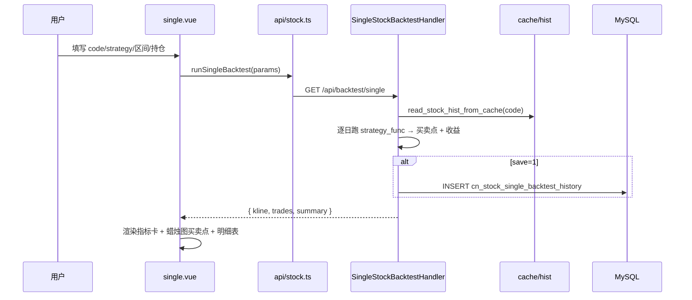

# 单股回测重构开发计划

> 目标：将「自定义回测」重构为「单股回测」，将已失效的「回测看板」替换为「回测历史」。
> 支持指定股票代码、选择策略、指定回测时间范围执行回测，结果可查看 **买卖点**、个股 **回测历史**。
>
> 关联设计稿：[single_stock_backtest_mockup.html](./single_stock_backtest_mockup.html)
> 创建日期：2026-06-04

---

## 1. 背景与现状

### 1.1 现有实现
| 模块 | 路径 | 现状 |
| --- | --- | --- |
| 自定义回测页 | `quantia/fontWeb/src/views/backtest/index.vue` | 单股 + 批量两种模式，仅展示「单买入点 + 未来 N 日收益数组」，无买卖点图 |
| 回测看板页 | `quantia/fontWeb/src/views/backtest/dashboard.vue` | 依赖聚合表 `cn_stock_backtest`，**已失效** |
| 单股回测接口 | `quantia/web/backtestHandler.py` → `RunBacktestHandler` / `_run_backtest` | 给定 code/strategy/period，返回 **1 个买入点** + 检查点收益、关键指标 |
| 看板接口 | `quantia/web/backtestDashboardHandler.py` | 5 个聚合端点（overview / strategy_detail / distribution / timeline / trade_pairs） |
| 信号扫描 | `quantia/web/verifyOptimizeHandler.py` → `_scan_one_stock_for_signals` | **可复用**：对单只股票在区间内逐日跑策略函数，返回所有命中日 |
| 前端路由 | `quantia/fontWeb/src/router/index.ts` (~L391) | `/backtest` 父级 `hidden:true`，子级 `dashboard`、`custom` |
| 前端 API | `quantia/fontWeb/src/api/stock.ts` | `runBacktest` / `runBatchBacktest` / `getBacktestConfig` / `getBacktestDashboard*` |

### 1.2 核心差距
1. 现有「自定义回测」**只产出一个买入点**，无法满足"区间内全部买卖点"的需求。
2. 「回测看板」依赖的聚合表失效，需下线并由「回测历史」取代。
3. 前端无 K 线/蜡烛图组件 —— 但 **ECharts 5.5.0 原生支持 `candlestick` + `markPoint`**，无需引入 `klinecharts`/`lightweight-charts` 等新依赖。
4. 缺少持久化的"单股回测历史"存储。

---

## 2. 目标与范围

### 2.1 功能目标
- **单股回测**：输入股票代码 → 选择策略 → 指定回测时间范围 → （可选）持仓周期 → 执行。
- **持仓周期（可选，任意正整数）**：
  - **填值 N**：固定持仓 N 个交易日到期离场（时间驱动出场）。
  - **留空**：按所选策略自身定义的**卖出信号**离场（信号驱动出场）。
- **买卖点**：在回测区间内扫描出策略**所有买入信号日**作为买入点；按上述出场规则生成对应卖出点；在 K 线图上以红 ▲（买）/蓝 ▼（卖）标注，并提供交易明细表。
- **回测历史**：持久化每次单股回测的参数与汇总结果；支持按股票代码/策略/日期筛选、分页、查看复现、删除。

### 2.2 命名变更
| 旧 | 新 |
| --- | --- |
| 自定义回测（菜单/标题/路由 `custom`） | 单股回测（`single`） |
| 回测看板（菜单/标题/路由 `dashboard`） | 回测历史（`history`） |

### 2.3 不在本次范围
- 组合/算法回测（`quantia/core/backtest/bt_engine.py`、`portfolioBacktestHandler.py`、`/algo/*`）保持不变。
- 批量策略验证（`RunBatchBacktestHandler`）保留，但从单股回测页中剥离（迁至"策略验证中心"或独立入口）。

---

## 3. 后端设计

> 遵循 `backend-handlers.instructions.md`：仅 fetch 管线可调外部 API；handler 只读 MySQL + `cache/hist/`；表元数据从 `quantia/core/tablestructure.py` 导入；SQL 列名需对照真实 schema；新 handler 在 `web_service.py` 注册；改动后重启 + 黑盒验证。

### 3.1 新增：单股区间买卖点回测端点
**路由**：`GET /quantia/api/backtest/single`
**Handler**：`SingleStockBacktestHandler`（`quantia/web/backtestHandler.py`）

**入参**
| 参数 | 必填 | 说明 |
| --- | --- | --- |
| `code` | 是 | 股票代码 |
| `strategy` | 是 | 策略 name，须为 `tbs.TABLE_CN_STOCK_STRATEGIES` 中的**完整表名**（如 `cn_stock_strategy_keep_increasing`），与 `_get_builtin_strategy_func(strategy_table)` 匹配口径一致 |
| `start_date` | 是 | 区间起 `YYYYMMDD` / `YYYY-MM-DD` |
| `end_date` | 是 | 区间止 |
| `hold_days` | 否 | 持仓周期（交易日），任意正整数；**留空/缺省**则按策略卖出信号离场 |
| `save` | 否 | `1` 时写入回测历史表，默认 0 |

**实现逻辑**（复用 `_scan_one_stock_for_signals` 的扫描思路）
1. `stf.read_stock_hist_from_cache(code, ext_start, ext_end)` 读取缓存（区间前预热 **≥250 根**，覆盖 MA250 等长周期，与 §指标叠加 的"从历史起点计算"保持一致）。
2. 逐交易日调用 `strategy_func(stock, hist, date=d)`，命中即为**买入信号日 T**。
3. 买入价 = **T+1 开盘价**（与现有 `_run_backtest` 口径一致）；T+1 开盘**相对 T 日收盘价**涨幅 ≥9.5% 视为开盘涨停 → 跳过该笔（沿用 `_run_backtest` 的 `(buy_price - t_close)/t_close >= 0.095` 判定）。
   > ⚠️ 该阈值为主板 10% 涨停近似，**未区分**创业板/科创板（20%，`300xxx`/`301xxx`/`688xxx`）与 ST（5%）。单股回测面向任意个股，需在实现时按板块/ST 标识动态取涨停幅度，否则会误跳过或误纳入交易（见 §8 风险）。
4. **出场规则（二选一，由 `hold_days` 是否提供决定）**：
   - **固定持仓**（`hold_days=N`，任意正整数）：卖出 = 买入后第 N 个交易日**收盘价**；区间末未到期 → 标记"持仓中"。
   - **策略信号出场**（`hold_days` 留空）：自买入日起逐日检测该策略的**卖出条件**（如对应 `cn_stock_strategy_*` 的反向信号 / `indicators_sell` / 策略内置 `sell` 判定），命中日**收盘价**离场；区间末仍未触发 → 标记"持仓中"。需为各策略约定卖点判定来源（见 §3.4）。
5. 每笔收益 = `(卖出价 - 买入价)/买入价 × 100 - ROUND_TRIP_COST_PCT(0.30)`（双边成本，复用 `rate_stats.ROUND_TRIP_COST_PCT`）。
6. 信号去重：持仓期内的重复买入信号合并（避免重叠开仓），策略可配置是否允许重叠。

**返回结构**
```jsonc
{
  "code": "000001",
  "name": "平安银行",
  "strategy": "cn_stock_strategy_keep_increasing",
  "strategy_cn": "均线多头",
  "start_date": "2026-01-02",
  "end_date": "2026-05-30",
  "hold_days": 10,                 // null 表示按策略卖点出场
  "exit_mode": "fixed",           // fixed | strategy_signal
  "kline": [                       // 供 ECharts candlestick
    { "date": "2026-01-02", "open": 9.0, "close": 9.1, "low": 8.9, "high": 9.2, "volume": 12345 }
  ],
  "indicators": {                  // 供 K 线叠加（按策略推荐，前端可显隐）
    "recommended": ["ma5","ma10","ma20","ma30","ma60"],   // 该策略默认勾选项
    "available": ["ma5","ma10","ma20","ma30","ma60","ma250","boll","vol","macd","kdj","rsi"],
    "ma": { "5": [], "10": [], "20": [], "30": [], "60": [], "250": [] },
    "boll": { "up": [], "mid": [], "dn": [] },   // 源列: boll_ub / boll / boll_lb
    "macd": { "dif": [], "dea": [], "hist": [] }, // 源列: macd / macds / macdh
    "kdj": { "k": [], "d": [], "j": [] },         // 源列: kdjk / kdjd / kdjj
    "rsi": { "6": [], "12": [], "24": [] }        // 源列: rsi_6 / rsi_12 / rsi_24
  },
  "trades": [
    { "no": 1, "buy_date": "2026-01-15", "buy_price": 9.42,
      "sell_date": "2026-01-29", "sell_price": 9.98,
      "hold_days": 10, "exit_reason": "hold_expired", "rate": 5.64,
      "raw_rate": 5.94, "status": "closed", "win": true }
    // exit_reason ∈ hold_expired | sell_signal | interval_end
  ],
  "summary": {
    "trade_count": 6, "closed_count": 5, "open_count": 1,
    "win_count": 3, "lose_count": 2, "win_rate": 60.0,   // 分母=closed_count，持仓中不计
    "cum_return": 10.05, "avg_return": 2.04, "sharpe": 1.98,
    "max_trade_return": 7.95, "max_trade_drawdown": -4.31
  }
}
```
> 颜色口径遵循 A 股：红涨绿跌（前端 candlestick `color`=红、`color0`=绿）。
> 指标字段名为前端友好命名，后端取值映射到 `calculate_indicator.py` 实际列（见上方注释），勿臆造列名（遵循 AGENTS.md 规则 7 validate-first）。

#### 统计口径定义（避免歧义）
- **`trade_count`**：区间内全部买卖点笔数（含未平仓的"持仓中"）。
- **`closed_count` / `open_count`**：已平仓 / 持仓中笔数，`closed + open = trade_count`。
- **`win_count` / `lose_count`**：仅在**已平仓**交易上判定（`rate > 0` 为胜）；持仓中不计入。`win + lose = closed_count`。
- **`win_rate`**：`win_count / closed_count × 100`，`closed_count == 0` 时返回 `null`。
- **`avg_return`**：已平仓交易扣费收益率均值。
- **`cum_return`**：已平仓交易按**复利**累乘 `∏(1 + rate_i/100) − 1`（非简单求和），口径在返回中固定，前后端一致。
- **`max_trade_return` / `max_trade_drawdown`**：已平仓交易中单笔最大 / 最小收益率（非持仓期内 high/low 的浮盈浮亏）。

#### 夏普比率计算
- 样本为各**已平仓**交易的扣费收益率 `rate_i`。注意 `rate_i` 与 `trades[].rate` 同为**百分比**口径，计算时统一转小数 `r_i = rate_i/100`。
- 无风险利率 `rf` 默认 3%（年化），按该笔实际持仓天数折算后扣减：`excess_i = r_i − rf × hold_days_i/252`。
- `sharpe = mean(excess) / std(excess, ddof=1) × √(252 / avg_hold_days)`，其中 `avg_hold_days` 为各笔实际持仓交易日均值（固定持仓时即 `hold_days`）。
- 守护：`std(excess) == 0`、`closed_count < 2`、或 `avg_hold_days <= 0` → 返回 `null`（前端显示「—」），不得返回 inf/NaN（遵循 `db-writes` 有限值要求）。
- 与 AGENTS.md 一致：用**非重叠**收益样本（每笔交易即一个独立样本），禁止用重叠滚动窗口虚高夏普。
- ⚠️ 局限：交易之间存在空仓间隔时，按 `√(252/avg_hold_days)` 年化会高估（隐含资金始终满仓滚动）。本指标仅作**横向比较参考**，文案需注明「基于交易级收益年化估算」。

#### 指标叠加（`indicators` 字段）
- 后端按所选策略给出 `recommended` 默认勾选指标，`available` 为全部可选项；前端渲染为可显隐的 chip。
- **指标一律从历史 K 线起点计算**（非区间内子段）：读取 `cache/hist/` 的**完整历史**（区间前预热 ≥250 根供 MA250/长周期指标）跑指标，再按完整 `date` 序列对齐返回；前期不足周期处补 `null`。这样 MA250、MACD、KDJ 等从历史起点即有效，不会出现"区间起点指标突然从 0 开始"。
- **K 线显示范围**：前端返回完整 K 线 + 完整指标序列，`dataZoom` 默认 `start:0, end:100` 展示**全部 K 线**；用户可自由缩放/拖动查看任意子段，缩放联动所有主/副图（`axisPointer.link` + 多 `xAxisIndex`）。
- 指标值复用 `quantia/core/indicator/calculate_indicator.py`（已封装 TA-Lib MA/BOLL/MACD/KDJ/RSI/CCI/ATR 等），不另造轮子。
- **主图叠加**（与 K 线同 grid）：MA5/10/20/30/60、年线 MA250、BOLL。
- **副图指标**（各占独立 grid 子图，随勾选动态增减图高）：成交量、MACD(12,26,9)、KDJ(9,3,3)、RSI(6,12,24)。
- **策略 → 推荐指标映射**（`STRATEGY_OVERLAY_MAP`，键为完整表名 `cn_stock_strategy_*`）：
  - `cn_stock_strategy_keep_increasing`（均线多头）→ `ma5/ma10/ma20/ma30/ma60`（多头排列均线）。
  - `cn_stock_strategy_backtrace_ma250`（回踩年线）→ `ma250`（年线）+ `ma20`，高亮回踩点。
  - `cn_stock_strategy_enter`（放量上涨）/ `cn_stock_strategy_low_backtrace_increase`（无大幅回撤）等 → `vol`（成交量）+ `ma20` + `macd`，标注放量阈值。
  - `cn_stock_strategy_parking_apron`（停机坪）/ `cn_stock_strategy_breakthrough_platform`（突破平台）→ `ma20` + `vol` + 平台高点参考线。
  - 指标买卖信号类（`indicators_buy/sell`）→ `kdj` + `rsi` + `macd`。
  - 其余策略 → 默认 `ma20`，`available` 始终含 `ma5/10/20/30/60/250 + boll + vol + macd + kdj + rsi`。


### 3.2 新增：回测历史表
**表名**：`cn_stock_single_backtest_history`（在 `tablestructure.py` 定义列与 `FIELD_FORMAT_MAP`）

| 列 | 类型 | 说明 |
| --- | --- | --- |
| `id` | BIGINT PK AUTO | 主键 |
| `created_at` | DATETIME | 回测执行时间 |
| `code` | VARCHAR(8) | 股票代码 |
| `name` | VARCHAR(32) | 股票名称 |
| `strategy` | VARCHAR(64) | 策略 name |
| `strategy_cn` | VARCHAR(64) | 策略中文 |
| `start_date` / `end_date` | DATE | 回测区间 |
| `hold_days` | INT NULL | 持仓周期；NULL = 按策略卖点出场 |
| `exit_mode` | VARCHAR(16) | `fixed` / `strategy_signal` |
| `trade_count` | INT | 笔数 |
| `win_rate` | FLOAT | 胜率(%) |
| `cum_return` | FLOAT | 累计收益(%) |
| `avg_return` | FLOAT | 平均每笔(%) |
| `detail_json` | MEDIUMTEXT | **仅存** 入参 + `trades` + `summary` 的 JSON（**不含** kline / indicators 大数组，避免逐条膨胀 DB）|

> 写入遵循 `db-writes.instructions.md`：`to_sql(chunksize=500)`、NaN/inf 落库前清洗为有限值。
> 单条写入量小，亦可走 `mdb` 直接 INSERT；`detail_json` 入库前确保 JSON 可序列化（`_json_default`）。
> **复现策略**："查看"历史记录时，前端用 `detail_json` 直接渲染指标卡与交易明细表；K 线 + 叠加指标则用该记录的入参（code/strategy/start/end/hold_days）**重新调用** `/api/backtest/single` 重建（确定性计算，结果一致），而非把大数组持久化。

### 3.3 新增：回测历史查询/删除端点
| 路由 | Handler | 说明 |
| --- | --- | --- |
| `GET /quantia/api/backtest/history` | `BacktestHistoryListHandler` | 入参 `code` / `strategy` / `start` / `end` / `page` / `page_size`；返回分页列表（不含 `detail_json`）|
| `GET /quantia/api/backtest/history/detail?id=` | `BacktestHistoryDetailHandler` | 返回单条 `detail_json` 解析后的完整结果，用于复现图表 |
| `DELETE /quantia/api/backtest/history?id=` | `BacktestHistoryDeleteHandler` | 删除一条历史 |

### 3.4 策略卖点判定来源（`hold_days` 留空时）
当未指定持仓周期时，需要为每个策略确定"何时卖出"。按优先级回退：
1. **指标信号**：若策略本身基于指标买点（`indicators_buy`），对应用 `indicators_sell` 的卖出信号日离场。
2. **反向选股信号**：对 `cn_stock_strategy_*` 类选股策略，逐日复用 `_scan_one_stock_for_signals` 思路，命中"该策略不再成立/反向条件"的首日离场（如均线多头 → 跌破多头排列首日）。
3. **兜底**：若某策略无法定义明确卖点，则回退为"区间末收盘价平仓"，并在返回 `summary.warning` 中提示"该策略无内置卖点，已按区间末平仓"。

> 实现时为每个策略维护一张 `STRATEGY_EXIT_RULES` 映射（buy strategy → exit checker）；新增策略需补充该映射，否则走兜底。卖点判定同样只读 `cache/hist/`，不调外部 API。
> `exit_reason` 取值枚举：`hold_expired`（固定持仓到期）、`sell_signal`（策略卖点命中）、`interval_end`（区间末兜底平仓 / 持仓中）。

### 3.5 下线/保留
- **下线**：`backtestDashboardHandler.py` 的 5 个聚合端点 + 前端看板页（路由与 API 一并移除）。先标注 `@deprecated`、灰度一版后删除，避免外链 404。
- **保留**：`GetBacktestConfigHandler`（策略/周期列表，单股回测页继续用）、`RunBatchBacktestHandler`（路由保留注册；看板 UI 删除后，其入口迁移到"策略验证中心"或暂以直链访问，UI 落点在 P5 前确认）。

### 3.6 注册
在 `quantia/web/web_service.py` handlers 列表注册新增 4 个路由；移除看板路由。

---

## 4. 前端设计（Vue 3 + Element Plus + ECharts）

> 遵循 `frontend-vue.instructions.md`：`<script setup lang="ts">`；HTTP 全部经 `src/api/*`；keep-alive 用 `onActivated`；`dayjs` 处理日期；`npm run build`(=`vue-tsc --noEmit && vite build`) 必须通过。

### 4.1 路由变更（`router/index.ts`）
```ts
{
  path: '/backtest',
  component: Layout,
  redirect: '/backtest/single',
  meta: { title: '策略回测', icon: 'DataLine', hidden: false }, // 由 hidden 改为可见
  children: [
    { path: 'single',  name: 'SingleStockBacktest', component: () => import('@/views/backtest/single.vue'),  meta: { title: '单股回测' } },
    { path: 'history', name: 'BacktestHistoryView', component: () => import('@/views/backtest/history.vue'), meta: { title: '回测历史' } }
  ]
}
```
> 删除 `dashboard` 子路由。保留旧 `/backtest/custom` → `redirect: '/backtest/single'` 一版以兼容书签。

### 4.2 视图文件
| 文件 | 说明 |
| --- | --- |
| `views/backtest/single.vue` | 由 `index.vue` 重构：去掉 batch 模式，新增日期范围、持仓周期（`el-input-number`，**可留空**，留空=按策略卖点）；结果区为 **指标卡 + K线买卖点图 + 交易明细表** |
| `views/backtest/history.vue` | 新增：筛选表单 + 历史表格 + 分页 + 查看/删除；"查看"跳回 `single.vue` 并以 `detail` 渲染 |
| `components/KlineBacktestChart.vue` | 新增：封装 ECharts `candlestick` + `markPoint`（买 ▲ / 卖 ▼）+ `dataZoom`；**主图叠加**（均线/年线/BOLL）+ **副图子图**（成交量/MACD/KDJ/RSI，随勾选动态增减图高），多 grid 缩放联动 |
| 删除 | `views/backtest/dashboard.vue` |

### 4.3 K线买卖点组件要点
- `echarts.init` + `series[0].type='candlestick'`（红涨绿跌）。
- 买卖点用 `series.markPoint.data`：买入 `symbol:'triangle'` 红色、卖出 `symbolRotate:180` 蓝色，`tooltip` 显示日期/价格/收益。
- **主图叠加**：顶部 chip 控制 MA5/10/20/30/60/年线MA250、BOLL（与 K 线同 grid）。
- **副图子图**：成交量、MACD(12,26,9)、KDJ(9,3,3)、RSI(6,12,24) 各占一个独立 grid；根据勾选动态计算布局与总高度，多 xAxis 通过 `axisPointer.link` 联动。
- **默认勾选**：根据后端 `indicators.recommended`（如均线多头→五均线；回踩年线→MA250；放量上涨→成交量+MACD；指标信号→KDJ+RSI+MACD），用户可随意勾选/取消。
- **显示范围**：`dataZoom` 默认 `start:0,end:100` 展示全部 K 线；指标与 K 线均从历史起点对齐。
- Tab 切换/keep-alive 激活后 `nextTick` → `chart.resize()`。
- 设计稿 `single_stock_backtest_mockup.html` 已用真实 ECharts 演示买卖点 + 主图叠加 + MACD/KDJ/RSI 副图 + 全范围缩放效果，可直接对照实现。

### 4.4 API 层（`src/api/stock.ts`）
```ts
export const runSingleBacktest   = (params) => request.get('/quantia/api/backtest/single', { params }) // hold_days 可不传=策略卖点
export const getBacktestHistory  = (params) => request.get('/quantia/api/backtest/history', { params })
export const getBacktestHistoryDetail = (id) => request.get('/quantia/api/backtest/history/detail', { params: { id } })
export const deleteBacktestHistory = (id) => request.delete('/quantia/api/backtest/history', { params: { id } })
// 移除 getBacktestDashboard* 系列
```

---

## 5. 数据流



---

## 6. 分阶段实施

| 阶段 | 内容 | 产出/验证 |
| --- | --- | --- |
| **P1 后端核心** | `SingleStockBacktestHandler` + `_run_single_backtest`（复用扫描逻辑），注册路由 | 重启服务 → `curl /api/backtest/single?code=000001&strategy=cn_stock_strategy_keep_increasing&start_date=...&end_date=...` 返回 200 且含 kline/trades/summary |
| **P2 历史存储** | `cn_stock_single_backtest_history` 表 + 3 个历史端点 + `save` 写入 | 执行带 `save=1` 回测 → 查 `/api/backtest/history` 出现该记录；detail/delete 正常 |
| **P3 前端单股回测** | `single.vue` + `KlineBacktestChart.vue` + API；路由改名 | `npm run build` 通过；页面跑通买卖点图与明细 |
| **P4 前端回测历史** | `history.vue` + 筛选/分页/查看/删除 | 列表筛选、复现、删除可用 |
| **P5 下线看板** | 删除 `dashboard.vue` + 看板路由 + 看板 API；`backtestDashboardHandler` 标注废弃 | 旧路径 404 兜底/重定向；无残留引用（grep 校验）|
| **P6 部署验证** | 构建 + 部署 + 服务端黑盒回归 | `dist/*` → `quantia/web/static/`；重启 `web_service.py`；生产环境点测 |

---

## 7. 测试计划

> 遵循 `testing.instructions.md`（`tests/` 下，conftest 约定，DB mock）。

- **单元（后端）**：
  - `_run_single_backtest`：上升趋势→多笔盈利、横盘→无信号、数据不足→空 trades、T+1 涨停→跳过该笔、区间末未到期→`status=open`。
  - **出场双模式**：`hold_days=N` → 固定 N 日出场（任意正整数，含 N=1 / N=3 / N=60）；`hold_days` 缺省 → 按策略卖点出场（命中卖信号/区间末兑仓两条路径）；无卖点策略走兑仓兑底并出 `warning`。
  - 收益口径含 `ROUND_TRIP_COST_PCT`；NaN/inf 清洗。
  - **夏普比率**：多笔收益正常返回有限值；`std==0`/样本 `<2` → `null`；不返回 inf/NaN。
  - **指标叠加**：`indicators.recommended` 按策略映射正确（均线多头→五均线、回踩年线→MA250、放量上涨→vol+macd、指标信号→kdj+rsi+macd）；MA/BOLL/MACD/KDJ/RSI 值与 K 线 date 对齐、前期不足周期处为 `null`；指标序列长度 == 完整 K 线长度（**从历史起点计算**，非区间子段）。
- **Handler（Tornado）**：缺参 400；正常 200 字段齐全；`save=1` 落库；history 列表分页/筛选；delete 幂等。
- **前端**：`single.vue` 表单校验、空结果占位；`KlineBacktestChart` markPoint 数量与 trades 对应；`vue-tsc` 类型检查通过。
- **回归**：现有 `RunBatchBacktestHandler`、`GetBacktestConfigHandler` 不受影响。

---

## 8. 风险与注意事项

1. **生产 MySQL 时延**：本机连 `115.29.213.22` 较慢，端到端浏览器验证需在服务器执行。
2. **缓存依赖**：回测只读 `cache/hist/`，需保证目标股票缓存已更新（否则返回"无缓存数据"提示）。
3. **信号重叠**：同一持仓期内重复信号需去重，避免虚增笔数；提供"允许重叠"开关备选。
4. **策略函数签名差异**：部分策略需 `istop` 等额外参数，复用 `_scan_one_stock_for_signals` 的 `TypeError` fallback。
5. **看板下线兼容**：旧书签/外链 `/backtest/dashboard`、`/backtest/custom` 做重定向，灰度一版再删后端废弃端点。
6. **数据量**：`detail_json` 用 `MEDIUMTEXT` 但**只存** params+trades+summary（不含 kline/indicators，见 §3.2 复现策略）；长区间 K 线点数较多时前端启用 `dataZoom` 默认收窄显示。
7. **指数/ETF 代码**：本功能面向**个股**回测。若输入指数代码（`000300`/`399xxx` 等），须走 `load_benchmark_data` 而非 `load_stock_data`（AGENTS.md 规则 3，否则 EastMoney `secid=0.000300` → HTTP 500）。当前阶段**仅支持个股**：入参校验拦截指数代码并提示「暂不支持指数回测」；如后续要支持需单独走基准数据通道与适配策略函数。
8. **涨停板阈值差异**：复用的 `_run_backtest` 涨停判定为固定 `(buy_price - t_close)/t_close >= 0.095`，仅近似主板 10%。创业板/科创板（`300/301/688` 开头，20%）与 ST（5%）需按板块/标识动态取阈值，否则会误跳过或误纳入买点。实现时统一封装 `_price_limit_pct(code, name)` 工具函数，单股回测与 `_run_backtest` 共用。

---

## 9. 验收标准

- [ ] 输入股票代码 + 策略 + 时间范围（持仓周期可留空或填任意正整数），点击执行可返回区间内全部买卖点。
- [ ] 持仓周期留空时按策略卖点出场；填值时按固定 N 日出场，两种模式明细表与图表一致。
- [ ] K 线图正确标注红 ▲ 买 / 蓝 ▼ 卖，悬停显示日期、价格、收益。
- [ ] 汇总指标（笔数/胜率/累计收益/平均收益/**夏普比率**/最大盈亏）与明细表一致；夏普在样本不足时显示「—」。
- [ ] K 线图默认展示**全部 K 线**（`dataZoom` 0~100%），可自由缩放；指标从**历史起点**计算对齐，非区间子段。
- [ ] K 线图可按策略默认叠加对应指标（均线多头→五均线、回踩年线→MA250、放量上涨→成交量），且可手动显隐。
- [ ] 支持 MACD/KDJ/RSI 等副图指标独立子图展示，与主图缩放联动。
- [ ] 回测历史可按股票/策略/日期筛选、分页、查看复现、删除。
- [ ] 菜单显示为「单股回测 / 回测历史」，旧「回测看板」已下线。
- [ ] `npm run build` 通过；后端端点服务器黑盒验证 200。
