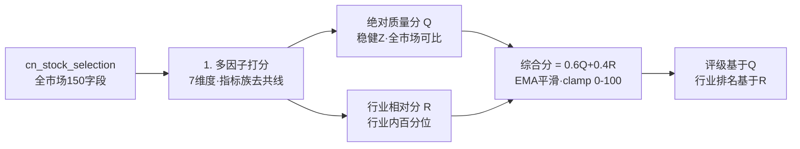
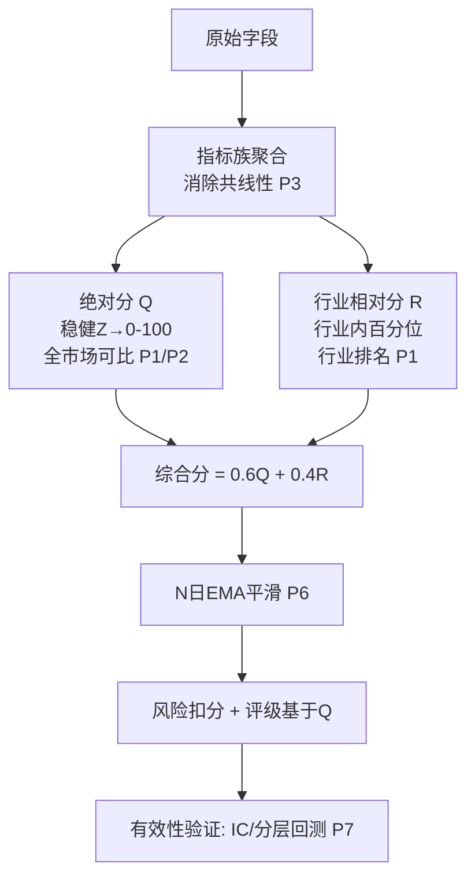

# 综合选股重构 — 行业分类 + 多因子综合评分 需求与开发文档

> 生成时间: 2026-06-01 | 状态: 需求设计 & 开发计划
> 目标路由: `/selection/all`（玄枢 Quantia「综合选股」）
> 关联表: `cn_stock_selection`（~150 字段日结快照）

---

## 〇、文档导航

| 章节 | 内容 |
|------|------|
| ★ | 设计审查与优化记录（v2） |
| 一 | 背景与问题 |
| 二 | 产品目标与核心思路 |
| 三 | 数据源盘点（可用字段分组） |
| 四 | 多因子综合评分模型（核心·双分制） |
| 五 | 行业分类与双口径归一 |
| 六 | 后端设计（表结构 / 计算 Job / API） |
| 七 | 前端设计（页面结构 / 交互 / 组件） |
| 八 | 开发任务拆解与里程碑 |
| 九 | 风险、边界与注意事项 |

配套可视化原型: [design-mockup.html](design-mockup.html)（用浏览器打开查看完整效果）

---

## 一、背景与问题

### 1.1 现状

当前 `/selection/all`「综合选股」与「每日股票数据」`/basic/spot` 在体验上高度重叠：

| 维度 | 现状问题 |
|------|----------|
| 数据流 | `selection_data_daily_job` 拉取东方财富选股器**全市场**数据，**原样落库**到 `cn_stock_selection`，不做任何筛选/加工 |
| 后端 | `GetStockDataHandler` 对该表执行 **`SELECT *`**，无任何业务逻辑 |
| 前端 | 与 `/basic/spot` 复用同一个 `StockData.vue`，仅 `meta.tableName` 不同 |
| 结果 | 用户看到的是"全市场行情宽表"，**名为"综合选股"实则未选股**，前半段行情列与每日数据重复，产生冗余感 |

### 1.2 核心痛点

- **名不副实**：叫"综合选股"，但没有"选"的逻辑，只是把 150 列数据堆在表格里。
- **数据未被利用**：表里 150+ 字段（估值/盈利/成长/财务/技术/资金/情绪）价值巨大，但前端只做平铺展示，用户难以从中提炼决策。
- **缺乏行业视角**：不同行业估值/盈利水平差异极大（银行 PE 5 vs 芯片 PE 80），跨行业直接比较无意义。

---

## 二、产品目标与核心思路

### 2.1 目标

把「综合选股」从**数据平铺**重构为**真正的综合选股**：

> 充分利用 `cn_stock_selection` 表的全部数据，对每只股票从**估值、盈利、成长、财务健康、技术、资金、情绪**等多维度建模，计算 **0–100 综合评分**，并**按行业分类**展示每个行业内股票的评分排名。

### 2.2 核心思路（双分制，详见 ★ 与第四章）



1. **多因子打分**：每个维度由若干字段构成子因子，先方向化、指标族聚合（去共线）与标准化。
2. **双口径归一**：绝对质量分 $Q$（全市场稳健 Z，跨行业可比）与行业相对分 $R$（行业内百分位）同时产出。
3. **综合加权**：综合分 = 0.6Q+0.4R（EMA 平滑）；**评级基于 $Q$**（S/A/B/C/D），**行业内排名基于 $R$**。

### 2.3 与现有功能的差异定位

| 功能 | 定位 |
|------|------|
| `/basic/spot` 每日股票数据 | 实时行情快照（看盘） |
| `/selection/all` 综合选股（**重构后**） | 行业分类 + 多因子综合评分榜（**选股决策**） |

---

## ★ 设计审查与优化记录（v2）

> 对 v1 方案做深入审查后，识别出 11 处关键问题并给出优化方案。下文第四、五、六、八章已按此更新；本节为变更依据与速览。

### 关键问题与优化

| # | v1 问题 | 影响 | v2 优化方案 |
|---|---------|------|-------------|
| **P1** | **相对分与全市场可比性冲突**：若全部用行业内百分位，每个行业都有 ~100 与 ~0 分股票，全市场 Top 榜失去意义（弱行业龙头 = 强行业龙头），评级 S 退化为"矮子里拔高个" | 🔴 严重 | **双分制**：绝对质量分 `Q`（全市场口径，跨行业可比）+ 行业相对分 `R`（行业内百分位）。综合分 = α·Q+(1−α)·R（α=0.6）。**评级基于 Q**，保证 S=真优质；**行业排名基于 R** |
| **P2** | **纯百分位丢失量纲与差距**：rank 百分位把任何分布拉成均匀分布，抹掉真实质量差（第1名远超第2名，但分位只差一步） | 🟠 中 | 绝对分用**稳健 Z-score**：Winsorize(1/99%)→ robust-z =(x−median)/(1.4826·MAD)→ logistic 映射到 0–100，保留相对差距、抗离群。相对分仍用百分位（直观表达排名） |
| **P3** | **因子共线性**：`pe9`/`pettmdeducted`/`dtsyl` 几乎等价，估值维度被 PE **三倍计权** | 🟠 中 | 维度内先分**指标族**，族内取均值，再族间等权。估值族 = {PE族, PB, PS, PEG, 股息率}，PE 只算 1 票 |
| **P4** | **金融业不可比**：银行/券商/保险负债率天然 >90%、无毛利率/PS 概念、ROE 口径不同 | 🟠 中 | 金融业走**专属因子集+权重模板**（去掉负债率扣分、PS、毛利率；强化 ROE/PB/股息/拨备）。按一级行业自动路由模板 |
| **P5** | **亏损股估值记 0 太一刀切**：高成长亏损（创新药/芯片）被误杀 | 🟡 轻 | 估值族为负/缺失时**该族不计入并重新归一权重**（而非记 0），并打"成长型亏损"标签，由成长维度体现价值 |
| **P6** | **评分日频抖动**：分位排名每日跳动→评分忽高忽低，失真且体验差 | 🟠 中 | 综合分做 **N 日指数平滑（EMA, N=5）**；同时存当日分与平滑分；展示排名变化箭头 |
| **P7** | **缺乏有效性验证**：权重纯主观，未验证评分能否预测收益 | 🟠 中 | 新增**因子有效性验证**：IC（信息系数）、分层回测（Top/Bottom 组未来 N 日收益）、评分-收益单调性。复用现有回测引擎，列为 M0/M7 |
| **P8** | **缺失值一律填中位数**：会"奖励"数据缺失的差公司 | 🟡 轻 | 区分中性缺失（填行业中位）与关键字段缺失（轻扣"数据完整度"分）；UI 标注**数据完整度** |
| **P9** | **情绪维度可能助长追高**：人气高/换手高常是顶部特征 | 🟡 轻 | 情绪仅 5% 权重；换手率用**钟形**（适中最佳）；人气只取"上升趋势"而非绝对高位 |
| **P10** | **次新股/停牌信号失真**：财务与技术信号不全混入主榜误导 | 🟡 轻 | 次新（上市<60 交易日）、停牌、长期一字板**单独分组/标记**，不混入主榜 |
| **P11** | **跨模板不可比**：若金融业/用户模板用不同权重计算 Q，则全市场 Top 榜按 Q 排序时不同模板的 Q 混比 | 🟠 中 | **Q 与评级固定用「均衡」模板计算**（全市场唯一口径）；用户权重模板仅在**API 按维度分实时重加权**影响当前视图的综合分排序，不改变存储的 Q/评级；金融业模板只替换不适用因子（去负债率扣分等），维度标准化仍为全市场口径 |

### 评分体系（v2 总览）



---

## 三、数据源盘点（可用字段分组）

> 全部来自 `cn_stock_selection`，无需新增采集。下表为评分建模选用的核心字段，按维度分组。

### 3.1 估值维度（Valuation，越低越好为主）
| 字段 | 含义 | 方向 |
|------|------|------|
| `pe9` | 市盈率TTM | 低优（>0） |
| `pettmdeducted` | 市盈率TTM扣非 | 低优（>0） |
| `pbnewmrq` | 市净率MRQ | 低优（>0） |
| `ps9` | 市销率TTM | 低优 |
| `ycpeg` | 预测PEG | 低优（0–1 最佳） |
| `dtsyl` | 动态市盈率 | 低优 |
| `zxgxl` | 最新股息率 | **高优** |
| `enterprise_value_multiple` | 企业价值倍数 | 低优 |

### 3.2 盈利能力维度（Profitability，越高越好）
| 字段 | 含义 |
|------|------|
| `roe_weight` | 净资产收益率ROE |
| `jroa` | 总资产净利率ROA |
| `roic` | 投入资本回报率ROIC |
| `sale_gpr` | 毛利率 |
| `sale_npr` | 净利率 |

### 3.3 成长性维度（Growth，越高越好）
| 字段 | 含义 |
|------|------|
| `netprofit_yoy_ratio` | 净利润增长率 |
| `deduct_netprofit_growthrate` | 扣非净利润增长率 |
| `toi_yoy_ratio` | 营收增长率 |
| `netprofit_growthrate_3y` | 净利润3年复合增长率 |
| `income_growthrate_3y` | 营收3年复合增长率 |
| `predict_netprofit_ratio` | 预测净利润同比增长 |
| `basiceps_yoy_ratio` | 每股收益同比增长率 |

### 3.4 财务健康维度（Financial Health，风险扣分项）
| 字段 | 含义 | 方向 |
|------|------|------|
| `debt_asset_ratio` | 资产负债率 | 适中（过高扣分） |
| `current_ratio` | 流动比率 | 高优 |
| `speed_ratio` | 速动比率 | 高优 |
| `per_netcash_operate` | 每股经营现金流 | 高优（>0） |
| `goodwill_assets_ratro` | 商誉占净资产比例 | 低优（高=风险） |
| `pledge_ratio` | 质押比例 | 低优（高=风险） |

### 3.5 技术面维度（Technical，信号加分，BIT 布尔）
| 字段组 | 含义 |
|------|------|
| `macd_golden_fork` / `_forkz` / `_forky` | MACD金叉 日/周/月线 |
| `kdj_golden_fork` / `_forkz` / `_forky` | KDJ金叉 日/周/月线 |
| `long_avg_array` | 均线多头排列（+），`short_avg_array` 空头（–） |
| `breakup_ma_*days` | 向上突破均线 5/10/20/30/60 日 |
| `break_through` / `upside_volume` / `upper_large_volume` | 放量突破 / 放量上攻 / 连涨放量 |
| `one_dayang_line` / `two_dayang_lines` / `rise_sun` / `power_fulgun` / `morning_star` / `first_dawn` | 看涨形态（+） |
| `evening_star` / `black_cloud_tops` / `shooting_star` / `bearish_engulfing` / `down_7days` | 看跌形态（–） |

### 3.6 资金/机构维度（Capital，越高越好）
| 字段 | 含义 |
|------|------|
| `allcorp_ratio` | 机构持股比例合计 |
| `allcorp_fund_ratio` | 基金持股比例 |
| `allcorp_sb_ratio` | 社保持股比例 |
| `allcorp_qfii_ratio` | QFII持股比例 |
| `org_survey_3m` | 近3月机构调研次数 |
| `org_rating` | 机构评级（买入/增持…） |
| `holder_ratio` | 股东户数增长率（**负**=筹码集中，利好） |
| `holdnum_growthrate_3q` | 户均持股数季度增长率（**正**=集中，利好） |
| `low_funds_inflow` | 低位资金净流入（BIT，+） |
| `high_funds_outflow` | 高位资金净流出（BIT，–） |

### 3.7 市场情绪维度（Sentiment，辅助权重）
| 字段 | 含义 |
|------|------|
| `popularity_rank` / `rank_change` | 股吧人气排名 / 变化 |
| `concern_rank_7days` | 7日关注排名 |
| `volume_ratio` | 量比 |
| `turnoverrate` | 换手率（适中最佳） |
| `bigfans_ratio` | 铁杆粉丝占比 |

### 3.8 风险/排除项（一票否决或重扣分）
| 字段 | 规则 |
|------|------|
| `name` 含 `ST`/`*ST`/`退` | 排除（不参与评分或最低分） |
| `is_issue_break` / `is_bps_break` | 破发/破净（提示，不直接排除） |
| `pledge_ratio` > 50% | 高质押风险，重扣分 |
| `goodwill_assets_ratro` > 50% | 高商誉风险，重扣分 |
| `predict_type` = 预减/首亏/续亏 | 业绩预警，扣分 |
| `listing_date` < 上市 60 个交易日 | 次新股，单独标记 |

---

## 四、多因子综合评分模型（核心，v2 双分制）

### 4.1 总体公式（双分制，见 P1/P2）

每只股票产出**两套维度分**，再合成综合分：

- **绝对质量分** $Q_d$：维度 $d$ 在**全市场**口径下的稳健 Z 映射分（跨行业可比，用于全市场榜与评级）
- **行业相对分** $R_d$：维度 $d$ 在**行业内**的百分位（直观表达行业排名）

$$
Q = \Big(\sum_{d \in D} w_d \cdot Q_d\Big)\times 100 - \text{RiskPenalty}, \qquad
R = \Big(\sum_{d \in D} w_d \cdot R_d\Big)\times 100
$$

$$
\boxed{\;\text{综合评分} = \alpha\,Q + (1-\alpha)\,R\;}\qquad \alpha = 0.6\ \text{(偏绝对)}
$$

- $D$ = {估值, 盈利, 成长, 财务, 技术, 资金, 情绪}
- $Q_d,\,R_d \in [0,1]$；$w_d$ 为维度权重，$\sum w_d = 1$
- **评级取 $Q$**（保证 S=真优质），**行业内排名取 $R$**
- `RiskPenalty`：风险扣分（0–20，仅作用于 $Q$）
- **越界截断（clamp）**：风险扣分后 $Q$ 可能为负，故 $Q$ 与综合分均 **clamp 到 $[0,100]$**，避免负分
- 最终展示分对综合分做 **5 日 EMA 平滑**（见 P6）

### 4.2 默认维度权重（可配置）

| 维度 | 代号 | 默认权重 | 说明 |
|------|------|---------|------|
| 盈利能力 | profitability | **0.20** | 质地基石 |
| 成长性 | growth | **0.20** | 弹性来源 |
| 估值 | valuation | **0.18** | 安全边际 |
| 财务健康 | health | **0.15** | 风险控制 |
| 资金/机构 | capital | **0.12** | 聪明钱认可 |
| 技术面 | technical | **0.10** | 择时辅助 |
| 市场情绪 | sentiment | **0.05** | 边际催化 |
| 合计 | — | **1.00** | — |

> 权重以「价值成长」为基调（盈利+成长+估值 = 58%），技术/情绪为辅。
>
> **模板作用域（P11）**：上表「均衡」模板是**存储的 $Q$ 与评级的唯一口径**（保证全市场可比）。用户可选模板（价值/成长/技术/金融业）**仅在 API 从存储的维度分实时重加权**，仅改变当前视图的综合分排序，不重算也不改写 $Q$/评级（无需多模板多行存储，节省计算与存储）。

### 4.3 子因子标准化（维度内，v2）

为同时消除**共线性**（P3）并保留**质量差距**（P2），分两路产出 $Q_d$ 与 $R_d$：

**Step 1 · 方向化**：低优取负（PE）、高优取正（ROE）。

**Step 2 · 指标族聚合（P3 去共线）**：维度内先按经济含义分「指标族」，**族内取均值得 1 个代表值**，再族间等权。

| 维度 | 指标族（族内取均值） |
|------|----------------------|
| 估值 | {PE族: pe9, pettmdeducted, dtsyl}、{PB}、{PS}、{PEG}、{股息率} |
| 盈利 | {ROE族: roe, roe_weight}、{毛利率}、{净利率} |
| 成长 | {营收增速}、{净利增速}、{扣非增速} |

**Step 3 · 异常与缺失（P5/P8）**：
- 极端值按 1%/99% 分位 **Winsorize** 截断。
- 估值族 PE/PB/PS ≤ 0 → **该族不计入估值并按剩余族重新归一权重**（不记 0、不误杀成长型亏损），并打"成长型亏损"标签。
- 中性缺失 → 填该行业中位数；关键字段缺失 → 额外轻扣"数据完整度"分并在 UI 标注。

**Step 4 · 双口径归一**：
- 绝对分 $Q_d$（P2）：对族代表值做**稳健 Z**：$z=\dfrac{x-\text{median}}{1.4826\cdot \text{MAD}}$，再 logistic 映射 $Q_d=\dfrac{1}{1+e^{-z}}\in[0,1]$（全市场口径，保留差距、抗离群）。
- 行业相对分 $R_d$（P1）：$R_d=\text{rank\_pct}_{\text{industry}}(x)\in[0,1]$（行业内百分位，直观排名）。

**Step 5 · 维度合成**：族间等权平均得 $Q_d$ 与 $R_d$。

### 4.4 技术面维度打分（布尔信号 → 0–1）

技术面由 BIT 信号组成，采用**加权计数**：

```
tech_raw =  Σ(看涨信号·权重)  −  Σ(看跌信号·权重)
```

| 信号类 | 示例 | 权重 |
|------|------|------|
| 多周期金叉 | macd月线/周线、kdj月线 | +1.5 / 个 |
| 日线金叉 | macd日线、kdj日线 | +1.0 / 个 |
| 均线多头 | long_avg_array | +2.0 |
| 放量突破类 | break_through, upside_volume | +1.5 / 个 |
| 看涨形态 | rise_sun, power_fulgun, morning_star… | +1.0 / 个 |
| 均线空头 | short_avg_array | −2.0 |
| 看跌形态 | evening_star, black_cloud_tops… | −1.0 / 个 |

`tech_raw` 再按 4.3 Step 4 **双口径归一**（$Q_{technical}$ 全市场稳健 Z、$R_{technical}$ 行业内百分位）。

### 4.5 风险扣分（RiskPenalty，0–20）

| 风险项 | 扣分 |
|------|------|
| 质押比例 > 50% | 6 |
| 商誉占净资产 > 50% | 5 |
| 资产负债率 > 80%（非金融） | 4 |
| 业绩预告为 预减/首亏/续亏 | 4 |
| 破净 + 破发 同时 | 2 |
| 高位资金净流出 | 2 |
| （封顶 20 分） | — |

### 4.6 评级映射（基于**绝对质量分 Q**，见 P1）

> 评级用 $Q$（全市场可比）而非行业相对分，避免"每个行业都有 S"。行业排名另由 $R$ 给出。

| 绝对质量分 Q | 评级 | 含义（全市场口径） |
|---------|------|------|
| ≥ 85 | **S** | 全市场顶尖 |
| 75–84 | **A** | 优质 |
| 60–74 | **B** | 良好 |
| 45–59 | **C** | 一般 |
| < 45 | **D** | 偏弱 |

阈值通过**分位锚定**校准（如 S≈全市场前 5%、A≈前 20%），并随 4.8 有效性验证迭代。

### 4.7 输出字段（每只股票，v2）

```jsonc
{
  "code": "300750", "name": "宁德时代", "industry": "电池",
  "total_score": 86.4,        // 综合分 = 0.6Q + 0.4R（平滑后展示值）
  "quality_score": 88.6,      // 绝对质量分 Q（全市场可比，驱动评级）
  "industry_score": 95.2,     // 行业相对分 R（行业内百分位）
  "rating": "S",              // 基于 Q
  "industry_rank": 1, "industry_total": 42,    // 基于 R
  "rank_change_1d": 0,        // 较上一交易日行业排名变化（P6）
  "data_completeness": 0.97,  // 数据完整度（P8）
  "dim_scores_q": { "valuation": 72, "profitability": 95, "growth": 90,
                    "health": 84, "capital": 91, "technical": 65, "sentiment": 80 },
  "risk_penalty": 0,
  "weight_template": "balanced",
  "tags": ["机构重仓", "高成长", "均线多头"],   // 亮点标签
  "risk_flags": []                              // 风险标签
}
```

### 4.8 因子有效性验证（P7，上线前必做）

权重不能纯主观，需用历史数据验证评分对未来收益的预测力（复用现有回测引擎）：

- 默认验证主模板建议使用 `m1_auto_ic_m12`；`m1_auto_ic_m15` / `m1_auto_ic_m16` 仅用于约束实验对照。
- 比较不同模板时，先固定样本窗口、股票池和披露滞后，再看 `Top−Bottom` 与单调性，避免因为数据面变化误判模板优劣。

1. **因子 IC**：每个维度分与未来 N 日（5/10/20）收益的 Spearman 秩相关（IC），|IC|>0.03 且正负稳定才保留。
2. **分层回测**：按综合分分 5 组，验证 Top 组收益 > Bottom 组且**单调**递减。
3. **权重校准**：以 IC 加权或回测夏普为目标调优维度权重（避免过拟合，留样本外验证）。
4. **评级阈值校准**：以分位锚定 S/A/B/C/D 阈值（见 4.6）。

---

## 五、行业分类与行业内相对评分

### 5.1 行业分类与小行业/金融业处理（P4/P10）

直接使用表内 `industry` 字段（东方财富行业分类）。
- 缺失 `industry` 的归入「其他」。
- **小行业（<5 只）**：不再回退到“全市场百分位”（会混用不可比的归一基准），而是**上升到上一级行业分类**合并后再算行业相对分 $R$；仍不足则标记"行业样本不足"且仅展示绝对分 $Q$。
- **金融业（银行/证券/保险）**：负债率天然 >90%、无毛利率/PS 概念、ROE 口径不同，走**专属因子集+权重模板**（去掉负债率扣分、PS、毛利率；强化 ROE/PB/股息/拨备），按一级行业自动路由模板。
- **次新股（上市 <60 交易日）、停牌、长期一字板**：单独分组/标记，不混入主榜。

### 5.2 双口径归一回顾

- **行业相对分 $R_d$**（行业内百分位，驱动行业排名）：

$$
R_d = \frac{\text{rank}_{\text{asc}}(x \mid \text{industry})}{N_{\text{industry}} - 1}
$$

- 同一行业内排序后取分位，最差=0、最好=1。
- 这样**银行股之间比、芯片股之间比**，避免跨行业量纲污染。

### 5.3 展示分组

最终结果按 `industry` 分组，每组内按 `total_score` 降序：

```
电池 (42只)         平均分 71  龙头 宁德时代(88.6 S)
  ① 宁德时代  88.6 S
  ② 亿纬锂能  81.2 A
  ③ ...
半导体 (88只)       平均分 63  龙头 ...
  ...
```

并提供**行业横向对比**：各行业平均分、龙头股、行业景气度（行业内成长维度均值）。

---

## 六、后端设计

### 6.1 计算定位（AGENTS.md 规则 1）

| 模块 | 管道 | 说明 |
|------|------|------|
| `quantia/core/selection_scoring.py` | **Compute** | 纯计算：因子标准化、行业归一、加权评分。DB 懒加载 |
| `quantia/job/selection_score_job.py` | **Fetch/编排** | 读 `cn_stock_selection` → 调 scoring → 写结果表 |
| `quantia/web/selectionScoreHandler.py` | Web | 提供评分榜 API |

### 6.2 结果表 `cn_stock_selection_score`

```sql
CREATE TABLE IF NOT EXISTS `cn_stock_selection_score` (
  `date` DATE NOT NULL COMMENT '评分日期',
  `code` VARCHAR(10) NOT NULL COMMENT '股票代码',
  `name` VARCHAR(20) DEFAULT NULL,
  `industry` VARCHAR(50) DEFAULT NULL COMMENT '行业',
  `total_score` FLOAT DEFAULT NULL COMMENT '综合评分 0-100（=0.6Q+0.4R，EMA平滑后）',
  `total_score_raw` FLOAT DEFAULT NULL COMMENT '未平滑当日综合分',
  `quality_score` FLOAT DEFAULT NULL COMMENT '绝对质量分 Q（全市场可比）',
  `industry_score` FLOAT DEFAULT NULL COMMENT '行业相对分 R（行业内百分位）',
  `rating` ENUM('S','A','B','C','D') DEFAULT NULL COMMENT '基于 quality_score',
  `industry_rank` INT DEFAULT NULL COMMENT '行业内排名（基于R）',
  `industry_total` INT DEFAULT NULL COMMENT '行业内股票数',
  `rank_change_1d` INT DEFAULT NULL COMMENT '较上交易日行业排名变化（区别于原表人气rank_change）',
  `data_completeness` FLOAT DEFAULT NULL COMMENT '数据完整度 0-1',
  `score_valuation` FLOAT DEFAULT NULL,
  `score_profitability` FLOAT DEFAULT NULL,
  `score_growth` FLOAT DEFAULT NULL,
  `score_health` FLOAT DEFAULT NULL,
  `score_capital` FLOAT DEFAULT NULL,
  `score_technical` FLOAT DEFAULT NULL,
  `score_sentiment` FLOAT DEFAULT NULL,
  `risk_penalty` FLOAT DEFAULT 0,
  `tags` JSON DEFAULT NULL COMMENT '亮点标签',
  `risk_flags` JSON DEFAULT NULL COMMENT '风险标签',
  `weight_template` VARCHAR(20) DEFAULT 'balanced' COMMENT '生成Q/评级的口径模板，固定 balanced（用户模板在API实时重加权）',
  `updated_at` DATETIME DEFAULT CURRENT_TIMESTAMP ON UPDATE CURRENT_TIMESTAMP,
  PRIMARY KEY (`date`, `code`),
  INDEX `idx_industry_score` (`industry`, `total_score` DESC),
  INDEX `idx_score` (`total_score` DESC),
  INDEX `idx_rating` (`rating`, `date`)
) ENGINE=InnoDB DEFAULT CHARSET=utf8mb4 COMMENT='综合选股多因子评分结果';
```

### 6.3 计算 Job 流程

```
selection_score_job(date):
  1. 读取 cn_stock_selection 当日全量（DataFrame）
  2. 过滤 ST/退市/停牌
  3. 按 industry 分组：
       - 各维度字段方向化 + Winsorize + 缺失填充（行业中位数）
       - 行业内百分位归一 → 维度分 0-1
  4. 加权汇总 → quality_score(Q) 与 industry_score(R)；total_score=clamp(0.6Q+0.4R,0,100)；EMA 平滑
  5. 映射 rating（基于 Q）；计算 industry_rank（基于 R）、rank_change_1d
  6. 计算 risk_penalty / tags / risk_flags / data_completeness
  7. DELETE 当日旧数据 → 批量 INSERT cn_stock_selection_score
```

- 触发：每日收盘后，**在 `selection_data_daily_job` 之后**执行（cron.workdayly）。
- 纯 pandas 向量化，全市场 ~5000 只秒级完成。

### 6.4 API 设计

| 接口 | 方法 | 参数 | 返回 |
|------|------|------|------|
| `/quantia/api/selection/score/industries` | GET | `date?`, `template?` | 行业汇总列表（行业名、股票数、平均分、龙头、景气度） |
| `/quantia/api/selection/score/list` | GET | `industry?`, `date?`, `rating?`, `min_quality?`, `template?`, `sort(total_score/total_score_view/quality_score/industry_rank)`, `page`, `page_size` | 股票评分榜（分页） |
| `/quantia/api/selection/score/detail` | GET | `code`, `date?` | 单股维度分 + 标签 + 原始指标（雷达图用） |
| `/quantia/api/selection/score/top` | GET | `n=20` | 全市场 TopN（**固定按 `quality_score` 排序**，不接受 template，保证可比） |

- `template`（list/industries）：已支持按存储的 7 维度分**实时重加权**（返回 `total_score_view` / `template_used`），仅影响当前视图排序与聚合，不改写 `quality_score`/`rating`。
- `list` 响应补充：`sort_by`（最终排序键）与 `view_score_active`（是否启用视图分排序）；当 `sort=total_score_view` 或 `template!=balanced && sort=total_score` 时，`view_score_active=true`。
- `list` 前端契约：每条记录统一返回 `display_score` 与 `display_score_source`，顶层返回 `display_score_field`；前端应优先展示 `display_score`，避免自行在 `total_score`/`total_score_view` 间判断。
- `industries` 前端契约：每个行业返回 `avg_display_score` / `leader_display_score` 及对应 `*_source`，顶层同样返回 `display_score_field`；前端行业卡片建议统一读取 display 字段。
- 模板容错：`template` 非法或不存在时按 `balanced` 回退（`view_score_active=false`），避免错误模板触发“伪视图分”。
- `min_quality`：按绝对质量分 `Q` 过滤（取代原 `min_score`，语义更明确）。
- `rank_change_comparable`（list 返回字段）：由 `risk_flags` 派生；若包含 `rank_change_not_comparable`（如行业发生变化），则该值为 `false`，前端应展示“排名变化不可比”。
- `detail` 返回 `item`：包含 `score_*` 七维分、`rank_change_comparable`，并将 `risk_flags` / `tags` 以数组形式返回（便于前端直接渲染标签）。
- `industries` 返回 `items`：每个行业含 `stock_count`、`avg_total_score`、`avg_quality_score`、`leader_*`、`comparable_ratio`、`non_comparable_count`（用于行业卡片与可比性统计）。
- `top` 返回 `items`：固定按 `quality_score` 降序（并以 `total_score` 作为次序打平），忽略 `template` 参数，响应含 `sort_by=quality_score` 与 `rank_change_comparable`。
- API 路由注册到 `quantia/web/web_service.py`，表不存在时优雅降级返回空。

#### 6.5 因子实验模板约定（实验附录）

因子实验 / 验证中心的模板口径建议分成三层：

- **主对照**：`m1_auto_ic_m12`。这是默认推荐模板，用于主结果汇报和横向比较。
- **约束实验**：`m1_auto_ic_m15`。用于观察更强约束下的稳定性变化。
- **轻约束实验**：`m1_auto_ic_m16`。不设下界锁定与分位硬帽，仅保留温和上界约束，用于观察轻约束边际收益。

模板比较时，建议先固定数据窗口、股票池和披露滞后，再比较 `Top−Bottom` 与单调性；若实验模板只在子池局部更优，也应视为实验结果，不直接升级为默认口径。

| 模板 | 定位 | 核心约束 | 建议用途 |
|------|------|----------|----------|
| `m1_auto_ic_m12` | 主对照 | 仅做 floor / cap 控制 | 默认模板、主结果汇报 |
| `m1_auto_ic_m15` | 约束实验 | 低位锁定 + 上限锁定 | 与 M1.2 做保守对比 |
| `m1_auto_ic_m16` | 轻约束实验 | 无下界锁定 + 无分位硬帽 + 温和上界 | 测试“轻约束”边际收益 |

全池 financial 复验（selection 全池，2022-01-01~2024-12-31，horizons=20,60，lag=60）结果如下：

| 模板 | Top-Bottom(20d) | 单调性(20d) | Top-Bottom(60d) | 单调性(60d) |
|------|------------------|-------------|------------------|-------------|
| `m1_auto_ic_m12` | 0.006167 | 0.091667 | -0.001810 | 0.141667 |
| `m1_auto_ic_m16` | 0.003899 | -0.108333 | -0.007884 | 0.075000 |

复验结论：在全池 financial 场景下，当前固定配置的 `m1_auto_ic_m16` 未保持 200 样本阶段的边际优势，且四项 KPI 均弱于 `m1_auto_ic_m12`，因此默认模板继续使用 `m1_auto_ic_m12`，`m1_auto_ic_m16` 仅保留为实验口径。

外推边界：200 样本对比结论不能直接外推到全池，模板升级必须以全池复验结果为准。

---

## 七、前端设计

> 详见配套 [design-mockup.html](design-mockup.html)。以下为页面结构说明。

### 7.1 路由

| 路由 | 页面 | 说明 |
|------|------|------|
| `/selection/all` | **综合选股评分榜**（重构主页） | 行业卡片 + 全市场 Top 榜 |
| `/selection/all/industry/:name` | 行业详情榜 | 单行业内股票评分排序 |
| `/selection/detail/:code` | 个股评分详情（弹窗/抽屉） | 雷达图 + 维度拆解 + 原始指标 |

### 7.2 主页布局（/selection/all）

```
┌─ 顶部：标题 + 日期 + 权重模板切换(均衡/价值/成长/技术) + 搜索 ─┐
├─ 概览条：覆盖股票数 | S级数 | 行业数 | 全市场平均分 ───────────┤
├─ 全市场 Top20 榜（横向卡片，评分降序，评级色标） ─────────────┤
├─ 行业宫格（每个行业一张卡片）────────────────────────────────┤
│   电池        平均71  龙头宁德时代88.6  [景气度▮▮▮▮▯]         │
│   半导体      平均63  龙头...                                   │
│   白酒        平均68  龙头贵州茅台...                           │
│   ...（点击进入行业详情榜）                                     │
└──────────────────────────────────────────────────────────────┘
```

### 7.3 行业详情榜（/selection/all/industry/:name）

- 表头：行业名、股票数、行业平均分、行业雷达（7 维均值）。
- 表格列：排名(含↑↓变化) | 代码 | 名称 | **综合分**(进度条) | **绝对质量分 Q** | 评级 | 7维迷你格 | 标签 | 风险。
- 默认折叠 7 维明细，悬浮/展开查看；支持按任意维度排序、按评级筛选。
- 每行点击 → 个股评分详情抽屉。

### 7.4 个股评分详情（/selection/detail/:code）

- **ECharts 七维雷达图**（非手绘 SVG）。
- 综合分大数 + 绝对质量分 Q + 行业相对分 R + 评级徽章 + 行业内排名（“电池 第1/42”）。
- **“为什么是这个分”：自然语言归因**—列出 Top 亮点维度与短板维度。
- 维度拆解卡：展开看具体字段原始值 + 该维度行业分位；数据完整度标注。
- 亮点标签 + 风险提示 + 加自选/加对比。

### 7.5 视觉规范（人性化与无障碍）

复用现有 ChooseVerify 设计语言（Element Plus 风格），但**评级色与涨跌色解耦**（避免 A级红/C级绿与 A 股涨跌语义冲突）：
- **评级色**（不用红/绿，字母+图标双编码，色盲安全）：S 金 `#e6a23c`、A 紫 `#8b5cf6`、B 青 `#409eff`、C 青灰 `#5c8a9e`、D 灰 `#909399`。
- **涨跌色**仅用于行情数字：红涨 `#f56c6c` / 绿跌 `#67c23a`。
- 评分用进度条 + 数值；维度用雷达/迷你柱。
- 响应式：移动端行业宫格单列堆叠、表格卡片化；无障碍：评级不单靠颜色（字母徽章）、保证对比度。

---

## 八、开发任务拆解与里程碑

| 阶段 | 任务 | 产出 | 优先级 |
|------|------|------|--------|
| **M0 有效性验证** | 因子 IC + 分层回测（复用回测引擎），校准维度权重与评级阈值 | 经验证的权重/阈值参数 | ⭐⭐⭐⭐ |
| **M1 评分引擎** | `core/selection_scoring.py`：方向化/指标族聚合/Winsorize/双口径归一(Q稳健Z+R百分位)/加权/评级/风险/标签/EMA平滑（纯函数，单测全覆盖） | 可离线测试的计算核心 | ⭐⭐⭐⭐⭐ |
| **M2 结果表+Job** | `selection_scoring.ensure_*` 建表；`job/selection_score_job.py` 编排；接入 cron.workdayly | 每日产出评分数据 | ⭐⭐⭐⭐ |
| **M3 后端 API** | `web/selectionScoreHandler.py`（4 接口）+ 路由注册 + 降级 | REST 数据接口 | ⭐⭐⭐⭐ |
| **M4 前端主页** | `/selection/all` 重构：概览 + 筛选 + Top榜 + 行业宫格 + 状态态 | 评分榜主页 | ⭐⭐⭐ |
| **M5 前端详情** | 行业详情榜 + 个股 ECharts 雷达详情 + 归因文案 | 钻取闭环 | ⭐⭐⭐ |
| **M6 权重模板** | 多套权重（均衡/价值/成长/技术/金融业）切换 | 个性化 | ⭐⭐ |

### 8.1 测试要求

- M1 评分引擎：构造离线 DataFrame 夹具，覆盖：方向化、指标族聚合去共线、亏损股估值族剔除重归一、缺失填充、**双口径归一（Q稳健Z + R百分位）**、加权、clamp、评级边界、风险扣分、标签生成、EMA 平滑、**小行业上升一级合并**、金融业模板路由。
- Job：mock DB 读写，验证按行业分组与写表字段完整。
- Handler：mock 查询，验证分页/筛选/降级。

---

## 九、风险、边界与注意事项

1. **数据可得性**：`cn_stock_selection` 部分字段可能 NULL（尤其新股/小盘），需稳健缺失处理，避免评分被 NaN 污染。
2. **行业可比性**：金融业（银行/券商/保险）财务结构特殊，已在 §5.1 采用**金融业专属因子集+权重模板**（去负债率扣分/PS/毛利率）解决。
3. **评分非投资建议**：评分是基于公开数据的量化排序，**不构成投资建议**；前端需加免责声明。
4. **权重主观性**：默认权重为经验值，应做成可配置模板，并在文档/UI 标明。
5. **避免未来函数**：仅用当日及历史已披露数据，不引入未来信息。
6. **性能**：全部用 pandas 向量化 + 行业 groupby，避免逐股循环。
7. **与旧表关系**：`cn_stock_selection`（原始宽表）保留作为数据底座；新增 `cn_stock_selection_score` 仅存评分结果，两者通过 `(date, code)` 关联。

---

## 附录 A：维度 → 字段 → 方向 速查

| 维度 | 字段 | 方向 | 缺失/异常处理 |
|------|------|------|--------------|
| 估值 | pe9, pettmdeducted, pbnewmrq, ps9, ycpeg, dtsyl, enterprise_value_multiple | 低优 | ≤0 剔除该族并重归一权重（P5） |
| 估值 | zxgxl(股息率) | 高优 | 缺失=中位数 |
| 盈利 | roe_weight, jroa, roic, sale_gpr, sale_npr | 高优 | 缺失=中位数 |
| 成长 | netprofit_yoy_ratio, deduct_netprofit_growthrate, toi_yoy_ratio, netprofit_growthrate_3y, income_growthrate_3y, predict_netprofit_ratio, basiceps_yoy_ratio | 高优 | Winsorize 1/99% |
| 财务 | current_ratio, speed_ratio, per_netcash_operate | 高优 | 缺失=中位数 |
| 财务 | debt_asset_ratio, goodwill_assets_ratro, pledge_ratio | 低优 | 高=风险扣分 |
| 资金 | allcorp_ratio, allcorp_fund_ratio, allcorp_sb_ratio, allcorp_qfii_ratio, org_survey_3m | 高优 | 缺失=0 |
| 资金 | holder_ratio | 低优(负=集中) | — |
| 资金 | holdnum_growthrate_3q | 高优 | — |
| 技术 | macd/kdj 金叉、均线多头、突破、看涨形态 | 加分 | BIT 计数 |
| 技术 | 均线空头、看跌形态 | 减分 | BIT 计数 |
| 情绪 | popularity_rank↑, concern_rank_7days↑, volume_ratio, bigfans_ratio | 高优 | 排名取倒数归一 |
| 情绪 | turnoverrate | 适中 | 钟形打分 |
