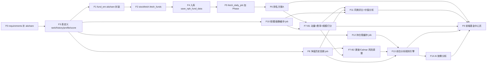

# 场外开放式基金数据获取 + 排名 开发计划

> **Status**: 已按代码核实升级（updated 2026-06-01；akshare schema 已实测对齐）
> **范围**: 新增「场外开放式基金（净值型 + 货币型）」数据域，含每日净值/多周期收益率抓取、入库，以及基金排名（先 A 直接排序，后 B 多因子综合打分，分期交付）。
> **用户决策**：① 基金范围 = 场外开放式基金（净值型）；② 排名 = 先 A 后 B 分期；③ 流程 = 先出本文档再实现。
> **核心原则**：复用现有数据域流水线模式（爬虫 → stockfetch 调度 → tablestructure 自动建表 → basic_data_daily_job 入库 → fetch_daily_job 编排），严守 fetch/analysis/web 三管道分离。
>
> **本次升级关键结论（已核实）**：
> 1. ✅ **akshare 是既有依赖**（`quantia/job/stock_announcement_em.py` 已 `import akshare`，财务数据走 AkShare），且 venv 已装 `akshare 1.17.75`。原 v1 文档「非 akshare」表述错误，已纠正。**但 akshare 漏在 `requirements.txt`**——属既有隐患，本计划顺带修复。
> 2. ✅ **不必手写东财基金爬虫**：akshare 自带 `fund_open_fund_rank_em` / `fund_money_rank_em` / `fund_open_fund_daily_em` / `fund_open_fund_info_em`，已实测可用，省去逆向分页/字段工作。
> 3. ✅ **两表合一**：`fund_open_fund_rank_em` 单函数即返回「净值 + 全周期收益率 + 按类型分桶」，每日落库本身就是净值时间序列，方案 B 的夏普/回撤可直接读历史行。原 v1 的 `cn_fund_spot` + `cn_fund_rank` 双表冗余，合并为单表 `cn_fund_rank`。
> 4. ✅ **自动建表 + 主键已确认**：`insert_db_from_df` 在表不存在时由 `to_sql(dtype=cols_type)` 建表，并在首次插入后 `ALTER TABLE ... ADD PRIMARY KEY(primary_keys)`（[database.py](../../quantia/lib/database.py#L314)）。无需手写 `init_job` CREATE TABLE。

---

## 0. 背景与定位

### 0.1 与现有数据域的区分

| 数据域 | 表 | 内容 | 现状 |
|--------|----|----|------|
| 场内 ETF | `cn_etf_spot` | 盘中行情（OHLC、成交量、换手率） | ✅ 已支持，多源抓取 |
| 指数 | `cn_index_spot` | 指数行情 | ✅ 已支持 |
| 股票 | `cn_stock_spot` / `cn_stock_selection` | 行情 + 基本面 | ✅ 已支持 |
| **场外开放式基金** | `cn_fund_rank`（新，单表） | **每日净值 + 多周期收益率排名** | ❌ 本计划新增 |

**关键差异**：场外基金**没有盘中行情/K 线**，只有 T+1 晚间披露的**每日净值**（单位净值/累计净值/日增长率）。排名维度来自净值衍生的多周期收益率，而非价格技术指标。

### 0.2 数据源（已实测）

项目 fetch 管道**已使用 akshare**（财务数据、公告数据）。基金数据直接调用 akshare 现成函数，**无需手写爬虫**。以下列结构均为 2026-06-01 在 venv 内实跑核实。

| akshare 函数 | 适用基金类型 | 返回 | 实测 |
|--------------|--------------|------|------|
| `fund_open_fund_rank_em(symbol=类型)` | 净值型（股票/混合/债券/指数/QDII/FOF） | 序号,基金代码,基金简称,日期,单位净值,累计净值,日增长率,近1周,近1月,近3月,近6月,近1年,近2年,近3年,今年来,成立来,自定义,手续费 | 股票型 1056×18 ✅ |
| `fund_money_rank_em()` | 货币型 | 序号,基金代码,基金简称,日期,万份收益,年化收益率7日/14日/28日,近1月,近3月,近6月,近1年,近2年,近3年,近5年,今年来,成立来,手续费 | 542×18 ✅ |
| `fund_open_fund_info_em(symbol=code, indicator='单位净值走势')` | 单基金净值历史（全量） | 净值日期,单位净值,日增长率 | 000001 返 5931×3 ✅（F8 回填用） |
| `fund_individual_basic_info_xq(symbol=code)` | 单基金画像（item/value） | 含最新规模(“26.44亿”)、基金公司、基金经理、基金类型、基金评级、投资策略/目标 | 14×2 ✅（规模因子+投资价值用） |
| `fund_scale_open_sina(symbol=类型)` | 批量规模（备选） | 基金代码,单位净值,总募集规模,最近总份额,成立日期,基金经理 | 6608×9 ✅（AUM≈份额×净值） |
| `fund_portfolio_hold_em(symbol=code, date=年份)` | 单基金季度前十大重仓股（F12） | 序号,股票代码,股票名称,占净值比例,持股数,持仓市值,季度 | 000001/2024 返 10×7/季 ✅（持仓股 + 行业映射用） |
| `fund_individual_basic_info_xq(symbol=code)` 的「业绩比较基准」item | 基准（F11 超额收益） | 文本（如"沪深300指数收益率×80%+..."） | ⚠️ **待核实**：该 item 是否在 14 行画像内未实跑确认，实现前需验证；若无则基准超额降级用同类平均 |
| `fund_open_fund_daily_em()` | 全市场当日净值 | 列名含日期（动态列，处理麻烦） | ⚠️ 不优先用，rank 已含净值 |

**`fund_open_fund_rank_em` 的 `symbol` 取值**：`全部/股票型/混合型/债券型/指数型/QDII/FOF`。按类型循环调用，天然得到 `fund_type` 分桶——正好满足「分类排名」硬约束。

> 字段处理注意：`手续费` 为字符串如 `'0.15%'`，需 strip `%` 转 float；`序号`/`自定义` 列丢弃；akshare 的 `日期` 列是该基金净值披露日（可能滞后于运行日、各基金不一），落入 `nav_date`，而入库主键 `date` 用运行日（见 §2）。
>
> **持仓股（F12）注意**：`fund_portfolio_hold_em` 仅披露**季度前十大重仓股**（非全持仓），`占净值比例` 为字符串百分数需解析；`date` 入参是**年份**（如 `"2024"`），返回该年各季度，需取最新季度。重仓股的「行业」akshare 此函数不直接给——需 LEFT JOIN 本项目已有的股票行业表（`cn_stock_selection.industry` 或行业分类表）按 `stock_code` 回填，从而支持「按行业筛选/对比」。
>
> **基准超额（benchmark）说明**：场外基金的「业绩比较基准」是文本表达式（如"沪深300×80%+中证综合债×20%"），**无现成数值序列**。基准超额收益的实现取两条务实路径：① 解析基准里的主指数代码，复用本项目 `load_benchmark_data`（指数管道，**严守 AGENTS 规则 3**：指数走 `load_benchmark_data` 不走 `load_stock_data`）取同期指数收益做近似超额；② 简化为「同类平均收益」作为对照基线（已有，桶内均值）。首期用 ②（零额外抓取），F11/详情页标注「对照=同类平均」；②→① 作为增量。

---

## 1. 范围定义

### 1.1 第一期（MVP，本计划主交付）

| # | 功能 | 优先级 |
|---|------|--------|
| F0 | 补 `requirements.txt` 加 `akshare>=1.17`（既有隐患修复） | P0 |
| F1 | 基金爬虫薄封装 `core/crawling/fund_em.py`（包 akshare 函数 + 列映射 + 费率解析），**不逆向东财** | P0 |
| F2 | `stockfetch.fetch_funds(date)`：循环各类型调用 + 异常容错 + 字段对齐 `TABLE_CN_FUND_RANK` | P0 |
| F3 | `tablestructure` 新增**单表** `TABLE_CN_FUND_RANK`（净值+收益率+类型，自动建表） | P0 |
| F4 | `basic_data_daily_job.save_nph_fund_data(date)` 入库（DELETE by date + upsert，chunksize=500） | P0 |
| F5 | `fetch_daily_job` 新增 Phase + 基金专属新鲜度/结算时间 + job 追踪 | P0 |
| F6 | ✅ **排名方案 A**：直接读 `cn_fund_rank`，按 `fund_type` 分桶按周期收益率排序（`fundRankHandler` + 路由 + 前端 api + 单测） | P1 |

### 1.2 第二期（增量，后续 PR）

| # | 功能 | 优先级 |
|---|------|--------|
| F7 | **排名方案 B**：`analysis` 管道多因子截面打分（B1 动量+费率+规模无需历史；B2 叠加夏普/Calmar 依赖 F8），按类型分桶，写 `cn_fund_rank_score` | P2 |
| F8 | **净值历史回填 + 增量缓存**：`fund_open_fund_info_em` 逐基金拓史（**仅 B1-Top-N ∪ 按需点开，非全市场；跳过货币型**），写 `cn_fund_nav_history`（供回撤/夏普/净值曲线） | P1 |
| F10 | **规模+画像缓存**：`fund_individual_basic_info_xq` 拓最新规模/公司/经理/评级/策略，周/月频写 `cn_fund_profile`（规模因子 + 投资价值分析数据源） | P1 |
| F11 | **同类基金评比 + 投资价值分析**：同 `fund_type` 桶内多维雷达对比 + 价值标签（Handler） | P1 |
| F9 | **前端基金中心页**（直观、人性化）：排行榜 + 同类评比雷达 + 净值曲线 + 价值分析卡片 + AI 工具 | P1 |
| F12 | **持仓股缓存**：`fund_portfolio_hold_em` 拓季度前十大重仓股，写 `cn_fund_holding`；LEFT JOIN 行业表得行业分布（支持「按行业筛选/对比」+ 详情持仓展示） | P1 |
| F13 | **综合分析与建议（规则引擎）**：融合「历史业绩（夏普/回撤/多周期收益/基准超额）+ 持仓（集中度/行业分布/风格）」生成结构化解读 + 风险等级标签（**非买卖建议**） | P1 |
| F14 | **AI 综合分析（按需触发）**：用户点击才运行的 LLM 分析——喂入该基金所有已落库数据（净值/收益/夏普/回撤/持仓/画像/基准）+ `web_search` 检索的相关资讯，产出自然语言综合分析。懒加载、异步、结果可缓存 | P2 |

> 用户已明确：**需要前端（直观/人性化）、需要回填净值历史、需要规模因子、需要同类评比+投资价值分析、需要夏普/最大回撤/近1/3/5年/基准收益、需要按行业筛选对比、需要持仓股、需要综合分析+建议、需要按需 AI 分析**。故 F8~F14 均纳入交付。

### 1.3 明确不做

- ❌ 不做场外基金的「买卖点/技术指标」（无 K 线，不适用）。
- ❌ 不把基金 code JOIN 进任何 `cn_stock_*` 表（code 空间与股票重叠，如 `000001`）。
- ❌ 不跨基金类型混排（货币 7 日年化 vs 股票型年收益不可比）。

---

## 2. 表结构设计（tablestructure.py）— 单表方案

### `TABLE_CN_FUND_RANK` — 每日净值 + 多周期收益率（净值型 & 货币型合一）

唯一键 `(date, code)`，与 ETF 一致。**`date` = 入库快照日（运行日/交易日）**，另设 `nav_date` = akshare 返回的净值披露日（可能滞后/各基金不一）——这样方案 A 的 `WHERE date=MAX(date)` 取得到完整一批，不会因部分基金披露滞后而漏选。净值型与货币型字段不同，互斥列 nullable。每日落库即净值/收益率时间序列，**方案 A 零计算、方案 B 历史可追溯**。

| 列 | 类型 | 净值型来源 | 货币型来源 |
|----|------|-----------|-----------|
| date | DATE | 入库快照日（运行日） | 入库快照日（运行日） |
| code | VARCHAR(6) | 基金代码 | 基金代码 |
| name | VARCHAR(60) | 基金简称 | 基金简称 |
| nav_date | DATE | 日期（披露净值日） | 日期 |
| fund_type | VARCHAR(20) | symbol 循环值 | '货币型' |
| unit_nav | FLOAT | 单位净值 | null |
| acc_nav | FLOAT | 累计净值 | null |
| day_growth | FLOAT | 日增长率 | null |
| million_unit_income | FLOAT | null | 万份收益 |
| seven_day_annual | FLOAT | null | 年化收益率7日 |
| rate_1w | FLOAT | 近1周 | null |
| rate_1m / rate_3m / rate_6m | FLOAT | 近1月/3月/6月 | 近1月/3月/6月 |
| rate_1y / rate_2y / rate_3y | FLOAT | 近1/2/3年 | 近1/2/3年 |
| rate_ytd / rate_since | FLOAT | 今年来/成立来 | 今年来/成立来 |
| fee | FLOAT | 手续费(解析%) | 手续费(解析%) |

> 建表方式：`insert_db_from_df(data, 'cn_fund_rank', cols_type, False, "\`date\`,\`code\`")`——表不存在时自动建表并加 `(date,code)` 主键（已核实 [database.py](../../quantia/lib/database.py#L314)）。`cols_type = tbs.get_field_types(TABLE_CN_FUND_RANK['columns'])`。
>
> **不做** `cn_fund_spot` 单独快照表——rank 已含净值，避免冗余双写。

### `TABLE_CN_FUND_NAV_HISTORY` — 单位净值历史（F8，回撤/夏普/净值曲线）

来源 `fund_open_fund_info_em(symbol=code, indicator='单位净值走势')` + `indicator='累计净值走势'`。唯一键 `(code, nav_date)`。增量：每日新增最新一行，首次按需回填全史。

| 列 | 类型 | 来源 |
|----|------|------|
| code | VARCHAR(6) | 入参 |
| nav_date | DATE | 净值日期 |
| unit_nav | FLOAT | 单位净值（展示净值曲线用） |
| acc_nav | FLOAT | **累计净值**（算长期收益/夏普/回撤用，已还原分红拆分） |
| day_growth | FLOAT | 日增长率 |

> 主键 `(code, nav_date)`，建表 `insert_db_from_df(df, 'cn_fund_nav_history', cols_type, False, "\`code\`,\`nav_date\`")`。
>
> **⚠️ 审计修正（重要 bug）**：长期收益率 / 夏普 / 最大回撤**必须用 `acc_nav`（累计净值）**，不能用 `unit_nav`。单位净值在**分红/拆分**日会跳水（如 1.5→1.0 派现），用单位净值算会产生**虚假回撤**、**低估多年收益**。`fund_open_fund_info_em` 的 `累计净值走势` indicator 已还原分红，是长期口径的正确来源。净值曲线**展示**可用 unit_nav（用户直观），但**所有派生风险/收益指标用 acc_nav**。

### `TABLE_CN_FUND_PROFILE` — 规模 + 画像（F10，规模因子 & 投资价值分析）

来源 `fund_individual_basic_info_xq(symbol=code)`（item/value 透视为一行）。规模/经理/评级季度级稳定，**周/月频更新**即可，不必每日。唯一键 `code`（覆盖更新）。

| 列 | 类型 | 来源（item） |
|----|------|------|
| code | VARCHAR(6) | 基金代码 |
| name | VARCHAR(60) | 基金名称 |
| full_name | VARCHAR(120) | 基金全称 |
| setup_date | DATE | 成立时间 |
| scale_yi | FLOAT | 最新规模（"26.44亿"→26.44，解析为亿元单位 float） |
| company | VARCHAR(60) | 基金公司 |
| manager | VARCHAR(120) | 基金经理 |
| fund_type_detail | VARCHAR(40) | 基金类型（如"混合型-偏股"） |
| rating | VARCHAR(20) | 基金评级 |
| strategy | TEXT | 投资策略 |
| objective | TEXT | 投资目标 |
| benchmark | VARCHAR(200) | 业绩比较基准文本（**待核实**：若 xq 画像无此 item，则改用 `fund_individual_analysis_xq`/`fund_basic_info_xq` 或留空，基准超额降级用同类平均；实现前需实跑确认字段名） |
| update_date | DATE | 更新日（入库日） |

> 规模解析需容错单位："亿"→×1、"万"→×1e-4 亿；"<NA>"/空→None。

### `TABLE_CN_FUND_HOLDING` — 季度前十大重仓股（F12，持仓展示 + 行业筛选/对比）

来源 `fund_portfolio_hold_em(symbol=code, date=年份)`，取最新季度。唯一键 `(code, quarter, stock_code)`。`industry` 由 LEFT JOIN 本项目股票行业表（按 `stock_code`）回填，**不新增行业抓取**。

| 列 | 类型 | 来源 |
|----|------|------|
| code | VARCHAR(6) | 基金代码 |
| quarter | VARCHAR(10) | 季度（如 "2025年1季度"，取最新） |
| stock_code | VARCHAR(8) | 股票代码 |
| stock_name | VARCHAR(40) | 股票名称 |
| hold_ratio | FLOAT | 占净值比例（"5.21%"→5.21 解析为 float） |
| hold_shares | FLOAT | 持股数（万股，nullable） |
| hold_value | FLOAT | 持仓市值（万元，nullable） |
| industry | VARCHAR(40) | LEFT JOIN 股票行业表回填（缺失→"未分类"） |
| update_date | DATE | 入库日 |

> 主键 `(code, quarter, stock_code)`，建表 `insert_db_from_df(df, 'cn_fund_holding', cols_type, False, "\`code\`,\`quarter\`,\`stock_code\`")`。
> 「按行业筛选」= 用每只基金重仓股的 `industry` 加权（hold_ratio）得「主行业/行业分布」，作为基金的行业标签，供排行榜行业过滤与同行业对比。

### `TABLE_CN_FUND_RANK_SCORE` — 多因子综合得分（F7）

由 analysis 管道计算，唯一键 `(date, code)`。

| 列 | 类型 | 含义 |
|----|------|------|
| date | DATE | 计算日 |
| code | VARCHAR(6) | 基金代码 |
| fund_type | VARCHAR(20) | 分桶 |
| score | FLOAT | 综合得分 0~100（桶内截面） |
| momentum_score / fee_score / scale_score | FLOAT | 分项（B1） |
| sharpe_score / calmar_score | FLOAT | 分项（B2，nullable） |
| sharpe | FLOAT | 夏普比率原值（年化，F8，nullable，展示用） |
| max_drawdown | FLOAT | 最大回撤原值（负数或绝对值，F8，nullable，展示用） |
| rate_3y / rate_5y | FLOAT | 近3年/近5年收益（净值型 5y 由 F8 净值序列算；货币型直接取 rank 表） |
| excess_1y | FLOAT | 近1年相对对照基线（同类平均或基准指数）超额，nullable |
| main_industry | VARCHAR(40) | 主行业标签（F12 加权得出，nullable） |
| rank_in_type | INT | 桶内名次 |

### `TABLE_CN_FUND_AI_ANALYSIS` — AI 按需分析结果缓存（F14）

用户点击才生成，按 `(code, data_date)` 缓存，同日重复点击直读缓存不重复烧 token。唯一键 `(code, data_date)`。

| 列 | 类型 | 含义 |
|----|------|------|
| code | VARCHAR(6) | 基金代码 |
| data_date | DATE | 所依据数据快照日（同日复用） |
| content | MEDIUMTEXT | LLM 生成的结构化分析（markdown/JSON） |
| sources | TEXT | web_search 引用源 JSON（标题+链接） |
| model | VARCHAR(40) | provider/model 名 |
| created_at | DATETIME | 生成时间 |

> 或复用现有 AI 会话存储层，但独立缓存表更简单可控。建表 `insert_db_from_df(df, 'cn_fund_ai_analysis', cols_type, False, "\`code\`,\`data_date\`")`。**本表由 web/AI 管道写入（非 fetch 管道），是分析结果缓存而非原始金融数据。**

---

## 3. 抓取与入库流水线

### 3.1 爬虫薄封装 `core/crawling/fund_em.py`

**不逆向东财**，直接包 akshare 函数 + 做中文列→英文列映射 + 费率解析：

```python
import akshare as ak

_NAV_TYPES = ['股票型', '混合型', '债券型', '指数型', 'QDII', 'FOF']

def fund_rank_all() -> pd.DataFrame:
    """净值型逐类型 + 货币型，统一到 TABLE_CN_FUND_RANK 列。"""
    frames = []
    for t in _NAV_TYPES:
        df = ak.fund_open_fund_rank_em(symbol=t)   # 含单位/累计净值 + 全周期收益
        df = _map_nav_columns(df); df['fund_type'] = t
        frames.append(df)
    money = ak.fund_money_rank_em()                # 货币型（万份收益/7日年化）
    money = _map_money_columns(money); money['fund_type'] = '货币型'
    frames.append(money)
    return pd.concat(frames, ignore_index=True)
```

要点：
- 逐类型循环间加 `time.sleep(random.uniform(1,2))` 限速。
- `_map_nav_columns` / `_map_money_columns` 丢弃 `序号`/`自定义`，`手续费` strip `%` 转 float，数值列 `pd.to_numeric(errors='coerce')`。
- akshare 无内置健康追踪，某类型失败时 try/except 跨过并记录，不中断其他类型；全部失败才返回 None。

### 3.2 调度 `stockfetch.fetch_funds(date)`

对标 [fetch_etfs](../../quantia/core/stockfetch.py#L329) 风格，但数据源为 akshare 单源（预留多源列表骨架）：

```python
def fetch_funds(date):
    data = fem.fund_rank_all()
    if data is None or len(data.index) == 0:
        return None
    data.insert(0, 'date', (date or datetime.date.today()).strftime('%Y-%m-%d'))
    data = data.drop_duplicates(subset=['code'], keep='first')   # 防跨类型桶重复
    data = data[list(tbs.TABLE_CN_FUND_RANK['columns'])]
    return data
```

> akshare 抓取属 fetch 管道（stockfetch/crawling/fetch_*），符合管道分离。先例：`stock_announcement_em.py` 已在 job 层直接用 akshare。
> `date` 写运行日、`nav_date` 保留 akshare `日期`。费率解析需容错 `'0.15%'`/`'0'`/`'---'`/`''` → `float` 或 None（正则提 `%` 前数字，否则 None）。

### 3.3 入库 `basic_data_daily_job.save_nph_fund_data(date)`

照搬 [save_nph_etf_spot_data](../../quantia/job/basic_data_daily_job.py#L52)：DELETE by date → `insert_db_from_df(data, 'cn_fund_rank', cols_type, False, "\`date\`,\`code\`")`。

**DB 写入硬约束（db-writes 规则）**：
- `insert_db_from_df` 已内置 `chunksize=_DB_INSERT_CHUNKSIZE(500)`，不得绕过。
- NaN/inf 在源头清洗（未披露列为 NaN）；`_sanitize_dataframe_for_mysql` 已在 `insert_*` 内部兜底，但收益率应在转 float 时就 coerce。

### 3.4 编排 `fetch_daily_job` 新增 Phase

在 selection（Phase 2）之后、扩展数据（Phase 3）之前插入「Phase 2.x 基金排名入库」：
- `_check_and_skip('cn_fund_rank', date_str, '基金排名')` 新鲜度跳过；
- `_FRESHNESS_THRESHOLDS` 新增一行 `'cn_fund_rank': _cfg.get_int('QUANTIA_FRESH_FUND_RANK', 8000)`（与现有 config-key 模式一致；净值型+货币型合计约 1.5万+）；
- `record_task_start/end` 追踪；失败仅记录不阻塞整体作业（仿现有 enrich_spot Phase 的 try/except）。

> **结算时间坑（已核实）**：`_check_and_skip(table_name, date_str, task_label)` 内部硬编码调 `trd.is_post_settlement(date_str)`（默认结算小时 `QUANTIA_SETTLEMENT_HOUR`=18，见 [trade_time.py](../../quantia/lib/trade_time.py#L206)）。**基金净值多在当晚 20:00–23:00 才披露、QDII T+2**，沿用 18:00 会在未披露时误跳过、入空。`is_post_settlement` **已支持 `settlement_hour` 入参**，但 `_check_and_skip` 当前未透传 → 落地修法：给 `_check_and_skip` 增加可选 `settlement_hour` 形参并透传，基金 Phase 调用时传 `settlement_hour=_cfg.get_int('QUANTIA_FUND_SETTLEMENT_HOUR', 23)`，不复用股票 18:00 结算门。

### 3.5 净值历史回填 + 画像缓存（F8 / F10，独立 job）

这两类是**逐基金分页**抓取，量大耗时，**不放进每日 `fetch_daily_job` 主链**，单列脚本 + 低频 cron：

**F8 `fetch_fund_nav_history_job.py`（净值历史）**
```python
import akshare as ak
for code in target_codes:                     # 见下「抓取范围」，非全市场 distinct code
    if is_money_fund(code):                   # 货币型无单位/累计净值走势序列，跳过
        continue
    unit = ak.fund_open_fund_info_em(symbol=code, indicator='单位净值走势')
    acc  = ak.fund_open_fund_info_em(symbol=code, indicator='累计净值走势')  # 长期口径
    hist = merge_on_navdate(unit, acc)       # unit_nav + acc_nav 合并到一行/日
    # 首次：全史回填；之后：只取 nav_date > 库内 MAX(nav_date) 的增量
    save_fund_nav_history(code, hist)         # insert_db_from_df 主键(code,nav_date)
    time.sleep(random.uniform(0.5, 1.5))      # 限速，分批跑
```
- **⚠️ 审计修正（抓取范围，重要）**：原「`fund_codes` = `cn_fund_rank` 全部 distinct code」需对 ~1.3万只净值型基金各拓净值历史，逐只 2 次 akshare 调用 + 限速 sleep。**真正瓶颈是回填壁钟时间 + akshare 限流/改版风险**，不是存储：全量约 20–30M 行×~50B ≈ 1.5–3GB，磁盘 30GB+ 轻松容纳；RAM 1.6GB 也不是问题，因为是**逐基金**处理（单只 ~6000 行极小）、`insert_db_from_df` 已 chunksize=500，不会一次物化全市场 DataFrame。但 13000 只×2 调用×~1s sleep ≈ **数小时**，且 akshare 可能限流。故采双轨：首期先用 **F7-B1**（动量+费率+规模，**不需净值历史**）对每桶全量打分排序 → 取每桶 **Top-N（如前 200）∪ 用户点开过详情的基金**（懒抓+缓存）**优先拓净值历史**，立即点亮 Top-N 的夏普/回撤展示；**全市场回填作为可续抓的多夜后台 cron**（`cron.workdayly`、跳过已有最新日 code）逐步补齐，不阻塞主链。与 F12 持仓股抓取范围口径一致（§3.5 F12）。
- **⚠️ 货币型跳过**：`fund_open_fund_info_em(indicator='单位净值走势'/'累计净值走势')` 仅适用净值型；货币型基金没有单位/累计净值走势（其 indicator 是「每万份收益」「7日年化收益率」），调用会报错或空 → F8 循环须 `is_money_fund(code)` 跳过（货币型本就不算夏普/回撤，§4.2/§4.B2）。
- 首期对 `target_codes` 全史回填一次（可分多日/分批，断点续抓：跳过库中已有最新日的 code）。
- 之后每日只补增量行（1 行/基金），或直接复用 `cn_fund_rank.unit_nav` 累积，省一次抓取。
- 放 `cron.workdayly` 或独立慢任务，**不阻塞**主 fetch。

**F10 `fetch_fund_profile_job.py`（规模+画像）**
```python
for code in fund_codes:
    info = ak.fund_individual_basic_info_xq(symbol=code)   # item/value
    row = pivot_items(info)                                # 透视 + 规模"亿"解析
    upsert_fund_profile(row)                               # 主键 code 覆盖
    time.sleep(random.uniform(0.5, 1.5))
```
- 规模/经理/评级季度级稳定，**周频或月频**跑一次即可（`cron.monthly` + 手动触发）。
- 容错：xq 接口可能限流/部分 code 无数据 → try/except 跳过并记录，不中断整批。

> 两 job 均属 fetch 管道、纯 akshare，符合管道分离。回填进度落 `cn_etl_job_status`（复用 `record_task_*`）便于断点续抓。

**F12 `fetch_fund_holding_job.py`（季度重仓股）**
```python
for code in target_codes:                                # 见下「抓取范围」，非全市场
    yr = current_year
    df = ak.fund_portfolio_hold_em(symbol=code, date=str(yr))
    if df is None or df.empty:                            # 年初最新季度可能在上一年
        df = ak.fund_portfolio_hold_em(symbol=code, date=str(yr-1))
    df = pick_latest_quarter(df)                          # 取最新季度前十大
    df = parse_ratio(df)                                  # "5.21%"→5.21
    df = join_industry(df)                                # LEFT JOIN 股票行业表回填 industry
    upsert_fund_holding(code, df)                         # 主键(code,quarter,stock_code)
    time.sleep(random.uniform(0.5, 1.5))
```
- 持仓**季度披露**，季频更新即可（`cron.monthly` + 手动触发），不进每日链。
- **抓取范围（落地性，重要）**：全市场逐只抓持仓量太大且多数用户只看头部 → 首期 `target_codes` **只覆盖**「评分 Top-N（如每桶前 200）∪ 用户点开过详情的基金（按需懒抓+缓存）」，而非全部数千只；缺持仓的基金详情页显示「暂无持仓数据」占位。
- `join_industry`：读本项目已有股票行业映射（**只读 MySQL，不调外部 API**，符合管道分离），按 `stock_code` 回填；缺失填 "未分类"。
- **行业映射仅覆盖 A 股**：QDII/港股/海外持仓与债券持仓在 A 股行业表里查不到 → 归 "未分类"。故「按行业筛选/对比」**仅对 A 股权益类（股票型/偏股混合/指数型）有效**，对 QDII/债券/货币型该能力默认关闭或提示「不适用」。
- 货币型/纯债型无股票重仓 → 跳过或返回空，不报错。

> **AGENTS 规则 1 重申**：F8/F10/F12 三个慢 job 抓取阶段走 akshare（fetch 管道）；`join_industry` 的行业回填是**读库**操作，仍属允许范围。analysis/web 侧（F13 综合分析、F11 评比）一律只读 MySQL。

---

## 4. 排名

### 4.1 方案 A（第一期，MVP）

直接读 `cn_fund_rank`，**按 `fund_type` 分桶**后按指定周期收益率排序：

```sql
SELECT code, name, fund_type, rate_1y, rate_ytd, ...
FROM cn_fund_rank
WHERE date = (SELECT MAX(date) FROM cn_fund_rank)
  AND fund_type = %s
ORDER BY rate_1y DESC LIMIT %s
```

- 新增 `fundRankHandler.py`（web 管道，只读 MySQL）+ 路由注册（`web_service.py`，遵守路由对齐规则 8）。
- 零计算成本，落库即可排名。

### 4.2 方案 B（第二期，多因子综合打分）

> **审计修正（重要）**：composite 的 `n_rank` 是**滚动时间序列**百分位（[`s.rolling(60).rank(pct=True)`](../../quantia/core/composite/normalizers.py#L25)），用于单标的指标的**时序**归一，**不能直接用于基金截面排名**。`n_lin` 只是 clip 到 0~100，也不适用于收益率。基金评分需**截面**百分位：同一 `date` 内、**按 `fund_type` 分组**做 `groupby('fund_type')[factor].rank(pct=True)*100`。复用 composite 仅借鉴「归一 → 加权合成」思路，需新增一个截面归一 helper（如 `n_cross_rank`），不要误用 `n_rank`。

在 `analysis` 管道（仿 [analysis_daily_job.py](../../quantia/job/analysis_daily_job.py)）计算综合得分，**强制按 `fund_type` 分桶**，写 `cn_fund_rank_score`。分两级交付：

**B1 — 截面动量 + 费率 + 规模（无需净值历史，可与方案 A 同期）**

动量/费率因子来自 `cn_fund_rank` 当日行，规模因子来自 `cn_fund_profile`（F10，周/月频，LEFT JOIN）：

| 因子 | 列 | 方向 | 建议权重 |
|------|----|----|---------|
| 中期动量 | rate_3m | 正 | 0.18 |
| 中期动量 | rate_6m | 正 | 0.22 |
| 长期动量 | rate_1y | 正 | 0.28 |
| 年内表现 | rate_ytd | 正 | 0.12 |
| 费率 | fee | 负 | 0.08 |
| 规模 | scale_yi | 适中（倒U） | 0.12 |

每因子在**同类型桶内**取截面百分位 $r_i = \text{rank}_{\text{pct}}(f_i) \times 100$（费率取 $100 - r_{\text{fee}}$），综合分：

$$\text{score} = \sum_i w_i \cdot r_i,\quad \sum_i w_i = 1$$

- 动量因子高度相关（rate_1y 与 rate_6m），故只取少数代表周期、避免重复计权；不要把全部 9 个周期都塞进去。
- **规模是「倒 U」非单调**：过小（<0.5 亿，有清盘风险）和过大（>200 亿，调仓笨重）都减分，取 $r_{\text{scale}} = 100 - |\,\text{rank}_{\text{pct}}(\log\text{scale}) - 0.5\,|\times 200$，中位规模得分最高。规模缺失（profile 未覆盖）填中性 50，不淘汰。
- 缺披露（NaN）因子在桶内填中性 50，不参与极端拉偏。

**B2 — 风险调整（依赖 F8 净值历史）**

在 B1 基础上叠加需要时间序列的因子（读 `cn_fund_nav_history`）：

| 因子 | 公式 | 依赖 |
|------|------|------|
| 夏普 | 年化收益 / 年化波动 | F8 净值历史 |
| Calmar | 年化收益 / \|最大回撤\| | F8 净值历史 |

夏普/Calmar 同样**桶内截面百分位**后并入加权。回撤/波动需逐基金净值序列，故必须先有 F8（F8 首期回填全史 + 每日增量）。

> **展示派生指标（用户明确要求，F8 净值序列一次算齐，落 `cn_fund_rank_score`）**：
> - **⚠️ 全部用 `acc_nav`（累计净值）计算，不用 `unit_nav`**——单位净值在分红/拆分日跳水会造成假回撤、低估收益（见 §2 nav_history 审计修正）。
> - **夏普比率** `sharpe`：基于 `acc_nav` 日对数/简单收益，$(\bar r_d \times 252 - r_f) / (\sigma_d \times \sqrt{252})$，$r_f$ 取无风险年化（可配置，默认 2%）。样本不足（< ~60 个交易日）返回 None，不强算。
> - **最大回撤** `max_drawdown`：$\min_t (\text{acc\_nav}_t / \max_{s\le t}\text{acc\_nav}_s - 1)$，展示取绝对值百分数。
> - **近1/3/5年收益**：近1/3年净值型 rank 表已有（`rate_1y`/`rate_3y`）；**近5年**净值型 rank 表无此列，由 F8 `acc_nav` 序列 `acc_t / acc_{t-5y} - 1` 计算落 `rate_5y`（成立不足5年→None）；货币型 rank 表本就含 `近5年`，直接取。
> - **基准超额** `excess_1y`：近1年收益 − 对照基线收益（首期对照=同类平均；增量=解析业绩比较基准主指数走 `load_benchmark_data`，**禁止把指数 code 路由 `load_stock_data`**，AGENTS 规则 3）。
> - **货币型不算夏普/最大回撤**（无单位净值波动，无意义），相关列留 None。

**货币型单独评分**：货币基金无单位净值、用 7 日年化 + 万份收益 + 费率，与净值型收益率不可比，**独立成桶单独打分**，不混入上面公式。

**通用约束**：
- 归一化按 `groupby('fund_type')` 截面，不跨桶。
- 评分类结果**禁止落库为可交易 strategy_template**（与 Phase 9 评分类范式守门一致）。
- 评分是排序辅助，不构成投资建议——前端需带风险提示。

---

## 4.5 同类基金评比 + 投资价值分析（F11）

> 用户明确需要：同类（同 `fund_type`）基金横向评比 + 投资价值分析。本节为只读 analysis/web 逻辑，不新增抓取。

### 4.5.1 同类评比（雷达多维对标）

`fundPeerCompareHandler`：给定 `code`，定位其 `fund_type` 桶，在桶内对比目标基金 vs 同类中位/最优，输出 5 维**桶内百分位**（0~100）：

| 维度 | 数据来源 | 含义 |
|------|---------|------|
| 收益 | rate_1y 桶内分位 | 长期回报 |
| 抗跌 | 100 − 最大回撤分位（F8） | 风险控制 |
| 稳定 | 夏普分位（F8） | 风险调整后收益 |
| 成本 | 100 − fee 分位 | 费率优势 |
| 规模 | scale_yi 倒U 分位（F10） | 规模适中度 |

前端用雷达图直观呈现「目标基金 vs 同类平均」两条轮廓。

### 4.5.2 投资价值分析（规则标签，非投资建议）

基于上述分位 + `cn_fund_profile` 生成**可解释标签**，禁止"买/卖"措辞：

- 「同类收益前 10%」「回撤控制优于同类 85%」「费率低于同类中位」「规模适中」「成立满 N 年」「评级 X」。
- 价值综合分 = F7 的 `score`（桶内）；标签由阈值规则生成（如分位≥90→"领先"、≤30→"靠后"）。
- 每张分析卡片带**风险提示固定文案**：「历史业绩不代表未来，非投资建议」。
- AI 工具（F9 第二期）只读这些已算好的标签/分位，不让 LLM 现编数字（防幻觉）。

### 4.5.3 按行业筛选 + 同行业对比（F12）

- 每只基金由 `cn_fund_holding` 重仓股 `industry` 按 `hold_ratio` 加权得**行业分布**与**主行业**（`main_industry`）。
- 排行榜支持「行业」二级过滤：选某行业 → 只看该行业为主的基金；与 `fund_type` 桶**叠加**（先类型桶、再行业过滤，仍不跨类型比）。
- 同行业对比：在同 `fund_type` 且同 `main_industry` 子集内做收益/夏普/回撤横向排序（复用 §4.5.1 雷达，标注「同行业」）。
- 行业回填缺失（重仓股无行业映射）→ 归"未分类"，过滤时单列一档，不淘汰。

---

## 4.6 综合分析与建议（F13，规则引擎，非投资建议）

> 用户明确需要「根据持仓股 + 历史业绩的综合分析和建议」。本节为 **analysis/web 只读规则引擎**，融合两类已落库数据，输出结构化解读，**禁止"买/卖/加仓/减仓"措辞**，统一为风险/特征描述 + 风险等级。

`fundCompositeAnalysisHandler`（只读 MySQL）：给定 `code`，汇聚 `cn_fund_rank` / `cn_fund_rank_score` / `cn_fund_nav_history` / `cn_fund_holding` / `cn_fund_profile`，按规则生成：

| 维度 | 输入 | 规则化输出 |
|------|------|-----------|
| 历史业绩 | rate_1y/3y/5y、夏普、最大回撤、excess | "近3年年化X%""夏普Y（同类前Z%）""最大回撤W%（抗跌优于N%）""跑赢对照基线/落后" |
| 持仓集中度 | 前十大 hold_ratio 之和 | <40% 分散 / 40~60% 适中 / >60% 集中（高弹性高风险） |
| 行业分布 | industry 加权 | "主配<行业>，行业集中度<H>""分散于N个行业" |
| 风格 | fund_type_detail + 重仓股市值 | 偏股/偏债/均衡、大盘/中小盘（如有市值数据） |
| 规模/成立 | scale_yi、setup_date | "规模适中/偏小需留意""成立满N年具备完整周期" |
| **风险等级** | 波动+回撤+集中度综合 | 低/中/中高/高（规则阈值映射，非模型预测） |

- 输出为**结构化 JSON**（字段 + 规则标签 + 一句话模板总结），前端渲染为卡片，**不调用 LLM**（确定性、可复现、防幻觉）。
- 每段带数据出处与口径说明；底部固定风险提示。
- 与 §4.5.2 价值标签共享阈值常量，避免两处口径不一致。

---

## 4.7 AI 综合分析（F14，按需触发，LLM + web_search）

> 用户明确：「基于该基金能获取的所有数据 + 通过 web_search 获取的相关数据进行综合分析；AI 分析只有用户点击才运行并展示结果」。

**触发与生命周期**：
- **懒加载**：详情页 AI 卡片初始只显示「运行 AI 分析」按钮，**不自动调用**（省 token、避免无谓 LLM 调用）。
- 用户点击 → 前端 `POST /quantia/api/fund/ai_analysis {code}` → 后端**异步**跑，SSE/轮询回结果；按钮置 loading。
- 结果按 `(code, 数据日期)` **缓存**（如 `cn_fund_ai_analysis` 或缓存层），同日重复点击直接读缓存，不重复烧 token。

**数据装配（喂给 LLM 的上下文，全部来自已落库 + 检索，遵守 ai-tools 验证优先）**：
1. **本地结构化数据**：该基金 `cn_fund_rank`（多周期收益）+ `cn_fund_rank_score`（夏普/回撤/评分/超额/主行业）+ `cn_fund_holding`（前十大重仓+行业）+ `cn_fund_profile`（公司/经理/规模/评级/基准/策略）+ F13 已算好的规则结论。**数字由后端算好传入，禁止让 LLM 现编**（ai-tools 反幻觉）。
2. **web_search 检索**：以「基金名称 / 基金经理 / 重仓股」为 query 调既有 AI `web_search`/检索工具，取近期资讯摘要（基金经理变更、限购、行业政策、重仓股事件等），**带来源链接**。检索结果作为上下文，LLM 须**标注引用**、不得编造来源。

**Prompt 契约（复用 `quantia/lib/ai/agent.py` 运行时 + `prompt/*.md`）**：
- system 明确「你只能基于提供的结构化数据和检索摘要分析，数字不得改写，无依据不得臆断」。
- 强制负向约束：**没有**给出未来涨跌预测、**没有**"买入/卖出"指令、必须输出风险提示。
- 输出结构：① 业绩与风险概览（引用本地数字）② 持仓与行业解读 ③ 近期资讯影响（引用 web_search，带链接）④ 风险点 ⑤ 适合的投资者画像描述（非荐买）。

**工程约束**：
- 复用既有多 provider LLM 接入（`quantia/lib/ai/providers/`）与**已注册的 `web_search` 工具**（[`WebSearchTool`](../../quantia/lib/ai/tools/web_search.py)，`name='web_search'`，支持博查/Bing CN/自建代理，`top_n` 限流），不新造轮子。新增提示词文件 `quantia/lib/ai/prompt/fund_analyst.md`——`prompt_loader` **无显式注册表**，[`prompt_loader.load('fund_analyst')`](../../quantia/lib/ai/prompt_loader.py) 按文件名直接读取即可（与 `stock_analyst` 同机制）；由调用 Handler 经 `agent.run(..., allowed_tools=['web_search'])` 注入工具白名单。**`sql_query` 可选**：本特性数字全部由后端预先算好装配进 user 上下文（反幻觉），LLM 不需要也不应自由查库，故默认 `allowed_tools=['web_search']`；仅当确需让模型补查时再加 `'sql_query'`（受 validate-first 列校验门控）。
- 结果写 `cn_fund_ai_analysis`（§2，`(code,data_date)` 缓存）。
- 调用失败/超时 → 降级展示 F13 的规则化综合分析（已确定性可得），并提示「AI 暂不可用」。
- 严守管道分离：web_search 属 AI 工具运行时（非 fetch 数据落库管道），仅服务于即时分析，不写入基金数据表（缓存表 `cn_fund_ai_analysis` 是分析结果非原始金融数据）。
- 风险：LLM 幻觉/越权荐买/编造来源 → 由 system prompt 负向约束 + 后端只传已验证数字 + 前端固定风险提示三重兜底。

---

## 5. 风险与约束清单

| # | 风险 | 对策 |
|---|------|------|
| 1 | 基金 ~1.5万+ 只（净值型逐类型约 1056 股票型/542 货币型等 + 货币型） | 逐类型 concat 后一次写入，chunksize=500；handler 不物化全量 |
| 2 | 净值 T+1/T+2 披露延迟 | 以 akshare `日期` 列为准；基金专属结算时间阈值，未披露当晚不入空 |
| 3 | 跨类型排名无意义 | `fund_type` 分桶为硬约束，A/B 都强制分桶 |
| 4 | code 与股票重叠（000001） | 基金独立表，禁止与 `cn_stock_*` JOIN |
| 5 | 货币基金无单位净值，列结构不同 | 合一表互斥列 nullable；排名用 7日年化单独桶 |
| 6 | akshare 无健康追踪/可能限流或改版 | 逐类型 try/except + 全部失败才返回 None；锁定 `akshare>=1.17` 防 schema 漂移 |
| 7 | akshare 漏在 requirements.txt | F0 补加（既有隐患，不仅基金需要） |
| 8 | 管道分离 | akshare 抓取只在 fetch 管道；排名 Handler/分析任务只读 MySQL，不调 API |
| 9 | 路由对齐 | 前端 API 调用前确认 `web_service.py` 已注册对应 Handler（规则 8） |
| 10 | `n_rank` 是滞动时序百分位，误用于截面会错乱 | 评分用 `groupby('fund_type')[f].rank(pct=True)` 截面归一，新增 helper不复用 `n_rank`（见 §4.2） |
| 11 | 规模因子需额外拓（rank 表无此列） | F10 由 `fund_individual_basic_info_xq` 周/月频拓「最新规模」入 `cn_fund_profile`；evaluate 时 LEFT JOIN，缺失填中性 |
| 12 | 费率字段含 `'---'`/空；规模含“亿/万”单位/`<NA>` | 解析容错→None，不报错；评分时桶内填中性 |
| 13 | F8/F10 逐基金拓史耗时（~1.5万只） | 独立慢 job + 限速 + 断点续抓（跳过已有最新日 code），不进主 fetch 链 |
| 13b | **F8 全市场回填壁钟时间长（~13000只×2调用×限速≈数小时）+ akshare 可能限流** | 首期 F8 仅拓 B1-Top-N ∪ 按需点开（同 F12）快速点亮夏普/回撤；全市场回填作为可续抓多夜后台 cron 逐步补齐。**存储非瓶颈**：~20–30M 行≈1.5–3GB，30GB+ 磁盘容纳；RAM 1.6GB 不受影响（逐基金处理 + chunksize=500）。货币型无净值走势序列须 `is_money_fund` 跳过（§3.5 F8） |
| 14 | 投资价值标签被误读为投资建议 | 纯规则分位标签，禁“买/卖”措辞；每卡片带风险提示；AI 只读已算数值防幻觉 |
| 15 | 前端排行榜性能（万级行） | 后端分页+桶过滤，不一次返回全量；ECharts 雷达/曲线在 tab 切换后 `resize()`（见 AGENTS ECharts 条） |
| 16 | 持仓股仅前十大、季度滞后、非全持仓 | 明确标注「季度前十大重仓（截至 X 季度）」；集中度只算前十大；货币/纯债无股票持仓时空态占位 |
| 17 | 重仓股行业回填靠 JOIN 股票行业表，可能缺失 | 缺失归"未分类"，不淘汰；行业回填是**读库**操作不破坏管道分离 |
| 18 | 基准超额无现成数值序列 | 首期对照=同类平均（零抓取）；增量解析基准主指数走 `load_benchmark_data`（**禁 `load_stock_data`**，规则3） |
| 19 | 夏普/回撤/近5年依赖 F8 净值序列，样本不足会失真 | 样本 <60 交易日返回 None 不强算；前端缺值占位；货币型不算夏普/回撤 |
| 20 | AI 分析烧 token / 幻觉 / 越权荐买 / 编造来源 | 懒加载（点击才跑）+ 结果按(code,日期)缓存；后端只传已验证数字；system prompt 负向约束禁预测/禁买卖；web_search 须标注来源；失败降级 F13 规则分析 |
| 21 | web_search 引入外部内容（提示注入风险） | 检索结果作上下文须当不可信数据处理，prompt 隔离指令；不让外部文本改写本地数字；仅服务即时分析不落库 |
| 22 | **用 unit_nav 算长期收益/夏普/回撤失真**（分红拆分跳水） | nav_history 增存 `acc_nav`（累计净值）；所有派生指标用 acc_nav，unit_nav 仅展示（§2/§4.B2） |
| 23 | 行业映射仅覆盖 A 股，QDII/债券/货币无行业 | 行业筛选/对比仅对 A 股权益类启用；其余桶隐藏行业能力并提示不适用（§3.5 F12/§9.2） |
| 24 | benchmark 字段来源未实跑核实 | 标「待核实」；实现前验证 xq item 名，若无则基准超额降级同类平均（验证优先原则） |
| 25 | F12 全市场逐只抓持仓过慢且多余 | 首期仅抓 评分 Top-N ∪ 用户点开过的基金（按需懒抓+缓存），非数千只全量（§3.5 F12） |
| 26 | 货币型桶误显夏普/回撤/持仓等无意义列 | 前端按 `fund_type` 动态列；货币型只显 7日年化/万份收益，不填假值（§9.2） |
| 27 | AI 分析结果未定义缓存表 | 新增 `cn_fund_ai_analysis`（(code,data_date) 主键），同日复用不重复烧 token（§2） |

---

## 6. 交付顺序与依赖



**交付 PR 拆分建议**：
1. PR-1：F0 + 五表定义（rank/history/profile/score/holding）+ `fund_em` akshare 封装 + stockfetch 调度（单测：mock `ak.fund_open_fund_rank_em` 返回样例 DataFrame，校验列映射 + 费率解析）。
2. PR-2：入库 + fetch_daily_job 编排（黑盒：本地跑一次 `fetch_funds` + 入库，校验行数/各类型分布）。
3. PR-3：F8 净值历史回填 job + F10 规模/画像 job + F12 持仓股 job（黑盒：抽样 code 拒史/拓持仓，校验行数/行业回填/断点续抓）。
4. PR-4：F7 评分（B1+B2，含夏普/回撤/近5年/基准超额）+ F11 同类评比 + F13 综合分析规则引擎 Handler + 路由。
5. PR-5：F9 前端基金中心页（排行榜+行业过滤 + 雷达评比 + 净值曲线 + 持仓 + 价值卡片 + 综合分析）+ 构建同步 dist。
   - ✅ **MVP 已交付（排行榜列表）**：`src/views/fund/index.vue` + 路由 `/fund/rank` + 侧边栏「基金排行榜」，消费 F6 `/api/fund/rank/meta` 与 `/api/fund/rank`；7 类型胶囊切换、周期/数量排序、货币型/净值型动态列、A股红涨绿跌着色、Top3 奖牌、空态友好提示；`npm run build`(vue-tsc) 通过、dist 已同步、浏览器渲染验证 OK。
   - ⏸ **后续期**（依赖 F7 评分 / F8 净值历史 / F10 画像 / F11 同类评比 / F12 持仓后端）：行业过滤、详情抽屉、雷达评比、净值曲线、持仓饼图、价值卡片、综合分析。
6. PR-6：F14 AI 按需分析（异步 Handler + LLM/web_search 装配 + 缓存 + 前端按钮懒加载 + 降级）。

> 前端页面细节见 §9。

---

## 7. 验证策略（遵守 diagnose-verify-fix）

- **单元测试**（`tests/`）：mock `ak.fund_open_fund_rank_em` / `ak.fund_money_rank_em` 返回固定 DataFrame → 校验 `fund_em` 列映射 + 费率 strip% + 数值 coerce、`stockfetch.fetch_funds` 字段对齐 `TABLE_CN_FUND_RANK`、入库 SQL 正确（mock DB）。禁打真实网络。
- **黑盒验证**：本地实跑一次抓取 + 入库（注意限速），`SELECT COUNT(*)` 校验当日行数与各类型分布；排名接口 `Invoke-RestMethod` 校验 200 + 分桶有序。
- **回归自检**：确认未触碰股票/ETF 既有流水线；fetch_daily_job 新 Phase 失败不阻塞整体作业（仿现有 enrich_spot Phase 的 try/except + 仅记录）。
- 后端改动后需重启 `web_service.py` 并黑盒验证接口再声明完成。

---

## 8. 已确认需求（用户 2026-06-01 答复）

- ✅ **需要前端**，且要求显示直观、人性化（详 §9）。
- ✅ **需要回填净值历史**（F8，供回撤/夏普/净值曲线）。
- ✅ **需要规模因子**（F10，`fund_individual_basic_info_xq` 最新规模，倒 U 打分）。
- ✅ **需要同类基金评比 + 投资价值分析**（F11，雷达多维 + 规则价值标签）。
- ✅ **需要夏普、最大回撤、近1/3/5年收益、基准收益**（F7-B2 派生指标 + §9.3 KPI 条；近5年/基准超额由 F8 净值序列与对照基线算）。
- ✅ **需要按行业筛选 + 同行业对比**（F12 持仓股 → 行业回填 → 排行榜行业过滤 + 同行业雷达对比）。
- ✅ **需要点击基金查看持仓股**（F12，详情页前十大重仓 + 行业分布饼图 + 集中度）。
- ✅ **需要基于持仓股 + 历史业绩的综合分析与建议**（F13 规则引擎，结构化解读 + 风险等级，非投资建议）。
- ✅ **需要按需 AI 综合分析**（F14，用户点击才运行；喂本地全量数据 + web_search 资讯；懒加载/异步/缓存/降级）。

### 实现前仍待用户定夺的细节

1. 排行榜默认排序周期（近1年 / 今年来 / 综合评分）？首屏默认展示哪几个 `fund_type` 桶？
2. 净值历史回填深度：全史（~数千行/基金）还是近 N 年（控制首期拓取量）？
3. 规模/画像刷新频率：周频还是月频？
4. 同类评比雷达的 5 维是否按上表（收益/抗跌/稳定/成本/规模），还是调整维度？

---

## 9. 前端设计（F9，直观 + 人性化）

> 📎 **可交互静态原型**：[fund_center_prototype.html](fund_center_prototype.html)（mock 数据，浏览器直接打开预览排行榜/详情抽屉/同类评比/雷达/净值曲线）。正式实现请按下述技术栈重写为 Vue 组件。

技术栈遵循 [frontend-vue 规范](../../.github/instructions/frontend-vue.instructions.md)：Vue 3 + Element Plus + Pinia + ECharts，新增 `src/views/fund/`、`src/api/fund.ts`，路由 `/fund`。每个前端 API 调用前确认 `web_service.py` 已注册 Handler（规则 8）。

### 9.1 信息架构（基金中心 `/fund`）

```
基金中心
├─ ① 排行榜 Tab（默认）  —— 列表 + 筛选 + 排序
├─ ② 基金详情抽屉/页    —— 净值曲线 + 同类雷达 + 价值卡片
└─ ③ 同类评比 Tab        —— 选两三只同类基金横向对比
```

### 9.2 排行榜页（直观）

- **顶部分类胶囊**：股票型/混合型/债券型/指数型/QDII/FOF/货币型，单击切桶（中性默认"混合型"）。**强制单桶展示**，避免跨类型误比。
- **行业二级过滤**（F12，**第二期能力**）：胶囊下一行「行业」下拉（全部 + 该桶出现的主行业），与类型桶叠加过滤。**仅对 A 股权益类桶（股票/偏股混合/指数）显示**；QDII/债券/货币型桶隐藏行业过滤（行业映射不覆盖，见 §3.5 F12）。MVP（F6 方案 A）阶段无该过滤。
- **按桶动态列**：货币型桶**隐藏**夏普/最大回撤/基准超额/主行业列（无单位净值波动，不适用），改展示 7日年化/万份收益；净值型桶才显示夏普/回撤等。前端按 `fund_type` 动态决定列集，不能对货币型填假夏普/回撤。
- **排序下拉**：近1月/3月/6月/1年/**近3年/近5年**/今年来/**夏普/最大回撤**/**综合评分**（默认综合评分降序）。按近5年排序时仅展示有 5 年历史的基金（其余沉底或过滤）。
- **表格列**：名次徽章、基金简称（点击进详情）、综合分（带 0~100 进度条色阶）、各周期收益率（含近1/3/5年，红涨绿跌着色）、**夏普**、**最大回撤**、**基准超额**、规模、费率、评级标签、主行业。列多时次要列移动端折叠/可配置显隐。
- **人性化**：① 收益率用颜色 + 箭头而非纯数字；② 综合分用环形/进度条；③ 名次前三给奖牌图标；④ 夏普高/回撤小用绿色高亮，回撤大用红色警示；⑤ 空数据/未披露给占位文案不留空白；⑥ 移动端响应式（参考 mobile_adaptation_plan）。
- **性能**：后端分页 + 桶过滤，前端不一次性渲染万行（虚拟滚动或分页器）。

### 9.3 基金详情（人性化解读）

- **关键指标条**：近1/3/5年收益、夏普、最大回撤、年化波动、**基准超额**（对照=同类平均或基准指数）一行 KPI 卡，正负着色。
- **净值曲线**（ECharts line，来自 `cn_fund_nav_history`）：支持近1月/3月/1年/成立来切换；**叠加基准/同类平均净值增长基线对比**（直观看超额）。
- **同类评比雷达**（ECharts radar）：目标基金 vs 同类平均两条轮廓，5 维（收益/抗跌/稳定/成本/规模）。
- **持仓股**（F12，ECharts 条形/饼 + 表格）：前十大重仓股（名称/代码/占净值比/行业）+ 行业分布饼图 + 持仓集中度（前十大合计占比）。
- **综合分析与建议卡片**（F13，规则引擎）：历史业绩 + 持仓集中度 + 行业分布 + 风格 + 风险等级，结构化解读 + 一句话总结（**模板拼接非 LLM**）。
- **AI 综合分析卡片**（F14，按需）：默认仅一个「🤖 运行 AI 分析」按钮；点击后置 loading → 展示 LLM 基于本地全量数据 + web_search 资讯的自然语言分析（分段 + 引用链接）；失败降级到 F13 规则分析。**不点击不调用**。
- **投资价值卡片**：规则标签 chips（如"同类收益前10%""回撤优于85%""费率低于中位""规模适中""成立满5年""评级AA"）+ 一句话白话总结。
- **基金画像**：公司/经理/类型/成立日/投资策略/业绩比较基准（来自 `cn_fund_profile`）。
- **固定风险提示条**：「历史业绩不代表未来表现，本页为数据分析非投资建议」。

### 9.4 同类评比 Tab

- 选择同一 `fund_type`（可叠加同 `main_industry`）下 2~3 只基金 → 雷达叠加 + 关键指标并排表（含夏普/回撤/近3/5年/基准超额）+ 净值曲线同图对比。
- 跨类型选择时禁用/提示"不可跨类型对比"；提供「按行业」快捷对比同行业头部基金。

### 9.5 ECharts 注意

切 Tab 后 v-show 重新出现的雷达/曲线容器尺寸可能为 0：tab change 时调 `chart.resize()` 或 `nextTick` 后再 init（AGENTS.md ECharts 条、commit e6d6268）。

### 9.6 构建部署

`npm run build`（含 `vue-tsc`，不得 `vite build` 绕过）→ 将 `dist/**` 拷入 `quantia/web/static`；后端 Handler 改动后重启 `web_service.py` 并黑盒验证接口（restart-and-deploy skill）。
